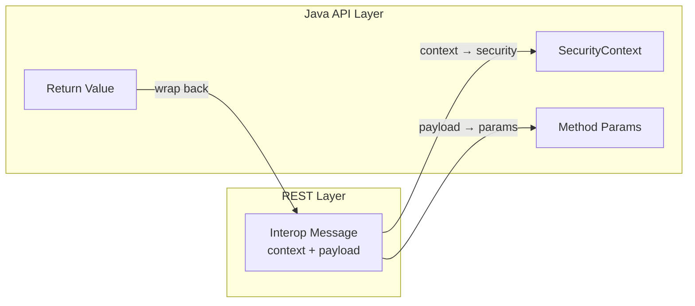
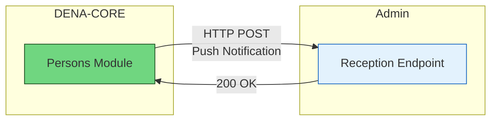
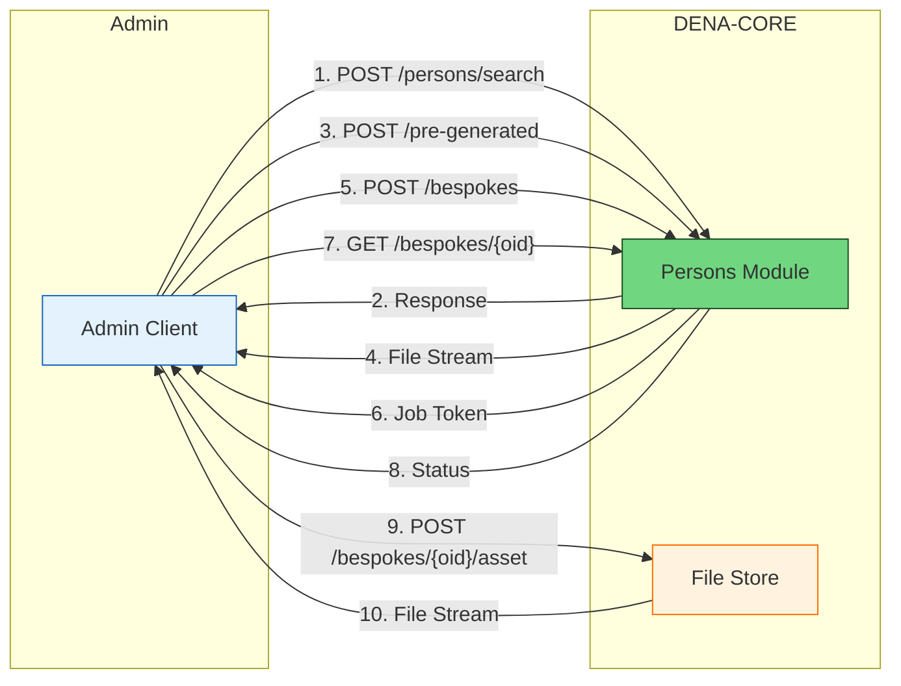

# :material-layers-outline: Internal Services Architecture

> Back to [:octicons-arrow-right-24: Architecture](./index.md)

## Overview

DENA has **two** API levels:

- **REST API**: exposes the CORE services as HTTP methods
- **Java API**: exposes the CORE services as Java methods

The following diagram shows how both APIs relate to the client and to the internal CORE:


The [client] typically *consumes* the REST API, but this is fairly difficult since the [client] must deal with HTTP semantics (connections, headers, auth...) and marshalling (serializing/deserializing) the [model objects] to/from JSON.

If the [client] can use the [Java API], the architecture includes a [client proxy] that handles all the HTTP semantics and data marshalling:


---

## Implementation layers


The [CORE] is typically implemented in three layers:

| Layer | Responsibility |
|------|----------------|
| **[service impl]** | **Transactionality** control |
| **[delegate]** | Parameter verification and orchestration of the implementation (typically orchestrates the [DAO] layer) |
| **[DAO]** | Data access |

!!! tip "Consistency"
    One of the most important features of the architecture is that **each layer implements the [client API interfaces]** ensuring that **everything stays consistent**.

---

## Exchanged data structures

### [interop messages] (REST) vs [model objects] (Java API)

REST-APIs have **slightly different data semantics** from the JAVA-API:

- **JAVA-APIs** use [**model objects**]
- **REST-APIs** exchange [**interop messages**] that contain:
    - The [**payload**]: something to be processed
    - DENA's [**interop context**] (origin, type, correlationId, route data)
    - [**protocol**] data (if needed): URLs, timeouts, etc.

The **important** part of the [interop message] is the [**payload**].

The [interop context] is used for **debugging / auditing** and is not strictly necessary.

---

### Transformation between interop messages and model objects

When the [interop message] **passes through the REST-API**, it is **transformed into the [model objects] used by the Java API**:


- The [**payload**] of the [interop message] becomes the **parameters** or **return value** of the [business method]
- The [**interop context**] is embedded in the [**security context**] which is always the first parameter of every JAVA-API method



---

### Example: Data Retrieval

The Java API method for retrieval is:

```java
public <D extends DN00IsDENADataExchangedObject>
    COREServiceMethodExecResult<DN00DataRetrieveResponse<D>>
        retrieveData(SecurityContext securityContext,
                     DN00DataRetrieveRequest retrieveRequest);
```

**Request interop message (payload):**

```json
{
  "payload": {
    "dataType": {
      "id": "citizen_service_appointments",
      "oid": "BEDCB4AF-D384-4E05-B74E-A25D7322EF63"
    },
    "admin": {
      "id": "admin-id",
      "oid": "D4348C40-84B8-4420-9747-193C75CB2875"
    },
    "person": {
      "id": "person-id",
      "oid": "DAA35E71-5B28-44BF-9DAE-A412E1CEC538"
    },
    "clientInstallment": "ED4576E0-DF47-4D2F-B039-A91228B3F09E"
  }
}
```

**Response interop message (payload):**

```json
{
  "payload": {
    "requestedNumberOfItems": 0,
    "itemsPagingContext": {
      "totalItemsCount": 200,
      "startPosition": 0
    },
    "dataItems": [
      {
        "data": {
          "type": "scheduleItem",
          "id": "appointment123",
          "lastChangedAt": "2026-08-19T08:07:56.7423565Z",
          "aboutPerson": {
            "oid": "D530141A-1E2A-4800-A118-3FC8D6EFE6D5"
          },
          "year": "2026",
          "monthOfYear": "8",
          "dayOfMonth": "18",
          "hourOfDay": "13",
          "minuteOfHour": "2",
          "durationMinutes": 30,
          "subject": {
            "ENGLISH": "an appointment",
            "SPANISH": "una cita"
          },
          "urls": [
            {
              "id": "main",
              "lang": "BASQUE",
              "value": "https://my-admin.eus/appointments/appointment123?lang=eu"
            },
            {
              "id": "main",
              "lang": "SPANISH",
              "value": "https://my-admin.eus/appointments/appointment123?lang=es"
            }
          ]
        },
        "isNewOrUpdated": false
      }
    ]
  }
}
```

---

### Interop Context components

#### Request context

```json
{
  "context": {
    "message": {
      "type": "CLIENT_RETRIEVE_REQ",
      "correlationId": "1AB7F413-399D-49F1-AC41-44D651E5799A",
      "interopRouteData": [
        {
          "denaComponentId": "CLIENT_INSTALLMENT",
          "timestamp": "2026-08-18T11:28:47.523Z"
        }
      ]
    },
    "originClientInstallment": "8B5AE78A-7D42-4069-A626-959BB07276C5",
    "destinationAdmin": { "id": "admin-id", "oid": "..." },
    "subjectPerson": { "id": "personid", "oid": "..." },
    "dataType": { "id": "data-type-id", "oid": "..." }
  }
}
```

What this [interop context] says:

- The origin is a **[client installment]** (DENA-APP)
- It is a **[data retrieval]** request: `CLIENT_RETRIEVE_REQ`
- The **[correlation id]** is kept throughout ALL the processing for debugging
- The message left the [client installment] at 11:28:47.523 and has NOT passed through any other DENA component

#### Response context

The response includes the full `interopRouteData` showing which DENA components the message passed through (CLIENT_INSTALLMENT → DENA_CORE → DENA_ADMIN_CONNECTOR → ADMIN → DENA_ADMIN_CONNECTOR → DENA_CORE), with timestamps for each step.

---

## Example: Person-Sync

Person-Sync lets administrations synchronize the persons registered in DENA. There are two main mechanisms:

### Person-Sync Push (DENA → Admin)

DENA notifies the administration when there are changes to persons.

**Java API method:**

```java
public void notifyPersonChange(SecurityContext securityContext,
                               DN00PersonPushNotification notification);
```

**Notification message payload:**

```json
{
  "payload": {
    "changeType": "CREATED",
    "person": {
      "oid": "501872FE-9A67-4AF8-BAAE-2E385119FF5F",
      "personId": { "id": "40404040H" }
    },
    "timestamp": "2026-08-17T15:14:07.0369127Z"
  }
}
```

**Change types:**
- `CREATED`: New person registered in DENA
- `DELETED`: Person deleted their account
- `UPDATED`: Person changed basic data (name, contact, etc.)

### Person-Sync Pull (Admin → DENA)

The administration queries person data from DENA.

#### Pull On-line: Person search

**Java API method:**

```java
public COREServiceMethodExecResult<DN00PersonSearchResponse>
    searchPersons(SecurityContext securityContext,
                  DN00PersonSearchRequest searchRequest);
```

**Request payload:**

```json
{
  "payload": {
    "personQuery": {
      "personIds": ["40404040H", "12345678Z"]
    }
  }
}
```

**Response payload:**

```json
{
  "payload": {
    "items": [
      {
        "person": {
          "oid": "501872FE-9A67-4AF8-BAAE-2E385119FF5F",
          "personId": { "id": "40404040H" }
        },
        "fullName": {
          "name": "Juan",
          "surname1": "García",
          "surname2": "López"
        },
        "contactData": {
          "email": "juan.garcia@example.com",
          "phone": "+34 600 123 456"
        },
        "preferredLanguages": ["es", "eu"]
      }
    ]
  }
}
```

#### Pull Off-line: Pre-generated files

**Java API method:**

```java
public COREServiceMethodExecResult<DN00PreGeneratedFileResponse>
    getPreGeneratedFile(SecurityContext securityContext,
                        DN00PreGeneratedFileRequest request);
```

**Request payload:**

```json
{
  "payload": {
    "jobType": "ALL_PERSONS",
    "exportType": "DATA",
    "fileFormat": "SQLITE",
    "hourOfDay": "20"
  }
}
```

**Response:** Returns a byte stream with the pre-generated file.

#### Pull Off-line: Bespoke files

**Java API method - Create job:**

```java
public COREServiceMethodExecResult<DN00BespokeJobResponse>
    createBespokeJob(SecurityContext securityContext,
                     DN00CreateBespokeJobRequest request);
```

**Request payload:**

```json
{
  "payload": {
    "exportSpec": {
      "personExportSpec": "data",
      "lastUpdateRange": "Instant:[2026-08-24T21:19:41.314878600Z..)",
      "exportContentSpec": {
        "exportDefaultContactData": true,
        "exportOtherContactData": true,
        "exportFinData": true
      },
      "exportFileFormat": "CSV"
    }
  }
}
```

**Response - Registered job:**

```json
{
  "payload": {
    "oid": "83F7BADC-1C54-4E80-8DB5-A9913ED3D41F",
    "status": "REGISTERED",
    "registeredAt": "2026-08-25T22:01:06.5551369Z"
  }
}
```

**Java API method - Query status:**

```java
public COREServiceMethodExecResult<DN00BespokeJobResponse>
    getBespokeJobStatus(SecurityContext securityContext,
                        DN00BespokeJobStatusRequest request);
```

**Response - Job being processed:**

```json
{
  "payload": {
    "oid": "83F7BADC-1C54-4E80-8DB5-A9913ED3D41F",
    "status": "BEING_PROCESSED",
    "startedAt": "2026-08-25T22:01:46.7589852Z"
  }
}
```

**Response - Completed job:**

```json
{
  "payload": {
    "oid": "7F46C5E1-7774-4C56-A450-5AD788D33EB0",
    "status": "FINISHED_OK",
    "finishedAt": "2026-08-25T22:04:16.0708960Z",
    "exportResultAssets": [
      {
        "fileStoreItemOid": "D824157A-CB93-4FC3-99ED-F567513FB1A2"
      }
    ]
  }
}
```

**Java API method - Download file:**

```java
public InputStream downloadBespokeAsset(SecurityContext securityContext,
                                        DN00DownloadAssetRequest request);
```

---

### Person-Sync Push flow



### Person-Sync Pull flow



---

## The client REST proxy

When the **Java API** invokes a business method, the call is translated into an HTTP request against the DENA-CORE REST-API. That translation (building the URL, serializing the payload to JSON, sending the HTTP request and deserializing the response) is centralized by a **REST proxy base class** that all concrete proxy implementations inherit from.

### Base class

`DN00ClientAPIRESTServiceProxyBase` is the abstract class that serves as the base for the client REST proxies. It encapsulates three elements:

| Element | Responsibility |
|---|---|
| Retryable HTTP executor | Sends the requests and **retries** those that fail (e.g. due to network problems). It keeps a **reusable connection pool**, so it must be shared across all proxies. |
| Model objects marshaller | Serializes and deserializes the [model objects] to/from JSON. |
| Base URL | Root URL of the REST service, on top of which the specific endpoints for each resource are composed. |

Requests are issued with these default characteristics:

- `Content-Type: application/json` and `Accept: application/json` headers
- Executor's **default timeouts**
- **2 retries** on failure
- Default **idempotency key**
- **HTTPS** protocol when composing the URL from host and path

Protected helper methods used by the subclasses:

```java
// POST with JSON body, response as String
protected String _executeJsonPOSTRequest(Url url, String jsonBody);

// POST with JSON body, response deserialized into a type T
protected <T> T _executeJsonPOSTRequest(Url url, String jsonBody,
                                        BodyHandler<T> responseBodyHandler,
                                        Class<T> responseType);

// GET, response as String
protected String _executeJSONGETRequest(Url url);

// GET, response deserialized into a type T
protected <T> T _executeJSONGETRequest(Url url,
                                       BodyHandler<T> responseBodyHandler,
                                       Class<T> responseType);
```

!!! note "Interruptions"
    If the thread running the HTTP request is interrupted, the proxy **restores the thread's interrupt flag** and propagates the error as an `IOException`. Restoring the flag is what allows thread pools (for example `ExecutorService`) to shut down properly.

### CORE proxy marker interface

`DN00IsDENACOREServiceProxy` is a **marker interface** (with no methods) that extends `IsProxyToCoreService`. It is used to uniformly identify the proxies that talk to DENA-CORE services.

<!-- DENA-DOC-FOOTER -->
---
<sub>DENA Docs v{{ dena.version }} · {{ dena.date }}</sub>
