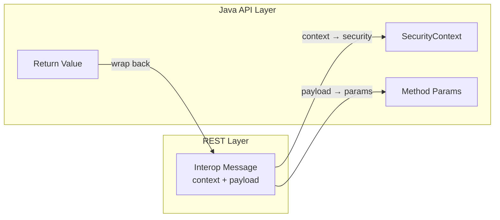
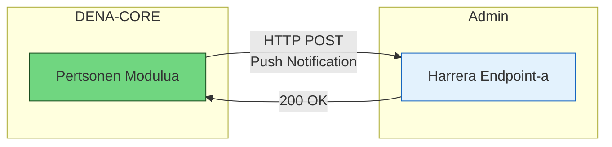
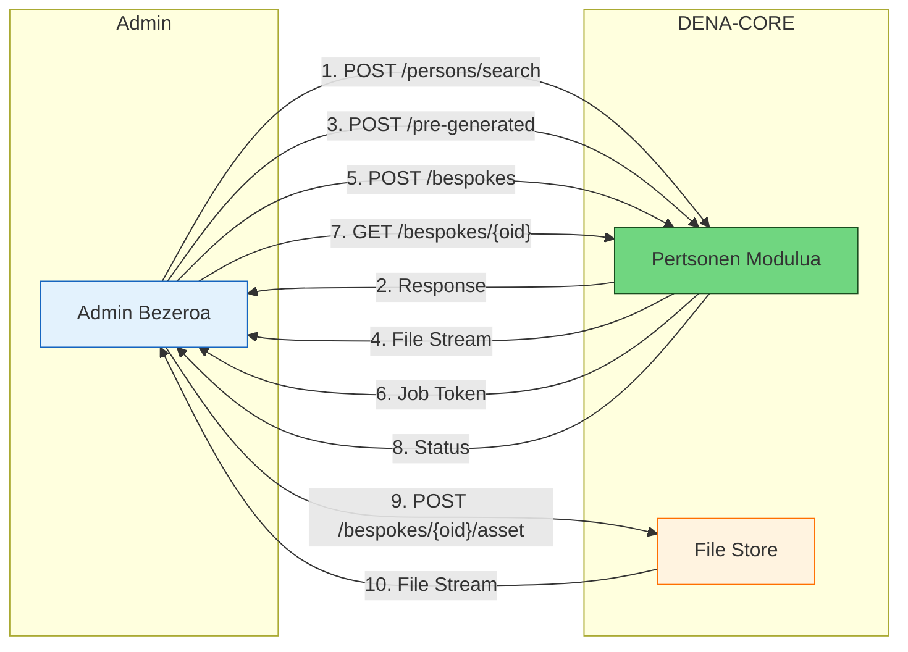

# :material-layers-outline: Zerbitzuen Barne Arkitektura

> Itzuli [:octicons-arrow-right-24: Arkitekturara](./index.md)

## Ikuspegi orokorra

DENAk **bi** API maila ditu:

- **REST API**: CORE zerbitzuak HTTP metodo gisa erakusten ditu
- **Java API**: CORE zerbitzuak Java metodo gisa erakusten ditu

Ondorengo diagramak bi APIak bezeroarekin eta barneko COREarekin nola erlazionatzen diren erakusten du:


[client]-ak normalean REST API *kontsumitzen* du, baina hori nahiko zaila da, [client]-ak HTTP semantika (konexioak, headerrak, auth...) eta [model objects]-en marshalling-a (serializatzea/deserializatzea) JSONera/JSONetik kudeatu behar baititu.

[client]-ak [Java API] erabil badezake, arkitekturak [client proxy] bat dauka, HTTP semantika eta datuen marshalling guztia kudeatzen dituena:


---

## Inplementazio geruzak


[CORE]-a normalean hiru geruzatan inplementatzen da:

| Geruza | Erantzukizuna |
|------|----------------|
| **[service impl]** | **Transakzionaltasunaren** kontrola |
| **[delegate]** | Parametroen egiaztapena eta inplementazioaren orkestrazioa (normalean [DAO] geruza orkestratzen du) |
| **[DAO]** | Datuetarako sarbidea |

!!! tip "Koherentzia"
    Arkitekturaren ezaugarririk garrantzitsuenetako bat da **geruza bakoitzak [client API interfazeak] inplementatzen dituela**, **dena koherente mantentzen dela** bermatuz.

---

## Trukatutako datu-egiturak

### [interop messages] (REST) vs [model objects] (Java API)

REST-APIek JAVA-APIek baino **datu-semantika apur bat desberdina** dute:

- **JAVA-APIek** [**model objects**] erabiltzen dituzte
- **REST-APIek** [**interop messages**] trukatzen dituzte, honakoak dituztenak:
    - [**payload**]-a: prozesatzeko zerbait
    - DENAren [**interop context**]-a (jatorria, mota, correlationId, route data)
    - [**protokolo**] datuak (beharrezkoa bada): URLak, timeout-ak, etab.

[interop message]-aren zati **garrantzitsua** [**payload**]-a da.

[interop context]-a **debugging / auditoretza** egiteko erabiltzen da eta ez da zorrozki beharrezkoa.

---

### interop messages eta model objects arteko eraldaketa

[interop message]-a **REST-APItik pasatzen denean**, Java APIak erabiltzen dituen **[model objects]-etara eraldatzen da**:


- [interop message]-aren [**payload**]-a [business method]-aren **parametro** edo **itzulera-balio** bihurtzen da
- [**interop context**]-a [**security context**]-ean txertatzen da, hau JAVA-APIaren metodo guztien lehen parametroa baita beti



---

### Adibidea: Data Retrieval

Retrieval-erako Java API metodoa hau da:

```java
public <D extends DN00IsDENADataExchangedObject>
    COREServiceMethodExecResult<DN00DataRetrieveResponse<D>>
        retrieveData(SecurityContext securityContext,
                     DN00DataRetrieveRequest retrieveRequest);
```

**Request interop message (payload):**

```json
{
  "payload": {
    "dataType": {
      "id": "citizen_service_appointments",
      "oid": "BEDCB4AF-D384-4E05-B74E-A25D7322EF63"
    },
    "admin": {
      "id": "admin-id",
      "oid": "D4348C40-84B8-4420-9747-193C75CB2875"
    },
    "person": {
      "id": "person-id",
      "oid": "DAA35E71-5B28-44BF-9DAE-A412E1CEC538"
    },
    "clientInstallment": "ED4576E0-DF47-4D2F-B039-A91228B3F09E"
  }
}
```

**Response interop message (payload):**

```json
{
  "payload": {
    "requestedNumberOfItems": 0,
    "itemsPagingContext": {
      "totalItemsCount": 200,
      "startPosition": 0
    },
    "dataItems": [
      {
        "data": {
          "type": "scheduleItem",
          "id": "appointment123",
          "lastChangedAt": "2026-08-19T08:07:56.7423565Z",
          "aboutPerson": {
            "oid": "D530141A-1E2A-4800-A118-3FC8D6EFE6D5"
          },
          "year": "2026",
          "monthOfYear": "8",
          "dayOfMonth": "18",
          "hourOfDay": "13",
          "minuteOfHour": "2",
          "durationMinutes": 30,
          "subject": {
            "ENGLISH": "an appointment",
            "SPANISH": "una cita"
          },
          "urls": [
            {
              "id": "main",
              "lang": "BASQUE",
              "value": "https://my-admin.eus/appointments/appointment123?lang=eu"
            },
            {
              "id": "main",
              "lang": "SPANISH",
              "value": "https://my-admin.eus/appointments/appointment123?lang=es"
            }
          ]
        },
        "isNewOrUpdated": false
      }
    ]
  }
}
```

---

### Interop Context-aren osagaiak

#### Request context

```json
{
  "context": {
    "message": {
      "type": "CLIENT_RETRIEVE_REQ",
      "correlationId": "1AB7F413-399D-49F1-AC41-44D651E5799A",
      "interopRouteData": [
        {
          "denaComponentId": "CLIENT_INSTALLMENT",
          "timestamp": "2026-08-18T11:28:47.523Z"
        }
      ]
    },
    "originClientInstallment": "8B5AE78A-7D42-4069-A626-959BB07276C5",
    "destinationAdmin": { "id": "admin-id", "oid": "..." },
    "subjectPerson": { "id": "personid", "oid": "..." },
    "dataType": { "id": "data-type-id", "oid": "..." }
  }
}
```

[interop context] honek dioena:

- Jatorria **[client installment]** bat da (DENA-APP)
- **[data retrieval]** eskaera bat da: `CLIENT_RETRIEVE_REQ`
- **[correlation id]**-a prozesatze GUZTIAN zehar mantentzen da debugging-erako
- Mezua [client installment]-etik 11:28:47.523etan atera zen eta EZ da beste DENA osagairik zeharkatu

#### Response context

Erantzunak `interopRouteData` osoa dakar, mezuak zein DENA osagai zeharkatu dituen erakutsiz (CLIENT_INSTALLMENT → DENA_CORE → DENA_ADMIN_CONNECTOR → ADMIN → DENA_ADMIN_CONNECTOR → DENA_CORE), urrats bakoitzerako timestamp-ekin.

---

## Adibidea: Person-Sync

Person-Sync-ek administrazioei DENAn erregistratutako pertsonak sinkronizatzeko aukera ematen die. Bi mekanismo nagusi daude:

### Person-Sync Push (DENA → Admin)

DENAk administrazioari jakinarazten dio pertsonetan aldaketak daudenean.

**Java API metodoa:**

```java
public void notifyPersonChange(SecurityContext securityContext,
                               DN00PersonPushNotification notification);
```

**Jakinarazpen-mezuaren payload-a:**

```json
{
  "payload": {
    "changeType": "CREATED",
    "person": {
      "oid": "501872FE-9A67-4AF8-BAAE-2E385119FF5F",
      "personId": { "id": "40404040H" }
    },
    "timestamp": "2026-08-17T15:14:07.0369127Z"
  }
}
```

**Aldaketa motak:**
- `CREATED`: Pertsona berria DENAn erregistratuta
- `DELETED`: Pertsonak bere kontua ezabatu du
- `UPDATED`: Pertsonak oinarrizko datuak aldatu ditu (izena, kontaktua, etab.)

### Person-Sync Pull (Admin → DENA)

Administrazioak pertsonen datuak kontsultatzen dizkio DENAri.

#### Pull On-line: Pertsonen bilaketa

**Java API metodoa:**

```java
public COREServiceMethodExecResult<DN00PersonSearchResponse>
    searchPersons(SecurityContext securityContext,
                  DN00PersonSearchRequest searchRequest);
```

**Request payload:**

```json
{
  "payload": {
    "personQuery": {
      "personIds": ["40404040H", "12345678Z"]
    }
  }
}
```

**Response payload:**

```json
{
  "payload": {
    "items": [
      {
        "person": {
          "oid": "501872FE-9A67-4AF8-BAAE-2E385119FF5F",
          "personId": { "id": "40404040H" }
        },
        "fullName": {
          "name": "Juan",
          "surname1": "García",
          "surname2": "López"
        },
        "contactData": {
          "email": "juan.garcia@example.com",
          "phone": "+34 600 123 456"
        },
        "preferredLanguages": ["es", "eu"]
      }
    ]
  }
}
```

#### Pull Off-line: Aurrez sortutako fitxategiak

**Java API metodoa:**

```java
public COREServiceMethodExecResult<DN00PreGeneratedFileResponse>
    getPreGeneratedFile(SecurityContext securityContext,
                        DN00PreGeneratedFileRequest request);
```

**Request payload:**

```json
{
  "payload": {
    "jobType": "ALL_PERSONS",
    "exportType": "DATA",
    "fileFormat": "SQLITE",
    "hourOfDay": "20"
  }
}
```

**Response:** Aurrez sortutako fitxategiaren byte stream bat itzultzen du.

#### Pull Off-line: Fitxategi bespoke-ak

**Java API metodoa - Job-a sortu:**

```java
public COREServiceMethodExecResult<DN00BespokeJobResponse>
    createBespokeJob(SecurityContext securityContext,
                     DN00CreateBespokeJobRequest request);
```

**Request payload:**

```json
{
  "payload": {
    "exportSpec": {
      "personExportSpec": "data",
      "lastUpdateRange": "Instant:[2026-08-24T21:19:41.314878600Z..)",
      "exportContentSpec": {
        "exportDefaultContactData": true,
        "exportOtherContactData": true,
        "exportFinData": true
      },
      "exportFileFormat": "CSV"
    }
  }
}
```

**Response - Erregistratutako job-a:**

```json
{
  "payload": {
    "oid": "83F7BADC-1C54-4E80-8DB5-A9913ED3D41F",
    "status": "REGISTERED",
    "registeredAt": "2026-08-25T22:01:06.5551369Z"
  }
}
```

**Java API metodoa - Egoera kontsultatu:**

```java
public COREServiceMethodExecResult<DN00BespokeJobResponse>
    getBespokeJobStatus(SecurityContext securityContext,
                        DN00BespokeJobStatusRequest request);
```

**Response - Prozesatzen ari den job-a:**

```json
{
  "payload": {
    "oid": "83F7BADC-1C54-4E80-8DB5-A9913ED3D41F",
    "status": "BEING_PROCESSED",
    "startedAt": "2026-08-25T22:01:46.7589852Z"
  }
}
```

**Response - Amaitutako job-a:**

```json
{
  "payload": {
    "oid": "7F46C5E1-7774-4C56-A450-5AD788D33EB0",
    "status": "FINISHED_OK",
    "finishedAt": "2026-08-25T22:04:16.0708960Z",
    "exportResultAssets": [
      {
        "fileStoreItemOid": "D824157A-CB93-4FC3-99ED-F567513FB1A2"
      }
    ]
  }
}
```

**Java API metodoa - Fitxategia deskargatu:**

```java
public InputStream downloadBespokeAsset(SecurityContext securityContext,
                                        DN00DownloadAssetRequest request);
```

---

### Person-Sync Push fluxua



### Person-Sync Pull fluxua



---

## Bezeroaren REST proxy-a

**Java API**-ak negozio-metodo bat deitzen duenean, deia DENA-COREren REST-APIaren aurkako HTTP eskaera batean itzultzen da. Itzulpen hori (URLaren eraikuntza, payload-aren serializazioa JSONera, HTTP bidalketa eta erantzunaren deserializazioa) **REST proxy oinarri-klase** batek zentralizatzen du, proxy inplementazio konkretu guztiek heredatzen dutena.

### Oinarri-klasea

`DN00ClientAPIRESTServiceProxyBase` bezeroaren REST proxyen oinarri gisa balio duen klase abstraktua da. Hiru elementu barneratzen ditu:

| Elementua | Erantzukizuna |
|---|---|
| HTTP exekutatzaile birsaiakor | Eskaerak bidaltzen ditu eta huts egiten dutenak **birsaiatzen** ditu (adib. sareko arazoengatik). **Konexio-pool berrerabilgarri** bat mantentzen du, beraz proxy guztien artean partekatu behar da. |
| Model objects marshaller-a | [model objects]-ak JSONera/JSONetik serializatzen eta deserializatzen ditu. |
| Oinarrizko URLa | REST zerbitzuaren erro-URLa, baliabide bakoitzaren endpoint konkretuak haren gainean osatzen direlarik. |

Eskaerak ezaugarri lehenetsi hauekin igortzen dira:

- `Content-Type: application/json` eta `Accept: application/json` headerrak
- Exekutatzailearen **timeout lehenetsiak**
- **2 birsaiakera** hutsaren aurrean
- **Idempotency key** lehenetsia
- **HTTPS** protokoloa URLa host-etik eta path-etik osatzean

Azpiklaseek erabiltzen dituzten laguntza-metodo babestuak:

```java
// POST JSON gorputzarekin, erantzuna String gisa
protected String _executeJsonPOSTRequest(Url url, String jsonBody);

// POST JSON gorputzarekin, erantzuna T motara deserializatuta
protected <T> T _executeJsonPOSTRequest(Url url, String jsonBody,
                                        BodyHandler<T> responseBodyHandler,
                                        Class<T> responseType);

// GET, erantzuna String gisa
protected String _executeJSONGETRequest(Url url);

// GET, erantzuna T motara deserializatuta
protected <T> T _executeJSONGETRequest(Url url,
                                       BodyHandler<T> responseBodyHandler,
                                       Class<T> responseType);
```

!!! note "Etenak"
    HTTP eskaera exekutatzen ari den haria eteten bada, proxy-ak hariaren **eten-flag-a berrezartzen du** eta errorea `IOException` gisa hedatzen du. Flag-a berrezartzeak ahalbidetzen du hari-poolak (adibidez `ExecutorService`) behar bezala itzaltzea.

### CORE proxyen marka-interfazea

`DN00IsDENACOREServiceProxy` **marka-interfaze** bat da (metodorik gabea) `IsProxyToCoreService` hedatzen duena. DENA-CORE zerbitzuekin hitz egiten duten proxyak modu homogeneoan identifikatzeko balio du.

<!-- DENA-DOC-FOOTER -->
---
<sub>DENA Docs v{{ dena.version }} · {{ dena.date }}</sub>
