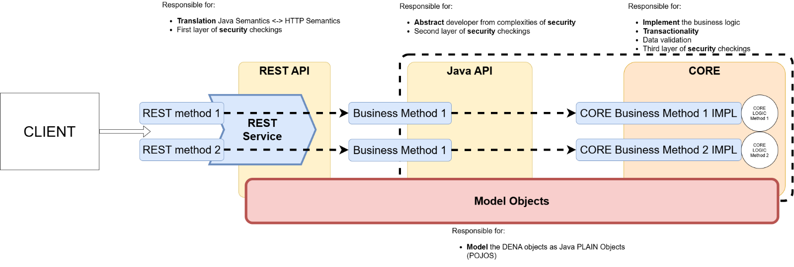
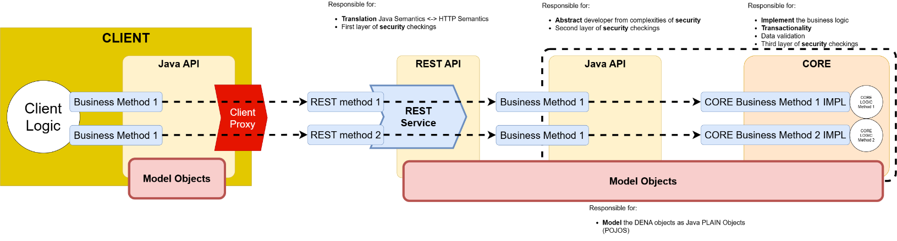
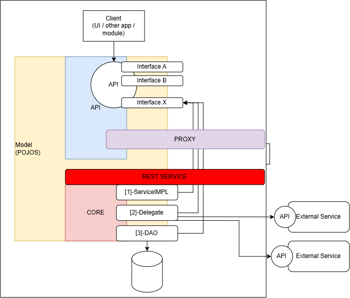
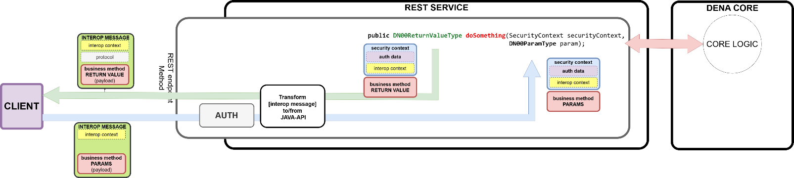
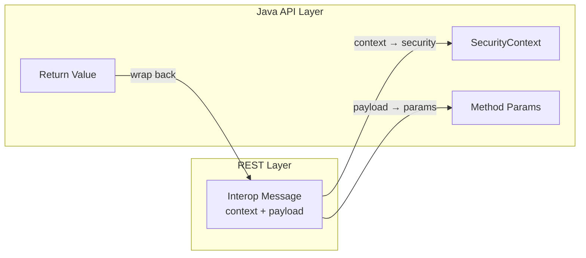
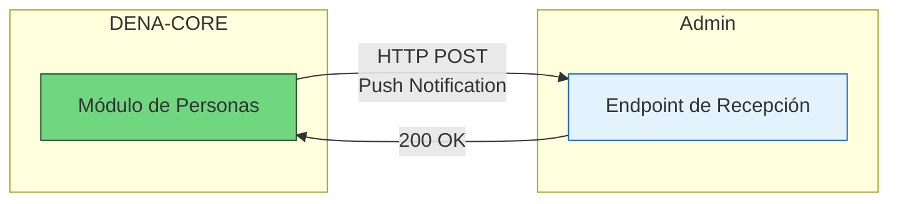
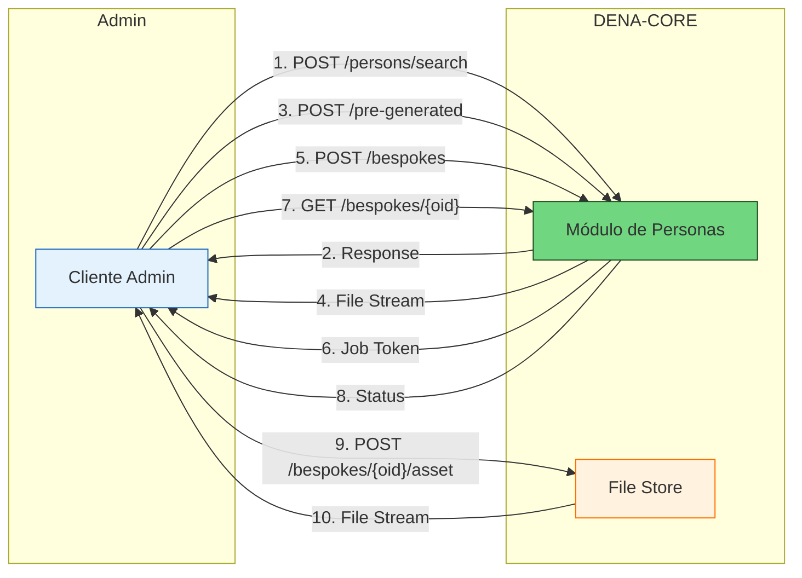

# :material-layers-outline: Arquitectura Interna de Servicios

> Volver a [:octicons-arrow-right-24: Arquitectura](./index.md)

## Vista general

DENA tiene **dos** niveles de API:

- **REST API**: expone los servicios CORE como métodos HTTP
- **Java API**: expone los servicios CORE como métodos Java

El siguiente diagrama muestra cómo se relacionan ambas APIs con el cliente y con el CORE interno:



El [cliente] típicamente *consume* la REST API, pero esto es bastante difícil ya que el [cliente] debe lidiar con la semántica HTTP (conexiones, headers, auth...) y el marshalling (serializar/deserializar) los [model objects] a/desde JSON.

Si el [cliente] puede usar la [Java API], la arquitectura incluye un [client proxy] que maneja toda la semántica HTTP y el marshalling de datos:



---

## Capas de implementación



El [CORE] se implementa típicamente en tres capas:

| Capa | Responsabilidad |
|------|----------------|
| **[service impl]** | Control de **transaccionalidad** |
| **[delegate]** | Verificación de parámetros y orquestación de la implementación (típicamente orquesta la capa [DAO]) |
| **[DAO]** | Acceso a datos |

!!! tip "Consistencia"
    Una de las características más importantes de la arquitectura es que **cada capa implementa las [interfaces del client API]** asegurando que **todo se mantiene consistente**.

---

## Estructuras de datos intercambiadas

### [interop messages] (REST) vs [model objects] (Java API)

Las REST-APIs tienen una **semántica de datos ligeramente diferente** de las JAVA-API:

- **JAVA-APIs** usan [**model objects**]
- **REST-APIs** intercambian [**interop messages**] que contienen:
    - El [**payload**]: algo a procesar
    - El [**interop context**] de DENA (origen, tipo, correlationId, route data)
    - Datos de [**protocolo**] (si es necesario): URLs, timeouts, etc.

La parte **importante** del [interop message] es el [**payload**].

El [interop context] se usa para **debugging / auditoría** y no es estrictamente necesario.

---

### Transformación entre interop messages y model objects

Cuando el [interop message] **pasa por la REST-API**, se **transforma a los [model objects] que usa la Java API**:



- El [**payload**] del [interop message] se convierte en los **parámetros** o **valor de retorno** del [business method]
- El [**interop context**] se embebe en el [**security context**] que siempre es el primer parámetro de todos los métodos de la JAVA-API



---

### Ejemplo: Data Retrieval

El método Java API para retrieval es:

```java
public <D extends DN00IsDENADataExchangedObject>
    COREServiceMethodExecResult<DN00DataRetrieveResponse<D>>
        retrieveData(SecurityContext securityContext,
                     DN00DataRetrieveRequest retrieveRequest);
```

**Request interop message (payload):**

```json
{
  "payload": {
    "dataType": {
      "id": "citizen_service_appointments",
      "oid": "BEDCB4AF-D384-4E05-B74E-A25D7322EF63"
    },
    "admin": {
      "id": "admin-id",
      "oid": "D4348C40-84B8-4420-9747-193C75CB2875"
    },
    "person": {
      "id": "person-id",
      "oid": "DAA35E71-5B28-44BF-9DAE-A412E1CEC538"
    },
    "clientInstallment": "ED4576E0-DF47-4D2F-B039-A91228B3F09E"
  }
}
```

**Response interop message (payload):**

```json
{
  "payload": {
    "requestedNumberOfItems": 0,
    "itemsPagingContext": {
      "totalItemsCount": 200,
      "startPosition": 0
    },
    "dataItems": [
      {
        "data": {
          "type": "scheduleItem",
          "id": "appointment123",
          "lastChangedAt": "2026-08-19T08:07:56.7423565Z",
          "aboutPerson": {
            "oid": "D530141A-1E2A-4800-A118-3FC8D6EFE6D5"
          },
          "year": "2026",
          "monthOfYear": "8",
          "dayOfMonth": "18",
          "hourOfDay": "13",
          "minuteOfHour": "2",
          "durationMinutes": 30,
          "subject": {
            "ENGLISH": "an appointment",
            "SPANISH": "una cita"
          },
          "urls": [
            {
              "id": "main",
              "lang": "BASQUE",
              "value": "https://my-admin.eus/appointments/appointment123?lang=eu"
            },
            {
              "id": "main",
              "lang": "SPANISH",
              "value": "https://my-admin.eus/appointments/appointment123?lang=es"
            }
          ]
        },
        "isNewOrUpdated": false
      }
    ]
  }
}
```

---

### Componentes del Interop Context

#### Request context

```json
{
  "context": {
    "message": {
      "type": "CLIENT_RETRIEVE_REQ",
      "correlationId": "1AB7F413-399D-49F1-AC41-44D651E5799A",
      "interopRouteData": [
        {
          "denaComponentId": "CLIENT_INSTALLMENT",
          "timestamp": "2026-08-18T11:28:47.523Z"
        }
      ]
    },
    "originClientInstallment": "8B5AE78A-7D42-4069-A626-959BB07276C5",
    "destinationAdmin": { "id": "admin-id", "oid": "..." },
    "subjectPerson": { "id": "personid", "oid": "..." },
    "dataType": { "id": "data-type-id", "oid": "..." }
  }
}
```

Lo que este [interop context] dice:

- El origen es una **[instalación cliente]** (DENA-APP)
- Es una petición de **[data retrieval]**: `CLIENT_RETRIEVE_REQ`
- El **[correlation id]** se mantiene durante TODO el procesamiento para debugging
- El mensaje dejó la [instalación cliente] a las 11:28:47.523 y NO ha pasado por ningún otro componente DENA

#### Response context

La respuesta incluye el `interopRouteData` completo mostrando por qué componentes DENA ha pasado el mensaje (CLIENT_INSTALLMENT → DENA_CORE → DENA_ADMIN_CONNECTOR → ADMIN → DENA_ADMIN_CONNECTOR → DENA_CORE), con timestamps para cada paso.

---

## Ejemplo: Person-Sync

Person-Sync permite a las administraciones sincronizar las personas registradas en DENA. Hay dos mecanismos principales:

### Person-Sync Push (DENA → Admin)

DENA notifica a la administración cuando hay cambios en personas.

**Método Java API:**

```java
public void notifyPersonChange(SecurityContext securityContext,
                               DN00PersonPushNotification notification);
```

**Payload del mensaje de notificación:**

```json
{
  "payload": {
    "changeType": "CREATED",
    "person": {
      "oid": "501872FE-9A67-4AF8-BAAE-2E385119FF5F",
      "personId": { "id": "40404040H" }
    },
    "timestamp": "2026-08-17T15:14:07.0369127Z"
  }
}
```

**Tipos de cambio:**
- `CREATED`: Nueva persona registrada en DENA
- `DELETED`: Persona eliminó su cuenta
- `UPDATED`: Persona cambió datos básicos (nombre, contacto, etc.)

### Person-Sync Pull (Admin → DENA)

La administración consulta los datos de personas a DENA.

#### Pull On-line: Búsqueda de personas

**Método Java API:**

```java
public COREServiceMethodExecResult<DN00PersonSearchResponse>
    searchPersons(SecurityContext securityContext,
                  DN00PersonSearchRequest searchRequest);
```

**Request payload:**

```json
{
  "payload": {
    "personQuery": {
      "personIds": ["40404040H", "12345678Z"]
    }
  }
}
```

**Response payload:**

```json
{
  "payload": {
    "items": [
      {
        "person": {
          "oid": "501872FE-9A67-4AF8-BAAE-2E385119FF5F",
          "personId": { "id": "40404040H" }
        },
        "fullName": {
          "name": "Juan",
          "surname1": "García",
          "surname2": "López"
        },
        "contactData": {
          "email": "juan.garcia@example.com",
          "phone": "+34 600 123 456"
        },
        "preferredLanguages": ["es", "eu"]
      }
    ]
  }
}
```

#### Pull Off-line: Ficheros pre-generados

**Método Java API:**

```java
public COREServiceMethodExecResult<DN00PreGeneratedFileResponse>
    getPreGeneratedFile(SecurityContext securityContext,
                        DN00PreGeneratedFileRequest request);
```

**Request payload:**

```json
{
  "payload": {
    "jobType": "ALL_PERSONS",
    "exportType": "DATA",
    "fileFormat": "SQLITE",
    "hourOfDay": "20"
  }
}
```

**Response:** Devuelve un stream de bytes con el ficheo pre-generado.

#### Pull Off-line: Ficheros bespoke

**Método Java API - Crear job:**

```java
public COREServiceMethodExecResult<DN00BespokeJobResponse>
    createBespokeJob(SecurityContext securityContext,
                     DN00CreateBespokeJobRequest request);
```

**Request payload:**

```json
{
  "payload": {
    "exportSpec": {
      "personExportSpec": "data",
      "lastUpdateRange": "Instant:[2026-08-24T21:19:41.314878600Z..)",
      "exportContentSpec": {
        "exportDefaultContactData": true,
        "exportOtherContactData": true,
        "exportFinData": true
      },
      "exportFileFormat": "CSV"
    }
  }
}
```

**Response - Job registrado:**

```json
{
  "payload": {
    "oid": "83F7BADC-1C54-4E80-8DB5-A9913ED3D41F",
    "status": "REGISTERED",
    "registeredAt": "2026-08-25T22:01:06.5551369Z"
  }
}
```

**Método Java API - Consultar estado:**

```java
public COREServiceMethodExecResult<DN00BespokeJobResponse>
    getBespokeJobStatus(SecurityContext securityContext,
                        DN00BespokeJobStatusRequest request);
```

**Response - Job en proceso:**

```json
{
  "payload": {
    "oid": "83F7BADC-1C54-4E80-8DB5-A9913ED3D41F",
    "status": "BEING_PROCESSED",
    "startedAt": "2026-08-25T22:01:46.7589852Z"
  }
}
```

**Response - Job completado:**

```json
{
  "payload": {
    "oid": "7F46C5E1-7774-4C56-A450-5AD788D33EB0",
    "status": "FINISHED_OK",
    "finishedAt": "2026-08-25T22:04:16.0708960Z",
    "exportResultAssets": [
      {
        "fileStoreItemOid": "D824157A-CB93-4FC3-99ED-F567513FB1A2"
      }
    ]
  }
}
```

**Método Java API - Descargar ficheo:**

```java
public InputStream downloadBespokeAsset(SecurityContext securityContext,
                                        DN00DownloadAssetRequest request);
```

---

### Flujo de Person-Sync Push



### Flujo de Person-Sync Pull



---

## El proxy REST del cliente

Cuando la **Java API** invoca un método de negocio, la llamada se traduce en una petición HTTP contra la REST-API de DENA-CORE. Esa traducción (construcción de la URL, serialización del payload a JSON, envío HTTP y deserialización de la respuesta) la centraliza una **clase base de proxy REST** que todas las implementaciones concretas de proxy heredan.

### Clase base

`DN00ClientAPIRESTServiceProxyBase` es la clase abstracta que sirve de base a los proxies REST del cliente. Encapsula tres elementos:

| Elemento | Responsabilidad |
|---|---|
| Ejecutor HTTP reintentable | Envía las peticiones y **reintenta** las que fallan (p. ej. por problemas de red). Mantiene un **pool de conexiones reutilizable**, por lo que debe compartirse entre todos los proxies. |
| Marshaller de model objects | Serializa y deserializa los [model objects] a/desde JSON. |
| URL base | URL raíz del servicio REST, sobre la que se componen los endpoints concretos de cada recurso. |

Las peticiones se emiten con estas características por defecto:

- Cabeceras `Content-Type: application/json` y `Accept: application/json`
- **Timeouts por defecto** del ejecutor
- **2 reintentos** ante fallo
- **Idempotency key** por defecto
- Protocolo **HTTPS** al componer la URL a partir de host y path

Métodos de ayuda protegidos que usan las subclases:

```java
// POST con cuerpo JSON, respuesta como String
protected String _executeJsonPOSTRequest(Url url, String jsonBody);

// POST con cuerpo JSON, respuesta deserializada a un tipo T
protected <T> T _executeJsonPOSTRequest(Url url, String jsonBody,
                                        BodyHandler<T> responseBodyHandler,
                                        Class<T> responseType);

// GET, respuesta como String
protected String _executeJSONGETRequest(Url url);

// GET, respuesta deserializada a un tipo T
protected <T> T _executeJSONGETRequest(Url url,
                                       BodyHandler<T> responseBodyHandler,
                                       Class<T> responseType);
```

!!! note "Interrupciones"
    Si el hilo que ejecuta la petición HTTP es interrumpido, el proxy **restaura el flag de interrupción** del hilo y propaga el error como `IOException`. Restaurar el flag es lo que permite que los pools de hilos (por ejemplo `ExecutorService`) se apaguen correctamente.

### Interfaz de marca de proxies CORE

`DN00IsDENACOREServiceProxy` es una **interfaz de marca** (sin métodos) que extiende `IsProxyToCoreService`. Sirve para identificar de forma homogénea los proxies que hablan con servicios de DENA-CORE.

<!-- DENA-DOC-FOOTER -->
---
<sub>DENA Docs v{{ dena.version }} · {{ dena.date }}</sub>
