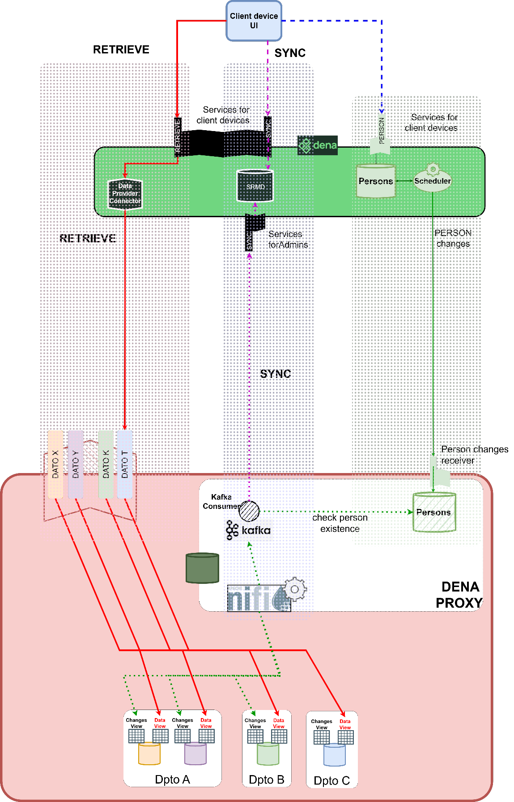

# :material-sitemap: Integration reference architectures

> Content of the *"Integration reference architectures"* section of the [DENA-CORE — Services for Admins](../adjuntos/documentos/DENA-CORE-Services_for_admins.pdf) document (:material-download: PDF).

Many administrations have dozens of data types and data origins to integrate into DENA, and a one-by-one approach is not the best solution, because it leads to multiple different components doing the same thing (for example, multiple components sending SRMD sync meta-data to DENA).

So a more centralized approach can help the multiple data origins integration into DENA.

The following image depicts one approach where the three integration areas of any administration are represented:

1. Person sync
2. SRMD sync meta-data sending
3. Data retrieval (*data provider*) services



---

## 5.1 Person Sync

The *person sync* is usually done once per admin, so every DENA-integrated administration has a single replica of the person DB.

This integration is straightforward using the DENA-provided artifacts that can be deployed in any administration's datacenter.

---

## 5.2 SRMD sync meta-data sending

The first thing a data origin has to do to integrate into DENA is to send changes. To do so, the administration can deploy a centralized changes collector using [Apache NiFi] that simply monitors a [DB view] of every data origin for changes and, when detected, sends a [message] to an [Apache Kafka] with the changes, which then sends the changes to DENA.

---

## 5.3 Data Retrieve

For data retrieval, the data origin data (or a copy of it) has to be accessed directly.

The easiest way is to ask the business to create a [DB view] of the data to be shown in DENA (which is usually just a few columns of the whole business data) and deploy it. This [DB view] is the source of a [data provider] service.

Many times, a convenient way to deploy each [data provider] service is to group all the data origin's [data providers] into a single common service and distribute data access using URL paths:

```
https://dena-internal.my_admin.eus/dena-data-provider/data-type1/byperson/{personId}
https://dena-internal.my_admin.eus/dena-data-provider/data-type2/byperson/{personId}
https://dena-internal.my_admin.eus/dena-data-provider/data-type3/byperson/{personId}
…
```

---

## Full document

[:material-download: DENA-CORE — Services for Admins (PDF)](../adjuntos/documentos/DENA-CORE-Services_for_admins.pdf) · [All documents (PDF)](../adjuntos/documentos.md)

<!-- DENA-DOC-FOOTER -->
---
<sub>DENA Docs v{{ dena.version }} · {{ dena.date }}</sub>
