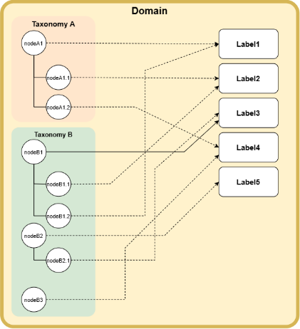
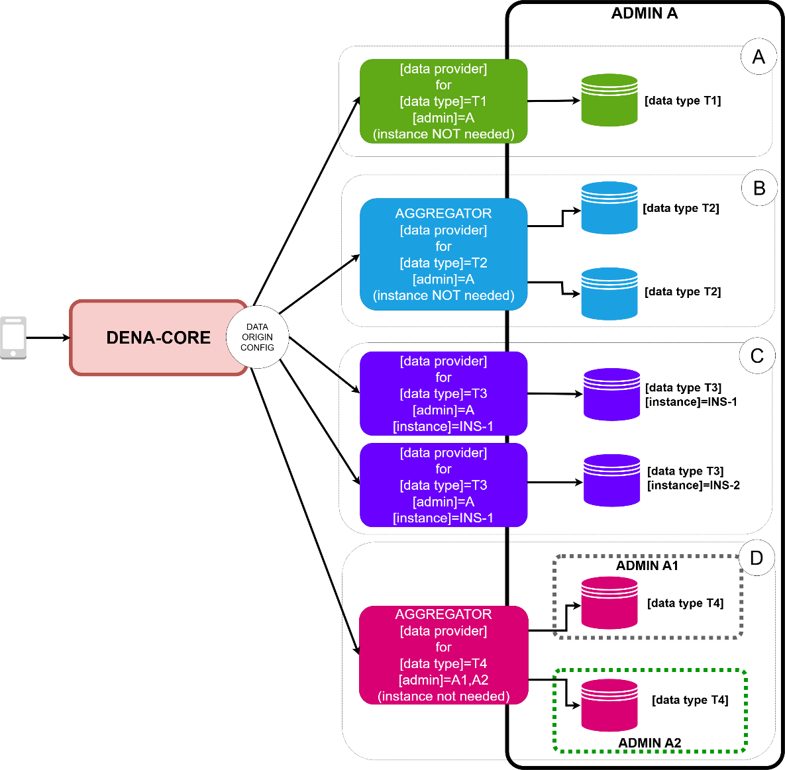

# :material-cog: DENA Configuration

DENA is configurable in these areas:

- **Labeling system** that allows tagging assets with normalized [labels]
- **Organizational structure** of the [Admins] that take part in the system
- **Interop**: the [data types] supported by DENA and the [data origins] that provide data for those [data types]

---

## Labeling System

The [labeling] system contains [**labels**] that can be used to categorize any asset.

!!! example "Example"
    [data types] are categorized thematically: a [birth certificate] can be categorized with the [label] `familia`.

### Taxonomies

The system can contain hundreds of [labels] from different [categories], so a means to "select" the [labels] is needed. That means is the [**taxonomy**], which is nothing more than a hierarchical arrangement of [labels]:

```
+ social
    + familia
    + jóvenes
    + personas mayores
    + inmigración
    + ...
+ cultura
    + teatro
    + lectura
    + ...
```

The [**taxonomy**] is **just a tool to select a [label]**, which is what really matters: the [label] is what gets "attached" to the categorized asset.

### Main objects of the labeling system

```
+ [domain group]
    + [domain]
        + [label]
        + [taxonomy group]
            + [taxonomy]
```

#### Label

A **[label]** represents a concept or a category:

- A **unique identifier** (oid)
- **Standard [terms]** in different languages (only **one** per language)
- **Synonym [terms]** in different languages (there can be **several** per language)
- **External identifiers**: the concept may exist in other systems with other identifiers

#### Taxonomy

A [**taxonomy**] is a tool to select [labels]:

- Unique identifier (oid)
- Name in different languages
- Hierarchical structure of [labels] (the [labels] can be repeated within a taxonomy)

Internally a **[taxonomy]** is represented as a *[node outline]* where each **[node]** contains:



- A **unique identifier**
- The **parent [node]** (null if it is the root)
- **The [label] the [node] links to** and the [domain] that contains it
- The **[role]** of the [label] in the [taxonomy] (usually the depth, but it can be any string such as "theme" or "subtheme")

### Java API for Labeling

Main interface: `DN00ClientAPIForLabeling`

=== "Create Domain Group"
    ```java
    DN00LabelingDomainGroup domainGroup = DN00LabelingDomainGroupBuilder.create()
        .suppliedWithNewOid()
        .defaultGroup()
        .noDescription()
        .withNames(name)
        .build();
    DN00LabelingDomainGroup saved = api.domainGroupAPI()
        .getForCRUD()
        .create(domainGroup);
    ```

=== "Create Domain"
    ```java
    DN00LabelingDomain domain = DN00LabelingDomainBuilder.create()
        .suppliedWithNewOid()
        .noSecurityUID()
        .inGroup(domainGroupOid)
        .noDescription()
        .withNames(name)
        .build();
    DN00LabelingDomain saved = api.domainAPI()
        .getForCRUD()
        .create(domain);
    ```

=== "Create Label"
    ```java
    DN00Label label = DN00LabelBuilder.create()
        .withOid(DN00LabelOID.supply())
        .inDomain(domainOid)
        .enabled()
        .withStandardTerms(stdTerms)
        .noSynonimousTerms()
        .build();
    DN00Label saved = api.labelAPI()
        .getForCRUD()
        .create(label);
    ```

=== "Create Taxonomy"
    ```java
    DN00Taxonomy taxonomy = DN00TaxonomyBuilder.create()
        .withOid(DN00TaxonomyOID.supply())
        .withBusinessIds(DN00TaxonomyID.forId("taxonomy"))
        .inDomain(domainOid)
        .inGroup(groupOid)
        .toBeUsedFor(DN00TaxonomyUsage.ALL)
        .withNames(desc)
        .build();
    DN00Taxonomy saved = api.taxonomyAPI()
        .getForCRUD()
        .save(taxonomy);
    ```

=== "Create Nodes"
    ```java
    // Root node
    DN00TaxonomyNode rootNode = api.taxonomyNodesAPI()
        .getForCRUD()
        .createRootNode(taxonomyOid,
                        labelOid, domainContainingLabelOid,
                        role);

    // Child node
    DN00TaxonomyNode childNode = api.taxonomyNodesAPI()
        .getForCRUD()
        .createNode(taxonomyOid,
                    labelOid, domainContainingLabelOid,
                    parentNodeOid,
                    role);
    ```

=== "Load taxonomy view"
    ```java
    DN00TaxonomyView taxonomyView = api.taxonomyNodesAPI()
        .getForNodeLabels()
        .usingCache()
        .loadTaxonomyView(taxonomy.getOid());
    ```

---

## Org Config

The [org config] contains information about the [admins] that take part in DENA by offering [data].

It is organized into two levels:

```
+ [org groups]
    + [admins]
```

!!! example "Organizational structure example"
    ```
    + Administración General de la CAV
        + Gobierno Vasco
        + Osakidetza
        + Lanbide
    + Administración Foral de Bizkaia
        + Diputación Foral de Bizkaia
    + Administración Local de Bizkaia
        + Ayuntamiento de Bilbao
        + Ayuntamiento de Barakaldo
        + Ayuntamiento de Getxo
    + Administración Foral de Gipuzkoa
        + Diputación Foral de Gipuzkoa
    + Administración Local de Gipuzkoa
        + Ayuntamiento de Donostia-San Sebastián
        + Ayuntamiento de Irún
    + Administración Foral de Araba
        + Diputación Foral de Araba
    + Administración Local de Araba
        + Ayuntamiento de Vitoria-Gasteiz
    ```

An **[org group]** is made up of: unique identifier (oid/uid) + name in multiple languages.

An **[admin]** is made up of:

- Unique identifier (oid/uid)
- The [org group] it belongs to
- Name in multiple languages
- Sync and Retrieve config:
    - **Priority for [data retrieval]** in DENA-APP
    - **Cold Start [data types]**: data types forced when a [person] enrolls

---

## Interop Config

### Data Type

A [data type] is a simple config object:

- The **name** in different languages
- The [**labels**] the [data type] is categorized under (used by the app to "paint" the UI by themes)

### Data Origin

The [data origin] config is DENA's **routing table** for the [data providers] of the [admins], using:

- The [admin]
- The [data type]
- The [data origin instance]

Structure:

```
+ [data origin]
    + (N) [dataType] config ........... each [data type] has its own [connector config]
        + [connector config] .......... how to CONNECT to RETRIEVE data
            + (1) EXTERNAL side config  how the [connector] calls the [admin]
            + (N) [admin] ............. admins this config applies to
    + (1) INTERNAL side config ........ how DENA-CORE calls the [connector]
```

#### Architectural options for [data providers]



| Option | Description |
|--------|-------------|
| **(a)** Single | A [data provider] for a **single [data type] in one [admin]** |
| **(b)** Aggregated instances | A [data provider] that **aggregates** [data] from multiple instances of a system (e.g.: multiple case managers in a data lake) |
| **(c)** Distributed | **Multiple [data providers]** for multiple origins in different instances |
| **(d)** Aggregated admins | A [data provider] that aggregates [data] from **multiple [admins]** (e.g.: provincial councils that provide data for multiple town councils) |

---

## AppVersion Config

DENA-CORE stores historical data about the **versions of the [app]** (mobile/web):

| Field | Description |
|-------|-------------|
| **Version number** | Pattern: `{major}.{minor}.{patch}[-alias]` |
| **Developer preview** | Whether it is a development preview |
| **Life range** | start..end (if end is null, it is the current version) |
| **Status** | PERMANENT / TEMPORARY DISABLED / ENABLED |
| **Client platform** | MOBILE_ANDROID / MOBILE_IOS / WEB_BROWSER |
| **Messages** | Messages to show after an update |

It is mainly used in the **init phase** of the [client app] to:

- **Disable** the app if the installed version is no longer usable
- **Force** the client to **update** the version

<!-- DENA-DOC-FOOTER -->
---
<sub>DENA Docs v{{ dena.version }} · {{ dena.date }}</sub>
