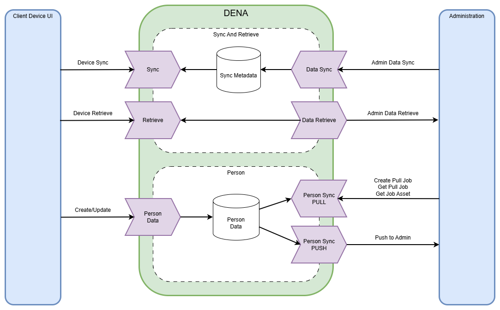

# :material-vector-polygon: Diagramas (draw.io)

Diagramas de arquitectura en formato draw.io y sus exportaciones.

---

## Diagramas disponibles

| Diagrama | Editable | Exportación |
|---|---|---|
| Arquitectura general | [`DENA_Architecture.drawio`](../adjuntos/imagenes/drawio/DENA_Architecture.drawio) |  |
| Login Giltza | [`login-giltza.drawio`](../adjuntos/imagenes/drawio/login-giltza.drawio) | [PNG](../adjuntos/imagenes/login-giltza.png) |
| Person-Sync Pull | [`person-sync-pull.drawio`](../adjuntos/imagenes/drawio/person-sync-pull.drawio) | [PNG](../adjuntos/imagenes/person-sync-pull.png) |
| WebAuthn Login | [`webauthn-login.drawio`](../adjuntos/imagenes/drawio/webauthn-login.drawio) | [PNG](../adjuntos/imagenes/webauthn-login.png) |
| WebAuthn Register | [`webauthn-register.drawio`](../adjuntos/imagenes/drawio/webauthn-register.drawio) | [PNG](../adjuntos/imagenes/webauthn-register.png) |

---

## Cómo editar

!!! tip "Edición con draw.io"

    1. Abre [app.diagrams.net](https://app.diagrams.net/)
    2. Carga el fichero `.drawio` desde `docs/adjuntos/imagenes/drawio/`
    3. Realiza los cambios
    4. Exporta como PNG al directorio `docs/adjuntos/imagenes/`
    5. Commitea ambos ficheros (`.drawio` + `.png`)

<!-- DENA-DOC-FOOTER -->
---
DENA Docs v{{ dena.version }} · {{ dena.date }}
