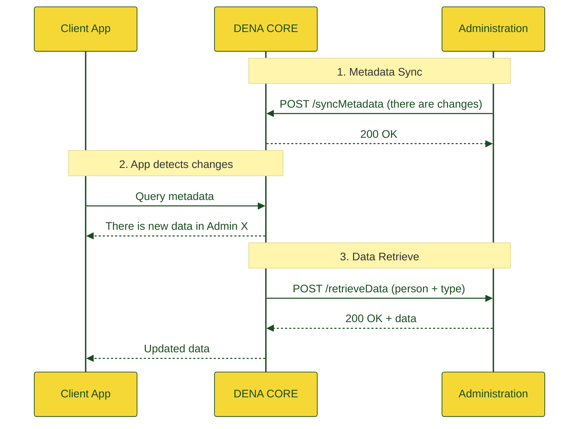

# :material-cube-outline: Architecture

## Overview

DENA Interop is the system that enables interoperability with different administrations to allow citizens, through the client application, to access the data that administrations manage about them.

---

## Main modules

-   :material-sync:{ .lg .middle } **Metadata Sync**

    ---

    Receives notifications from administrations when there are changes in a person's data. DENA stores only the last update date per combination of person + data type + administration.

    [:octicons-arrow-right-24: Metadata-Sync Semantics](../semantica/metadata-sync/index.md)

-   :material-database-arrow-right:{ .lg .middle } **Data Retrieve**

    ---

    When the client app detects changes, it requests the administration (through DENA) to download the updated data. The administration exposes a standard endpoint.

    [:octicons-arrow-right-24: Data-Retrieve Semantics](../semantica/data-retrieve/index.md)

-   :material-account-sync:{ .lg .middle } **Person Sync**

    ---

    Synchronizes the list of registered persons in DENA with the administrations. Two mechanisms: **Pull** (the administration queries) and **Push** (DENA notifies).

    [:octicons-arrow-right-24: Person-Sync Semantics](../semantica/person-sync/index.md)

---

## General flow

---

## Standard vs. non-standard connector

!!! tip "Standard endpoint"

    If your administration can implement the standard REST endpoint (`POST /api/retrieveData`), the integration is direct and fast.

    [:octicons-arrow-right-24: Implementation guide](../semantica/data-retrieve/guia-implementacion.md)

!!! info "Custom connector"

    If implementing the standard is not possible, DENA will develop a specific connector adapted to the means provided by the administration (SOAP, files, etc.).

---

## Related documentation

- [Diagrams (draw.io)](./diagramas.md)
- [Other documentation](./otra-documentacion.md)
- [ADRs (Architecture Decision Records)]({{ repos.docs_main }}/ArchitectureDecisionRecords)

<!-- DENA-DOC-FOOTER -->
---
DENA Docs v{{ dena.version }} · {{ dena.date }}
