# :material-cube-outline: Architecture

This section describes how DENA is built internally. It starts with an overview of the main blocks and delves into each aspect of the system.

---

## Overview

DENA Interop is composed of the following main blocks:


- **DENA-APP** (client device UI): the mobile/web application used by persons
- **DENA-CORE**: the central system, composed of:
    - **[Config]**: organizational structure, interop config, app version
    - **[Persons]**: person account + synchronization of persons with admins
    - **[Sync and Retrieve]** (SRMD): services for admins and DENA-APP
    - **[Consents]**: storage and verification of consents
    - **[Security]**: person login, admin auth, admin UI auth
- **[Connectors]**: independent modules that intermediate with each administration
- **[Administrations]**: the admin systems that expose data

---

## SYNC + RETRIEVE Mechanism

DENA has two main data exchange mechanisms:

### SYNC: notify changes (SRMD)

Administrations **periodically send metadata** to DENA-CORE indicating there are changes in person data:

```
{person} | {admin} | {data type} | {last update instant}
```

This diagram shows the complete metadata synchronization flow (read from right to left):

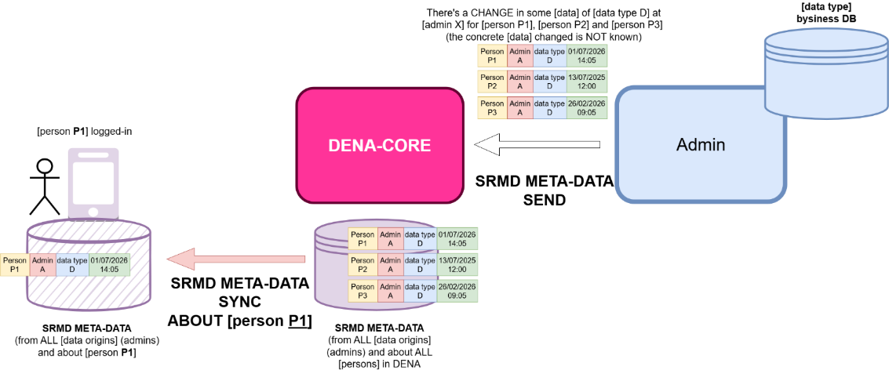

What it shows:

- **Right**: admins periodically send SRMD to DENA-CORE with detected changes
- **Center**: DENA-CORE stores that SRMD (metadata only, not actual data)
- **Left**: DENA-APP syncs its local SRMD copy with DENA-CORE to know which data to refresh

This does NOT send the data itself, just says: *"some data of this type about this person has changed"*.

**What your administration has to do here:**

!!! success "Your responsibility in Metadata-Sync"
    1. Have a periodic process (every X minutes) that queries your DB looking for records that have changed since the last cycle
    2. For each change, create an SRMD record with: person + data type + admin + when it changed
    3. Send all SRMD to DENA-CORE with an HTTP POST

    You don't need to know which specific data changed or send it. Just the fact that there was a change and when.

### RETRIEVE: retrieve data

When DENA-APP detects changes, it asks DENA-CORE for the complete data. DENA-CORE acts as a **proxy** toward the administration:

This diagram shows the simplified data retrieval flow — DENA-CORE intermediates between the app and your admin:

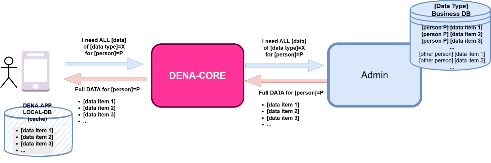

The following diagram shows the detailed steps of the complete process (read from left to right):


Step by step flow:

1. Client calls DENA-CORE requesting data
2. DENA-CORE authenticates and translates the request
3. DENA-CORE invokes the admin connector
4. Connector calls the admin data provider
5. Admin returns data from its DB
6. Connector translates semantics if necessary
7. DENA-CORE determines which data is new/updated
8. Data reaches the app

!!! success "Your responsibility in Data-Retrieve"
    1. Expose a REST endpoint that DENA can call (e.g., `POST /api/retrieveData`)
    2. When DENA calls, query your DB for the requested person
    3. Return data in standard DENA format, always including the **`lastChangedAt`** field for each data
    4. If you can't use the standard format, the DENA team will develop a custom connector that translates

    Your endpoint only needs to return data. DENA-CORE handles the rest (authenticate, calculate updates, deliver to app).

### The data origin instance

When an admin has **multiple data origins for the same data type** (e.g., several record management systems), an extra field is added for routing:

```
{person} | {admin} | {data type} | {data origin instance} | {last update instant}
```

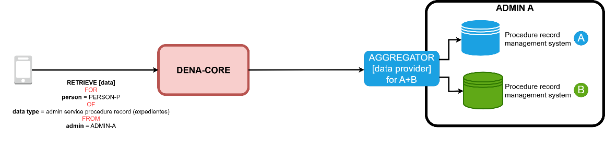
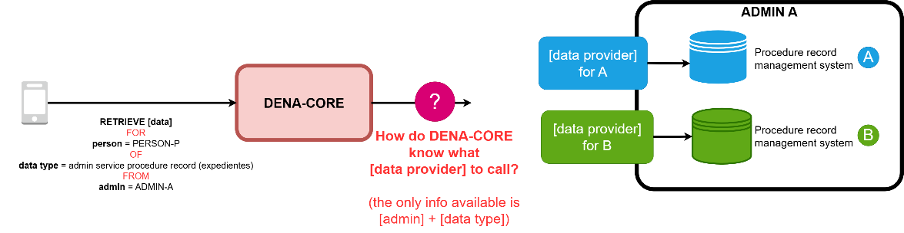

### "New/updated" detection

DENA-CORE automatically determines if data is new or has been updated:

1. Each data item returned by the admin has a **`lastChangedAt`** field
2. DENA-CORE compares with the **last time the person made a retrieve**
3. If `lastChangedAt` is later → the data is new or updated

The admin does **NOT need to indicate** if data is new or updated. DENA-CORE calculates it automatically.

### The Cold-Start Problem

When a person registers in DENA, no SRMD exists because admins don't yet know about them. For the app to show something from the first moment, DENA-CORE inserts initial SRMD for key admins/data types (EJGV, provincial councils, major municipalities).

### Person Sync

DENA synchronizes the list of persons registered in DENA with administrations so that admins only send SRMD for persons who actually have a DENA account.

**Why is it necessary?**

- Admins should only send SRMD for persons registered in DENA
- Admins access basic person data: NIF, name, contact, preferences

**Available mechanisms:**


#### DENA-PUSH: DENA notifies the admin

DENA sends an HTTP POST to an admin endpoint when:

| Event | Description |
|--------|-------------|
| `CREATED` | New person registered in DENA |
| `DELETED` | Person deleted their account |
| `UPDATED` | Person changed basic data (name, contact, etc.) |

**Your responsibility:**

!!! success "Your responsibility in Person-Sync Push"
    1. Expose an endpoint that accepts HTTP POST notifications from DENA
    2. Process the change type (CREATED/DELETED/UPDATED)
    3. Update your local DB to know which persons are in DENA
    4. Respond 200 OK

**Push payload example:**

```json
{
  "changeType": "CREATED",
  "person": {
    "oid": "501872FE-9A67-4AF8-BAAE-2E385119FF5F",
    "personId": { "id": "40404040H" }
  },
  "timestamp": "2026-08-17T15:14:07.0369127Z"
}
```


#### ADMIN PULL On-line: real-time query

The administration queries DENA directly to obtain person data.

**Your responsibility:**

!!! success "Your responsibility in Person-Sync Pull On-line"
    1. Obtain a DENA access token (OAuth authentication)
    2. Call the REST endpoint for person search
    3. Process the response and update your DB

**Request example:**

```
POST /persons/search
{
  "personIds": ["40404040H", "12345678Z"]
}
```

**Response example:**

```json
{
  "items": [
    {
      "person": {
        "oid": "501872FE-9A67-4AF8-BAAE-2E385119FF5F",
        "personId": { "id": "40404040H" }
      },
      "fullName": {
        "name": "Juan",
        "surname1": "García",
        "surname2": "López"
      },
      "contactData": {
        "email": "juan.garcia@example.com",
        "phone": "+34 600 123 456"
      },
      "preferredLanguages": ["es", "eu"]
    }
  ]
}
```

#### ADMIN PULL Off-line: batch synchronization

The administration downloads person lists in files.

**Pre-generated files:**

DENA periodically generates files (hourly) that the admin can download.

```
POST /pre-generated
{
  "jobType": "ALL_PERSONS",
  "exportType": "DATA",
  "fileFormat": "SQLITE"
}
```

**Custom (Bespoke) files:**

The admin requests a file with specific criteria and polls for status.

```
POST /bespokes
{
  "exportSpec": {
    "personExportSpec": "data",
    "lastUpdateRange": "Instant:[2026-08-24T21:19:41.314878600Z..)",
    "exportContentSpec": {
      "exportDefaultContactData": true,
      "exportOtherContactData": true,
      "exportFinData": true
    },
    "exportFileFormat": "CSV"
  }
}
```

**Complete Bespoke flow:**

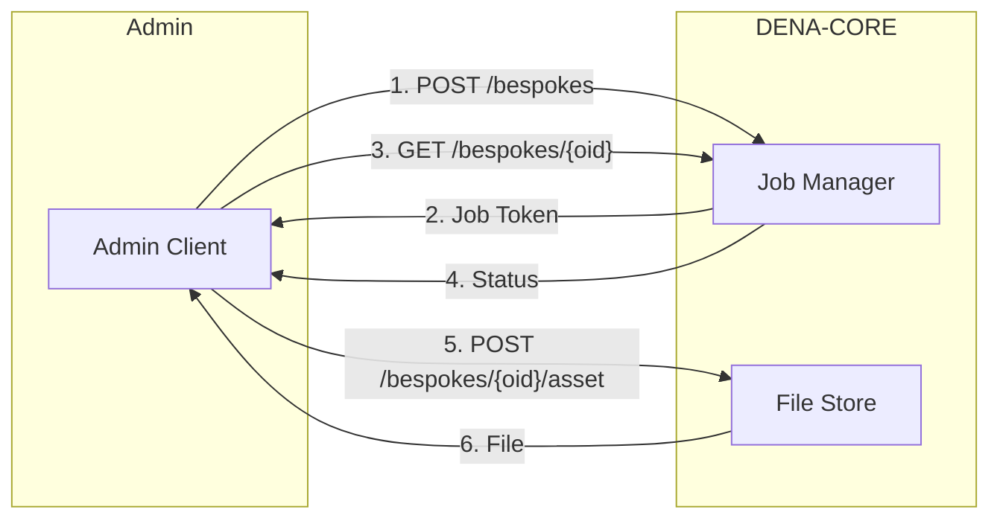

**Job states:**

- `REGISTERED`: Job created, pending processing
- `BEING_PROCESSED`: Job in execution
- `FINISHED_OK`: Job completed, file available
- `FINISHED_NOK`: Job failed (will retry)

!!! tip "Recommendation"
    We recommend implementing **both Push and Pull**:
    - Push for real-time notifications
    - Pull off-line as backup to recover missed notifications

---

## What does your administration have to implement?

Understanding the mechanism, this is what your admin must do in practice:

| Responsibility | What it implies | When |
|----------------|-----------------|------|
| **Expose a Data-Retrieve endpoint** | A REST service that DENA calls to get person data | Mandatory from the start |
| **Send SRMD periodically** | A process that queries your DB for changes and sends them to DENA | After having Data-Retrieve working |
| **Receive or query Person-Sync** | Expose an endpoint (Push) or query DENA (Pull) to know which persons are registered | When you need to filter for whom you send SRMD |
| **Configure authentication** | Request client credentials for your admin and/or provide credentials to DENA | At the start of onboarding |

!!! tip "Recommended order"
    1. Data-Retrieve → 2. Metadata-Sync → 3. Person-Sync

    You can start with only Data-Retrieve. The other operations are added later.

For the detailed implementation guide of each: [:octicons-arrow-right-24: Operations](../operativas/index.md)

---

## Connectors

The following diagram shows the architecture of a connector — the component that intermediates between DENA-CORE and your admin:

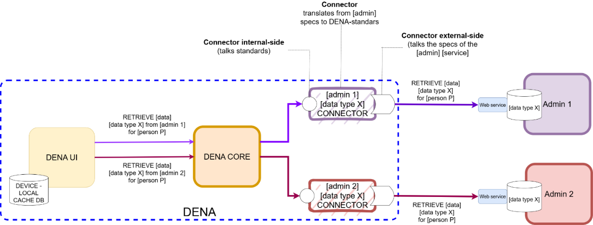

A connector has **two sides**:

| Side | Responsibility |
|------|----------------|
| **Internal** | Talks to DENA-CORE using standard DENA semantics |
| **External** | Talks to the admin in the terms it requires (transport, security, data format) |

The connector **translates** between both semantics. If the admin uses the standard DENA, the connector is transparent.

Connectors are **independent modules**: if a data provider degrades, the problem is contained in the connector without affecting the rest of the system.

!!! success "Your responsibility with connectors"
    - If you implement the **standard DENA endpoint** (REST + standard format): the connector is transparent, you don't need to do anything special
    - If your system uses **another format** (SOAP, files, custom semantics...): the DENA team develops a custom connector that translates between your format and the standard
    
    In both cases, the connector is managed by the DENA team. You only worry about exposing your service.

---

## Data provider architectures

Administrations can offer data in different ways depending on how they have their infrastructure organized. The following diagram shows the available options:


| Option | Description | Example |
|--------|-------------|---------|
| **(a)** Single | One data provider for a single data type in an admin | Your admin has a record manager with a dedicated endpoint |
| **(b)** Aggregated | One data provider that aggregates multiple instances of a system | Your admin has several record managers but a common data lake |
| **(c)** Distributed | Multiple separate data providers for multiple origins | Your admin has several record managers each with its own endpoint |
| **(d)** Multi-admin | One data provider that aggregates data from multiple admins | A provincial council offers data on behalf of its municipalities |

Below, the detail of each option:

**(a) Single** — One endpoint, one data type, one admin:
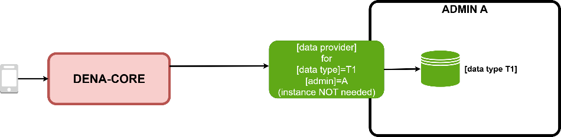

**(b) Aggregated** — One endpoint that aggregates multiple internal instances:
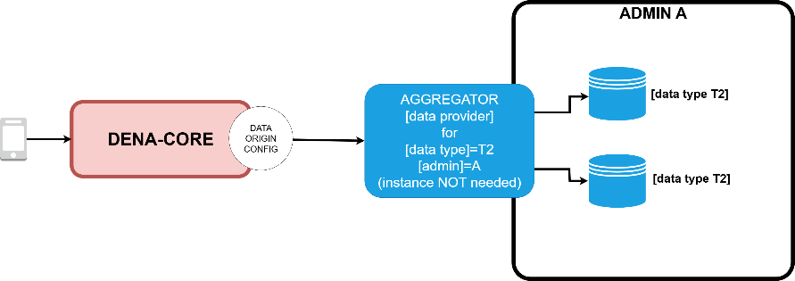

**(c) Distributed** — Multiple endpoints, each for a different origin (requires `data origin instance` in SRMD):
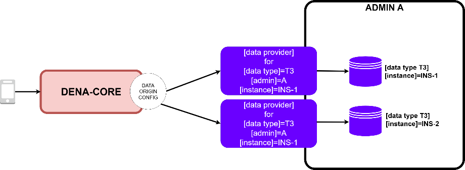

**(d) Multi-admin** — One endpoint that serves data for several administrations:
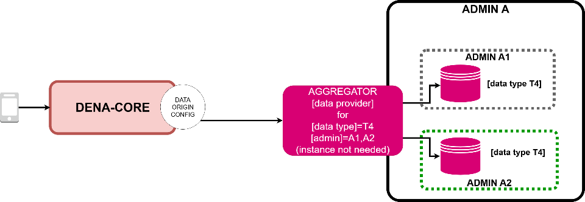

!!! success "Your responsibility: choose your pattern"
    - Most admins start with **(a)**: one endpoint per data type. It's the simplest.
    - If you have multiple systems for the same data type, choose between **(b)** (you aggregate) or **(c)** (DENA manages routing with `data origin instance`).
    - If you are a supra-territorial entity (provincial council) that can offer data from your municipalities, use **(d)**.
    
    The DENA team helps you decide which fits best to your case.

---

## Sync and Retrieve: detailed view

The following image shows the detailed view of the Sync and Retrieve module:

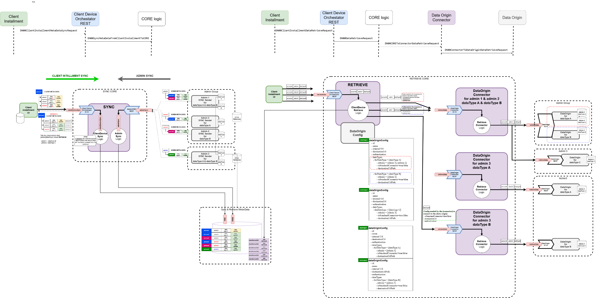

**Left part — SRMD SYNC (two flows):**

1. **Admin SYNC**: the admin calls DENA-CORE REST service to send SRMD → REST service translates [interop message] to [model objects] → stored in SRMD DB
2. **Client SYNC**: DENA-APP sends its local SRMD copy to DENA-CORE → DENA-CORE compares it with SRMD received from admins → returns to app which [data types] in which [admins] have changes pending refresh

**Right part — Data RETRIEVAL:**

1. DENA-APP requests data from DENA-CORE for a person + data type + admin
2. DENA-CORE queries **[data origin]** config to determine which [connector] to use and how to connect
3. DENA-CORE invokes the [connector]
4. [Connector] calls the [data provider] exposed by the admin
5. Data returns through the same path: admin → connector → CORE → app

---

## More information

| Page | Content |
|--------|-----------|
| [:octicons-arrow-right-24: Services Architecture](./arquitectura-servicios.md) | Internal layers, REST vs Java API, interop messages |
| [:octicons-arrow-right-24: Configuration](./configuracion.md) | Labeling, org config, interop config, data origins, app version |
| [:octicons-arrow-right-24: Base Data Model](./tipos-dato-base.md) | Foundational types: dates, ranges, UIDs, URLs... |
| [:octicons-arrow-right-24: Diagrams](./diagramas.md) | Editable draw.io diagrams |
| [:octicons-arrow-right-24: Other documentation](./otra-documentacion.md) | ADRs and additional documents |

---

## Complete architecture diagram

Once understood the modules and mechanisms above, this diagram shows the detailed view with all internal components of DENA-CORE and their interactions:

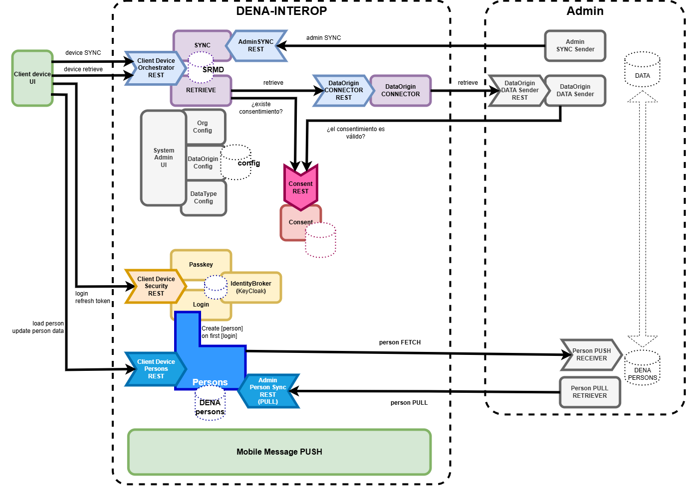

---

**Next:** [:octicons-arrow-right-24: Security & Authentication](../seguridad/index.md)

<!-- DENA-DOC-FOOTER -->
---
<sub>DENA Docs v{{ dena.version }} · {{ dena.date }}</sub>
