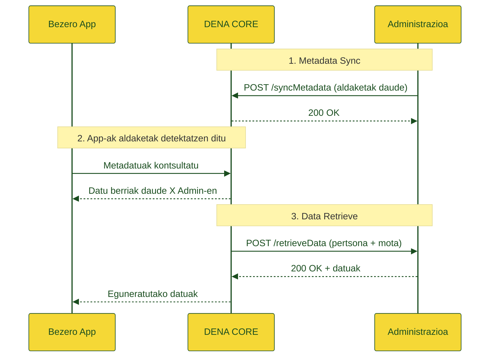

# :material-cube-outline: Arkitektura

## Ikuspegi Orokorra

DENA Interop administrazio ezberdinekin elkarreragingarritasuna ahalbidetzen duen sistema da, pertsona erabiltzaileei, bezero aplikazioaren bidez, administrazioek haiei buruz kudeatzen dituzten datuetara sarbidea emateko.

---

## Modulu nagusiak

-   :material-sync:{ .lg .middle } **Metadata Sync**

    ---

    Administrazioen jakinarazpenak jasotzen ditu pertsona baten datuetan aldaketak daudenean. DENA-k azken eguneratze-data soilik gordetzen du pertsona + datu mota + administrazio konbinazio bakoitzeko.

    [:octicons-arrow-right-24: Metadata-Sync Semantika](../semantica/metadata-sync/index.md)

-   :material-database-arrow-right:{ .lg .middle } **Data Retrieve**

    ---

    Bezero aplikazioak aldaketak detektatzen dituenean, administrazioari (DENA bidez) eguneratutako datuak deskargatzeko eskatzen dio. Administrazioak endpoint estandar bat esposatzen du.

    [:octicons-arrow-right-24: Data-Retrieve Semantika](../semantica/data-retrieve/index.md)

-   :material-account-sync:{ .lg .middle } **Person Sync**

    ---

    DENA-n erregistratutako pertsonen zerrenda administrazioekin sinkronizatzen du. Bi mekanismo: **Pull** (administrazioak kontsultatzen du) eta **Push** (DENA-k jakinarazten du).

    [:octicons-arrow-right-24: Person-Sync Semantika](../semantica/person-sync/index.md)

---

## Fluxu orokorra

---

## Konektore estandarra vs. ez-estandarra

!!! tip "Endpoint estandarra"

    Zure administrazioak REST endpoint estandarra inplementa badezake (`POST /api/retrieveData`), integrazioa zuzena eta azkarra da.

    [:octicons-arrow-right-24: Inplementazio gida](../semantica/data-retrieve/guia-implementacion.md)

!!! info "Konektore pertsonalizatua"

    Estandarra inplementatzea posible ez bada, DENA-tik administrazioak eskainitako bitartekoetara (SOAP, fitxategiak, etab.) egokitutako konektore espezifiko bat garatuko da.

---

## Dokumentazio erlazionatua

- [Diagramak (draw.io)](./diagramas.md)
- [Beste dokumentazioa](./otra-documentacion.md)
- [ADRak (Architecture Decision Records)]({{ repos.docs_main }}/ArchitectureDecisionRecords)

<!-- DENA-DOC-FOOTER -->
---
DENA Docs v{{ dena.version }} · {{ dena.date }}
