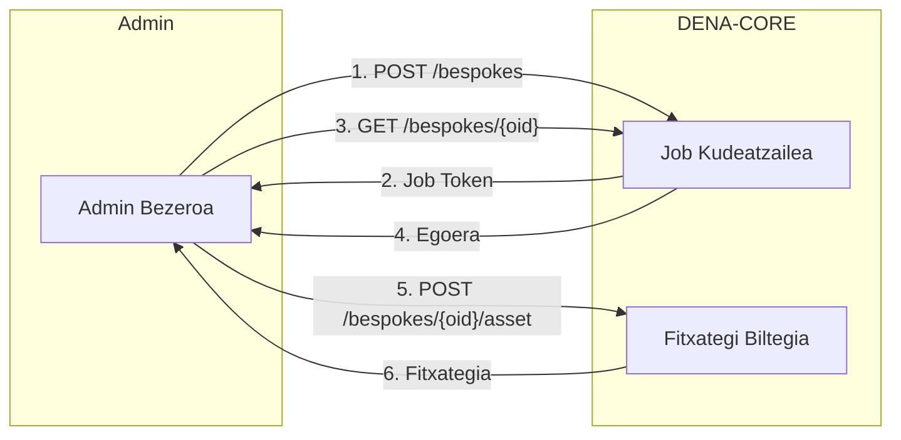

# :material-cube-outline: Arkitektura

Sekzio honek DENA barnealdetik nola eraikita dagoen deskribatzen du. Hasieran bloke nagusien ikuspegi orokorra eta sistemaren alderdi bakoitzean sakontzen du.

---

## Ikuspegi Orokorra

DENA Interop bloke nagusi hauek osatzen dute:


- **DENA-APP** (client device UI): pertsonek erabiltzen duten aplikazio mugikorra/web
- **DENA-CORE**: sistema nagusia, osatuta:
    - **[Config]**: antolaketa-egitura, interop konfigurazioa, app bertsioa
    - **[Persons]**: pertsona kontua + pertsonen sinkronizazioa adminekin
    - **[Sync and Retrieve]** (SRMD): zerbitzuak adminentzat eta DENA-APPentzat
    - **[Consents]**: baimenen biltegiratze eta egiaztapena
    - **[Security]]: pertsonaren saio hasiera, admin auth, admin UI auth
- **[Konektoreak]**: administrazio bakoitzekin bitartekaritza egiten duten modulu independenteak
- **[Administrazioak]**: datuak eskaintzen dituzten admin sistemak

---

## SYNC + RETRIEVE Mekanismoa

DENA bi datu-truke mekanismo nagusi ditu:

### SYNC: aldaketen jakinarazpena (SRMD)

Administrazioek **aldizka metadatuak bidaltzen** dizkiote DENA-COREri pertsonen datuetan aldaketak daudela adierazteko:

```
{persona} | {admin} | {datu mota} | {azken eguneratze instant}
```

Diagrama honek metadatu sinkronizazio fluxu osoa erakusten du (eskuinetik ezkerrera irakurri):


Zer erakusten duen:

- **Eskuin**: adminiek aldizka bidaltzen dizkiote SRMDak DENA-COREri detektatutako aldaketekin
- **Erdian**: DENA-COREk SRMD horiek gordetzen ditu (soilik metadatuak, benetako datuak ez)
- **Ezker**: DENA-APPk bere SRMD kopia lokala DENA-CORErekin sinkronizatzen du zer datu freskatu jakin dezan

Honek EZ du datuak bidaltzen, baizik eta esaten du: *"pertsona honi buruz datu mota honen zerbaitek aldatu egin da"*.

**Zure administrazioak hemen egin behar duena:**

!!! success "Zure ardura Metadata-Sync-en"
    1. Prozesu aldibaterako izatea (minuturo X) zure BD kontsultatzen duena azken ziklotik aldatu diren erregistroak bilatzeko
    2. Aldaketa bakoitzerako SRMD erregistroa sortzea: persona + datu mota + admin + noiz aldatu
    3) SRMD guztiak DENA-COREri bidaltzea HTTP POST batekin

    Ez daukazu jakin behar zein datu aldatu den edo bidali behar. soilik aldaketa gertatu dela eta noiz.

### RETRIEVE: datuen berreskuratzea

DENA-APPk aldaketak detektatzen dituenean, DENA-COREri datu osoak eskatzen dio. DENA-COREk **proxy** gisa jarduten du administrazioaren aurrean:

Diagrama honek datu-berreskuratze fluxu sinplifikatua erakusten du — DENA-COREk app eta zure adminen artean bitartekaritza egiten du:


Hurrengo diagramak prozesu osoaren urrats zehatzak erakusten ditu (ezkerretik eskuinera irakurri):


Urratsez urrats fluxua:

1. Bezeroak DENA-CORE deitzen du datuak eskatuz
2. DENA-COREk autentikatzen eta itzultzen du eskaera
3. DENA-COREk admin konektorea deitzen du
4. Konektoreak admin datu-hornitzaileari deitzen dio
5. Adminak datuak bere BDtik itzultzen ditu
6. Konektoreak semantika itzultzen du behar izanez gero
7. DENA-COREk zehazten zein datu diren berriak/eguneratuak
8. Datuk apperaino iristen dira

!!! success "Zure ardura Data-Retrieve-n"
    1. REST endpoint bat erakustea DENA dei diezaioken (adib. `POST /api/retrieveData`)
    2. DENA deitzen duenean, zure BD kontsultatzea eskatutako pertsonarentzat
    3. Datuak DENA formatu estandarrean itzultzea, beti **`lastChangedAt`** eremua barne datu bakoitzeko
    4. Estandar formatua ezin baduzu erabili, DENA taldeak konektore pertsonalizatua garatuko du itzultzeko

    Zure endpointek soilik datuak itzuli behar ditu. DENA-COREk gainerakoa kudeatzen du (autentikatu, kalkulatu berrikuntzak, entregatu appari).

### Data origin instance

Admin batek **jatorri anitzeko datuak dituenean datu mota bererako** (adib. kudeatzaile erregistro anitz), birrigarpeneko errenkada gehigarri bat gehitzen da:

```
{persona} | {admin} | {datu mota} | {data origin instance} | {azken eguneratze instant}
```


### "Berria/eguneratua" detekzioa

DENA-COREk automatikoki zehazten du datu bat berria den ala eguneratu den:

1. Adminak itzulitako datu elementu bakoitzak **`lastChangedAt`** eremua du
2. DENA-COREk alderatzen du **pertsonak azkeneko aldiz retrieve egin zuenekin**
3. `lastChangedAt` berriagoa bada → datua berria da edo eguneratu da

Admink EZ du adierazi behar datu bat berria den ala eguneratu den. DENA-COREk automatikoki kalkulatzen du.

### Cold-Start Arazoa

Pertsona bat DENAn erregistratzen denean, ez dago SRMDrik adminiek oraindik ez baitakite. Appak lehen momentutik zerbait erakusteko, DENA-COREk hasierako SRMDak txertatzen ditu admin/gidu-mota giltzetarako (EJGV, foru aldundiak, udalerri nagusiak).

### Person Sync

DENAk DENAn erregistratutako pertsonen zerrenda administrazioekin sinkronizatzen du, adminiek soilik SRMDak bidal ditzaten benetan DENA kontua duten pertsonentzat.

**Zergatik da beharrezko?**

- Adminiek soilik SRMDak bidali behar dituzte DENAn erregistratutako pertsonentzat
- Adminiek pertsonen datu basikoetara sartzen dira: NAF, izena, kontaktua, lehentasunak

**Meknismo erabilgarriak:**


#### DENA-PUSH: DENAk admini jakinarazten dio

DENAk HTTP POST bat bidaltzen dio adminaren endopinti:

| Gertaera | Deskribapena |
|----------|--------------|
| `CREATED` | PERTSONA BERRIA erregistratuta DENAn |
| `DELETED` | Pertsonak bere kontua ezabatu du |
| `UPDATED` | Pertsonak datu basikoak aldatu ditu (izena, kontaktua, etab.) |

**Zure ardura:**

!!! success "Zure ardura Person-Sync Push-en"
    1. HTTP POST jakinarazpenak onartzen dituen endpoint bat erakustea
    2. Aldaketa mota prozesatzea (CREATED/DELETED/UPDATED)
    3. Zure BD lokala eguneratzea zein pertsona dauden jakiteko DEnan
    4. 200 OK erantzutea

**Push payload adibidea:**

```json
{
  "changeType": "CREATED",
  "person": {
    "oid": "501872FE-9A67-4AF8-BAAE-2E385119FF5F",
    "personId": { "id": "40404040H" }
  },
  "timestamp": "2026-08-17T15:14:07.0369127Z"
}
```


#### ADMIN PULL Lineako: denbora errealeko kontsulta

Administrazioak zuzenean DENA kontsultatzen du pertsonen datuak lortzeko.

**Zure ardura:**

!!! success "Zure ardura Person-Sync Pull Lineako"
    1. DENA access token bat lortzea (OAuth autentikazioa)
    2. PERTSONEN bilaketarako REST endpoint deitzea
    3) Erantzuna prozesatu eta zure BD eguneratzea

**Eskari adibidea:**

```
POST /persons/search
{
  "personIds": ["40404040H", "12345678Z"]
}
```

**Erantzun adibidea:**

```json
{
  "items": [
    {
      "person": {
        "oid": "501872FE-9A67-4AF8-BAAE-2E385119FF5F",
        "personId": { "id": "40404040H" }
      },
      "fullName": {
        "name": "Juan",
        "surname1": "García",
        "surname2": "López"
      },
      "contactData": {
        "email": "juan.garcia@example.com",
        "phone": "+34 600 123 456"
      },
      "preferredLanguages": ["es", "eu"]
    }
  ]
}
```

#### ADMIN PULL Lineaz kanpoko: batch sinkronizazioa

Administrazioak pertsonen zerrendak fitxategitan deskargatzen ditu.

**Aurregeneratutako fitxategiak:**

DENAk aldizka (orduro) sortutako fitxategiak ditu adminak deskarga ditzakeenak.

```
POST /pre-generated
{
  "jobType": "ALL_PERSONS",
  "exportType": "DATA",
  "fileFormat": "SQLITE"
}
```

**Pertsonalizatutako (Bespoke) fitxategiak:**

Administrazioak irizpide zehatzekin fitxategi bat eskatzen eta egoeraren polling egiten du.

```
POST /bespokes
{
  "exportSpec": {
    "personExportSpec": "data",
    "lastUpdateRange": "Instant:[2026-08-24T21:19:41.314878600Z..)",
    "exportContentSpec": {
      "exportDefaultContactData": true,
      "exportOtherContactData": true,
      "exportFinData": true
    },
    "exportFileFormat": "CSV"
  }
}
```

**Bespoke fluxu osoa:**



**Job egoerak:**

- `REGISTERED`: Job sortuta, prozesatzeko zain
- `BEING_PROCESSED`: Job exekuzioan
- `FINISHED_OK`: Job osatuta, fitxategia erabilgarri
- `FINISHED_NOK`: Job huts egin du (berriro saiatuko da)

!!! tip "Gomendioa"
    **Bai Push eta Pull** inplementatzea gomendatzen da:
    - Push jakinarazpenetarako denbora errealean
    - Pull lineaz kanpoko babeskopiatutzat jakinarazpen galduak berreskuratzeko

---

## Zure administrazioak zer inplementatu behar du?

Mekanismoa ulertuta, hau da zure adminek praktikaren egin behar duena:

| Ardura | Zer esan nahi du | Noiz |
|--------|------------------|------|
| **Data-Retrieve endpoint erakustea** | DENAk deituko duen REST zerbitzu bat pertsona datuak lortzeko | Hasieratik derrigorrezkoa |
| **SRMD aldizka bidaltzea** | Zure BD kontsultatzen duen prozesu bat aldaketak bilatzeko eta DENAri bidaltzeko | Data-Retrieve izan ondoren |
| **Person-Sync jasotzea edo kontsultatzea** | Endpoint bat erakustea (Push) edo DENA kontsultatzea (Pull) zein pertsona dauden jakiteko | SRMDak nori bidali behar zaion iragazteko behar duzunean |
| **Autentifikazioa konfiguratzea** | Zure adminerako client credentials eskatzea eta/o DENAri credentzialak ematea | Onboarding hasieran |

!!! tip "Ordena gomendatua"
    1. Data-Retrieve → 2. Metadata-Sync → 3. Person-Skin

    Data-Retrieverekin has zaitezke soilik. Beste operazioak geroago gehitzen dira.

Inplementazio gida zehatzagorako: [:octicons-arrow-right-24: Operatibak](../operativas/index.md)

---

## Konektoreak

Hurrengo diagrama konektore baten arkitektura erakusten du — DENA-CORE eta zure adminen artean bitartekaritza egiten duen osagaia:


Konektoreak **bi alde** ditu:

| Aldea | Ardura |
|-------|--------|
| **Barneko** | DENA-CORErekin hitz egiten du DENA semantika estandarra erabiliz |
| **Kanpoko** | Adminarekin hitz egiten du honek eskatzen dituen terminoetan (garraioa, segurtasuna, datu formatua) |

Konektoreak **itzultzen** du bi semantiken artean. Adminak DENA estandarra erabiltzen badu, konektorea garden da.

Konektoreak **modulu independenteak** dira: data provider bat degradatzen bada, arazoa konektorean geratzen da sisteman gainerakoa eragin gabe.

!!! success "Zure ardura konektoreekin"
    - **DENA endpoint estandarra** inplementatzen baduzu (REST + formatu estandarra): konektorea garden da, ezer berezirik egin beharrik ez duzu
    - Zure sistemak **beste formatu** bat erabiltzen badu (SOAP, fitxategiak, semantika pertsonalizatua...): DENA taldeak konektore pertsonalizatua garatzen du zure formatutik estandarrera itzultzeko
    
    Bi kasuetan, konektorea DENA taldeak kudeatzen du. Zuk soilik zure zerbitzua erakusteaz kezkatu zaitezke.

---

## Data provider arkitekturak

Administrazioek datuak era desberdinetan eskaini ditzakete haien infragestrutura nola antolatu duten arabera. Hurrengo diagramak aukera erabilgarriak erakusten ditu:


| Aukera | Deskribapena | Adibidea |
|--------|--------------|----------|
| **(a)** Single | Datu mota bakarreko data provider bat admin bakarrean | Zure adminek kudeatzaile erregistro bat du dedicated endpoint batekin |
| **(b)** Aggregated | Sistema baten instantzia anitzak biltzen dituen data provider bat | Zure adminek kudeatzaile erregistro anitz ditu baina data lake komun bat |
| **(c)** Distributed | Jatorri anitzetarako data provider bananduak | Zure adminek kudeatzaile erregistro anitz ditu bakoitzak bere propio endpointarekin |
| **(d)** Multi-admin | Admin anitzeko datuak biltzen dituen data provider bat | Foru aldundi bat bere udalerrien izenean datuak eskaintzen ditu |

Behen, aukera bakoitzaren xehetasuna:

**(a) Single** — Endpoint bat, datu mota bat, admin bat:


**(b) Aggregated** — Instantzia barneko anitzak biltzen dituen endpoint bat:


**(c) Distributed** — Endpoint anitz, bakoitza jatorri desberdin batenentzat (SRMDn `data origin instance` behar du):


**(d)** Multi-admin — Admin anitzentzat datuak eskaintzen dituen endpoint bat:


!!! success "Zure ardura: zure patroia aukeratu"
    - Admin gehienak **(a)** hasten dira: endpoint bat datu mota bakoitzeko. Errazena da.
    - Sistema anitz badituzu datu mota bererako, aukeratu **(b)** (zu biltzen duzu) edo **(c)** (DENA kudeatzen du birrigarpenekin `data origin instance`)
    - Entitate supra-lurraldea bazara (foru aldundia) udalerrietako datuak eskain ditzakeena, erabili **(d)**.
    
    DENA taldeak laguntzen du zein egokitzen den hobe zure kasura.

---

## Sync and Retrieve: ikuspegi zehatza

Hurrengo irudiak Sync and Retrieve moduluaren ikuspegi zehatza erakusten du:


**Ezkerreko zatia — SRMD SYNC (bi fluxu):**

1. **Admin SYNC**: adminak DENA-CORE REST zerbitzua deitzen du SRMDa bidaltzeko → REST zerbitzuak [interop message] [model objects]era itzultzen du → SRMD DBn gordetzen dira
2. **Client SYNC**: DENA-APPk bere SRMD kopia lokala DENA-COREri bidaltzen du → DENA-COREk adminengandik jasotako SRMDekin alderatzen du → appari zein [data types] zein [admin]-etan dituen freskatzeko aldaketak itzultzen die

**Eskuineko zatia — Data RETRIEVAL:**

1. DENA-APPk DENA-CORE datuak eskatzen die pertsona + datu mota + admin baterako
2. DENA-COREk **[data origin]** konfigurazioa kontsultatzen du zein [konektore] erabili eta nola konektatu jakiteko
3. DENA-COREk [konektorea] deitzen du
4. [Konektoreak] adminak erakutsitako [data provider]ari deitzen dio
5. Datuak bide beretik itzultzen dira: admin → konektore → CORE → app

---

## Informazio gehiago

| Orrialdea | Edukia |
|-----------|--------|
| [:octicons-arrow-right-24: Zerbitzu Arkitektura](./arquitectura-servicios.md) | Barneko geruzak, REST vs Java API, interop mezuak |
| [:octicons-arrow-right-24: Konfigurazioa](./configuracion.md) | Etiketa, org konfigurazioa, interop konfigurazioa, data origins, app bertsioa |
| [:octicons-arrow-right-24: Oinarrizko Datu Eredua](./tipos-dato-base.md) | Oinarrizko motak: datak, barrutiak, UID, URL... |
| [:octicons-arrow-right-24: Diagramak](./diagramas.md) | Editagarriak diren draw.io diagramak |
| [:octicons-arrow-right-24: Beste dokumentazioa](./otra-documentacion.md) | ADR eta dokumentu gehigarriak |

---

## Arkitektura diagrama osoa

Moduluak eta mekanismoak ulertu ondoren, diagrama honek DENA-COREN osagai barnekoen eta haien interakzioen ikuspegi zehatza erakusten du:


---

**Hurrengoa:** [:octicons-arrow-right-24: Segurtasuna eta Autentifikazioa](../seguridad/index.md)

<!-- DENA-DOC-FOOTER -->
---
<sub>DENA Docs v{{ dena.version }} · {{ dena.date }}</sub>
