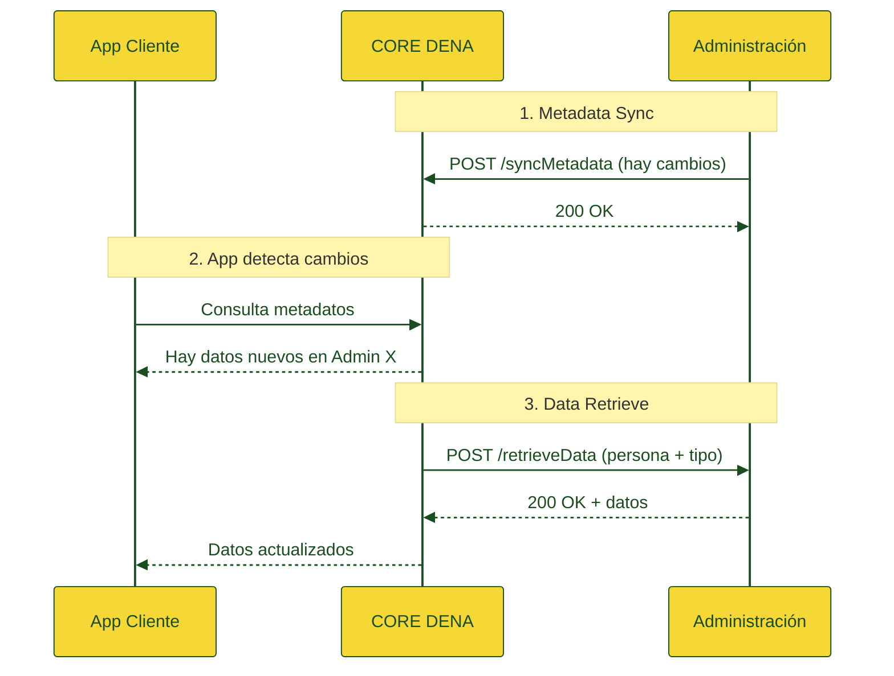

# :material-cube-outline: Arquitectura

## Visión General

DENA Interop es el sistema que permite la interoperabilidad con las distintas administraciones para facilitar a las personas usuarias, a través de la aplicación cliente, el acceso a los datos que las administraciones gestionan sobre ellas.

---

## Módulos principales

-   :material-sync:{ .lg .middle } **Metadata Sync**

    ---

    Recibe notificaciones de las administraciones cuando hay cambios en datos de una persona. DENA almacena solo la fecha de última actualización por combinación persona + tipo de dato + administración.

    [:octicons-arrow-right-24: Semántica Metadata-Sync](../semantica/metadata-sync/index.md)

-   :material-database-arrow-right:{ .lg .middle } **Data Retrieve**

    ---

    Cuando la app cliente detecta cambios, solicita a la administración (a través de DENA) la descarga de los datos actualizados. La administración expone un endpoint estándar.

    [:octicons-arrow-right-24: Semántica Data-Retrieve](../semantica/data-retrieve/index.md)

-   :material-account-sync:{ .lg .middle } **Person Sync**

    ---

    Sincroniza el listado de personas registradas en DENA con las administraciones. Dos mecanismos: **Pull** (la administración consulta) y **Push** (DENA notifica).

    [:octicons-arrow-right-24: Semántica Person-Sync](../semantica/person-sync/index.md)

---

## Flujo general

---

## Conector estándar vs. no estándar

!!! tip "Endpoint estándar"

    Si tu administración puede implementar el endpoint REST estándar (`POST /api/retrieveData`), la integración es directa y rápida.

    [:octicons-arrow-right-24: Guía de implementación](../semantica/data-retrieve/guia-implementacion.md)

!!! info "Conector a medida"

    Si no es posible implementar el estándar, desde DENA se desarrollará un conector específico que se adapte a los medios facilitados por la administración (SOAP, ficheros, etc.).

---

## Documentación relacionada

- [Diagramas (draw.io)](./diagramas.md)
- [Otra documentación](./otra-documentacion.md)
- [ADRs (Architecture Decision Records)]({{ repos.docs_main }}/ArchitectureDecisionRecords)

<!-- DENA-DOC-FOOTER -->
---
DENA Docs v{{ dena.version }} · {{ dena.date }}
