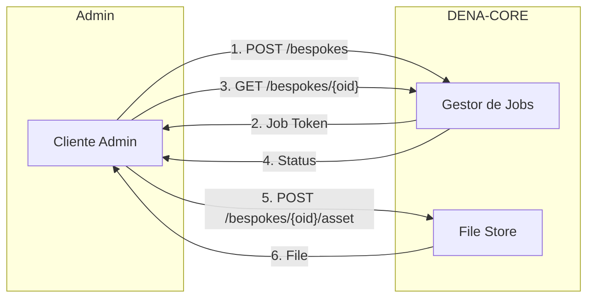

# :material-cube-outline: Arquitectura

Esta sección describe cómo está construido DENA por dentro. Comienza con una visión general de los bloques principales y profundiza en cada aspecto del sistema.

---

## Visión General

DENA Interop está compuesto por los siguientes bloques principales:


- **DENA-APP** (client device UI): la aplicación móvil/web que usan las personas
- **DENA-CORE**: el sistema central, compuesto por:
    - **[Config]**: estructura organizacional, interop config, app version
    - **[Persons]**: cuenta de persona + sincronización de personas con admins
    - **[Sync and Retrieve]** (SRMD): servicios para admins y DENA-APP
    - **[Consents]**: almacenamiento y verificación de consentimientos
    - **[Security]**: login de persona, auth de admins, auth de la UI de administración
- **[Conectores]**: módulos independientes que intermedian con cada administración
- **[Administraciones]**: los sistemas de las admins que exponen datos

---

## Mecanismo SYNC + RETRIEVE

DENA tiene dos mecanismos principales de intercambio de datos:

### SYNC: notificar cambios (SRMD)

Las administraciones **envían periódicamente meta-datos** a DENA-CORE indicando que hay cambios en datos de personas:

```
{persona} | {admin} | {tipo de dato} | {instante última actualización}
```

Este diagrama muestra el flujo completo de la sincronización de meta-datos (léelo de derecha a izquierda):


Lo que muestra:

- **Derecha**: las admins periódicamente envían SRMD a DENA-CORE con los cambios detectados
- **Centro**: DENA-CORE almacena esos SRMD (solo meta-datos, no datos reales)
- **Izquierda**: DENA-APP sincroniza su copia local de SRMD con DENA-CORE para saber qué datos refrescar

Esto NO envía los datos en sí, solo dice: *"algún dato de este tipo sobre esta persona ha cambiado"*.

**Lo que tu administración tiene que hacer aquí:**

!!! success "Tu responsabilidad en Metadata-Sync"
    1. Tener un proceso periódico (cada X minutos) que consulte tu BD buscando registros que han cambiado desde el último ciclo
    2. Por cada cambio, crear un registro SRMD con: persona + tipo de dato + admin + cuándo cambió
    3. Enviar todos los SRMD a DENA-CORE con un POST HTTP

    No necesitas saber qué dato concreto cambió ni enviarlo. Solo el hecho de que hubo un cambio y cuándo.

### RETRIEVE: recuperar datos

Cuando DENA-APP detecta cambios, pide a DENA-CORE los datos completos. DENA-CORE actúa como **proxy** hacia la administración:

Este diagrama muestra el flujo simplificado de la recuperación de datos — DENA-CORE intermedia entre la app y tu admin:


El siguiente diagrama muestra los pasos detallados del proceso completo (léelo de izquierda a derecha):


El flujo paso a paso:

1. El cliente llama a DENA-CORE solicitando datos
2. DENA-CORE autentica y traduce la petición
3. DENA-CORE invoca al conector de la admin
4. El conector llama al data provider de la admin
5. La admin devuelve los datos desde su BD
6. El conector traduce la semántica si es necesario
7. DENA-CORE determina qué datos son nuevos/actualizados
8. Los datos llegan a la app

!!! success "Tu responsabilidad en Data-Retrieve"
    1. Exponer un endpoint REST que DENA pueda llamar (ej: `POST /api/retrieveData`)
    2. Cuando DENA llame, consultar tu BD para la persona solicitada
    3. Devolver los datos en formato estándar DENA, incluyendo siempre el campo **`lastChangedAt`** por cada dato
    4. Si no puedes usar el formato estándar, el equipo DENA desarrollará un conector a medida que traduzca

    Tu endpoint solo necesita devolver datos. DENA-CORE se encarga del resto (autenticar, calcular novedades, entregar a la app).

### El data origin instance

Cuando una admin tiene **múltiples orígenes de datos para el mismo tipo de dato** (ej: varios gestores de expedientes), se añade un campo extra para el routing:

```
{persona} | {admin} | {tipo de dato} | {data origin instance} | {última actualización}
```


### Detección de "nuevo/actualizado"

DENA-CORE determina automáticamente si un dato es nuevo o ha sido actualizado:

1. Cada dato devuelto por la admin tiene un campo **`lastChangedAt`**
2. DENA-CORE compara con la **última vez que la persona hizo un retrieve**
3. Si `lastChangedAt` es posterior → el dato es nuevo o actualizado

La admin **NO necesita indicar** si un dato es nuevo o actualizado. DENA-CORE lo calcula automáticamente.

### El problema del Cold-Start

Cuando una persona se inscribe en DENA, no existe SRMD porque las admins aún no saben de ella. Para que la app muestre algo desde el primer momento, DENA-CORE inserta SRMD iniciales para admins/tipos de dato clave (EJGV, diputaciones, principales ayuntamientos).

### Person Sync

DENA sincroniza el listado de personas inscritas con las administraciones para que las admins solo envíen SRMD para personas que realmente tienen cuenta DENA.

**¿Por qué es necesario?**

- Las admins solo deben enviar SRMD para personas inscritas en DENA
- Las admins acceden a datos básicos de las personas: NIF, nombre, contacto, preferencias

**Mecanismos disponibles:**


#### DENA-PUSH: DENA notifica a la admin

DENA envía un HTTP POST a un endpoint de la administración cuando:

| Evento | Descripción |
|--------|-------------|
| `CREATED` | Nueva persona registrada en DENA |
| `DELETED` | Persona eliminó su cuenta |
| `UPDATED` | Persona cambió datos básicos (nombre, contacto, etc.) |

**Tu responsabilidad:**

!!! success "Tu responsabilidad en Person-Sync Push"
    1. Exponer un endpoint que acepte notificaciones HTTP POST de DENA
    2. Procesar el tipo de cambio (CREATED/DELETED/UPDATED)
    3. Actualizar tu BD local para saber qué personas están en DENA
    4. Responder 200 OK

**Ejemplo de payload Push:**

```json
{
  "changeType": "CREATED",
  "person": {
    "oid": "501872FE-9A67-4AF8-BAAE-2E385119FF5F",
    "personId": { "id": "40404040H" }
  },
  "timestamp": "2026-08-17T15:14:07.0369127Z"
}
```


#### ADMIN PULL On-line: consulta en tiempo real

La administración consulta directamente a DENA para obtener datos de personas.

**Tu responsabilidad:**

!!! success "Tu responsabilidad en Person-Sync Pull On-line"
    1. Obtener un access token de DENA (autenticación OAuth)
    2. Llamar al endpoint REST de búsqueda de personas
    3. Procesar la respuesta y actualizar tu BD

**Ejemplo de request:**

```
POST /persons/search
{
  "personIds": ["40404040H", "12345678Z"]
}
```

**Ejemplo de response:**

```json
{
  "items": [
    {
      "person": {
        "oid": "501872FE-9A67-4AF8-BAAE-2E385119FF5F",
        "personId": { "id": "40404040H" }
      },
      "fullName": {
        "name": "Juan",
        "surname1": "García",
        "surname2": "López"
      },
      "contactData": {
        "email": "juan.garcia@example.com",
        "phone": "+34 600 123 456"
      },
      "preferredLanguages": ["es", "eu"]
    }
  ]
}
```

#### ADMIN PULL Off-line: sincronización por lotes

La administración descarga listados de personas en ficheos.

**Ficheros pre-generados:**

DENA genera ficheos periódicamente (cada hora) que la admin puede descargar.

```
POST /pre-generated
{
  "jobType": "ALL_PERSONS",
  "exportType": "DATA",
  "fileFormat": "SQLITE"
}
```

**Ficheros a medida (Bespoke):**

La admin solicita un ficheo con criterios específicos y hace polling del estado.

```
POST /bespokes
{
  "exportSpec": {
    "personExportSpec": "data",
    "lastUpdateRange": "Instant:[2026-08-24T21:19:41.314878600Z..)",
    "exportContentSpec": {
      "exportDefaultContactData": true,
      "exportOtherContactData": true,
      "exportFinData": true
    },
    "exportFileFormat": "CSV"
  }
}
```

**Flujo completo de Bespoke:**



**Estados del job:**

- `REGISTERED`: Job creado, pendiente de procesar
- `BEING_PROCESSED`: Job en ejecución
- `FINISHED_OK`: Job completado, ficheo disponible
- `FINISHED_NOK`: Job falló (reintentará)

!!! tip "Recomendación"
    Se recomienda implementar **tanto Push como Pull**:
    - Push para notificaciones en tiempo real
    - Pull off-line como respaldo para recuperar notificaciones perdidas

---

## ¿Qué tiene que implementar tu administración?

Entendido el mecanismo, esto es lo que tu admin debe hacer en la práctica:

| Responsabilidad | Qué implica | Cuándo |
|----------------|-------------|--------|
| **Exponer un endpoint de Data-Retrieve** | Un servicio REST que DENA llama para obtener datos de una persona | Obligatorio desde el inicio |
| **Enviar SRMD periódicamente** | Un proceso que consulta tu BD buscando cambios y los envía a DENA | Después de tener Data-Retrieve funcionando |
| **Recibir o consultar Person-Sync** | Exponer un endpoint (Push) o consultar a DENA (Pull) para saber qué personas están inscritas | Cuando necesites filtrar para quién envías SRMD |
| **Configurar autenticación** | Solicitar client credentials para tu admin y/o proporcionar credenciales a DENA | Al inicio del onboarding |

!!! tip "Orden recomendado"
    1. Data-Retrieve → 2. Metadata-Sync → 3. Person-Sync

    Puedes empezar solo con Data-Retrieve. Las otras operativas se añaden después.

Para la guía detallada de implementación de cada una: [:octicons-arrow-right-24: Operativas](../operativas/index.md)

---

## Conectores

El siguiente diagrama muestra la arquitectura de un conector — el componente que intermedia entre DENA-CORE y tu admin:


Un conector tiene **dos lados**:

| Lado | Responsabilidad |
|------|----------------|
| **Interno** | Habla con DENA-CORE usando semántica estándar DENA |
| **Externo** | Habla con la admin en los términos que ella requiera (transport, security, data format) |

El conector **traduce** entre ambas semánticas. Si la admin usa el estándar DENA, el conector es transparente.

Los conectores son **módulos independientes**: si un data provider se degrada, el problema queda contenido en el conector sin afectar al resto del sistema.

!!! success "Tu responsabilidad con los conectores"
    - Si implementas el **endpoint estándar** DENA (REST + formato estándar): el conector es transparente, no necesitas hacer nada especial
    - Si tu sistema usa **otro formato** (SOAP, ficheros, semántica propia...): el equipo DENA desarrolla un conector a medida que traduce entre tu formato y el estándar
    
    En ambos casos, el conector lo gestiona el equipo DENA. Tú solo te preocupas de exponer tu servicio.

---

## Arquitecturas de data providers

Las administraciones pueden ofrecer datos de diferentes formas dependiendo de cómo tengan organizada su infraestructura. El siguiente diagrama muestra las opciones disponibles:


| Opción | Descripción | Ejemplo |
|--------|-------------|---------|
| **(a)** Single | Un data provider para un único tipo de dato en una admin | Tu admin tiene un gestor de expedientes con un endpoint dedicado |
| **(b)** Aggregated | Un data provider que agrega múltiples instancias de un sistema | Tu admin tiene varios gestores de expedientes pero un data lake común |
| **(c)** Distributed | Múltiples data providers separados para múltiples orígenes | Tu admin tiene varios gestores de expedientes cada uno con su propio endpoint |
| **(d)** Multi-admin | Un data provider que agrega datos de múltiples admins | Una diputación ofrece datos en nombre de sus ayuntamientos |

A continuación, el detalle de cada opción:

**(a) Single** — Un endpoint, un tipo de dato, una admin:


**(b) Aggregated** — Un endpoint que agrega múltiples instancias internas:


**(c) Distributed** — Múltiples endpoints, cada uno para un origen distinto (requiere `data origin instance` en el SRMD):


**(d) Multi-admin** — Un endpoint que sirve datos para varias administraciones:


!!! success "Tu responsabilidad: elige tu patrón"
    - La mayoría de admins empiezan con **(a)**: un endpoint por tipo de dato. Es lo más sencillo.
    - Si tienes múltiples sistemas para el mismo tipo de dato, elige entre **(b)** (tú agregas) o **(c)** (DENA gestiona el routing con `data origin instance`).
    - Si eres una entidad supra-territorial (diputación) que puede ofrecer datos de tus ayuntamientos, usa **(d)**.
    
    El equipo DENA te ayuda a decidir cuál se ajusta mejor a tu caso.

---

## Sync and Retrieve: vista detallada

La siguiente imagen muestra la vista detallada del módulo de Sync and Retrieve:


**Parte izquierda — SRMD SYNC (dos flujos):**

1. **Admin SYNC**: la [admin] llama al REST service de DENA-CORE para enviar SRMD → el REST service traduce el [interop message] a [model objects] → se almacenan en la DB de SRMD
2. **Client SYNC**: DENA-APP envía su copia local de SRMD a DENA-CORE → DENA-CORE la compara con los SRMD recibidos de las admins → devuelve a la app qué [data types] en qué [admins] tienen cambios pendientes de refrescar

**Parte derecha — Data RETRIEVAL:**

1. DENA-APP solicita datos a DENA-CORE para una persona + tipo de dato + admin
2. DENA-CORE consulta la **config de [data origin]** para determinar qué [conector] usar y cómo conectar
3. DENA-CORE invoca al [conector] correspondiente
4. El [conector] llama al [data provider] expuesto por la admin
5. Los datos vuelven por el mismo camino: admin → conector → CORE → app

---

## Más información

| Página | Contenido |
|--------|-----------|
| [:octicons-arrow-right-24: Arquitectura de Servicios](./arquitectura-servicios.md) | Capas internas, REST vs Java API, interop messages |
| [:octicons-arrow-right-24: Configuración](./configuracion.md) | Labeling, org config, interop config, data origins, app version |
| [:octicons-arrow-right-24: Modelo de Datos Base](./tipos-dato-base.md) | Tipos fundacionales: fechas, ranges, UIDs, URLs... |
| [:octicons-arrow-right-24: Diagramas](./diagramas.md) | Diagramas draw.io editables |
| [:octicons-arrow-right-24: Otra documentación](./otra-documentacion.md) | ADRs y documentos adicionales |

---

## Diagrama completo de la arquitectura

Una vez entendidos los módulos y mecanismos anteriores, este diagrama muestra la vista detallada con todos los componentes internos de DENA-CORE y sus interacciones:


---

**Siguiente:** [:octicons-arrow-right-24: Seguridad y Autenticación](../seguridad/index.md)

<!-- DENA-DOC-FOOTER -->
---
<sub>DENA Docs v{{ dena.version }} · {{ dena.date }}</sub>
