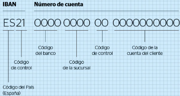

# :material-format-list-bulleted-type: Tipos de Dato Base

DENA usa un conjunto de [**model objects**] que constituyen una de las piedras angulares del sistema. Esta sección describe los [model objects] básicos.

---

## Tipos fundacionales

### Boolean

`true` / `false` (siempre en minúsculas).

### Numbers

| Tipo | Descripción | Ejemplo |
|------|-------------|---------|
| **Integer** | Número entero con signo. Representación 64 bits (Java Long). Rango: [-9.223.372.036.854.775.808 .. 9.223.372.036.854.775.807] | `25` |
| **FloatingPoint** | Número de doble precisión en punto flotante. Representación 64 bits (Java Double). Rango: [4.9E-324 .. 1.8E+308] | `12.5` (punto como separador decimal) |

### Enums

Representan valores en un espectro finito predefinido. Se serializan como texto siempre en MAYÚSCULAS.

```
ACTIVE / INACTIVE
```

### Language / Country

[Language] es un [Enum] especializado con los idiomas soportados por DENA:

| Enum Val | Int code | iso639_1 | iso639_2 |
|----------|----------|----------|----------|
| SPANISH | 10 | es | spa |
| BASQUE | 11 | eu | eus |
| ENGLISH | 20 | en | eng |
| FRENCH | 30 | fr | fra |
| DEUTCH | 40 | de | deu |
| ITALIAN | 58 | it | ita |
| PORTUGUESE | 59 | pt | por |

| Country Enum | Val | iso3166_1 | iso3166_2 |
|-------------|-----|-----------|-----------|
| SPAIN | 724 | ES | ESP |
| UNITED_KINGDOM | 826 | GB | GBR |
| FRANCE | 250 | FR | FRA |
| GERMANY | 276 | DE | DEU |
| ITALY | 380 | IT | ITA |
| PORTUGAL | 620 | PT | PRT |

### String

Un texto plano.

```
Sample text string
```

### LanguageTexts

Un `Map<Language, String>` cuya [clave] es el [idioma] y el [valor] un texto en ese [idioma]:

```json
{
  "SPANISH": "Expediente",
  "BASQUE": "Espediente",
  "ENGLISH": "Administrative Record"
}
```

### Date Time

| Tipo | Descripción | Formato | Ejemplo |
|------|-------------|---------|---------|
| **LocalDate** | Fecha sin hora ni zona horaria | `yyyy-MM-dd` | `2024-12-15` |
| **UTCDateTime** | Fecha y hora con precisión de milisegundo. Siempre UTC | `yyyy-MM-ddTHH:mm:ss.SSSZ` | `2023-12-16T13:00:00.000Z` |
| **OffsetDateTime** | Fecha y hora con zona horaria | `yyyy-MM-ddTHH:mm:ss.SSSXXX` | `2026-02-05T14:30:15.123+01:00` |
| **TimeStamp** | Un instante, siempre en UTC. EPOCH (segundos desde 1970-01-01T00:00:00Z) | número | `1670374400` |

**Tipos auxiliares:**

| Tipo | Descripción | Ejemplo |
|------|-------------|---------|
| **TimeLapse** | Período de tiempo: `{número}{d|h|m|s|ms|mus|ns}` | `5d` = 5 días, `3s` = 3 segundos |
| **TimeFrequency** | Enum: DAILY, WEEKLY, MONTHLY, QUARTERLY, YEARLY | `MONTHLY` |

### Ranges

Representan un intervalo discreto de números o fechas con dos límites que pueden o no estar incluidos:

| Notación | Significado | Equivalencia |
|----------|-------------|--------------|
| `[1..20]` | Entre 1 y 20, ambos incluidos | X >= 1 && X <= 20 |
| `[1..20)` | 1 incluido, 20 excluido | X >= 1 && X < 20 |
| `(1..20]` | 1 excluido, 20 incluido | X > 1 && X <= 20 |
| `(1..20)` | Ambos excluidos | X > 1 && X < 20 |
| `[1..]` | Mayor o igual a 1 | X >= 1 |
| `(1..]` | Mayor que 1 | X > 1 |
| `[..20]` | Menor o igual a 20 | X <= 20 |
| `[..20)` | Menor que 20 | X < 20 |

!!! note "Por defecto"
    En los servicios de interoperabilidad DENA, **por defecto se usan bounds inclusivos**.

**Ejemplos comunes:**

| Tipo | Representación |
|------|---------------|
| Local Date Range | `[2023-01-01..2023-12-31]` |
| DateTime Range | `[2023-01-01T00:00:00.000Z..2023-01-01T13:00:00.000Z]` |
| Integer Range | `[12..15]` |
| Floating Point Range | `[1.5..5.5]` |

---

### UID / OID

Un UID (Unique Identifier) y su especialización OID (Object Identifier) son un **identificador universal único sin significado de negocio**, generado aleatoriamente.

**Los UIDs / OIDs no se repiten.**

Formato: cadena hexadecimal de 36 caracteres organizada en 5 grupos separados por `-`.

```
db761b72-1634-4fb0-b7f1-3c1ebbdbb1eb
```

!!! info "Short UIDs"
    A veces se usan **SHORT UIDs** (más cortos, ej: `db761b72`). Se usan en situaciones especiales donde el conjunto de objetos es muy pequeño o para nombrar objetos de vida corta (ej: un mensaje que expira).

### ID

IDs son **identificadores con significado de negocio**:

- Un identificador de [persona] (ej: NIF español)
- Un número de [expediente administrativo] (ej: `EXP-2023-0004232`)
- El [IBAN] que identifica una [cuenta bancaria]

**Ejemplos de formatos:**

- **IBAN**: `ES21999911110099999999`



- **DNI**: 8 dígitos + 1 letra
- **NIE**: 1 letra (X/Y/Z) + 7 dígitos + 1 letra
- **CIF**: 1 letra + 7 dígitos + 1 carácter de control

### Token

Tokens son similares a [ID] pero generalmente relacionados con seguridad.

### URLs

#### Url

Modela una URL con: protocol, port, host, urlPath, queryString, anchor.

```
https://dena.eus/payments#concepts?param1=a&param2=b
```

#### UrlCollection

Una colección de [Url]s donde cada item puede tener: ID, language, tags.

```json
[
  {
    "id": "mipago",
    "url": "https://www.euskadi.eus/nireordainketa",
    "lang": "BASQUE"
  },
  {
    "id": "mipago",
    "url": "https://www.euskadi.eus/mipago",
    "lang": "SPANISH"
  }
]
```

#### WebLink

Modela un [web link] con: url text, language, atributos de presentación.

```json
{
  "url": "https://www.euskadi.eus/nireordainketa",
  "texts": {
    "lang": "BASQUE",
    "title": "Euskal administrazioen ordainketa-pasabidea",
    "description": "Admin baten edozein likidazio ordaintzeko aukera ematen du"
  }
}
```

#### WebLinkCollection

Una colección de [WebLinks].

### Money

Tipo para representar valores monetarios (moneda + cantidad).

### Hash (digest)

Resumen de un texto obtenido aplicando el algoritmo **SHA-256**. Características:

| Propiedad | Descripción |
|---|---|
| **Longitud fija** | A partir de cualquier texto de entrada se obtiene un hash de longitud y formato fijo |
| **Consistencia** | El mismo texto de entrada siempre genera el mismo hash |
| **Unidireccional** | Es prácticamente imposible obtener el texto original a partir del hash |
| **Resistente a colisiones** | Es prácticamente imposible que dos textos diferentes generen el mismo hash |
| **Sensibilidad extrema** | Cualquier pequeño cambio en la entrada genera un hash completamente diferente |

**Ejemplo:**

| Texto original | Hash (SHA-256) |
|---|---|
| `This is a random text to be hashed` | `2251f5ac60e4fc24a62914bf92a9adf3af1abbf72d649eceec9ed7c3a2e29b8f` |

### UserAgent

String que identifica al cliente que realiza una petición HTTP. Sigue un patrón estructurado según el tipo de origen:

| Origen | Formato | Ejemplo |
|---|---|---|
| App móvil DENA | `DenaApp/<ver> (<OS>; <device>) Dart/<ver> Flutter/<ver>` | `DenaApp/1.0 (Android 13; Pixel 6 Pro) Dart/3.0 Flutter/3.16` |
| DENA-CORE | `DENA-CORE/<ver> <module>/<ver> (support@dena.eus)` | `DENA-CORE/2.1.0 person-data/1.0.1 (support@dena.eus)` |
| Administración | `AdminX/<ver> <module>/<ver> (support@adminX.eus)` | `AdminX/1.1.0 expedientes/1.0.0 (support@adminX.eus)` |
| Navegador web | Formato estándar del browser | `Mozilla/5.0 (Macintosh; ...) Chrome/143.0.0.0 ...` |

Para más detalle: [:octicons-arrow-right-24: UserAgent](../semantica/semantica-base/modelo/user-agent.md)

<!-- DENA-DOC-FOOTER -->
---
<sub>DENA Docs v{{ dena.version }} · {{ dena.date }}</sub>
