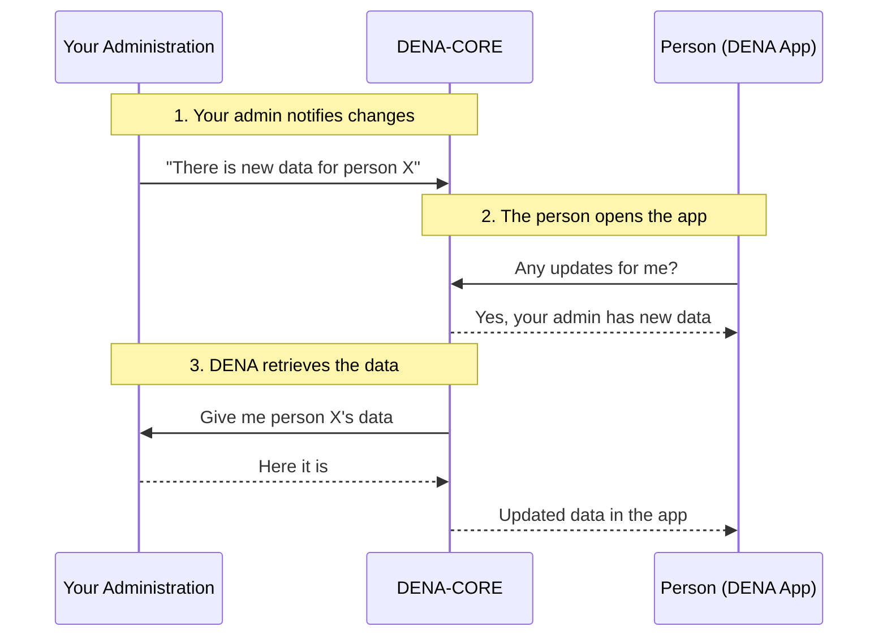

---
hide:
  - toc
---

# :material-swap-horizontal-bold: What is DENA?

**DENA** is the Basque Government's interoperability platform that allows people to access, from a single application (mobile or web), the data that different public administrations manage about them.

This documentation is aimed at the **public administrations** that integrate with DENA to expose their data.

---

## The problem it solves

Today, a person has data spread across multiple administrations: records at the Basque Government, appointments at their municipality, notifications at the provincial council... To check them, they must visit each administration's website separately.

DENA eliminates that friction: **one app, all the data, from all administrations**.

---

## Key concepts

| Concept | What it is |
|---------|-----------|
| **Person** | A person registered in DENA (identified by NIF) |
| **Administration (admin)** | Your entity: municipality, provincial council, Basque Government... that exposes data |
| **DENA-APP** | The mobile/web app the person uses to view their data |
| **DENA-CORE** | The central system that mediates between the app and the administrations |
| **Data type** | A category of information: records, appointments, notifications, payments... |
| **SRMD** | *Sync and Retrieve Meta-Data*: the "there are changes" notifications your admin sends to DENA |
| **Connector** | A component in DENA that knows how to communicate with your system |

The diagram shows how concepts relate:

- The **[person]** uses the **DENA-APP** installed on their **[client device]** (may have multiple installations)
- The DENA-APP communicates with **DENA-CORE** to sync SRMD and retrieve data
- The **[admins]** have **[data origins]** that expose **[data providers]**
- DENA-CORE uses **[admin connectors]** to talk to each admin's data providers
- Admins send **SRMD** (change notifications) to DENA-CORE through the **[admin SRMD receiver]**
- DENA-APP syncs its local SRMD copy with DENA-CORE through the **[client SRMD sync]**

---

## How it works

Now that you know the actors and their relationships, this is the simplified daily flow between your administration, DENA and the person:

Three steps:

1. **Your admin notifies DENA** that there is new data for a person (**Metadata-Sync**)
2. **DENA detects the change** and communicates it to the app
3. **DENA retrieves the data** from your admin when the person needs it (**Data-Retrieve**)

---

## What does your administration need to do?

-   :material-database-arrow-right:{ .lg .middle } **Serve Data (Data-Retrieve)**

    ---

    Expose a REST endpoint so DENA can query a person's data when needed.

    **This is the first thing to implement.**

    [:octicons-arrow-right-24: How to implement it](./operativas/data-retrieve.md)

-   :material-bell-ring:{ .lg .middle } **Notify Changes (Metadata-Sync)**

    ---

    Periodically send notifications to DENA that there is new or updated data for certain people.

    *Without this, DENA doesn't know when there are updates.*

    [:octicons-arrow-right-24: How to implement it](./operativas/metadata-sync.md)

-   :material-account-sync:{ .lg .middle } **Synchronize People (Person-Sync)**

    ---

    Receive from DENA the list of registered people to know for whom to send notifications.

    *Push (DENA notifies you) or Pull (you query).*

    [:octicons-arrow-right-24: How to implement it](./operativas/person-sync.md)

---

## Fundamental principles

!!! tip "DENA does not store your data"
    DENA-CORE acts as a **proxy**: data is retrieved directly from your admin when the person requests it. No copies are stored in DENA.

!!! tip "Your admin does not need additional infrastructure"
    You only need to expose a REST endpoint. DENA adapts to you. If you cannot implement the standard, DENA develops a custom connector.

!!! tip "Consent is mandatory"
    Every data access requires prior consent from the person. Your admin can verify it in DENA-CORE.

---

## :material-sitemap: Where do I go next?

| Section | Content | When to consult |
|---|---|---|
| [:material-cube-outline: Architecture](./arquitectura/index.md) | How DENA is built internally | To understand the system |
| [:material-shield-lock: Security & Authentication](./seguridad/index.md) | How it's protected and how to authenticate | To configure access |
| [:material-cogs: Operations](./operativas/index.md) | What to implement and how (Data-Retrieve, Sync...) | To develop |
| [:material-code-braces: Semantics](./semantica/index.md) | Data format, fields, models | For technical specification |
| [:material-play-circle: Getting Started](./guia-inicio/onboarding.md) | Onboarding, installation, connectivity | When you're ready to implement |
| [:material-wrench: Tools](./devtools/index.md) | DevTools, Postman, mock | To test |
| [:material-book-open-variant: Reference](./referencia/faq.md) | FAQ, Glossary, Troubleshooting | If you have questions |

---

!!! question "Technical support"
    
    For technical queries, integration issues or credential requests:
    
    **:material-email:** [admin-digital-data-dena@ejie.eus](mailto:admin-digital-data-dena@ejie.eus)

<!-- DENA-DOC-FOOTER -->
---
DENA Docs v{{ dena.version }} · {{ dena.date }}
