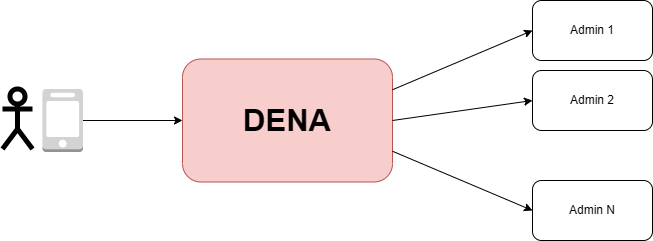
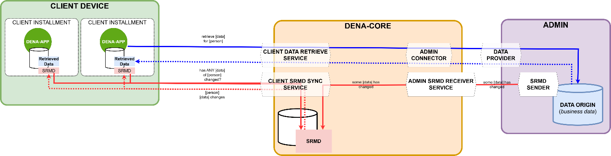
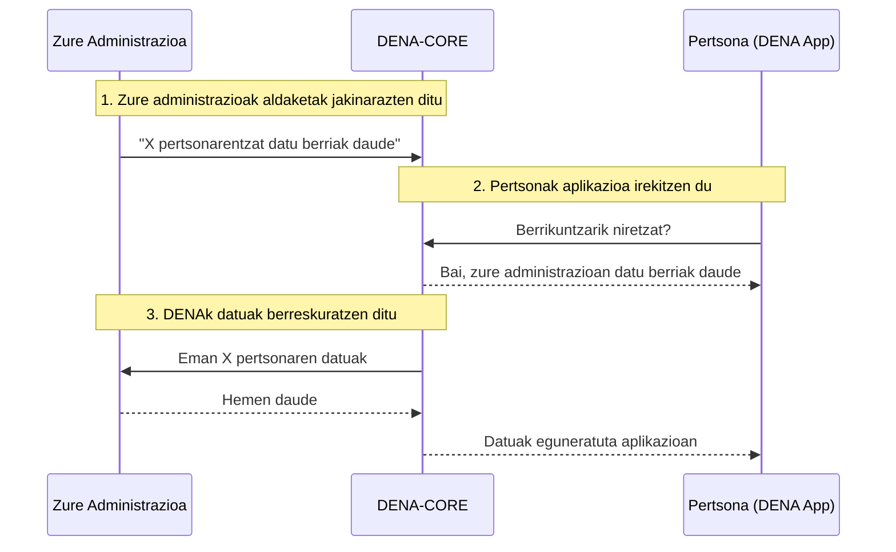

---
hide:
  - toc
---

# :material-swap-horizontal-bold: Zer da DENA?

**DENA** Eusko Jaurlaritzaren elkarreragingarritasun-plataforma da, herritarrei aplikazio bakar batetik (mugikorra edo weba) administrazio publiko ezberdinek haiei buruz kudeatzen dituzten datuetara sartzeko aukera ematen diena.

Dokumentazio hau DENArekin integratzen diren **administrazio publikoei** zuzenduta dago, beren datuak erakusteko.

---

## Konpontzen duen arazoa

Gaur egun, pertsona batek hainbat administraziotan dauka datuak sakabanatuta: espedienteak Eusko Jaurlaritzan, hitzorduak bere udaletxean, jakinarazpenak foru aldundian... Haiek kontsultatzeko, bakoitzaren webgunera joan behar du banan-banan.

DENAk marruskadura hori ezabatzen du: **aplikazio bakarra, datu guztiak, administrazio guztietatik**.

---

## Funtsezko kontzeptuak

| Kontzeptua | Zer den |
|------------|---------|
| **Pertsona** | DENAn inskribatutako pertsona (NANaz identifikatua) |
| **Administrazioa (admin)** | Zure erakundea: udala, foru aldundia, Eusko Jaurlaritza... datuak erakusten dituena |
| **DENA-APP** | Pertsonak bere datuak ikusteko erabiltzen duen mugikor/web aplikazioa |
| **DENA-CORE** | Aplikazioaren eta administrazioen arteko bitartekari den sistema zentrala |
| **Datu mota** | Informazio-kategoria bat: espedienteak, hitzorduak, jakinarazpenak, ordainketak... |
| **SRMD** | *Sync and Retrieve Meta-Data*: zure administrazioak DENAri bidaltzen dizkion "aldaketak daude" abisua |
| **Konektorea** | DENAn zure sistemarekin nola hitz egin dakien osagaia |

Diagramak kontzeptuen arteko harremana erakusten du:

- **[Pertsonak]** bere **[gailu klientean]** instalatutako **DENA-APP** erabiltzen du (instalazio bat baino gehiago izan ditzake)
- DENA-APPek **DENA-CORE**rekin komunikatzen da SRMD sinkronizatzeko eta datuak berreskuratzeko
- **[Administrazioek]** **[datu-jatorriak]** dituzte, **[datu-hornitzaileak]** erakusten dituztenak
- DENA-COREk **[admin konektoreak]** erabiltzen ditu admin bakoitzaren datu-hornitzaileekin hitz egiteko
- Administrazioek **SRMD** (aldaketa-abisuak) bidaltzen dizkiote DENA-COREri **[admin SRMD hartzailearen]** bidez
- DENA-APPek bere SRMD kopia lokala DENA-CORErekin sinkronizatzen du **[client SRMD sync]** bidez

---

## Nola funtzionatzen du

Aktoreak eta haien harremanak ezagututa, hau da zure administrazioaren, DENAren eta pertsonaren artean egunerokoan gertatzen denaren fluxu sinplifikatua:

Hiru urrats:

1. **Zure administrazioak DENAri jakinarazten dio** pertsona batentzat datu berriak daudela (**Metadata-Sync**)
2. **DENAk aldaketa detektatzen du** eta aplikazioari komunikatzen dio
3. **DENAk datuak berreskuratzen ditu** zure administraziotik pertsonak behar dituenean (**Data-Retrieve**)

---

## Zer egin behar du zure administrazioak?

-   :material-database-arrow-right:{ .lg .middle } **Datuak Zerbitzatu (Data-Retrieve)**

    ---

    REST endpoint bat erakutsi DENAk pertsona baten datuak kontsulta ditzan behar dituenean.

    **Hau da lehenik inplementatu behar dena.**

    [:octicons-arrow-right-24: Nola inplementatu](./operativas/data-retrieve.md)

-   :material-bell-ring:{ .lg .middle } **Aldaketak Jakinarazi (Metadata-Sync)**

    ---

    Aldizka DENAri abisuak bidali zenbait pertsonentzat datu berriak edo eguneratuak daudela.

    *Hau gabe, DENAk ez daki noiz dauden berrikuntzak.*

    [:octicons-arrow-right-24: Nola inplementatu](./operativas/metadata-sync.md)

-   :material-account-sync:{ .lg .middle } **Pertsonak Sinkronizatu (Person-Sync)**

    ---

    DENAtik inskribatutako pertsonen zerrenda jaso, noretzat bidali abisuak jakiteko.

    *Push (DENAk jakinarazten dizu) edo Pull (zuk kontsultatzen duzu).*

    [:octicons-arrow-right-24: Nola inplementatu](./operativas/person-sync.md)

---

## Oinarrizko printzipioak

!!! tip "DENAk ez ditu zure datuak gordetzen"
    DENA-COREk **proxy** gisa jokatzen du: datuak zuzenean berreskuratzen dira zure administraziotik pertsonak eskatzen dituenean. Ez da kopiarik gordetzen DENAn.

!!! tip "Zure administrazioak ez du azpiegitura gehigarririk behar"
    REST endpoint bat erakustea besterik ez duzu behar. DENA zuri egokitzen zaizu. Estandarra inplementatu ezin baduzu, DENAk neurri-konektore bat garatzen du.

!!! tip "Baimena derrigorrezkoa da"
    Datu-sarbide bakoitzak pertsonaren aldez aurreko baimena eskatzen du. Zure administrazioak DENA-COREn egiaztatu dezake.

---

## :material-sitemap: Nora jarraitu?

| Atala | Edukia | Noiz kontsultatu |
|---|---|---|
| [:material-cube-outline: Arkitektura](./arquitectura/index.md) | DENA nola eraikita dagoen barrutik | Sistema ulertzeko |
| [:material-shield-lock: Segurtasuna eta Autentifikazioa](./seguridad/index.md) | Nola babesten den eta nola autentifikatu | Sarbideak konfiguratzeko |
| [:material-cogs: Operatibak](./operativas/index.md) | Zer inplementatu eta nola (Data-Retrieve, Sync...) | Garatzeko |
| [:material-code-braces: Semantika](./semantica/index.md) | Datu-formatua, eremuak, ereduak | Zehaztapen teknikorako |
| [:material-play-circle: Lehen Urratsak](./guia-inicio/onboarding.md) | Onboardinga, instalazioa, konektibitatea | Inplementatzeko prest zaudenean |
| [:material-wrench: Tresnak](./devtools/index.md) | DevTools, Postman, mock | Probatzeko |
| [:material-book-open-variant: Erreferentzia](./referencia/faq.md) | FAQ, Glosarioa, Troubleshooting | Zalantzak badituzu |

---

!!! question "Laguntza teknikoa"
    
    Kontsulta teknikoetarako, integrazio arazoetarako edo kredentzial eskaeretarako:
    
    **:material-email:** [admin-digital-data-dena@ejie.eus](mailto:admin-digital-data-dena@ejie.eus)

<!-- DENA-DOC-FOOTER -->
---
DENA Docs v{{ dena.version }} · {{ dena.date }}
