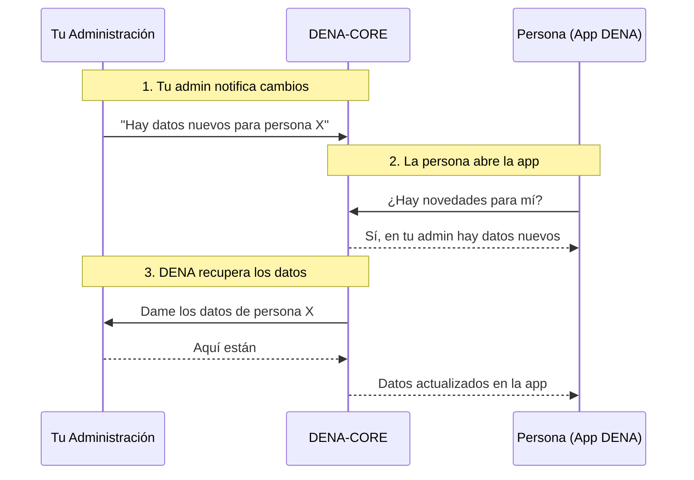

---
hide:
  - toc
---

# :material-swap-horizontal-bold: ¿Qué es DENA?

**DENA** es la plataforma de interoperabilidad del Gobierno Vasco que permite a la ciudadanía acceder, desde una única aplicación (móvil o web), a los datos que las distintas administraciones públicas gestionan sobre ella.

Esta documentación está dirigida a las **administraciones públicas** que se integran con DENA para exponer sus datos.

---

## El problema que resuelve

Hoy, una persona tiene datos repartidos en múltiples administraciones: expedientes en el Gobierno Vasco, citas en su ayuntamiento, notificaciones en la diputación... Para consultarlos, debe ir a la web de cada una por separado.

DENA elimina esa fricción: **una sola app, todos los datos, de todas las administraciones**.

---

## Conceptos clave

| Concepto | Qué es |
|----------|--------|
| **Persona** | Una persona inscrita en DENA (identificada por NIF) |
| **Administración (admin)** | Tu entidad: ayuntamiento, diputación, Gobierno Vasco... que expone datos |
| **DENA-APP** | La app móvil/web que usa la persona para ver sus datos |
| **DENA-CORE** | El sistema central que intermedia entre la app y las administraciones |
| **Tipo de dato** | Una categoría de información: expedientes, citas, notificaciones, pagos... |
| **SRMD** | *Sync and Retrieve Meta-Data*: los avisos de "hay cambios" que tu admin envía a DENA |
| **Conector** | Un componente en DENA que sabe cómo hablar con tu sistema |

El diagrama muestra cómo se relacionan los conceptos:

- La **[persona]** usa la **DENA-APP** instalada en su **[dispositivo cliente]** (puede tener varias instalaciones)
- La DENA-APP se comunica con **DENA-CORE** para sincronizar SRMD y recuperar datos
- Las **[admins]** tienen **[orígenes de datos]** (data origins) que exponen **[data providers]**
- DENA-CORE usa **[conectores de admin]** para hablar con los data providers de cada admin
- Las admins envían **SRMD** (avisos de cambios) a DENA-CORE a través del **[admin SRMD receiver]**
- DENA-APP sincroniza su copia local de SRMD con DENA-CORE a través del **[client SRMD sync]**

---

## Cómo funciona

Ahora que conoces los actores y sus relaciones, este es el flujo simplificado de lo que ocurre en el día a día entre tu administración, DENA y la persona:

Tres pasos:

1. **Tu admin notifica a DENA** que hay datos nuevos para una persona (**Metadata-Sync**)
2. **DENA detecta el cambio** y se lo comunica a la app
3. **DENA recupera los datos** de tu admin cuando la persona los necesita (**Data-Retrieve**)

---

## ¿Qué tiene que hacer tu administración?

-   :material-database-arrow-right:{ .lg .middle } **Servir Datos (Data-Retrieve)**

    ---

    Exponer un endpoint REST para que DENA consulte los datos de una persona cuando los necesite.

    **Es lo primero que hay que implementar.**

    [:octicons-arrow-right-24: Cómo implementarlo](./operativas/data-retrieve.md)

-   :material-bell-ring:{ .lg .middle } **Notificar Cambios (Metadata-Sync)**

    ---

    Enviar periódicamente a DENA avisos de que hay datos nuevos o actualizados para ciertas personas.

    *Sin esto, DENA no sabe cuándo hay novedades.*

    [:octicons-arrow-right-24: Cómo implementarlo](./operativas/metadata-sync.md)

-   :material-account-sync:{ .lg .middle } **Sincronizar Personas (Person-Sync)**

    ---

    Recibir de DENA el listado de personas inscritas para saber para quién enviar avisos.

    *Push (DENA te notifica) o Pull (tú consultas).*

    [:octicons-arrow-right-24: Cómo implementarlo](./operativas/person-sync.md)

---

## Principios fundamentales

!!! tip "DENA no almacena tus datos"
    DENA-CORE actúa como **proxy**: los datos se recuperan directamente de tu admin cuando la persona los pide. No se guardan copias en DENA.

!!! tip "Tu admin no necesita infraestructura adicional"
    Solo necesitas exponer un endpoint REST. DENA se adapta a ti. Si no puedes implementar el estándar, DENA desarrolla un conector a medida.

!!! tip "El consentimiento es obligatorio"
    Cada acceso a datos requiere un consentimiento previo de la persona. Tu admin puede verificarlo en DENA-CORE.

---

## :material-sitemap: ¿Por dónde sigo?

| Sección | Contenido | Cuándo consultarla |
|---|---|---|
| [:material-cube-outline: Arquitectura](./arquitectura/index.md) | Cómo está construido DENA por dentro | Para entender el sistema |
| [:material-shield-lock: Seguridad y Autenticación](./seguridad/index.md) | Cómo se protege y cómo autenticarte | Para configurar accesos |
| [:material-cogs: Operativas](./operativas/index.md) | Qué implementar y cómo (Data-Retrieve, Sync...) | Para desarrollar |
| [:material-code-braces: Semántica](./semantica/index.md) | Formato de datos, campos, modelos | Para la especificación técnica |
| [:material-play-circle: Primeros Pasos](./guia-inicio/onboarding.md) | Onboarding, instalación, conectividad | Cuando estés listo para implementar |
| [:material-wrench: Herramientas](./devtools/index.md) | DevTools, Postman, mock | Para probar |
| [:material-book-open-variant: Referencia](./referencia/faq.md) | FAQ, Glosario, Troubleshooting | Si tienes dudas |

---

!!! question "Soporte técnico"
    
    Para consultas técnicas, problemas de integración o solicitud de credenciales:
    
    **:material-email:** [admin-digital-data-dena@ejie.eus](mailto:admin-digital-data-dena@ejie.eus)

<!-- DENA-DOC-FOOTER -->
---
DENA Docs v{{ dena.version }} · {{ dena.date }}
