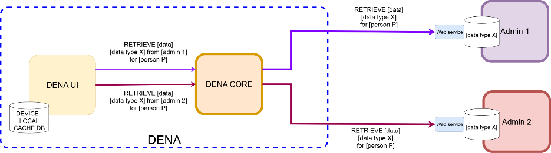
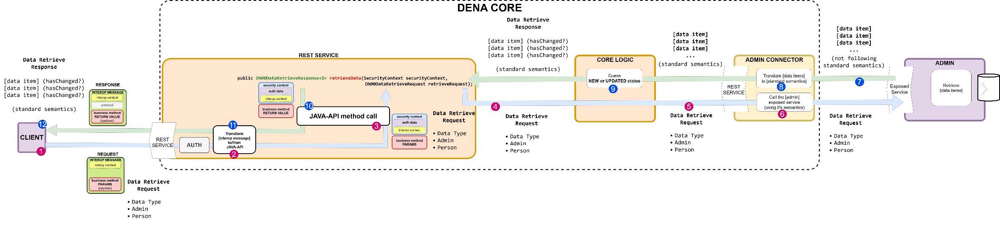

# :material-database-arrow-right: Data-Retrieve (Serve Data)

## Concept

Data-Retrieve is the operation by which **DENA calls your administration to obtain a person's data**. Your admin exposes a REST endpoint and DENA invokes it when the person needs to see their updated data.



### How does it work?

1. The person opens the app and DENA detects that there is data pending refresh
2. DENA-CORE invokes your endpoint through your admin's connector
3. Your endpoint queries the DB and returns that person's data
4. DENA-CORE determines which data is new/updated and sends it to the app



### Key points

- Your admin returns **all the data** of the requested data type for that person
- Each data item must include a **`lastChangedAt`** field with the timestamp of the last change
- DENA-CORE automatically calculates whether the data is new/updated (the admin does NOT need to indicate it)
- Data is **not stored in DENA** — it is passed directly to the app

---

## Implementation

### Endpoint

Your admin exposes an endpoint that DENA will call:

```
POST /api/retrieveData
```

The endpoint receives the person and the requested data type, and returns the data items.

### Example: database table

Let's assume a data type "citizen care appointments" with this structure:

| PERSON_ID | AT | DURATION_MIN | SUBJECT_ES | SUBJECT_EU | LAST_UPDATED_AT |
|-----------|-----|------|------------|------------|-----------------|
| 48291038Z | 2026-08-17T14:30 | 30 | Cita renovación | Berritze hitzordua | 2026-08-17T09:14:22Z |
| 48291038Z | 2026-09-04T10:15 | 15 | Consulta estado | Egoera kontsulta | 2026-08-17T18:41:03Z |

### Example: SQL query

```sql
SELECT PERSON_ID, AT, DURATION_MIN, SUBJECT_ES, SUBJECT_EU,
       COALESCE(LAST_UPDATED_AT, CREATED_AT) AS LAST_CHANGE_AT
  FROM APPOINTMENTS
 WHERE PERSON_ID = ?
```

### Example: conversion to DENA model

```java
private List<DN00ScheduleItem> _fromDBDataToReturnedDataItems(
        final Collection<DBData> dbData) {
    return dbData.stream()
        .map(item -> {
            DN00ScheduleItem schItem = new DN00ScheduleItem();

            // IMPORTANT: timestamp of last change
            schItem.setLastChangedAt(item.lastChangedAt());
            schItem.setId(DN00ScheduleItemID.forId(item.id()));
            schItem.setAt(item.at());
            schItem.setDurationMinutes(item.durationMins());

            // Multi-language texts
            schItem.setSubjectByLanguage(new LanguageTextsMapBacked()
                .add(Language.SPANISH, item.subjectES())
                .add(Language.BASQUE, item.subjectEU()));

            // Detail URLs on your website
            schItem.setUrls(UrlCollection.create()
                .addItems(
                    UrlCollectionItem.createFor(
                        Url.from("https://my-admin.eus/citas/" + item.id() + "?lang=eu")),
                        CollectionItemID.forId("main"), Language.BASQUE),
                    UrlCollectionItem.createFor(
                        Url.from("https://my-admin.eus/citas/" + item.id() + "?lang=es")),
                        CollectionItemID.forId("main"), Language.SPANISH)));

            return schItem;
        })
        .toList();
}
```

### Example: REST Controller

```java
@RestController
@RequestMapping("/dena/retrieve")
public class AdminAppointmentsController {

    @GetMapping("/citizen_care_appointments/{personId}")
    public ResponseEntity<String> getByPerson(
            @PathVariable("personId") String personIdParam) {

        DN00PersonID personId = DN00PersonID.forId(personIdParam);

        // 1. Query the DB
        List<DBData> dbData = _retrieveDBDataFor(personId);

        // 2. Convert to DENA model
        List<DN00ScheduleItem> items = _fromDBDataToReturnedDataItems(dbData);

        // 3. Serialize and return
        String json = _marshaller.forWriting().toJSON(items);
        return ResponseEntity.ok(json);
    }
}
```

### Example: returned JSON

The complete response includes the DENA interop message structure (context + data). The data items go inside `data.dataItems`:

```json
{
  "context": {
    "messageType": "PERSON_FETCH_DATA",
    "dataType": { "dataTypeId": "SCHEDULE" },
    "messageCorrelationId": "550e8400-e29b-41d4-a716-446655440000",
    "flowDirection": "RESPONSE",
    "subjectPerson": { "personId": "48291038Z" }
  },
  "data": {
    "dataItems": [
      {
        "id": "appointment123",
        "lastChangedAt": "2026-08-19T08:07:56.742Z",
        "year": "2026",
        "monthOfYear": "8",
        "dayOfMonth": "18",
        "hourOfDay": "13",
        "minuteOfHour": "2",
        "durationMinutes": 30,
        "subject": {
          "SPANISH": "una cita",
          "BASQUE": "hitzordu bat"
        },
        "urls": [
          { "id": "main", "lang": "BASQUE", "value": "https://my-admin.eus/citas/appointment123?lang=eu" },
          { "id": "main", "lang": "SPANISH", "value": "https://my-admin.eus/citas/appointment123?lang=es" }
        ]
      }
    ]
  },
  "code": "OK"
}
```

??? note "Complete message structure (with all base semantics fields)"

    In a real response, the message may include additional protocol, consent and traceability fields that DENA manages automatically. Your administration only needs to worry about the `data.dataItems` block, but the complete structure is shown below for reference:

    ```json
    {
      "context": {
        "messageType": "PERSON_FETCH_DATA",
        "messageCorrelationId": "550e8400-e29b-41d4-a716-446655440000",
        "flowDirection": "RESPONSE",
        "originPartyId": "MI-ADMIN",
        "destinationPartyId": "DENA-CORE",
        "userAgent": "MiAdmin/1.0 data-provider/1.0 (soporte@miadmin.eus)",
        "dataType": { "dataTypeId": "SCHEDULE" },
        "subjectPerson": { "personId": "48291038Z" },
        "administration": { "administrationId": "MI-ADMIN", "dir3Code": "EA0000001" },
        "interopRouteData": [
          { "denaComponentId": "DENA_ADMIN_CONNECTOR", "timestamp": "2026-08-19T08:07:55.100Z" },
          { "denaComponentId": "ADMIN", "timestamp": "2026-08-19T08:07:56.742Z" }
        ]
      },
      "protocol": {
        "urls": [],
        "timeOut": "30s"
      },
      "consent": {
        "consentOid": "CONSENT-OID-2026-001"
      },
      "data": {
        "dataItems": [
          {
            "id": "appointment123",
            "lastChangedAt": "2026-08-19T08:07:56.742Z",
            "year": "2026",
            "monthOfYear": "8",
            "dayOfMonth": "18",
            "hourOfDay": "13",
            "minuteOfHour": "2",
            "durationMinutes": 30,
            "subject": {
              "SPANISH": "una cita",
              "BASQUE": "hitzordu bat"
            },
            "urls": [
              { "id": "main", "lang": "BASQUE", "value": "https://my-admin.eus/citas/appointment123?lang=eu" },
              { "id": "main", "lang": "SPANISH", "value": "https://my-admin.eus/citas/appointment123?lang=es" }
            ]
          }
        ]
      },
      "status": {
        "code": "OK"
      }
    }
    ```

    For detailed documentation of each block: [:octicons-arrow-right-24: Base Semantics](../semantica/semantica-base/index.md)

!!! tip "Detail URLs"
    Always include URLs where the person can see more details, modify or cancel the item on your website.

---

## Full specification

For the detailed specification of fields, validations and errors:

[:octicons-arrow-right-24: Data-Retrieve Semantics](../semantica/data-retrieve/index.md)

---

## Reference code

Repositories with tests and example code for Data-Retrieve and security headers:

| Resource | Repository |
|----------|------------|
| HTTP header definitions (constants) | [DN00InteropHeaders.java]({{ repos.common_interop_api_blob }}/denaCommonInteropAPIModelClasses/src/main/java/dena/api/common/model/interop/DN00InteropHeaders.java) |
| Mock factory for service procedures | [DN99DENATestMockObjFactoryForAdmistrativeServiceProcedureRecord.java]({{ repos.interop_test_blob }}/denaTestCommonDataClasses/src/main/java/dena/test/common/data/services/DN99DENATestMockObjFactoryForAdmistrativeServiceProcedureRecord.java) |
| Mock factory for notifications | [DN99DENATestMockObjFactoryForAdministrativeNotice.java]({{ repos.interop_test_blob }}/denaTestCommonDataClasses/src/main/java/dena/test/common/data/notification/DN99DENATestMockObjFactoryForAdministrativeNotice.java) |
| Mock factory for payments | [DN99DENATestMockObjFactoryForOneOffPayment.java]({{ repos.interop_test_blob }}/denaTestCommonDataClasses/src/main/java/dena/test/common/data/payment/DN99DENATestMockObjFactoryForOneOffPayment.java) |
| Mock factory for appointments | [DN99DENATestMockObjFactoryForScheduleItem.java]({{ repos.interop_test_blob }}/denaTestCommonDataClasses/src/main/java/dena/test/common/data/schedule/DN99DENATestMockObjFactoryForScheduleItem.java) |
| Mock factory for official registers | [DN99DENATestMockObjFactoryForAdministrativeOfficialRegisterRecord.java]({{ repos.interop_test_blob }}/denaTestCommonDataClasses/src/main/java/dena/test/common/data/register/DN99DENATestMockObjFactoryForAdministrativeOfficialRegisterRecord.java) |
| Base fields (oid, id, urls) | [DN99DENATestMockObjFactoryForDENADataExchangedObjectBase.java]({{ repos.interop_test_blob }}/denaTestCommonDataClasses/src/main/java/dena/test/common/data/DN99DENATestMockObjFactoryForDENADataExchangedObjectBase.java) |

!!! tip "Use the mock factories as reference"
    These tests generate fully valid example objects. You can use them to see the exact format expected by DENA, including the security headers and the interop message structure.

---

**Next:** [:octicons-arrow-right-24: Metadata-Sync](./metadata-sync.md)

<!-- DENA-DOC-FOOTER -->
---
<sub>DENA Docs v{{ dena.version }} · {{ dena.date }}</sub>
