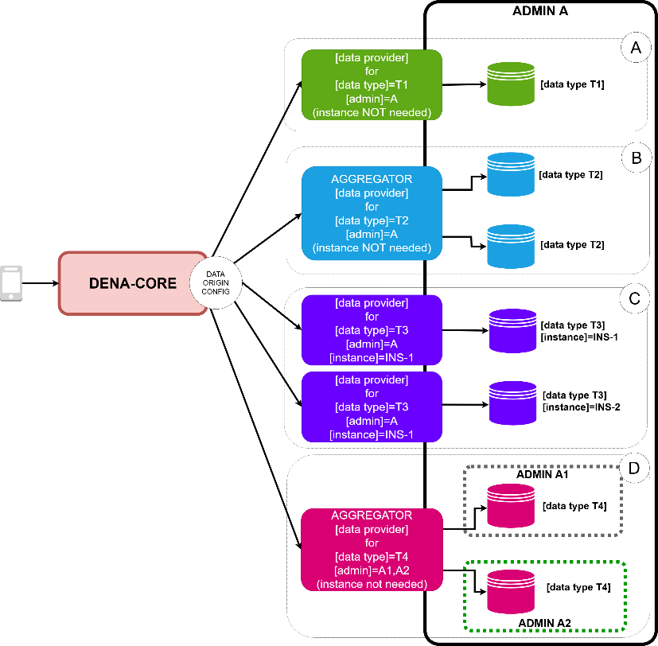

# :material-bell-ring: Metadata-Sync (Notificar Cambios)

## Concepto

Metadata-Sync es la operativa por la cual **tu administración notifica a DENA que hay datos nuevos o actualizados** para ciertas personas. Sin esto, DENA no sabe cuándo hay novedades y la app no puede avisar a la persona de que hay datos frescos.


### ¿Cómo funciona?

Tu admin **periódicamente** (tan frecuentemente como sea posible):

1. Consulta su BD buscando datos que han cambiado desde el último ciclo
2. Para cada cambio, crea un registro SRMD:
    ```
    {persona} | {tipo de dato} | {admin} | {instante última actualización}
    ```
3. Envía todos los SRMD a DENA-CORE vía REST



### Puntos clave

- Solo envías **meta-datos** (qué cambió y cuándo), NO los datos en sí ni quién es la persona concretamente
- Puedes enviar SRMD de **múltiples tipos de dato** y **múltiples personas** en una sola llamada
- Si un dato es nuevo O se ha modificado, cuenta como cambio
- Los registros eliminados también cuentan como cambio
- La frecuencia ideal es: tan a menudo como puedas (cada minuto, cada 5 minutos, cada hora...)

---

## Implementación

### Paso 1: Consultar cambios en tu BD

La única información que DENA necesita es: **¿qué tipo de dato se ha modificado?** y **¿cuándo fue el último cambio?**

```sql
SELECT PERSON_ID,
       MAX(COALESCE(LAST_UPDATED_AT, CREATED_AT)) AS LAST_CHANGE_AT
  FROM MY_TABLE
 WHERE COALESCE(LAST_UPDATED_AT, CREATED_AT) >= ?
 GROUP BY PERSON_ID;
```

!!! note ""
    `COALESCE(LAST_UPDATED_AT, CREATED_AT)` usa la fecha de actualización si existe, o la de creación si no ha sido actualizado nunca.

### Paso 2: Convertir a modelo DENA

```java
private List<DN00SyncMetaDataFromAdminToCOREItem> _toSRMD(
        final Collection<DBPersonLastChange> dbChanges) {
    return dbChanges.stream()
        .map(dbChange -> DN00SyncMetaDataBuilder
            .syncMetaDataFromAdminToCOREBuilder()
            .atAdmin(DN00OrgAdminID.forId("MY_ADMIN"))
            .fromSingleDataOrigin()
            .aboutPerson(DN00PersonID.forId(dbChange.personId()))
            .someDataWasUpdatedAt(dbChange.lastChangedAt())
            .ofType(DN00DataTypeID.forId("citizen_service_appointment"))
            .build())
        .toList();
}
```

### Paso 3: Envolver en un interop message y enviar

```java
// Crear el interop message
DN00InteropContext ctx = DN00InteropContextBuilder
    .createMessageOfType(DN00InteropMessageType.ADMIN_SYNC_METADATA_REQ)
    .withCorrelationOID(DN00MessageCorrelationOID.supply())
    .fromAdministration(DN00OrgAdminID.forId("MY_ADMIN"))
    .build();

DN00SyncMetaDataFromAdminRequestPayload payload =
    DN00SyncMetaDataFromAdminRequestPayload.from(srmdItems);

DN00SyncMetaDataFromAdminRequestMessage reqMsg =
    new DN00SyncMetaDataFromAdminRequestMessage(ctx, payload);

// Serializar a JSON
String json = marshaller.forWriting().toJSON(reqMsg);

// Enviar por HTTP POST
HttpRequest request = HttpRequest.newBuilder()
    .uri(URI.create("https://api.dena.eus/srmd/"))
    .header("Content-Type", "application/json")
    .header("Accept", "application/json")
    .POST(HttpRequest.BodyPublishers.ofString(json))
    .build();
```

### Ejemplo: JSON enviado a DENA

```json
[
  {
    "admin": { "id": "EJGV" },
    "aboutPerson": { "id": "40404040H" },
    "someDataWasUpdatedAt": "2026-08-17T15:14:07.036Z",
    "ofType": { "id": "ADMIN_NOTICE" },
    "fromDataOrigin": "DEFAULT"
  },
  {
    "admin": { "id": "EJGV" },
    "aboutPerson": { "id": "12345678A" },
    "someDataWasUpdatedAt": "2026-08-17T15:14:07.032Z",
    "ofType": { "id": "PROCEDURE_RECORD" },
    "fromDataOrigin": "DEFAULT"
  }
]
```

!!! tip "IDs vs OIDs"
    - El **id de la persona** es su NIF (ej: `12345678A`)
    - El **id de la administracion** es siempre su NIF/CIF (ej: `S4833001C` para EJGV)
    - El **id del tipo de dato** es el identificador acordado con el equipo DENA (ej: `PROCEDURE_RECORD`)
    - El **fromDataOrigin** es `DEFAULT` si solo tienes un origen de datos. Si tienes multiples origenes, usa el identificador previamente comunicado al equipo DENA
    
    No necesitas usar los OIDs internos de DENA. Los IDs de negocio son suficientes.

!!! note "Sobre fromDataOrigin"
    Si tu administracion solo tiene un origen de datos por tipo de dato (lo mas habitual), envia `"fromDataOrigin": "DEFAULT"` y no necesitas preocuparte de nada mas.
    
    Si tienes **multiples origenes** para el mismo tipo de dato (ej: varios gestores de expedientes), el campo `fromDataOrigin` debe contener el identificador del origen concreto. Este identificador se acuerda previamente con el equipo DENA durante la configuracion del conector. Si no lo comunicas de antemano, los items fallaran en el procesamiento.

### Ejemplo: respuesta de DENA

```json
{
  "transactionOid": "20863FFE-0BEB-4079-BFA1-A1EAEEEB58FF",
  "receivedItemsCount": 2,
  "processedOK": [ ... ],
  "processedNOK": [
    {
      "item": { ... },
      "error": "The [data type] with ref=unknown could NOT be validated"
    }
  ]
}
```

DENA devuelve que items se procesaron correctamente (`processedOK`) y cuales fallaron (`processedNOK`) con el motivo del error. Un envio puede tener items validos e invalidos simultaneamente: los validos se procesan con normalidad y los invalidos se rechazan individualmente sin afectar al resto.

!!! warning "Error clasico: data origin no configurado"
    El fallo mas habitual en `processedNOK` es un `fromDataOrigin` que no esta dado de alta en la configuracion de DENA. Si recibes errores de validacion en el data origin, verifica con el equipo DENA que el identificador que usas coincide con el configurado en el conector.

---

## Especificación completa

Para la especificación detallada del endpoint, modelo y errores:

[:octicons-arrow-right-24: Semántica Metadata-Sync](../semantica/metadata-sync/index.md)

---

**Siguiente:** [:octicons-arrow-right-24: Person-Sync](./person-sync.md)

<!-- DENA-DOC-FOOTER -->
---
<sub>DENA Docs v{{ dena.version }} · {{ dena.date }}</sub>
