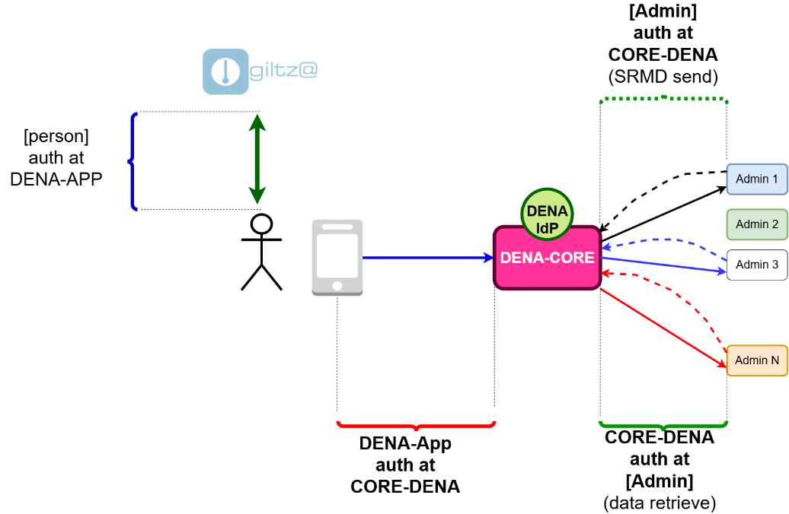
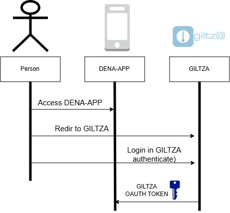
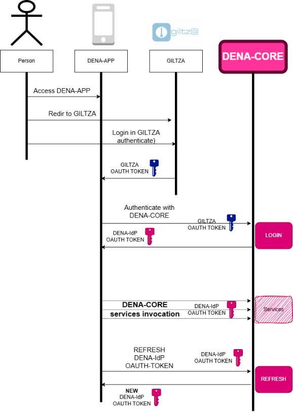
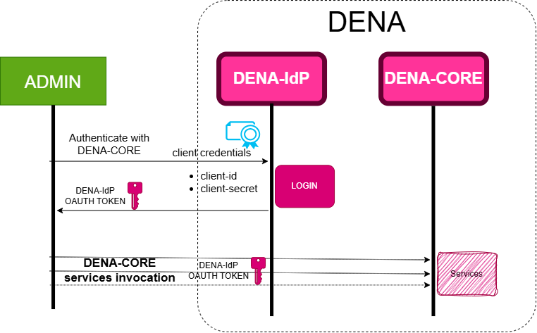
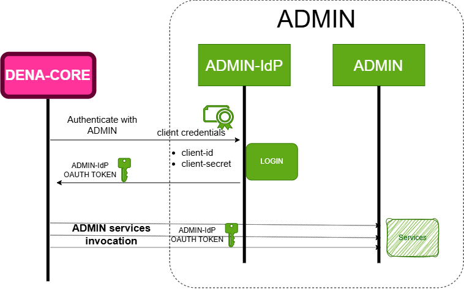

# :material-shield-lock: Security and Authentication

This section explains how communications are secured in DENA and how each part of the system authenticates. First the concepts, then the practical guide.

---

## Security objectives

Security in DENA has four objectives:

1. **Legitimate request origin:** Ensure that the service is only accessed by authorized and verified parties.
2. **Request integrity:** Ensure that exchanged data is not altered during transit.
3. **Data confidentiality:** Ensure that data remains encrypted and invisible to unauthorized third parties.
4. **Prevent replay attacks:** Prevent third parties from capturing and replaying requests.

| Objective | HTTPS | JWT | Security Header |
|----------|:-----:|:---:|:---------------:|
| Legitimate origin | | :material-check: | :material-check: |
| Integrity | | :material-check: | :material-check: |
| Confidentiality | :material-check: | :material-check: | |
| Anti-replay | | :material-check: | :material-check: |

---

## Authentication areas

There are four areas where different parties authenticate:

| Area | Who authenticates | With whom | Mechanism |
|------|-------------------|-----------|-----------|
| **1** | Person | DENA-APP | GILTZA OAuth token |
| **2** | DENA-APP | DENA-CORE | DENA-IdP OAuth token |
| **3** | Administration | DENA-CORE | DENA-IdP OAuth token (client_credentials) |
| **4** | DENA-CORE | Administration | Whatever the admin prefers (OAuth, X.509, usr/pwd...) |

!!! info "For administrations"
    The areas that affect you as an administration are **3** (your admin authenticates with DENA) and **4** (DENA authenticates with your admin). Areas 1 and 2 are internal to the person's app.

---

## Flow 1: Person → DENA-APP (GILTZA)

1. The person opens DENA-APP and is redirected to the **GILTZA** login page (web-view)
2. The person logs in
3. GILTZA returns an OAuth token

---

## Flow 2: DENA-APP → DENA-CORE (DENA-IdP)

DENA-APP identifies itself with DENA-CORE using the GILTZA token. In return it receives a **DENA-IdP OAuth token** that it will use in all subsequent calls (init, sync SRMD, retrieve data...).

!!! warning "Expiration"
    The DENA-IdP token **expires**. DENA-APP must refresh it periodically.

---

## Flow 3: Your Administration → DENA-CORE (client_credentials)

Your administration authenticates with DENA using **client_credentials** OAuth2:

1. You request `client_id` + `client_secret` from the DENA team
2. You send the credentials to the DENA-IdP token endpoint
3. You receive an OAuth token
4. You use that token in every call to DENA-CORE (send SRMD, query persons, etc.)

**This is the flow you need to implement for:**

- Sending Metadata-Sync
- Querying person data (Person-Sync Pull)
- Any call from your admin to DENA

[:octicons-arrow-right-24: Practical implementation guide](../autenticacion/administracion-core-dena/index.md)

---

## Flow 4: DENA-CORE → Your Administration

When DENA-CORE calls your admin (for Data-Retrieve), it must authenticate. DENA **does NOT impose** a mechanism; each admin chooses its own:

- **OAuth**: your admin provides client credentials to DENA
- **X.509 Certificates**: mutual TLS authentication
- **User/password**: basic credentials
- Others

Your admin provides the DENA team with the necessary credentials for the chosen mechanism.

[:octicons-arrow-right-24: Practical implementation guide](../autenticacion/core-dena-administracion/index.md)

---

## Practical implementation guides

The following pages contain the technical implementation details:

| Flow | Page |
|-------|--------|
| Your admin calls DENA | [:octicons-arrow-right-24: get-token endpoint + examples](../autenticacion/administracion-core-dena/index.md) |
| DENA calls your admin | [:octicons-arrow-right-24: Configuration + model](../autenticacion/core-dena-administracion/index.md) |

---

**Next:** [:octicons-arrow-right-24: Operations](../operativas/index.md)

<!-- DENA-DOC-FOOTER -->
---
DENA Docs v{{ dena.version }} · {{ dena.date }}
