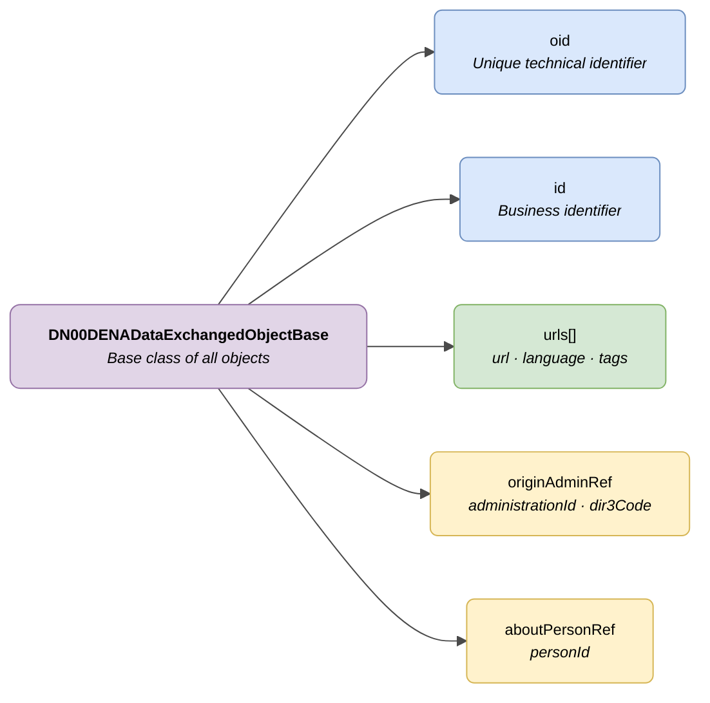

# :material-database-outline: Common Fields (Base Fields)

> - **Version:** `v{{ dena.version }}`
> - **Date:** {{ dena.date }}
> - **Test:** [DN99DENATestMockObjFactoryForDENADataExchangedObjectBase.java]({{ repos.interop_test_blob }}/denaTestCommonDataClasses/src/main/java/dena/test/common/data/DN99DENATestMockObjFactoryForDENADataExchangedObjectBase.java)
> - **Code:** [DN00DENADataExchangedObjectBase.java]({{ repos.common_data_api_blob }}/denaCommonDataAPIModelClasses/src/main/java/dena/api/data/model/DN00DENADataExchangedObjectBase.java)

## Description

All data objects exchanged in DATA-RETRIEVE inherit a set of common fields from the base class `DN00DENADataExchangedObjectBase`. This document describes those fields.



| Colour | Meaning |
|--------|---------|
| 🟣 Violet | Abstract base class |
| 🔵 Light blue | Mandatory fields (oid, id) |
| 🟢 Green | Access URLs |
| 🟡 Yellow | Optional fields (refs auto-completed by DENA) |

---

## Fields inherited by all objects

| Field | Type | Mandatory | Description |
|-------|------|:---------:|-------------|
| `oid` | `String` | ✅ | Unique technical identifier assigned by the administration's system |
| `id` | `String` | ✅ | Human-readable business identifier (assigned by the administration) |
| `urls` | `Array` | ❌ | Access URLs to the object in the e-government portal |
| `originAdminRef` | `Object` | ❌ | Reference to the originating administration. If not provided, DENA completes it automatically |
| `aboutPersonRef` | `Object` | ❌ | Reference to the person the object is about. If not provided, DENA completes it automatically |

---

## Detail of `originAdminRef`

Identifies the administration that generates the data. It is optional because DENA can infer it from the request context.

```json
{
  "originAdminRef": {
    "administrationId": "ADMIN-001",
    "dir3Code": "EA0000001"
  }
}
```

| Field | Type | Description |
|-------|------|-------------|
| `administrationId` | `String` | Administration identifier in DENA |
| `dir3Code` | `String` | DIR3 code of the administration |

---

## Detail of `aboutPersonRef`

Identifies the citizen person the data refers to. It is optional because DENA fills it in with the `personId` from the request context.

```json
{
  "aboutPersonRef": {
    "personId": "12345678A"
  }
}
```

| Field | Type | Description |
|-------|------|-------------|
| `personId` | `String` | DNI/NIE/NIF of the person |

---

## Detail of `urls`

Array of URLs that provide access to the object in the e-government portal. Each element has the following structure:

```json
{
  "urls": [
    {
      "url": "https://sede.miadmin.eus/expediente/EXP-2024-00123",
      "language": "SPANISH",
      "tags": ["default"]
    },
    {
      "url": "https://egoitza.miadmin.eus/espedientea/EXP-2024-00123",
      "language": "BASQUE",
      "tags": ["default"]
    }
  ]
}
```

| Field | Type | Mandatory | Description |
|-------|------|:---------:|-------------|
| `url` | `String` | ✅ | Full URL (HTTPS) |
| `language` | `String` | ❌ | Language of the URL: `SPANISH`, `BASQUE`, `ENGLISH` |
| `tags` | `Array<String>` | ❌ | Tags to classify the URL |

### Common tags

| Tag | Use |
|-----|-----|
| `default` | Main access URL to the object |
| `payment` | Payment URL (in payment-type objects) |
| `payment-receipt` | Payment receipt URL |

---

## Full example with common fields

```json
{
  "type": "administrativeServiceProcedureRecord",
  "oid": "EXP-OID-001",
  "id": "EXP-2024-00123",
  "originAdminRef": {
    "administrationId": "ADMIN-001",
    "dir3Code": "EA0000001"
  },
  "aboutPersonRef": {
    "personId": "12345678A"
  },
  "urls": [
    { "url": "https://sede.miadmin.eus/expediente/EXP-2024-00123", "language": "SPANISH", "tags": ["default"] }
  ],
  "...": "object-specific fields"
}
```

---

## Notes for the administration

- The `originAdminRef` and `aboutPersonRef` fields are **optional**. If the administration does not include them, DENA will complete them automatically from the request context.
- It is recommended to include at least one URL with the `default` tag for each supported language (Spanish and Basque as a minimum).
- The `oid` field must be unique within the administration's system for that object type.
- The `id` field must be the business identifier that the citizen recognises (e.g. the record number visible in the portal).

---

## Objects that inherit these fields

| Type (`type`) | Object | Document |
|---------------|--------|----------|
| `administrativeServiceProcedureRecord` | Record | [expediente.md](./expediente.md) |
| `administrativeNotice` | Notification | [notificacion.md](./notificacion.md) |
| `administrativeOfficialRegisterRecord` | Official Registration | [registro-oficial.md](./registro-oficial.md) |
| `oneOffPayment` | One-off payment | [pago.md](./pago.md) |
| `directDebitPayment` | Direct debit | [pago.md](./pago.md) |
| `scheduleItem` | Appointment | [cita.md](./cita.md) |
| `personData` | Person data | [persona.md](./persona.md) |

See also: [`DN00DataTypeEnum.java`]({{ repos.common_data_api_blob }}/denaCommonDataAPIModelClasses/src/main/java/dena/api/data/model/DN00DataTypeEnum.java) — enumeration with all available data types.


---

## 🔗 Source code

| Class | Repository |
|-------|------------|
| DN00DENADataExchangedObjectBase | [View code]({{ repos.common_data_api_blob }}/denaCommonDataAPIModelClasses/src/main/java/dena/api/data/model/DN00DENADataExchangedObjectBase.java) |
| DN00OrgUnitReference | [View code]({{ repos.common_data_api_blob }}/denaCommonDataAPIModelClasses/src/main/java/dena/api/data/model/org/DN00OrgUnitReference.java) |
| DN00OrgUnitReferenceWithRole | [View code]({{ repos.common_data_api_blob }}/denaCommonDataAPIModelClasses/src/main/java/dena/api/data/model/org/DN00OrgUnitReferenceWithRole.java) |
| DN00OrgUnitRole | [View code]({{ repos.common_data_api_blob }}/denaCommonDataAPIModelClasses/src/main/java/dena/api/data/model/org/DN00OrgUnitRole.java) |


---

## 🧪 Tests and examples

> Repository: [DENA-Euskadi/dena-interop-common-data-test]({{ repos.interop_test_tree }})

| Mock Factory | Repository |
|--------------|------------|
| DN99DENATestMockObjFactoryForDENADataExchangedObjectBase | [View code]({{ repos.interop_test_blob }}/denaTestCommonDataClasses/src/main/java/dena/test/common/data/DN99DENATestMockObjFactoryForDENADataExchangedObjectBase.java) |
| DN99DENATestMockObjFactoryForStateWithDescriptionBase | [View code]({{ repos.interop_test_blob }}/denaTestCommonDataClasses/src/main/java/dena/test/common/data/DN99DENATestMockObjFactoryForStateWithDescriptionBase.java) |

<!-- DENA-DOC-FOOTER -->
---
<sub>DENA Docs v{{ dena.version }} · {{ dena.date }}</sub>
