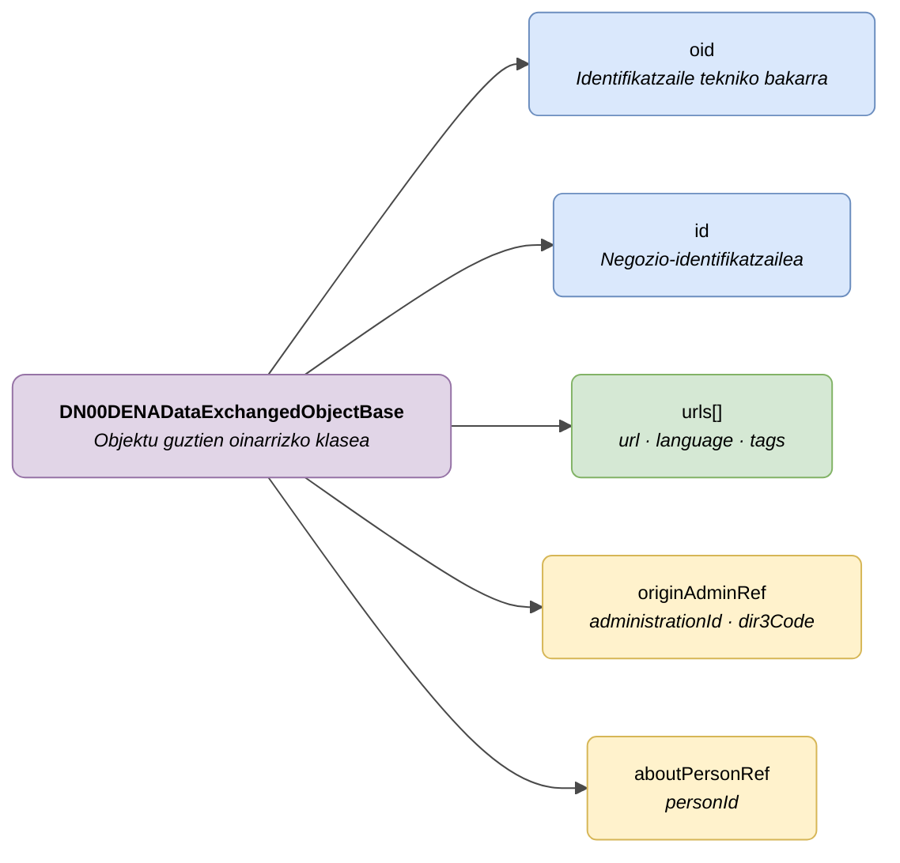

# :material-database-outline: Eremu Komunak (Base Fields)

> - **Bertsioa:** `v{{ dena.version }}`
> - **Data:** {{ dena.date }}
> - **Testa:** [DN99DENATestMockObjFactoryForDENADataExchangedObjectBase.java]({{ repos.interop_test_blob }}/denaTestCommonDataClasses/src/main/java/dena/test/common/data/DN99DENATestMockObjFactoryForDENADataExchangedObjectBase.java)
> - **Kodea:** [DN00DENADataExchangedObjectBase.java]({{ repos.common_data_api_blob }}/denaCommonDataAPIModelClasses/src/main/java/dena/api/data/model/DN00DENADataExchangedObjectBase.java)

## Deskribapena

DATA-RETRIEVE-n trukatutako datu-objektu guztiek eremu komunen multzo bat heredatzen dute `DN00DENADataExchangedObjectBase` oinarrizko klasetik. Dokumentu honek eremu horiek deskribatzen ditu.



| Kolorea | Esanahia |
|---------|----------|
| 🟣 More | Oinarrizko klase abstraktua |
| 🔵 Urdin argia | Derrigorrezko eremuak (oid, id) |
| 🟢 Berde | Sarbide-URLak |
| 🟡 Hori | Aukerako eremuak (DENA-k automatikoki osatutako erreferentziak) |

---

## Objektu guztiek heredatzen dituzten eremuak

| Eremua | Mota | Derrigorrez | Deskribapena |
|--------|------|:-----------:|--------------|
| `oid` | `String` | ✅ | Administrazioaren sistemak esleitutako identifikatzaile tekniko bakarra |
| `id` | `String` | ✅ | Negozio-identifikatzaile irakurgarria (administrazioak esleitua) |
| `urls` | `Array` | ❌ | Egoitza elektronikoko objekturako sarbide-URLak |
| `originAdminRef` | `Object` | ❌ | Jatorrizko administrazioaren erreferentzia. Ez bada ematen, DENA-k automatikoki osatzen du |
| `aboutPersonRef` | `Object` | ❌ | Objektuak aipatzen duen pertsonaren erreferentzia. Ez bada ematen, DENA-k automatikoki osatzen du |

---

## `originAdminRef`-en xehetasuna

Datua sortzen duen administrazioa identifikatzen du. Aukerakoa da DENA-k eskaeraren testuingurutik ondorioztatu dezakeelako.

```json
{
  "originAdminRef": {
    "administrationId": "ADMIN-001",
    "dir3Code": "EA0000001"
  }
}
```

| Eremua | Mota | Deskribapena |
|--------|------|--------------|
| `administrationId` | `String` | DENA-ko administrazioaren identifikatzailea |
| `dir3Code` | `String` | Administrazioaren DIR3 kodea |

---

## `aboutPersonRef`-en xehetasuna

Datuak aipatzen duen herritarra identifikatzen du. Aukerakoa da DENA-k eskaeraren testuinguruko `personId`-rekin osatzen duelako.

```json
{
  "aboutPersonRef": {
    "personId": "12345678A"
  }
}
```

| Eremua | Mota | Deskribapena |
|--------|------|--------------|
| `personId` | `String` | Pertsonaren NAN/AIZ/IFZ |

---

## `urls`-en xehetasuna

Egoitza elektronikoko objekturako sarbidea ematen duten URLen array-a. Elementu bakoitzak egitura hau du:

```json
{
  "urls": [
    {
      "url": "https://sede.miadmin.eus/expediente/EXP-2024-00123",
      "language": "SPANISH",
      "tags": ["default"]
    },
    {
      "url": "https://egoitza.miadmin.eus/espedientea/EXP-2024-00123",
      "language": "BASQUE",
      "tags": ["default"]
    }
  ]
}
```

| Eremua | Mota | Derrigorrez | Deskribapena |
|--------|------|:-----------:|--------------|
| `url` | `String` | ✅ | URL osoa (HTTPS) |
| `language` | `String` | ❌ | URLaren hizkuntza: `SPANISH`, `BASQUE`, `ENGLISH` |
| `tags` | `Array<String>` | ❌ | URLa sailkatzeko etiketak |

### Tag komunak

| Tag | Erabilera |
|-----|-----------|
| `default` | Objekturako sarbide-URL nagusia |
| `payment` | Ordainketa-URLa (ordainketa motako objektuetan) |
| `payment-receipt` | Ordainagiriaren URLa |

---

## Eremu komunekin adibide osoa

```json
{
  "type": "administrativeServiceProcedureRecord",
  "oid": "EXP-OID-001",
  "id": "EXP-2024-00123",
  "originAdminRef": {
    "administrationId": "ADMIN-001",
    "dir3Code": "EA0000001"
  },
  "aboutPersonRef": {
    "personId": "12345678A"
  },
  "urls": [
    { "url": "https://sede.miadmin.eus/expediente/EXP-2024-00123", "language": "SPANISH", "tags": ["default"] }
  ],
  "...": "objektuaren eremu espezifikoak"
}
```

---

## Administrazioarentzako oharrak

- `originAdminRef` eta `aboutPersonRef` eremuak **aukerakoak** dira. Administrazioak ez baditu sartzen, DENA-k automatikoki osatuko ditu eskaeraren testuingurutik.
- Gomendatzen da gutxienez `default` tag-arekin URL bat sartzea onartutako hizkuntza bakoitzeko (gaztelania eta euskera gutxienez).
- `oid` eremua bakarra izan behar da administrazioaren sisteman objektu mota horretarako.
- `id` eremua herritarrak ezagutzen duen negozio-identifikatzailea izan behar da (adib.: egoitzan ikusgai dagoen espediente-zenbakia).

---

## Eremu hauek heredatzen dituzten objektuak

| Mota (`type`) | Objektua | Dokumentua |
|---------------|----------|------------|
| `administrativeServiceProcedureRecord` | Espedientea | [expediente.md](./expediente.md) |
| `administrativeNotice` | Jakinarazpena | [notificacion.md](./notificacion.md) |
| `administrativeOfficialRegisterRecord` | Erregistro Ofiziala | [registro-oficial.md](./registro-oficial.md) |
| `oneOffPayment` | Ordainketa bakarra | [pago.md](./pago.md) |
| `directDebitPayment` | Domiziliazioa | [pago.md](./pago.md) |
| `scheduleItem` | Hitzordua | [cita.md](./cita.md) |
| `personData` | Pertsona-datuak | [persona.md](./persona.md) |

Ikusi baita ere: [`DN00DataTypeEnum.java`]({{ repos.common_data_api_blob }}/denaCommonDataAPIModelClasses/src/main/java/dena/api/data/model/DN00DataTypeEnum.java) — eskuragarri dauden datu-mota guztiekin enumeratua.


---

## 🔗 Iturburu-kodea

| Klasea | Biltegia |
|--------|----------|
| DN00DENADataExchangedObjectBase | [Ikusi kodea]({{ repos.common_data_api_blob }}/denaCommonDataAPIModelClasses/src/main/java/dena/api/data/model/DN00DENADataExchangedObjectBase.java) |
| DN00OrgUnitReference | [Ikusi kodea]({{ repos.common_data_api_blob }}/denaCommonDataAPIModelClasses/src/main/java/dena/api/data/model/org/DN00OrgUnitReference.java) |
| DN00OrgUnitReferenceWithRole | [Ikusi kodea]({{ repos.common_data_api_blob }}/denaCommonDataAPIModelClasses/src/main/java/dena/api/data/model/org/DN00OrgUnitReferenceWithRole.java) |
| DN00OrgUnitRole | [Ikusi kodea]({{ repos.common_data_api_blob }}/denaCommonDataAPIModelClasses/src/main/java/dena/api/data/model/org/DN00OrgUnitRole.java) |


---

## 🧪 Testak eta adibideak

> Biltegia: [DENA-Euskadi/dena-interop-common-data-test]({{ repos.interop_test_tree }})

| Mock Factory | Biltegia |
|--------------|----------|
| DN99DENATestMockObjFactoryForDENADataExchangedObjectBase | [Ikusi kodea]({{ repos.interop_test_blob }}/denaTestCommonDataClasses/src/main/java/dena/test/common/data/DN99DENATestMockObjFactoryForDENADataExchangedObjectBase.java) |
| DN99DENATestMockObjFactoryForStateWithDescriptionBase | [Ikusi kodea]({{ repos.interop_test_blob }}/denaTestCommonDataClasses/src/main/java/dena/test/common/data/DN99DENATestMockObjFactoryForStateWithDescriptionBase.java) |

<!-- DENA-DOC-FOOTER -->
---
<sub>DENA Docs v{{ dena.version }} · {{ dena.date }}</sub>
