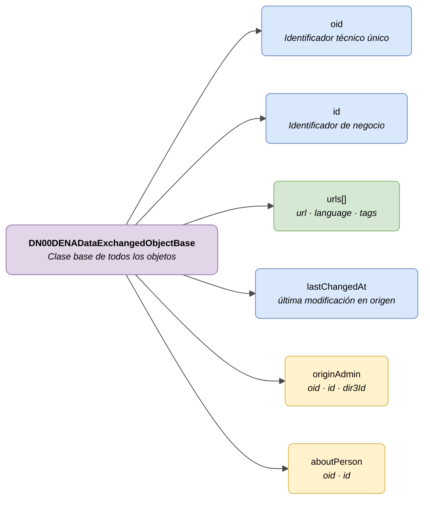

# :material-database-outline: Campos Comunes (Base Fields)

> - **Versión:** `v{{ dena.version }}`
> - **Fecha:** {{ dena.date }}
> - **Test:** [DN99DENATestMockObjFactoryForDENADataExchangedObjectBase.java]({{ repos.interop_test_blob }}/denaTestCommonDataClasses/src/main/java/dena/test/common/data/DN99DENATestMockObjFactoryForDENADataExchangedObjectBase.java)
> - **Código:** [DN00DENADataExchangedObjectBase.java]({{ repos.common_data_api_blob }}/denaCommonDataAPIModelClasses/src/main/java/dena/api/data/model/DN00DENADataExchangedObjectBase.java)

## Descripción

Todos los objetos de datos intercambiados en DATA-RETRIEVE heredan un conjunto de campos comunes de la clase base `DN00DENADataExchangedObjectBase`. Este documento describe esos campos.



| Color | Significado |
|-------|-------------|
| 🟣 Violeta | Clase base abstracta |
| 🔵 Azul claro | Campos obligatorios (oid, id) |
| 🟢 Verde | URLs de acceso |
| 🟡 Amarillo | Campos opcionales (refs autocompletados por DENA) |

---

## Campos heredados por todos los objetos

| Campo | Tipo | Obligatorio | Descripción |
|-------|------|:-----------:|-------------|
| `oid` | `OID` | ✅ | Identificador técnico único asignado por el sistema de la administración |
| `id` | `ID` | ✅ | Identificador de negocio legible (asignado por la administración) |
| `urls` | `Array` | ❌ | URLs de acceso al objeto en la sede electrónica |
| `lastChangedAt` | `Instant` | ✅ | Última modificación del dato en el origen. **Muy importante**: DENA-CORE lo usa para calcular el estado NEW/UPDATED/UNCHANGED en la UI |
| `originAdmin` | `OrgAdminRef` | ❌ | Referencia a la administración de origen. Si no se proporciona, DENA la completa automáticamente |
| `aboutPerson` | `PersonRef` | ❌ | Referencia a la persona sobre la que trata el objeto. Si no se proporciona, DENA la completa automáticamente |

---

## Detalle de `lastChangedAt`

Instante (formato ISO 8601) de la última modificación del dato **en el sistema de origen de la administración**. Es un campo clave: DENA-CORE lo compara con la última vez que ese tipo de dato fue recuperado de la administración para decidir el estado NEW/UPDATED/UNCHANGED que muestra la UI. Si `lastChangedAt` es más reciente que la última recuperación, el dato se marca como NEW/UPDATED.

```json
{
  "lastChangedAt": "2026-08-19T08:07:56.742Z"
}
```

---

## Detalle de `originAdmin`

Identifica la administración que genera el dato. Es una [OrgAdminRef](../../semantica-base/modelo/org-admin-ref.md). Es opcional porque DENA puede inferirla del contexto de la petición.

```json
{
  "originAdmin": {
    "oid": "6AE83A0C-2202-4666-9857-3334C14663A2",
    "id": "S4833001C",
    "dir3Id": "EA0000001"
  }
}
```

---

## Detalle de `aboutPerson`

Identifica a la persona a la que se refiere el dato. Es una [PersonRef](../../semantica-base/modelo/person-ref.md). Es opcional porque DENA la completa con la persona del contexto de la petición.

```json
{
  "aboutPerson": {
    "oid": "DAA35E71-5B28-44BF-9DAE-A412E1CEC538",
    "id": "12345678A"
  }
}
```

---

## Detalle de `urls`

Array de URLs que permiten acceder al objeto en la sede electrónica. Cada elemento tiene la siguiente estructura:

```json
{
  "urls": [
    {
      "url": "https://sede.miadmin.eus/expediente/EXP-2024-00123",
      "language": "SPANISH",
      "tags": ["default"]
    },
    {
      "url": "https://egoitza.miadmin.eus/espedientea/EXP-2024-00123",
      "language": "BASQUE",
      "tags": ["default"]
    }
  ]
}
```

| Campo | Tipo | Obligatorio | Descripción |
|-------|------|:-----------:|-------------|
| `url` | `String` | ✅ | URL completa (HTTPS) |
| `language` | `String` | ❌ | Idioma de la URL: `SPANISH`, `BASQUE`, `ENGLISH` |
| `tags` | `Array<String>` | ❌ | Etiquetas para clasificar la URL |

### Tags comunes

| Tag | Uso |
|-----|-----|
| `default` | URL principal de acceso al objeto |
| `payment` | URL de pago (en objetos de tipo pago) |
| `payment-receipt` | URL del justificante de pago |

---

## Ejemplo completo con campos comunes

```json
{
  "type": "administrativeServiceProcedureRecord",
  "oid": "EXP-OID-001",
  "id": "EXP-2024-00123",
  "lastChangedAt": "2026-08-19T08:07:56.742Z",
  "originAdmin": {
    "oid": "6AE83A0C-2202-4666-9857-3334C14663A2",
    "id": "S4833001C",
    "dir3Id": "EA0000001"
  },
  "aboutPerson": {
    "oid": "DAA35E71-5B28-44BF-9DAE-A412E1CEC538",
    "id": "12345678A"
  },
  "urls": [
    { "url": "https://sede.miadmin.eus/expediente/EXP-2024-00123", "language": "SPANISH", "tags": ["default"] }
  ],
  "...": "campos específicos del objeto"
}
```

---

## Notas para la administración

- Los campos `originAdmin` y `aboutPerson` son **opcionales**. Si la administración no los incluye, DENA los completará automáticamente a partir del contexto de la petición.
- Se recomienda incluir al menos una URL con tag `default` por cada idioma soportado (castellano y euskera como mínimo).
- El campo `oid` debe ser único dentro del sistema de la administración para ese tipo de objeto.
- El campo `id` debe ser el identificador de negocio que la persona ciudadana reconoce (ej: número de expediente visible en la sede).

---

## Objetos que heredan estos campos

| Tipo (`type`) | Objeto | Documento |
|---------------|--------|-----------|
| `administrativeServiceProcedureRecord` | Expediente | [expediente.md](./expediente.md) |
| `administrativeNotice` | Notificación | [notificacion.md](./notificacion.md) |
| `administrativeOfficialRegisterRecord` | Registro Oficial | [registro-oficial.md](./registro-oficial.md) |
| `oneOffPayment` | Pago único | [pago.md](./pago.md) |
| `directDebitPayment` | Domiciliación | [pago.md](./pago.md) |
| `scheduleItem` | Cita | [cita.md](./cita.md) |
| `personData` | Datos de persona | [persona.md](./persona.md) |

Ver también: [`DN00DataTypeEnum.java`]({{ repos.common_data_api_blob }}/denaCommonDataAPIModelClasses/src/main/java/dena/api/data/model/DN00DataTypeEnum.java) — enumerado con todos los tipos de datos disponibles.


---

## 🔗 Código fuente

| Clase | Repositorio |
|-------|-------------|
| DN00DENADataExchangedObjectBase | [Ver código]({{ repos.common_data_api_blob }}/denaCommonDataAPIModelClasses/src/main/java/dena/api/data/model/DN00DENADataExchangedObjectBase.java) |
| DN00OrgUnitReference | [Ver código]({{ repos.common_data_api_blob }}/denaCommonDataAPIModelClasses/src/main/java/dena/api/data/model/org/DN00OrgUnitReference.java) |
| DN00OrgUnitReferenceWithRole | [Ver código]({{ repos.common_data_api_blob }}/denaCommonDataAPIModelClasses/src/main/java/dena/api/data/model/org/DN00OrgUnitReferenceWithRole.java) |
| DN00OrgUnitRole | [Ver código]({{ repos.common_data_api_blob }}/denaCommonDataAPIModelClasses/src/main/java/dena/api/data/model/org/DN00OrgUnitRole.java) |


---

## 🧪 Tests y ejemplos

> Repositorio: [DENA-Euskadi/dena-interop-common-data-test]({{ repos.interop_test_tree }})

| Mock Factory | Repositorio |
|--------------|-------------|
| DN99DENATestMockObjFactoryForDENADataExchangedObjectBase | [Ver código]({{ repos.interop_test_blob }}/denaTestCommonDataClasses/src/main/java/dena/test/common/data/DN99DENATestMockObjFactoryForDENADataExchangedObjectBase.java) |
| DN99DENATestMockObjFactoryForStateWithDescriptionBase | [Ver código]({{ repos.interop_test_blob }}/denaTestCommonDataClasses/src/main/java/dena/test/common/data/DN99DENATestMockObjFactoryForStateWithDescriptionBase.java) |


<!-- DENA-DOC-FOOTER -->
---
<sub>DENA Docs v{{ dena.version }} · {{ dena.date }}</sub>
