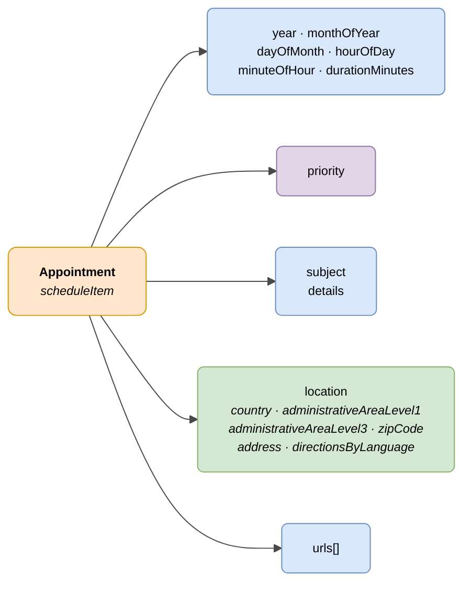

# :material-calendar-clock: Appointment (Schedule Item)

> - **Version:** `v{{ dena.version }}`
> - **Date:** {{ dena.date }}
> - **Test:** [DN99DENATestMockObjFactoryForScheduleItem.java]({{ repos.interop_test_blob }}/denaTestCommonDataClasses/src/main/java/dena/test/common/data/schedule/DN99DENATestMockObjFactoryForScheduleItem.java)
> - **Code:** [DN00ScheduleItem.java]({{ repos.common_data_api_blob }}/denaCommonDataAPIScheduleModelClasses/src/main/java/dena/api/data/model/schedule/DN00ScheduleItem.java)

## Description

Represents a schedule item or appointment. It can be an appointment with a duration or a point-in-time milestone (duration = 0).

> **Note:** Unlike other objects (notification, registry, payment), appointments are **independent of records**. They do not have a `procedureRecord` field.

> See also: [campos-comunes.md](./campos-comunes.md) for inherited fields (`oid`, `id`, `urls`, `originAdminRef`, `aboutPersonRef`)



| Colour | Meaning |
|-------|-------------|
| 🟠 Orange | Main object (Appointment) |
| 🟣 Purple | Enums (priority) |
| 🔵 Light blue | Data fields |
| 🟢 Green | Physical location |

---

## 🔗 Source code

| Class | Repository |
|-------|-------------|
| DN00ScheduleItem | [View code]({{ repos.common_data_api_blob }}/denaCommonDataAPIScheduleModelClasses/src/main/java/dena/api/data/model/schedule/DN00ScheduleItem.java) |
| DN00ScheduleItemLocation | [View code]({{ repos.common_data_api_blob }}/denaCommonDataAPIScheduleModelClasses/src/main/java/dena/api/data/model/schedule/DN00ScheduleItemLocation.java) |
| DN00ScheduleItemLocationItem | [View code]({{ repos.common_data_api_blob }}/denaCommonDataAPIScheduleModelClasses/src/main/java/dena/api/data/model/schedule/DN00ScheduleItemLocationItem.java) |
| DN00ScheduleItemPriority | [View code]({{ repos.common_data_api_blob }}/denaCommonDataAPIScheduleModelClasses/src/main/java/dena/api/data/model/schedule/DN00ScheduleItemPriority.java) |

---

## 🧪 Tests and examples

> Repository: [DENA-Euskadi/dena-interop-common-data-test]({{ repos.interop_test_tree }})

| Mock Factory | Repository |
|--------------|-------------|
| DN99DENATestMockObjFactoryForScheduleItem | [View code]({{ repos.interop_test_blob }}/denaTestCommonDataClasses/src/main/java/dena/test/common/data/schedule/DN99DENATestMockObjFactoryForScheduleItem.java) |
| DN99DENATestMockObjFactoryForScheduleItemLocation | [View code]({{ repos.interop_test_blob }}/denaTestCommonDataClasses/src/main/java/dena/test/common/data/schedule/DN99DENATestMockObjFactoryForScheduleItemLocation.java) |
| DN99DENATestMockObjFactoryForScheduleItemLocationItem | [View code]({{ repos.interop_test_blob }}/denaTestCommonDataClasses/src/main/java/dena/test/common/data/schedule/DN99DENATestMockObjFactoryForScheduleItemLocationItem.java) |
| DN99DENATestMockObjFactoryForScheduleItemPriority | [View code]({{ repos.interop_test_blob }}/denaTestCommonDataClasses/src/main/java/dena/test/common/data/schedule/DN99DENATestMockObjFactoryForScheduleItemPriority.java) |

---

## JSON attributes


| Field | Type | Mandatory | Example | Description |
|-------|------|:-----------:|---------|-------------|
| `type` | `String` | ✅ | `"scheduleItem"` | Polymorphic discriminator |
| `oid` | `String` | ✅ | `"SCHED-OID-001"` | Unique technical identifier |
| `id` | `String` | ✅ | `"CITA-2024-00050"` | Business identifier |
| `year` | `Number` | ✅ | `2024` | Year |
| `monthOfYear` | `Number` | ✅ | `7` | Month (1-12) |
| `dayOfMonth` | `Number` | ✅ | `15` | Day of month (1-31) |
| `hourOfDay` | `Number` | ✅ | `10` | Hour (0-23) |
| `minuteOfHour` | `Number` | ✅ | `30` | Minute (0-59) |
| `durationMinutes` | `Number` | ✅ | `30` | Duration in minutes (0 = point-in-time milestone) |
| `priority` | `String` | ❌ | `"NORMAL"` | Priority |
| `subject` | `LanguageTexts` | ✅ | `{"SPANISH":"Cita renovación DNI"}` | Appointment subject |
| `details` | `LanguageTexts` | ❌ | `{"SPANISH":"Traer foto reciente"}` | Additional details |
| `location` | `Object` | ❌ | *(see [Location](#location-location) · [`DN00ScheduleItemLocation`]({{ repos.common_data_api_blob }}/denaCommonDataAPIScheduleModelClasses/src/main/java/dena/api/data/model/schedule/DN00ScheduleItemLocation.java))* | Location (recommended) |
| `urls` | `Array` | ❌ | *(see [campos-comunes.md](./campos-comunes.md) · [`DN00DENADataExchangedObjectBase`]({{ repos.common_data_api_blob }}/denaCommonDataAPIModelClasses/src/main/java/dena/api/data/model/DN00DENADataExchangedObjectBase.java))* | Access URLs |

---

## Priority (`priority`)

| Code | Description |
|--------|-------------|
| `HIGH` | High |
| `MEDIUM` | Medium |
| `NORMAL` | Normal |
| `LOW` | Low |

---

## Location (`location`)

| Field | Type | Mandatory | Description |
|-------|------|:-----------:|-------------|
| `country` | `Object` | ❌ | Country (`id`, `name`) |
| `administrativeAreaLevel1` | `Object` | ❌ | Territory / Region (`id`, `name`) |
| `administrativeAreaLevel3` | `Object` | ❌ | Municipality (`id`, `name`) |
| `zipCode` | `String` | ❌ | Postal code |
| `address` | `String` | ❌ | Address |
| `directionsByLanguage` | `LanguageTexts` | ❌ | Multilingual access directions (serialized as `"address"` in JSON — see note) |

> **Note:** In the current model, both `address` (String) and `directionsByLanguage` (LanguageTexts) are serialized with the JSON name `"address"` due to a known bug in the code. It is recommended to use only one of the two fields until this is fixed.

---

## JSON example

```json
{
  "type": "scheduleItem",
  "oid": "SCHED-OID-001",
  "id": "CITA-2024-00050",
  "year": 2024,
  "monthOfYear": 7,
  "dayOfMonth": 15,
  "hourOfDay": 10,
  "minuteOfHour": 30,
  "durationMinutes": 30,
  "priority": "NORMAL",
  "subject": {
    "SPANISH": "Cita previa para renovación de DNI",
    "BASQUE": "NAN berritzeko aurretiko hitzordua"
  },
  "details": {
    "SPANISH": "Traer fotografía reciente y DNI anterior",
    "BASQUE": "Ekarri argazki berria eta aurreko NANa"
  },
  "location": {
    "country": { "id": "ES", "name": "España" },
    "administrativeAreaLevel1": { "id": "PV", "name": "País Vasco" },
    "administrativeAreaLevel3": { "id": "48020", "name": "Bilbao" },
    "zipCode": "48001",
    "address": "Gran Vía 50, Bilbao",
    "directionsByLanguage": {
      "SPANISH": "Planta 2, oficina 201. Acceso por la entrada principal.",
      "BASQUE": "2. solairua, 201 bulegoa. Sarrera nagusitik sartu."
    }
  },
  "urls": [
    { "url": "https://sede.miadmin.eus/cita/CITA-2024-00050", "language": "SPANISH", "tags": ["default"] }
  ]
}
```

---

## Example — Milestone (duration = 0)

```json
{
  "type": "scheduleItem",
  "oid": "SCHED-OID-002",
  "id": "HITO-2024-00010",
  "year": 2024,
  "monthOfYear": 9,
  "dayOfMonth": 1,
  "hourOfDay": 0,
  "minuteOfHour": 0,
  "durationMinutes": 0,
  "subject": {
    "SPANISH": "Inicio del plazo de matriculación",
    "BASQUE": "Matrikulazio-epearen hasiera"
  }
}
```

---

## Differences with other objects

| Characteristic | Appointment | Record / Notification / Registry / Payment |
|----------------|------|----------------------------------------------|
| Depends on a record | ❌ No | ✅ Yes (`procedureRecord` field) |
| Has state | ❌ No | ✅ Yes |
| Has ISO 8601 date | ❌ (uses separate fields year/month/day/hour/minute) | ✅ Yes |
| Has physical location | ✅ Yes | ❌ No |


---

<!-- DENA-DOC-FOOTER -->
---
<sub>DENA Docs v{{ dena.version }} · {{ dena.date }}</sub>
