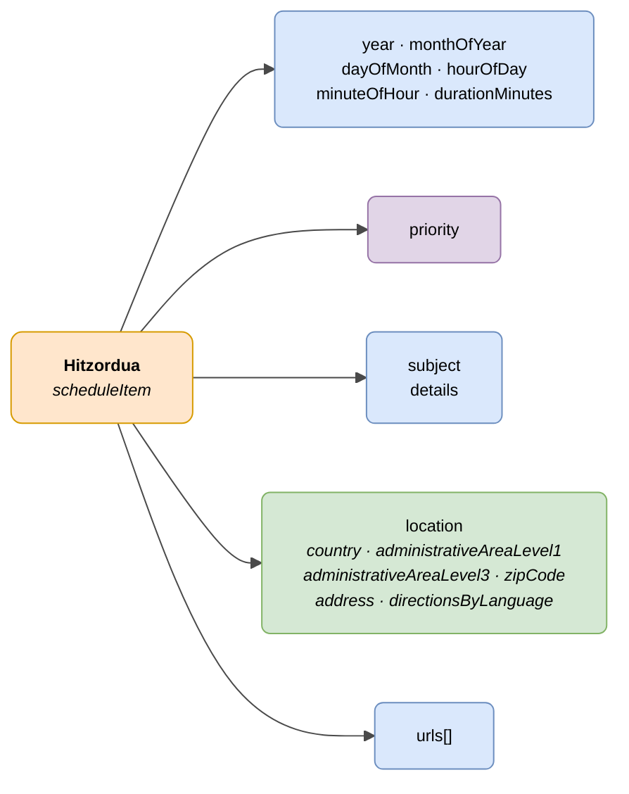

# :material-calendar-clock: Hitzordua (Schedule Item)

> - **Bertsioa:** `v{{ dena.version }}`
> - **Data:** {{ dena.date }}
> - **Testa:** [DN99DENATestMockObjFactoryForScheduleItem.java]({{ repos.interop_test_blob }}/denaTestCommonDataClasses/src/main/java/dena/test/common/data/schedule/DN99DENATestMockObjFactoryForScheduleItem.java)
> - **Kodea:** [DN00ScheduleItem.java]({{ repos.common_data_api_blob }}/denaCommonDataAPIScheduleModelClasses/src/main/java/dena/api/data/model/schedule/DN00ScheduleItem.java)

## Deskribapena

Agenda-elementu bat edo aurretiko hitzordu bat adierazten du. Iraupena duen hitzordu bat edo une puntualeko mugarri bat izan daiteke (iraupena = 0).

> **Oharra:** Beste objektuekin alderatuta (jakinarazpena, erregistroa, ordainketa), hitzorduak **espedienteetatik independenteak** dira. Ez dute `procedureRecord` eremurik.

> Ikusi ere: [campos-comunes.md](./campos-comunes.md) heredatutako eremuetarako (`oid`, `id`, `urls`, `originAdmin`, `aboutPerson`)



| Kolorea | Esanahia |
|-------|-------------|
| 🟠 Laranja | Objektu nagusia (Hitzordua) |
| 🟣 Morea | Enum-ak (lehentasuna) |
| 🔵 Urdin argia | Datu-eremuak |
| 🟢 Berdea | Kokapen fisikoa |

---

## 🔗 Iturburu-kodea

| Klasea | Biltegia |
|-------|-------------|
| DN00ScheduleItem | [Ikusi kodea]({{ repos.common_data_api_blob }}/denaCommonDataAPIScheduleModelClasses/src/main/java/dena/api/data/model/schedule/DN00ScheduleItem.java) |
| DN00ScheduleItemLocation | [Ikusi kodea]({{ repos.common_data_api_blob }}/denaCommonDataAPIScheduleModelClasses/src/main/java/dena/api/data/model/schedule/DN00ScheduleItemLocation.java) |
| DN00ScheduleItemLocationItem | [Ikusi kodea]({{ repos.common_data_api_blob }}/denaCommonDataAPIScheduleModelClasses/src/main/java/dena/api/data/model/schedule/DN00ScheduleItemLocationItem.java) |
| DN00ScheduleItemPriority | [Ikusi kodea]({{ repos.common_data_api_blob }}/denaCommonDataAPIScheduleModelClasses/src/main/java/dena/api/data/model/schedule/DN00ScheduleItemPriority.java) |

---

## 🧪 Testak eta adibideak

> Biltegia: [DENA-Euskadi/dena-interop-common-data-test]({{ repos.interop_test_tree }})

| Mock Factory | Biltegia |
|--------------|-------------|
| DN99DENATestMockObjFactoryForScheduleItem | [Ikusi kodea]({{ repos.interop_test_blob }}/denaTestCommonDataClasses/src/main/java/dena/test/common/data/schedule/DN99DENATestMockObjFactoryForScheduleItem.java) |
| DN99DENATestMockObjFactoryForScheduleItemLocation | [Ikusi kodea]({{ repos.interop_test_blob }}/denaTestCommonDataClasses/src/main/java/dena/test/common/data/schedule/DN99DENATestMockObjFactoryForScheduleItemLocation.java) |
| DN99DENATestMockObjFactoryForScheduleItemLocationItem | [Ikusi kodea]({{ repos.interop_test_blob }}/denaTestCommonDataClasses/src/main/java/dena/test/common/data/schedule/DN99DENATestMockObjFactoryForScheduleItemLocationItem.java) |
| DN99DENATestMockObjFactoryForScheduleItemPriority | [Ikusi kodea]({{ repos.interop_test_blob }}/denaTestCommonDataClasses/src/main/java/dena/test/common/data/schedule/DN99DENATestMockObjFactoryForScheduleItemPriority.java) |

---

## JSON atributuak


| Eremua | Mota | Nahitaezkoa | Adibidea | Deskribapena |
|-------|------|:-----------:|---------|-------------|
| `type` | `String` | ✅ | `"scheduleItem"` | Diskriminatzaile polimorfokoa |
| `oid` | `String` | ✅ | `"SCHED-OID-001"` | Identifikatzaile tekniko bakarra |
| `id` | `String` | ✅ | `"CITA-2024-00050"` | Negozio-identifikatzailea |
| `year` | `Number` | ✅ | `2024` | Urtea |
| `monthOfYear` | `Number` | ✅ | `7` | Hilabetea (1-12) |
| `dayOfMonth` | `Number` | ✅ | `15` | Hilabeteko eguna (1-31) |
| `hourOfDay` | `Number` | ✅ | `10` | Ordua (0-23) |
| `minuteOfHour` | `Number` | ✅ | `30` | Minutua (0-59) |
| `durationMinutes` | `Number` | ✅ | `30` | Iraupena minututan (0 = une puntualeko mugarria) |
| `priority` | `String` | ❌ | `"NORMAL"` | Lehentasuna |
| `subject` | `LanguageTexts` | ✅ | `{"SPANISH":"Cita renovación DNI"}` | Hitzorduaren gaia |
| `details` | `LanguageTexts` | ❌ | `{"SPANISH":"Traer foto reciente"}` | Xehetasun gehigarriak |
| `location` | `Object` | ❌ | *(ikusi [Kokapena](#kokapena-location) · [`DN00ScheduleItemLocation`]({{ repos.common_data_api_blob }}/denaCommonDataAPIScheduleModelClasses/src/main/java/dena/api/data/model/schedule/DN00ScheduleItemLocation.java))* | Kokapena (gomendatua) |
| `urls` | `Array` | ❌ | *(ikusi [campos-comunes.md](./campos-comunes.md) · [`DN00DENADataExchangedObjectBase`]({{ repos.common_data_api_blob }}/denaCommonDataAPIModelClasses/src/main/java/dena/api/data/model/DN00DENADataExchangedObjectBase.java))* | Sarbide URLak |

---

## Lehentasuna (`priority`)

| Kodea | Deskribapena |
|--------|-------------|
| `HIGH` | Altua |
| `MEDIUM` | Ertaina |
| `NORMAL` | Normala |
| `LOW` | Baxua |

---

## Kokapena (`location`)

| Eremua | Mota | Nahitaezkoa | Deskribapena |
|-------|------|:-----------:|-------------|
| `country` | `Object` | ❌ | Herrialdea (`id`, `name`) |
| `administrativeAreaLevel1` | `Object` | ❌ | Lurraldea / Autonomia Erkidegoa (`id`, `name`) |
| `administrativeAreaLevel3` | `Object` | ❌ | Udalerria (`id`, `name`) |
| `zipCode` | `String` | ❌ | Posta-kodea |
| `address` | `String` | ❌ | Helbidea |
| `directionsByLanguage` | `LanguageTexts` | ❌ | Sarbide-argibide eleaniztun |

---

## JSON adibidea

```json
{
  "type": "scheduleItem",
  "oid": "SCHED-OID-001",
  "id": "CITA-2024-00050",
  "year": 2024,
  "monthOfYear": 7,
  "dayOfMonth": 15,
  "hourOfDay": 10,
  "minuteOfHour": 30,
  "durationMinutes": 30,
  "priority": "NORMAL",
  "subject": {
    "SPANISH": "Cita previa para renovación de DNI",
    "BASQUE": "NANa berritzeko aurretiko hitzordua"
  },
  "details": {
    "SPANISH": "Traer fotografía reciente y DNI anterior",
    "BASQUE": "Ekarri argazki berria eta aurreko NANa"
  },
  "location": {
    "country": { "id": "ES", "name": "España" },
    "administrativeAreaLevel1": { "id": "PV", "name": "País Vasco" },
    "administrativeAreaLevel3": { "id": "48020", "name": "Bilbao" },
    "zipCode": "48001",
    "address": "Gran Vía 50, Bilbao",
    "directionsByLanguage": {
      "SPANISH": "Planta 2, oficina 201. Acceso por la entrada principal.",
      "BASQUE": "2. solairua, 201 bulegoa. Sarrera nagusitik sartu."
    }
  },
  "urls": [
    { "url": "https://sede.miadmin.eus/cita/CITA-2024-00050", "language": "SPANISH", "tags": ["default"] }
  ]
}
```

---

## Adibidea — Mugarria (iraupena = 0)

```json
{
  "type": "scheduleItem",
  "oid": "SCHED-OID-002",
  "id": "HITO-2024-00010",
  "year": 2024,
  "monthOfYear": 9,
  "dayOfMonth": 1,
  "hourOfDay": 0,
  "minuteOfHour": 0,
  "durationMinutes": 0,
  "subject": {
    "SPANISH": "Inicio del plazo de matriculación",
    "BASQUE": "Matrikulazio-epearen hasiera"
  }
}
```

---

## Beste objektuekin desberdintasunak

| Ezaugarria | Hitzordua | Espedientea / Jakinarazpena / Erregistroa / Ordainketa |
|----------------|------|----------------------------------------------|
| Espediente baten menpekoa | ❌ Ez | ✅ Bai (`procedureRecord` eremua) |
| Egoera du | ❌ Ez | ✅ Bai |
| ISO 8601 data du | ❌ (eremu bereiziak erabiltzen ditu year/month/day/hour/minute) | ✅ Bai |
| Kokapen fisikoa du | ✅ Bai | ❌ Ez |


---

<!-- DENA-DOC-FOOTER -->
---
<sub>DENA Docs v{{ dena.version }} · {{ dena.date }}</sub>
