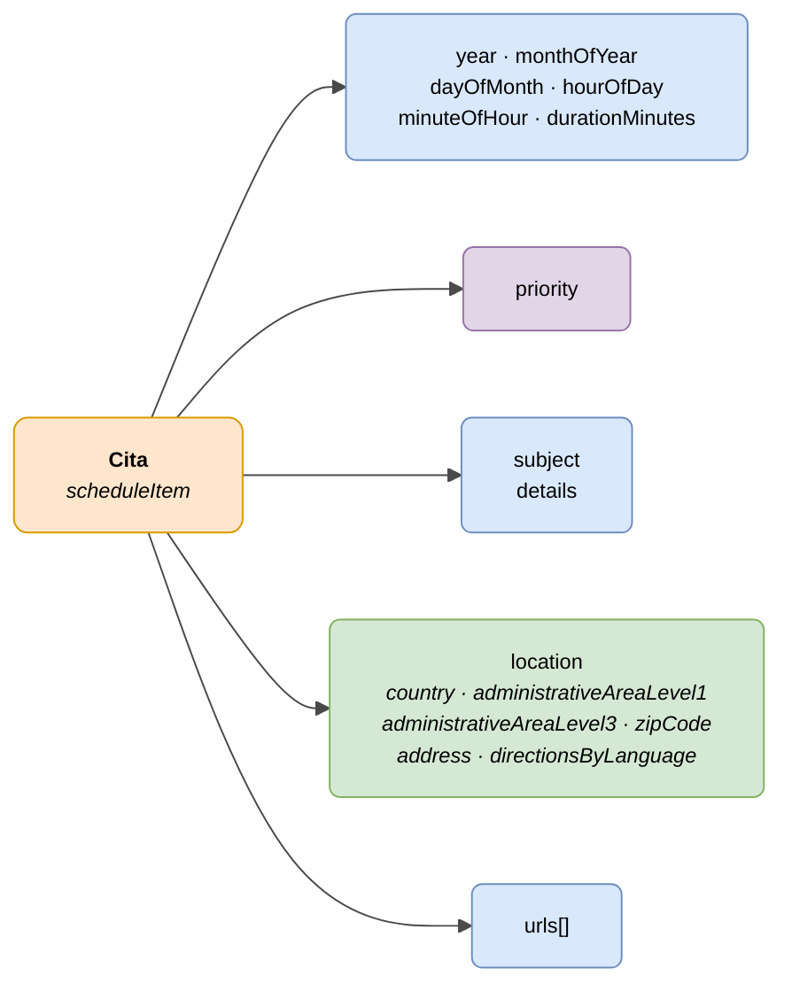

# :material-calendar-clock: Cita (Schedule Item)

> - **Versión:** `v{{ dena.version }}`
> - **Fecha:** {{ dena.date }}
> - **Test:** [DN99DENATestMockObjFactoryForScheduleItem.java]({{ repos.interop_test_blob }}/denaTestCommonDataClasses/src/main/java/dena/test/common/data/schedule/DN99DENATestMockObjFactoryForScheduleItem.java)
> - **Código:** [DN00ScheduleItem.java]({{ repos.common_data_api_blob }}/denaCommonDataAPIScheduleModelClasses/src/main/java/dena/api/data/model/schedule/DN00ScheduleItem.java)

## Descripción

Representa un elemento de agenda o cita previa. Puede ser una cita con duración o un hito puntual (duración = 0).

> **Nota:** A diferencia de los demás objetos (notificación, registro, pago), las citas son **independientes de expedientes**. No tienen campo `procedureRecord`.

> Ver también: [campos-comunes.md](./campos-comunes.md) para campos heredados (`oid`, `id`, `urls`, `originAdminRef`, `aboutPersonRef`)



| Color | Significado |
|-------|-------------|
| 🟠 Naranja | Objeto principal (Cita) |
| 🟣 Violeta | Enums (prioridad) |
| 🔵 Azul claro | Campos de datos |
| 🟢 Verde | Ubicación física |

---

## 🔗 Código fuente

| Clase | Repositorio |
|-------|-------------|
| DN00ScheduleItem | [Ver código]({{ repos.common_data_api_blob }}/denaCommonDataAPIScheduleModelClasses/src/main/java/dena/api/data/model/schedule/DN00ScheduleItem.java) |
| DN00ScheduleItemLocation | [Ver código]({{ repos.common_data_api_blob }}/denaCommonDataAPIScheduleModelClasses/src/main/java/dena/api/data/model/schedule/DN00ScheduleItemLocation.java) |
| DN00ScheduleItemLocationItem | [Ver código]({{ repos.common_data_api_blob }}/denaCommonDataAPIScheduleModelClasses/src/main/java/dena/api/data/model/schedule/DN00ScheduleItemLocationItem.java) |
| DN00ScheduleItemPriority | [Ver código]({{ repos.common_data_api_blob }}/denaCommonDataAPIScheduleModelClasses/src/main/java/dena/api/data/model/schedule/DN00ScheduleItemPriority.java) |

---

## 🧪 Tests y ejemplos

> Repositorio: [DENA-Euskadi/dena-interop-common-data-test]({{ repos.interop_test_tree }})

| Mock Factory | Repositorio |
|--------------|-------------|
| DN99DENATestMockObjFactoryForScheduleItem | [Ver código]({{ repos.interop_test_blob }}/denaTestCommonDataClasses/src/main/java/dena/test/common/data/schedule/DN99DENATestMockObjFactoryForScheduleItem.java) |
| DN99DENATestMockObjFactoryForScheduleItemLocation | [Ver código]({{ repos.interop_test_blob }}/denaTestCommonDataClasses/src/main/java/dena/test/common/data/schedule/DN99DENATestMockObjFactoryForScheduleItemLocation.java) |
| DN99DENATestMockObjFactoryForScheduleItemLocationItem | [Ver código]({{ repos.interop_test_blob }}/denaTestCommonDataClasses/src/main/java/dena/test/common/data/schedule/DN99DENATestMockObjFactoryForScheduleItemLocationItem.java) |
| DN99DENATestMockObjFactoryForScheduleItemPriority | [Ver código]({{ repos.interop_test_blob }}/denaTestCommonDataClasses/src/main/java/dena/test/common/data/schedule/DN99DENATestMockObjFactoryForScheduleItemPriority.java) |

---

## Atributos JSON


| Campo | Tipo | Obligatorio | Ejemplo | Descripción |
|-------|------|:-----------:|---------|-------------|
| `type` | `String` | ✅ | `"scheduleItem"` | Discriminador polimórfico |
| `oid` | `String` | ✅ | `"SCHED-OID-001"` | Identificador técnico único |
| `id` | `String` | ✅ | `"CITA-2024-00050"` | Identificador de negocio |
| `year` | `Number` | ✅ | `2024` | Año |
| `monthOfYear` | `Number` | ✅ | `7` | Mes (1-12) |
| `dayOfMonth` | `Number` | ✅ | `15` | Día del mes (1-31) |
| `hourOfDay` | `Number` | ✅ | `10` | Hora (0-23) |
| `minuteOfHour` | `Number` | ✅ | `30` | Minuto (0-59) |
| `durationMinutes` | `Number` | ✅ | `30` | Duración en minutos (0 = hito puntual) |
| `priority` | `String` | ❌ | `"NORMAL"` | Prioridad |
| `subject` | `LanguageTexts` | ✅ | `{"SPANISH":"Cita renovación DNI"}` | Asunto de la cita |
| `details` | `LanguageTexts` | ❌ | `{"SPANISH":"Traer foto reciente"}` | Detalles adicionales |
| `location` | `Object` | ❌ | *(ver [Ubicación](#ubicacion-location) · [`DN00ScheduleItemLocation`]({{ repos.common_data_api_blob }}/denaCommonDataAPIScheduleModelClasses/src/main/java/dena/api/data/model/schedule/DN00ScheduleItemLocation.java))* | Ubicación (recomendado) |
| `urls` | `Array` | ❌ | *(ver [campos-comunes.md](./campos-comunes.md) · [`DN00DENADataExchangedObjectBase`]({{ repos.common_data_api_blob }}/denaCommonDataAPIModelClasses/src/main/java/dena/api/data/model/DN00DENADataExchangedObjectBase.java))* | URLs de acceso |

---

## Prioridad (`priority`)

| Código | Descripción |
|--------|-------------|
| `HIGH` | Alta |
| `MEDIUM` | Media |
| `NORMAL` | Normal |
| `LOW` | Baja |

---

## Ubicación (`location`) { #ubicacion-location }

| Campo | Tipo | Obligatorio | Descripción |
|-------|------|:-----------:|-------------|
| `country` | `Object` | ❌ | País (`id`, `name`) |
| `administrativeAreaLevel1` | `Object` | ❌ | Territorio / CCAA (`id`, `name`) |
| `administrativeAreaLevel3` | `Object` | ❌ | Municipio (`id`, `name`) |
| `zipCode` | `String` | ❌ | Código postal |
| `address` | `String` | ❌ | Dirección |
| `directionsByLanguage` | `LanguageTexts` | ❌ | Indicaciones de acceso multiidioma (serializado como `"address"` en JSON — ver nota) |

> **Nota:** En el modelo actual, tanto `address` (String) como `directionsByLanguage` (LanguageTexts) se serializan con el nombre JSON `"address"` debido a un bug conocido en el código. Se recomienda usar solo uno de los dos campos hasta que se corrija.

---

## Ejemplo JSON

```json
{
  "type": "scheduleItem",
  "oid": "SCHED-OID-001",
  "id": "CITA-2024-00050",
  "year": 2024,
  "monthOfYear": 7,
  "dayOfMonth": 15,
  "hourOfDay": 10,
  "minuteOfHour": 30,
  "durationMinutes": 30,
  "priority": "NORMAL",
  "subject": {
    "SPANISH": "Cita previa para renovación de DNI",
    "BASQUE": "NAN berritzeko aurretiko hitzordua"
  },
  "details": {
    "SPANISH": "Traer fotografía reciente y DNI anterior",
    "BASQUE": "Ekarri argazki berria eta aurreko NANa"
  },
  "location": {
    "country": { "id": "ES", "name": "España" },
    "administrativeAreaLevel1": { "id": "PV", "name": "País Vasco" },
    "administrativeAreaLevel3": { "id": "48020", "name": "Bilbao" },
    "zipCode": "48001",
    "address": "Gran Vía 50, Bilbao",
    "directionsByLanguage": {
      "SPANISH": "Planta 2, oficina 201. Acceso por la entrada principal.",
      "BASQUE": "2. solairua, 201 bulegoa. Sarrera nagusitik sartu."
    }
  },
  "urls": [
    { "url": "https://sede.miadmin.eus/cita/CITA-2024-00050", "language": "SPANISH", "tags": ["default"] }
  ]
}
```

---

## Ejemplo — Hito (duración = 0)

```json
{
  "type": "scheduleItem",
  "oid": "SCHED-OID-002",
  "id": "HITO-2024-00010",
  "year": 2024,
  "monthOfYear": 9,
  "dayOfMonth": 1,
  "hourOfDay": 0,
  "minuteOfHour": 0,
  "durationMinutes": 0,
  "subject": {
    "SPANISH": "Inicio del plazo de matriculación",
    "BASQUE": "Matrikulazio-epearen hasiera"
  }
}
```

---

## Diferencias con otros objetos

| Característica | Cita | Expediente / Notificación / Registro / Pago |
|----------------|------|----------------------------------------------|
| Depende de expediente | ❌ No | ✅ Sí (campo `procedureRecord`) |
| Tiene estado | ❌ No | ✅ Sí |
| Tiene fecha ISO 8601 | ❌ (usa campos separados year/month/day/hour/minute) | ✅ Sí |
| Tiene ubicación física | ✅ Sí | ❌ No |


---

<!-- DENA-DOC-FOOTER -->
---
<sub>DENA Docs v{{ dena.version }} · {{ dena.date }}</sub>
