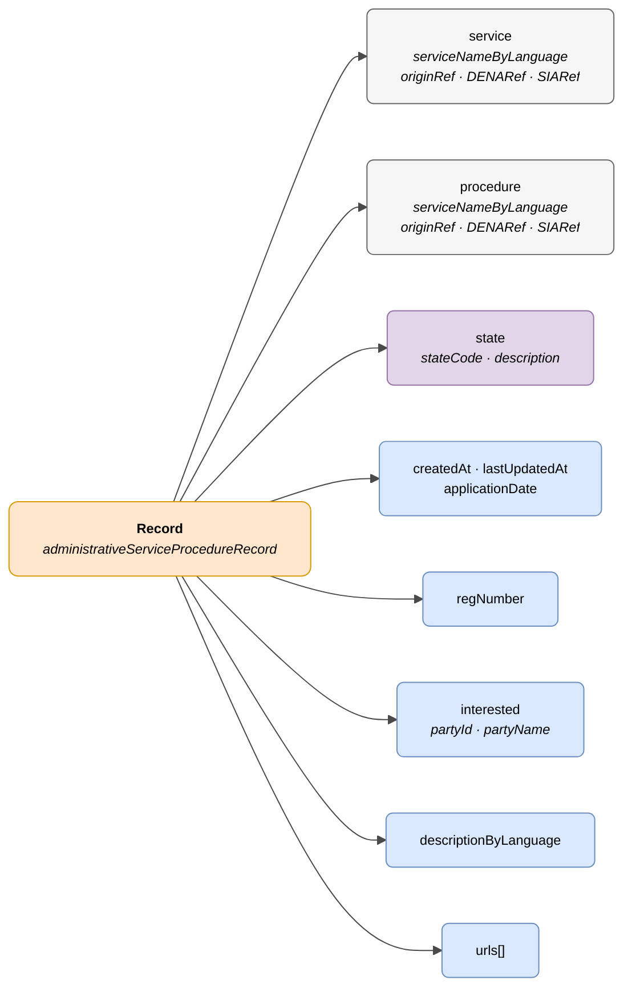

# :material-folder-open: Record (Procedure Record)

> - **Version:** `v{{ dena.version }}`
> - **Date:** {{ dena.date }}
> - **Test:** [DN99DENATestMockObjFactoryForAdmistrativeServiceProcedureRecord.java]({{ repos.interop_test_blob }}/denaTestCommonDataClasses/src/main/java/dena/test/common/data/services/DN99DENATestMockObjFactoryForAdmistrativeServiceProcedureRecord.java)
> - **Code:** [DN00AdmistrativeServiceProcedureRecord.java]({{ repos.common_data_api_blob }}/denaCommonDataAPIAdministrativeServicesModelClasses/src/main/java/dena/api/data/model/administrativeservices/DN00AdmistrativeServiceProcedureRecord.java)

## Description

Represents an administrative record linked to a service and procedure. It is the central object of the model: notifications, registrations and payments depend on it.

> See also: [campos-comunes.md](./campos-comunes.md) for inherited fields (`oid`, `id`, `urls`, `originAdmin`, `aboutPerson`)



| Colour | Meaning |
|--------|---------|
| 🟠 Orange | Main object (Record) |
| ⚪ Grey | Hierarchical context (Service / Procedure) |
| 🟣 Violet | Enums / states |
| 🔵 Light blue | Data fields |

---

## 🔗 Source code

| Class | Repository |
|-------|------------|
| DN00AdmistrativeServiceProcedureRecord | [View code]({{ repos.common_data_api_blob }}/denaCommonDataAPIAdministrativeServicesModelClasses/src/main/java/dena/api/data/model/administrativeservices/DN00AdmistrativeServiceProcedureRecord.java) |
| DN00AdministrativeServiceProcedureRecordState | [View code]({{ repos.common_data_api_blob }}/denaCommonDataAPIAdministrativeServicesModelClasses/src/main/java/dena/api/data/model/administrativeservices/DN00AdministrativeServiceProcedureRecordState.java) |
| DN00AdministrativeServiceProcedureRecordStateCode | [View code]({{ repos.common_data_api_blob }}/denaCommonDataAPIAdministrativeServicesModelClasses/src/main/java/dena/api/data/model/administrativeservices/DN00AdministrativeServiceProcedureRecordStateCode.java) |

---

## 🧪 Tests and examples

| Test | Repository |
|------|------------|
| DN00RecordTest | [View test]({{ repos.interop_test_blob }}/denaTestCommonDataClasses/src/main/java/dena/test/common/data/services/DN99DENATestMockObjFactoryForAdmistrativeServiceProcedureRecord.java) |
| DN00RecordStatusTest | [View test]({{ repos.interop_test_blob }}/denaTestCommonDataClasses/src/main/java/dena/test/common/data/services/DN99DENATestMockObjFactoryForAdministrativeServiceProcedureRecordState.java) |
| DN00RecordIDTest | [View test]({{ repos.interop_test_blob }}/denaTestCommonDataClasses/src/main/java/dena/test/common/data/services/DN99DENATestMockObjFactoryForAdmistrativeServiceProcedureRecord.java) |

---

## JSON attributes

| Field | Type | Mandatory | Example | Description |
|-------|------|:---------:|---------|-------------|
| `type` | `String` | ✅ | `"administrativeServiceProcedureRecord"` | Polymorphic discriminator |
| `oid` | `String` | ✅ | `"EXP-OID-001"` | Unique technical identifier |
| `id` | `String` | ✅ | `"EXP-2024-00123"` | Business identifier |
| `service` | `Object` | ✅ | *(see [servicio-administrativo.md](./servicio-administrativo.md) · [`DN00AdmistrativeService`]({{ repos.common_data_api_blob }}/denaCommonDataAPIAdministrativeServicesModelClasses/src/main/java/dena/api/data/model/administrativeservices/DN00AdmistrativeService.java))* | Administrative service |
| `procedure` | `Object` | ✅ | *(see [servicio-administrativo.md](./servicio-administrativo.md) · [`DN00AdministrativeServiceProcedure`]({{ repos.common_data_api_blob }}/denaCommonDataAPIAdministrativeServicesModelClasses/src/main/java/dena/api/data/model/administrativeservices/DN00AdministrativeServiceProcedure.java))* | Procedure |
| `createdAt` | `String` (ISO 8601) | ✅ | `"2024-03-15T10:30:00Z"` | Creation date |
| `lastUpdatedAt` | `String` (ISO 8601) | ❌ | `"2024-06-01T14:00:00Z"` | Last update date |
| `applicationDate` | `String` (ISO 8601) | ❌ | `"2024-03-14T09:00:00Z"` | Application submission date |
| `regNumber` | `String` | ❌ | `"REG-2024-00123"` | Registration number |
| `state` | `Object` | ✅ | *(see [`DN00AdministrativeServiceProcedureRecordState`]({{ repos.common_data_api_blob }}/denaCommonDataAPIAdministrativeServicesModelClasses/src/main/java/dena/api/data/model/administrativeservices/DN00AdministrativeServiceProcedureRecordState.java))* | Current state |
| `state.stateCode` | `String` | ✅ | `"IN_PROGRESS"` | State code |
| `state.description` | `LanguageTexts` | ❌ | `{"SPANISH":"En tramitación"}` | Multilingual state description |
| `interested` | `Object` | ❌ | *(see [`DN00AdministrativeServiceInterested`]({{ repos.common_data_api_blob }}/denaCommonDataAPIAdministrativeServicesModelClasses/src/main/java/dena/api/data/model/administrativeservices/DN00AdministrativeServiceInterested.java))* | Interested party in the record |
| `interested.partyId` | `String` | ❌ | `"12345678A"` | NIF/DNI of the interested party |
| `interested.partyName` | `String` | ❌ | `"Juan García"` | Name of the interested party |
| `descriptionByLanguage` | `LanguageTexts` | ❌ | `{"SPANISH":"Licencia apertura"}` | Record description |
| `urls` | `Array` | ❌ (recommended) | *(see [campos-comunes.md](./campos-comunes.md) · [`DN00DENADataExchangedObjectBase`]({{ repos.common_data_api_blob }}/denaCommonDataAPIModelClasses/src/main/java/dena/api/data/model/DN00DENADataExchangedObjectBase.java))* | Access URLs to the e-government portal |

---

## States (`state.stateCode`)

| Code | Description |
|------|-------------|
| `REGISTERED_PENDING_TO_BE_OPENED` | Registered, pending opening |
| `OPENED` | Opened |
| `IN_PROGRESS` | In progress |
| `WAITING_FOR_INTERESTED_PARTY_RESPONSE` | Awaiting response from the interested party |
| `WAITING_FOR_OTHER_ORG_WORK` | Awaiting another organisation |
| `CLOSED` | Closed |

---

## JSON example

```json
{
  "type": "administrativeServiceProcedureRecord",
  "oid": "EXP-OID-001",
  "id": "EXP-2024-00123",
  "service": {
    "serviceNameByLanguage": { "SPANISH": "Licencias de actividad", "BASQUE": "Jarduera-lizentziak" },
    "originRef": { "id": "SRV-LIC-ACT" }
  },
  "procedure": {
    "serviceNameByLanguage": { "SPANISH": "Solicitud de licencia de apertura", "BASQUE": "Irekiera-lizentzia eskaera" },
    "originRef": { "id": "PROC-LIC-APER" }
  },
  "createdAt": "2024-03-15T10:30:00Z",
  "lastUpdatedAt": "2024-06-01T14:00:00Z",
  "applicationDate": "2024-03-14T09:00:00Z",
  "regNumber": "REG-2024-00123",
  "interested": { "partyId": "12345678A", "partyName": "Juan García" },
  "state": {
    "stateCode": "IN_PROGRESS",
    "description": { "SPANISH": "En tramitación", "BASQUE": "Izapidetzen" }
  },
  "descriptionByLanguage": { "SPANISH": "Expediente de licencia de apertura", "BASQUE": "Irekiera-lizentzia espedientea" },
  "urls": [
    { "url": "https://sede.miadmin.eus/expediente/EXP-2024-00123", "language": "SPANISH", "tags": ["default"] },
    { "url": "https://egoitza.miadmin.eus/espedientea/EXP-2024-00123", "language": "BASQUE", "tags": ["default"] }
  ]
}
```

---

## Relationship with other objects

The following objects reference the record via `procedureRecord`:

- Notification (`administrativeNotice`)
- Official Registration (`administrativeOfficialRegisterRecord`)
- Payment (`oneOffPayment`, `directDebitPayment`)

> **Note:** Appointments (`scheduleItem`) do NOT depend on records.

---

## Validation rules

- `createdAt` is mandatory and must be a valid ISO 8601 date.
- If `lastUpdatedAt` is included, it must be ≥ `createdAt`.
- `service` and `procedure` must include at least `serviceNameByLanguage` with texts in `SPANISH` and `BASQUE`.
- See [validaciones.md](../validaciones.md) for full rules.


<!-- DENA-DOC-FOOTER -->
---
<sub>DENA Docs v{{ dena.version }} · {{ dena.date }}</sub>
