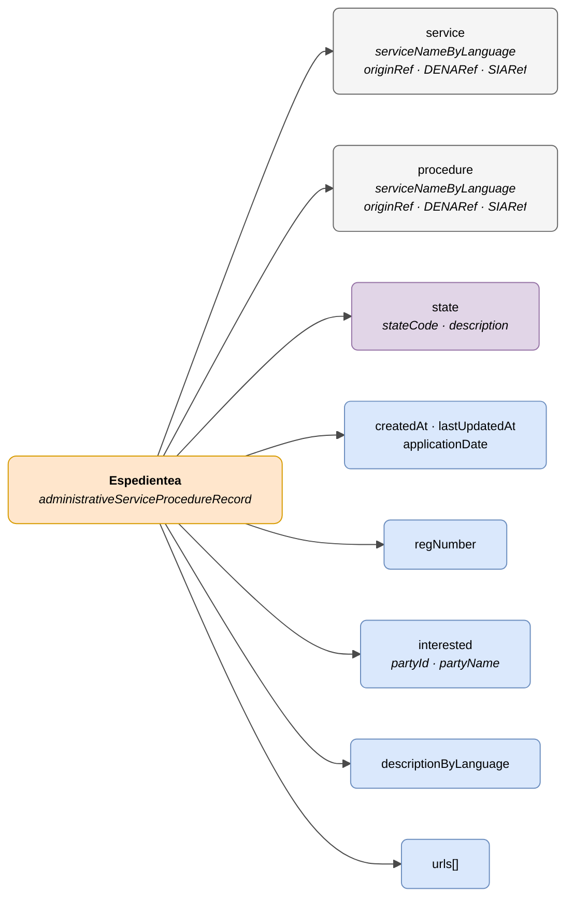

# :material-folder-open: Espedientea (Procedure Record)

> - **Bertsioa:** `v{{ dena.version }}`
> - **Data:** {{ dena.date }}
> - **Testa:** [DN99DENATestMockObjFactoryForAdmistrativeServiceProcedureRecord.java]({{ repos.interop_test_blob }}/denaTestCommonDataClasses/src/main/java/dena/test/common/data/services/DN99DENATestMockObjFactoryForAdmistrativeServiceProcedureRecord.java)
> - **Kodea:** [DN00AdmistrativeServiceProcedureRecord.java]({{ repos.common_data_api_blob }}/denaCommonDataAPIAdministrativeServicesModelClasses/src/main/java/dena/api/data/model/administrativeservices/DN00AdmistrativeServiceProcedureRecord.java)

## Deskribapena

Zerbitzu eta prozedura bati lotutako administrazio-espediente bat adierazten du. Ereduaren objektu nagusia da: jakinarazpenak, erregistroak eta ordainketak haren mende daude.

> Ikusi baita ere: [campos-comunes.md](./campos-comunes.md) heredatutako eremuetarako (`oid`, `id`, `urls`, `originAdmin`, `aboutPerson`)



| Kolorea | Esanahia |
|---------|----------|
| 🟠 Laranja | Objektu nagusia (Espedientea) |
| ⚪ Grisa | Testuinguru hierarkikoa (Zerbitzua / Prozedura) |
| 🟣 Morea | Enumak / egoerak |
| 🔵 Urdin argia | Datu-eremuak |

---

## 🔗 Iturburu-kodea

| Klasea | Biltegia |
|--------|----------|
| DN00AdmistrativeServiceProcedureRecord | [Ikusi kodea]({{ repos.common_data_api_blob }}/denaCommonDataAPIAdministrativeServicesModelClasses/src/main/java/dena/api/data/model/administrativeservices/DN00AdmistrativeServiceProcedureRecord.java) |
| DN00AdministrativeServiceProcedureRecordState | [Ikusi kodea]({{ repos.common_data_api_blob }}/denaCommonDataAPIAdministrativeServicesModelClasses/src/main/java/dena/api/data/model/administrativeservices/DN00AdministrativeServiceProcedureRecordState.java) |
| DN00AdministrativeServiceProcedureRecordStateCode | [Ikusi kodea]({{ repos.common_data_api_blob }}/denaCommonDataAPIAdministrativeServicesModelClasses/src/main/java/dena/api/data/model/administrativeservices/DN00AdministrativeServiceProcedureRecordStateCode.java) |

---

## 🧪 Testak eta adibideak

| Testa | Biltegia |
|-------|----------|
| DN00RecordTest | [Ikusi testa]({{ repos.interop_test_blob }}/denaTestCommonDataClasses/src/main/java/dena/test/common/data/services/DN99DENATestMockObjFactoryForAdmistrativeServiceProcedureRecord.java) |
| DN00RecordStatusTest | [Ikusi testa]({{ repos.interop_test_blob }}/denaTestCommonDataClasses/src/main/java/dena/test/common/data/services/DN99DENATestMockObjFactoryForAdministrativeServiceProcedureRecordState.java) |
| DN00RecordIDTest | [Ikusi testa]({{ repos.interop_test_blob }}/denaTestCommonDataClasses/src/main/java/dena/test/common/data/services/DN99DENATestMockObjFactoryForAdmistrativeServiceProcedureRecord.java) |

---

## JSON atributuak

| Eremua | Mota | Derrigorrez | Adibidea | Deskribapena |
|--------|------|:-----------:|----------|--------------|
| `type` | `String` | ✅ | `"administrativeServiceProcedureRecord"` | Diskriminatzaile polimorfiko |
| `oid` | `String` | ✅ | `"EXP-OID-001"` | Identifikatzaile tekniko bakarra |
| `id` | `String` | ✅ | `"EXP-2024-00123"` | Negozio-identifikatzailea |
| `service` | `Object` | ✅ | *(ikusi [servicio-administrativo.md](./servicio-administrativo.md) · [`DN00AdmistrativeService`]({{ repos.common_data_api_blob }}/denaCommonDataAPIAdministrativeServicesModelClasses/src/main/java/dena/api/data/model/administrativeservices/DN00AdmistrativeService.java))* | Administrazio-zerbitzua |
| `procedure` | `Object` | ✅ | *(ikusi [servicio-administrativo.md](./servicio-administrativo.md) · [`DN00AdministrativeServiceProcedure`]({{ repos.common_data_api_blob }}/denaCommonDataAPIAdministrativeServicesModelClasses/src/main/java/dena/api/data/model/administrativeservices/DN00AdministrativeServiceProcedure.java))* | Prozedura |
| `createdAt` | `String` (ISO 8601) | ✅ | `"2024-03-15T10:30:00Z"` | Sorrera-data |
| `lastUpdatedAt` | `String` (ISO 8601) | ❌ | `"2024-06-01T14:00:00Z"` | Azken eguneratze-data |
| `applicationDate` | `String` (ISO 8601) | ❌ | `"2024-03-14T09:00:00Z"` | Eskaera aurkezteko data |
| `regNumber` | `String` | ❌ | `"REG-2024-00123"` | Erregistro-zenbakia |
| `state` | `Object` | ✅ | *(ikusi [`DN00AdministrativeServiceProcedureRecordState`]({{ repos.common_data_api_blob }}/denaCommonDataAPIAdministrativeServicesModelClasses/src/main/java/dena/api/data/model/administrativeservices/DN00AdministrativeServiceProcedureRecordState.java))* | Uneko egoera |
| `state.stateCode` | `String` | ✅ | `"IN_PROGRESS"` | Egoera-kodea |
| `state.description` | `LanguageTexts` | ❌ | `{"SPANISH":"En tramitación"}` | Egoeraren deskribapen eleanitza |
| `interested` | `Object` | ❌ | *(ikusi [`DN00AdministrativeServiceInterested`]({{ repos.common_data_api_blob }}/denaCommonDataAPIAdministrativeServicesModelClasses/src/main/java/dena/api/data/model/administrativeservices/DN00AdministrativeServiceInterested.java))* | Espedientean interesduna |
| `interested.partyId` | `String` | ❌ | `"12345678A"` | Interesdunaren IFZ/NAN |
| `interested.partyName` | `String` | ❌ | `"Juan García"` | Interesdunaren izena |
| `descriptionByLanguage` | `LanguageTexts` | ❌ | `{"SPANISH":"Licencia apertura"}` | Espedientearen deskribapena |
| `urls` | `Array` | ❌ (gomendatua) | *(ikusi [campos-comunes.md](./campos-comunes.md) · [`DN00DENADataExchangedObjectBase`]({{ repos.common_data_api_blob }}/denaCommonDataAPIModelClasses/src/main/java/dena/api/data/model/DN00DENADataExchangedObjectBase.java))* | Egoitza elektronikorako sarbide-URLak |

---

## Egoerak (`state.stateCode`)

| Kodea | Deskribapena |
|-------|--------------|
| `REGISTERED_PENDING_TO_BE_OPENED` | Erregistratua, irekitzeko zain |
| `OPENED` | Irekita |
| `IN_PROGRESS` | Izapidetzen |
| `WAITING_FOR_INTERESTED_PARTY_RESPONSE` | Interesdunaren erantzunaren zain |
| `WAITING_FOR_OTHER_ORG_WORK` | Beste erakunde baten zain |
| `CLOSED` | Itxita |

---

## JSON adibidea

```json
{
  "type": "administrativeServiceProcedureRecord",
  "oid": "EXP-OID-001",
  "id": "EXP-2024-00123",
  "service": {
    "serviceNameByLanguage": { "SPANISH": "Licencias de actividad", "BASQUE": "Jarduera-lizentziak" },
    "originRef": { "id": "SRV-LIC-ACT" }
  },
  "procedure": {
    "serviceNameByLanguage": { "SPANISH": "Solicitud de licencia de apertura", "BASQUE": "Irekiera-lizentzia eskaera" },
    "originRef": { "id": "PROC-LIC-APER" }
  },
  "createdAt": "2024-03-15T10:30:00Z",
  "lastUpdatedAt": "2024-06-01T14:00:00Z",
  "applicationDate": "2024-03-14T09:00:00Z",
  "regNumber": "REG-2024-00123",
  "interested": { "partyId": "12345678A", "partyName": "Juan García" },
  "state": {
    "stateCode": "IN_PROGRESS",
    "description": { "SPANISH": "En tramitación", "BASQUE": "Izapidetzen" }
  },
  "descriptionByLanguage": { "SPANISH": "Expediente de licencia de apertura", "BASQUE": "Irekiera-lizentzia espedientea" },
  "urls": [
    { "url": "https://sede.miadmin.eus/expediente/EXP-2024-00123", "language": "SPANISH", "tags": ["default"] },
    { "url": "https://egoitza.miadmin.eus/espedientea/EXP-2024-00123", "language": "BASQUE", "tags": ["default"] }
  ]
}
```

---

## Beste objektuekin harremana

Ondorengo objektuek espedienteari erreferentzia egiten diote `procedureRecord` bidez:

- Jakinarazpena (`administrativeNotice`)
- Erregistro Ofiziala (`administrativeOfficialRegisterRecord`)
- Ordainketa (`oneOffPayment`, `directDebitPayment`)

> **Oharra:** Hitzorduak (`scheduleItem`) EZ daude espedienteen mende.

---

## Balioztatze-arauak

- `createdAt` derrigorrez da eta ISO 8601 data balioduna izan behar du.
- `lastUpdatedAt` sartzen bada, `createdAt` ≥ izan behar du.
- `service` eta `procedure`-k gutxienez `serviceNameByLanguage` sartu behar dute `SPANISH` eta `BASQUE` testuekin.
- Ikusi [validaciones.md](../validaciones.md) arau osoentzat.


<!-- DENA-DOC-FOOTER -->
---
<sub>DENA Docs v{{ dena.version }} · {{ dena.date }}</sub>
