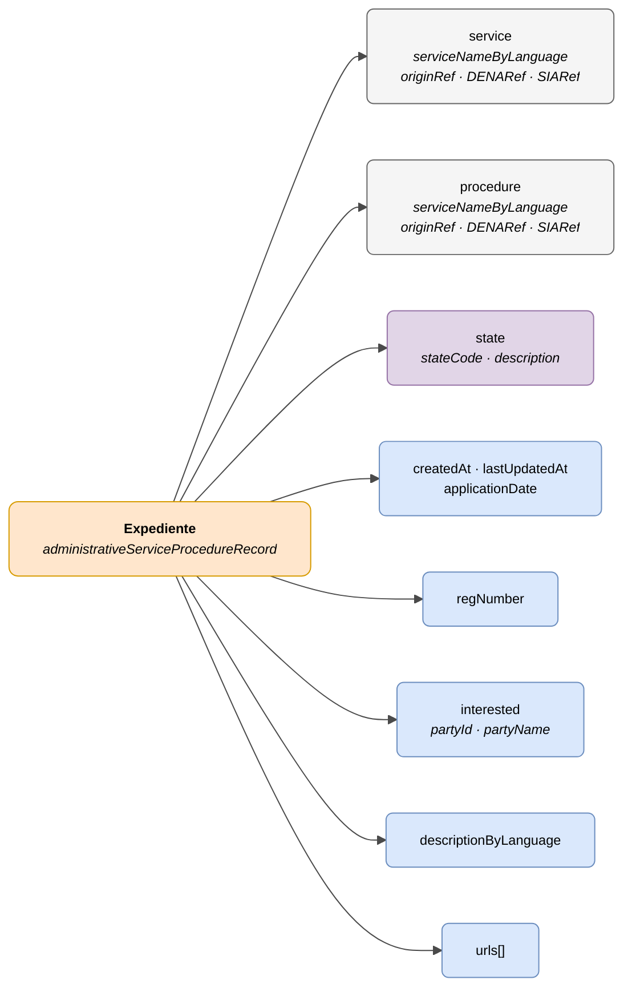

# :material-folder-open: Expediente (Procedure Record)

> - **Versión:** `v{{ dena.version }}`
> - **Fecha:** {{ dena.date }}
> - **Test:** [DN99DENATestMockObjFactoryForAdmistrativeServiceProcedureRecord.java]({{ repos.interop_test_blob }}/denaTestCommonDataClasses/src/main/java/dena/test/common/data/services/DN99DENATestMockObjFactoryForAdmistrativeServiceProcedureRecord.java)
> - **Código:** [DN00AdmistrativeServiceProcedureRecord.java]({{ repos.common_data_api_blob }}/denaCommonDataAPIAdministrativeServicesModelClasses/src/main/java/dena/api/data/model/administrativeservices/DN00AdmistrativeServiceProcedureRecord.java)

## Descripción

Representa un expediente administrativo vinculado a un servicio y procedimiento. Es el objeto central del modelo: notificaciones, registros y pagos dependen de él.

> Ver también: [campos-comunes.md](./campos-comunes.md) para campos heredados (`oid`, `id`, `urls`, `originAdminRef`, `aboutPersonRef`)



| Color | Significado |
|-------|-------------|
| 🟠 Naranja | Objeto principal (Expediente) |
| ⚪ Gris | Contexto jerárquico (Servicio / Procedimiento) |
| 🟣 Violeta | Enums / estados |
| 🔵 Azul claro | Campos de datos |

---

## 🔗 Código fuente

| Clase | Repositorio |
|-------|-------------|
| DN00AdmistrativeServiceProcedureRecord | [Ver código]({{ repos.common_data_api_blob }}/denaCommonDataAPIAdministrativeServicesModelClasses/src/main/java/dena/api/data/model/administrativeservices/DN00AdmistrativeServiceProcedureRecord.java) |
| DN00AdministrativeServiceProcedureRecordState | [Ver código]({{ repos.common_data_api_blob }}/denaCommonDataAPIAdministrativeServicesModelClasses/src/main/java/dena/api/data/model/administrativeservices/DN00AdministrativeServiceProcedureRecordState.java) |
| DN00AdministrativeServiceProcedureRecordStateCode | [Ver código]({{ repos.common_data_api_blob }}/denaCommonDataAPIAdministrativeServicesModelClasses/src/main/java/dena/api/data/model/administrativeservices/DN00AdministrativeServiceProcedureRecordStateCode.java) |

---

## 🧪 Tests y ejemplos

| Test | Repositorio |
|------|-------------|
| DN00RecordTest | [Ver test]({{ repos.interop_test_blob }}/denaTestCommonDataClasses/src/main/java/dena/test/common/data/services/DN99DENATestMockObjFactoryForAdmistrativeServiceProcedureRecord.java) |
| DN00RecordStatusTest | [Ver test]({{ repos.interop_test_blob }}/denaTestCommonDataClasses/src/main/java/dena/test/common/data/services/DN99DENATestMockObjFactoryForAdministrativeServiceProcedureRecordState.java) |
| DN00RecordIDTest | [Ver test]({{ repos.interop_test_blob }}/denaTestCommonDataClasses/src/main/java/dena/test/common/data/services/DN99DENATestMockObjFactoryForAdmistrativeServiceProcedureRecord.java) |

---

## Atributos JSON

| Campo | Tipo | Obligatorio | Ejemplo | Descripción |
|-------|------|:-----------:|---------|-------------|
| `type` | `String` | ✅ | `"administrativeServiceProcedureRecord"` | Discriminador polimórfico |
| `oid` | `String` | ✅ | `"EXP-OID-001"` | Identificador técnico único |
| `id` | `String` | ✅ | `"EXP-2024-00123"` | Identificador de negocio |
| `service` | `Object` | ✅ | *(ver [servicio-administrativo.md](./servicio-administrativo.md) · [`DN00AdmistrativeService`]({{ repos.common_data_api_blob }}/denaCommonDataAPIAdministrativeServicesModelClasses/src/main/java/dena/api/data/model/administrativeservices/DN00AdmistrativeService.java))* | Servicio administrativo |
| `procedure` | `Object` | ✅ | *(ver [servicio-administrativo.md](./servicio-administrativo.md) · [`DN00AdministrativeServiceProcedure`]({{ repos.common_data_api_blob }}/denaCommonDataAPIAdministrativeServicesModelClasses/src/main/java/dena/api/data/model/administrativeservices/DN00AdministrativeServiceProcedure.java))* | Procedimiento |
| `createdAt` | `String` (ISO 8601) | ✅ | `"2024-03-15T10:30:00Z"` | Fecha de creación |
| `lastUpdatedAt` | `String` (ISO 8601) | ❌ | `"2024-06-01T14:00:00Z"` | Fecha de última actualización |
| `applicationDate` | `String` (ISO 8601) | ❌ | `"2024-03-14T09:00:00Z"` | Fecha de presentación de la solicitud |
| `regNumber` | `String` | ❌ | `"REG-2024-00123"` | Número de registro |
| `state` | `Object` | ✅ | *(ver [`DN00AdministrativeServiceProcedureRecordState`]({{ repos.common_data_api_blob }}/denaCommonDataAPIAdministrativeServicesModelClasses/src/main/java/dena/api/data/model/administrativeservices/DN00AdministrativeServiceProcedureRecordState.java))* | Estado actual |
| `state.stateCode` | `String` | ✅ | `"IN_PROGRESS"` | Código de estado |
| `state.description` | `LanguageTexts` | ❌ | `{"SPANISH":"En tramitación"}` | Descripción multiidioma del estado |
| `interested` | `Object` | ❌ | *(ver [`DN00AdministrativeServiceInterested`]({{ repos.common_data_api_blob }}/denaCommonDataAPIAdministrativeServicesModelClasses/src/main/java/dena/api/data/model/administrativeservices/DN00AdministrativeServiceInterested.java))* | Interesado en el expediente |
| `interested.partyId` | `String` | ❌ | `"12345678A"` | NIF/DNI del interesado |
| `interested.partyName` | `String` | ❌ | `"Juan García"` | Nombre del interesado |
| `descriptionByLanguage` | `LanguageTexts` | ❌ | `{"SPANISH":"Licencia apertura"}` | Descripción del expediente |
| `urls` | `Array` | ❌ (recomendado) | *(ver [campos-comunes.md](./campos-comunes.md) · [`DN00DENADataExchangedObjectBase`]({{ repos.common_data_api_blob }}/denaCommonDataAPIModelClasses/src/main/java/dena/api/data/model/DN00DENADataExchangedObjectBase.java))* | URLs de acceso a la sede electrónica |

---

## Estados (`state.stateCode`)

| Código | Descripción |
|--------|-------------|
| `REGISTERED_PENDING_TO_BE_OPENED` | Registrado, pendiente de apertura |
| `OPENED` | Abierto |
| `IN_PROGRESS` | En tramitación |
| `WAITING_FOR_INTERESTED_PARTY_RESPONSE` | Pendiente de respuesta del interesado |
| `WAITING_FOR_OTHER_ORG_WORK` | Pendiente de otro organismo |
| `CLOSED` | Cerrado |

---

## Ejemplo JSON

```json
{
  "type": "administrativeServiceProcedureRecord",
  "oid": "EXP-OID-001",
  "id": "EXP-2024-00123",
  "service": {
    "serviceNameByLanguage": { "SPANISH": "Licencias de actividad", "BASQUE": "Jarduera-lizentziak" },
    "originRef": { "id": "SRV-LIC-ACT" }
  },
  "procedure": {
    "serviceNameByLanguage": { "SPANISH": "Solicitud de licencia de apertura", "BASQUE": "Irekiera-lizentzia eskaera" },
    "originRef": { "id": "PROC-LIC-APER" }
  },
  "createdAt": "2024-03-15T10:30:00Z",
  "lastUpdatedAt": "2024-06-01T14:00:00Z",
  "applicationDate": "2024-03-14T09:00:00Z",
  "regNumber": "REG-2024-00123",
  "interested": { "partyId": "12345678A", "partyName": "Juan García" },
  "state": {
    "stateCode": "IN_PROGRESS",
    "description": { "SPANISH": "En tramitación", "BASQUE": "Izapidetzen" }
  },
  "descriptionByLanguage": { "SPANISH": "Expediente de licencia de apertura", "BASQUE": "Irekiera-lizentzia espedientea" },
  "urls": [
    { "url": "https://sede.miadmin.eus/expediente/EXP-2024-00123", "language": "SPANISH", "tags": ["default"] },
    { "url": "https://egoitza.miadmin.eus/espedientea/EXP-2024-00123", "language": "BASQUE", "tags": ["default"] }
  ]
}
```

---

## Relación con otros objetos

Los siguientes objetos referencian al expediente mediante `procedureRecord`:

- Notificación (`administrativeNotice`)
- Registro Oficial (`administrativeOfficialRegisterRecord`)
- Pago (`oneOffPayment`, `directDebitPayment`)

> **Nota:** Las citas (`scheduleItem`) NO dependen de expedientes.

---

## Reglas de validación

- `createdAt` es obligatorio y debe ser una fecha ISO 8601 válida.
- Si se incluye `lastUpdatedAt`, debe ser ≥ `createdAt`.
- `service` y `procedure` deben incluir al menos `serviceNameByLanguage` con textos en `SPANISH` y `BASQUE`.
- Ver [validaciones.md](../validaciones.md) para reglas completas.


<!-- DENA-DOC-FOOTER -->
---
<sub>DENA Docs v{{ dena.version }} · {{ dena.date }}</sub>
