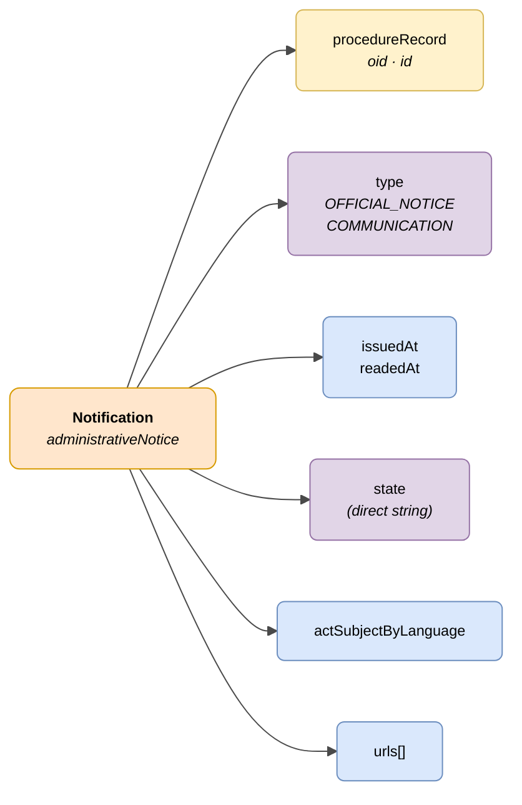

# :material-email-open: Notification (Administrative Notice)

> - **Version:** `v{{ dena.version }}`
> - **Date:** {{ dena.date }}
> - **Test:** [DN99DENATestMockObjFactoryForAdministrativeNotice.java]({{ repos.interop_test_blob }}/denaTestCommonDataClasses/src/main/java/dena/test/common/data/notification/DN99DENATestMockObjFactoryForAdministrativeNotice.java)
> - **Code:** [DN00AdministrativeNotice.java]({{ repos.common_data_api_blob }}/denaCommonDataAPIAdministrativeNoticeModelClasses/src/main/java/dena/api/data/model/administrativenotice/DN00AdministrativeNotice.java)

## Description

Represents an official notification or administrative communication issued to a person, linked to a record.

> See also: [campos-comunes.md](./campos-comunes.md) for inherited fields (`oid`, `id`, `urls`, `originAdmin`, `aboutPerson`)



| Colour | Meaning |
|--------|---------|
| 🟠 Orange | Main object (Notification) |
| 🟡 Yellow | Reference to another object (Record) |
| 🟣 Violet | Enums / states / types |
| 🔵 Light blue | Data fields |

---

## 🔗 Source code

| Class | Repository |
|-------|------------|
| DN00AdministrativeNotice | [View code]({{ repos.common_data_api_blob }}/denaCommonDataAPIAdministrativeNoticeModelClasses/src/main/java/dena/api/data/model/administrativenotice/DN00AdministrativeNotice.java) |
| DN00AdministrativeNoticeStateCode | [View code]({{ repos.common_data_api_blob }}/denaCommonDataAPIAdministrativeNoticeModelClasses/src/main/java/dena/api/data/model/administrativenotice/DN00AdministrativeNoticeStateCode.java) |
| DN00AdministrativeNoticeType | [View code]({{ repos.common_data_api_blob }}/denaCommonDataAPIAdministrativeNoticeModelClasses/src/main/java/dena/api/data/model/administrativenotice/DN00AdministrativeNoticeType.java) |

---

## 🧪 Tests and examples

| Test | Repository |
|------|------------|
| DN00NotificationTest | [View test]({{ repos.interop_test_blob }}/denaTestCommonDataClasses/src/main/java/dena/test/common/data/notification/DN99DENATestMockObjFactoryForAdministrativeNotice.java) |
| DN00NotificationStatusTest | [View test]({{ repos.interop_test_blob }}/denaTestCommonDataClasses/src/main/java/dena/test/common/data/notification/DN99DENATestMockObjFactoryForAdministrativeNoticeStateCode.java) |
| DN00NotificationTypeTest | [View test]({{ repos.interop_test_blob }}/denaTestCommonDataClasses/src/main/java/dena/test/common/data/notification/DN99DENATestMockObjFactoryForAdministrativeNoticeType.java) |
| DN00NotificationIDTest | [View test]({{ repos.interop_test_blob }}/denaTestCommonDataClasses/src/main/java/dena/test/common/data/notification/DN99DENATestMockObjFactoryForAdministrativeNotice.java) |

---

## JSON attributes

| Field | Type | Mandatory | Example | Description |
|-------|------|:---------:|---------|-------------|
| `type` | `String` | ✅ | `"OFFICIAL_NOTICE"` | Notification type. Polymorphic discriminator: `"administrativeNotice"` |
| `oid` | `String` | ✅ | `"NOT-OID-001"` | Unique technical identifier |
| `id` | `String` | ✅ | `"NOT-2024-00456"` | Business identifier |
| `procedureRecord` | `Object` | ✅ | `{"oid":"EXP-OID-001","id":"EXP-2024-00123"}` *(see [`DN00AdmistrativeServiceProcedureRecord`]({{ repos.common_data_api_blob }}/denaCommonDataAPIAdministrativeServicesModelClasses/src/main/java/dena/api/data/model/administrativeservices/DN00AdmistrativeServiceProcedureRecord.java))* | Reference to the record |
| `issuedAt` | `String` (ISO 8601) | ✅ | `"2024-05-20T09:00:00Z"` | Issue date |
| `readedAt` | `String` (ISO 8601) | ❌ | `"2024-05-21T10:30:00Z"` | Read date (null if not read) |
| `state` | `String` | ✅ | `"PENDING_TO_BE_READED_BY_DESTINATION"` | Current state (direct string, NOT an object) |
| `actSubjectByLanguage` | `LanguageTexts` | ✅ | `{"SPANISH":"Resolución de ayuda"}` | Subject of the notified act |
| `urls` | `Array` | ❌ (recommended) | *(see [campos-comunes.md](./campos-comunes.md) · [`DN00DENADataExchangedObjectBase`]({{ repos.common_data_api_blob }}/denaCommonDataAPIModelClasses/src/main/java/dena/api/data/model/DN00DENADataExchangedObjectBase.java))* | Access URLs |

> **Important:** In notifications, the `state` field is directly a **string** with the status code (e.g. `"PENDING_TO_BE_READED_BY_DESTINATION"`), unlike records and registrations where `state` is an object with `stateCode` and `description`.

---

## Types (`type`)

| Code | Description |
|------|-------------|
| `OFFICIAL_NOTICE` | Official administrative notification |
| `COMMUNICATION` | Administrative communication |

---

## States (`state`)

| Code | Description |
|------|-------------|
| `PENDING_TO_BE_READED_BY_DESTINATION` | Pending reading |
| `ACKNOWLEDGED_BY_DESTINATION` | Read and accepted |
| `REJECTED_BY_DESTINATION` | Rejected |
| `EXPIRED` | Expired |
| `CANCELLED_BY_ISSUER` | Cancelled by the issuer |
| `DELETED_BY_ISSUER` | Deleted by the issuer |

---

## JSON example

```json
{
  "type": "OFFICIAL_NOTICE",
  "oid": "NOT-OID-001",
  "id": "NOT-2024-00456",
  "procedureRecord": { "oid": "EXP-OID-001", "id": "EXP-2024-00123" },
  "issuedAt": "2024-05-20T09:00:00Z",
  "readedAt": null,
  "state": "PENDING_TO_BE_READED_BY_DESTINATION",
  "actSubjectByLanguage": {
    "SPANISH": "Resolución de concesión de ayuda",
    "BASQUE": "Laguntza emateko ebazpena"
  },
  "urls": [
    { "url": "https://sede.miadmin.eus/notificacion/NOT-2024-00456", "language": "SPANISH", "tags": ["default"] }
  ]
}
```

### Example — Read notification

```json
{
  "type": "COMMUNICATION",
  "oid": "NOT-OID-002",
  "id": "NOT-2024-00457",
  "procedureRecord": { "oid": "EXP-OID-001", "id": "EXP-2024-00123" },
  "issuedAt": "2024-05-15T08:00:00Z",
  "readedAt": "2024-05-16T10:30:00Z",
  "state": "ACKNOWLEDGED_BY_DESTINATION",
  "actSubjectByLanguage": {
    "SPANISH": "Comunicación de subsanación de documentación",
    "BASQUE": "Dokumentazioa zuzentzeko jakinarazpena"
  },
  "urls": [
    { "url": "https://sede.miadmin.eus/notificacion/NOT-2024-00457", "language": "SPANISH", "tags": ["default"] }
  ]
}
```

---

## Validation rules

- If `state` = `PENDING_TO_BE_READED_BY_DESTINATION`, then `readedAt` must be `null`.
- If `state` = `ACKNOWLEDGED_BY_DESTINATION` or `REJECTED_BY_DESTINATION`, then `readedAt` must have a value.
- `issuedAt` must be earlier than or equal to `readedAt` (if present).
- See [validaciones.md](../validaciones.md) for full rules.


---

<!-- DENA-DOC-FOOTER -->
---
<sub>DENA Docs v{{ dena.version }} · {{ dena.date }}</sub>
