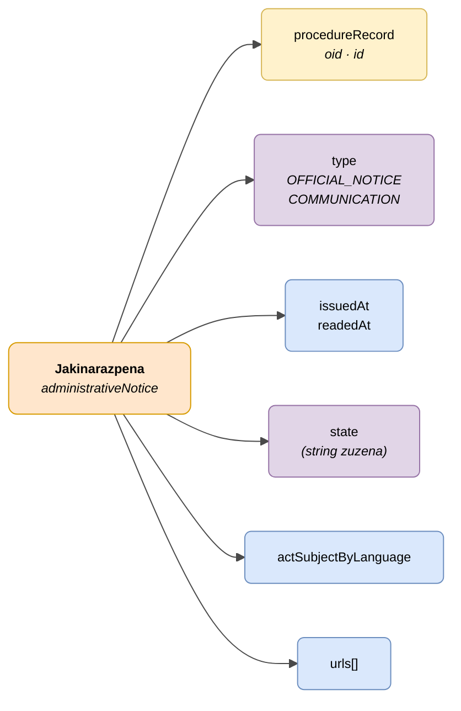

# :material-email-open: Jakinarazpena (Administrative Notice)

> - **Bertsioa:** `v{{ dena.version }}`
> - **Data:** {{ dena.date }}
> - **Testa:** [DN99DENATestMockObjFactoryForAdministrativeNotice.java]({{ repos.interop_test_blob }}/denaTestCommonDataClasses/src/main/java/dena/test/common/data/notification/DN99DENATestMockObjFactoryForAdministrativeNotice.java)
> - **Kodea:** [DN00AdministrativeNotice.java]({{ repos.common_data_api_blob }}/denaCommonDataAPIAdministrativeNoticeModelClasses/src/main/java/dena/api/data/model/administrativenotice/DN00AdministrativeNotice.java)

## Deskribapena

Herritarrei zuzendutako jakinarazpen ofizial edo administrazio-komunikazio bat adierazten du, espediente bati lotuta.

> Ikusi baita ere: [campos-comunes.md](./campos-comunes.md) heredatutako eremuetarako (`oid`, `id`, `urls`, `originAdmin`, `aboutPerson`)



| Kolorea | Esanahia |
|---------|----------|
| 🟠 Laranja | Objektu nagusia (Jakinarazpena) |
| 🟡 Horia | Beste objektu baten erreferentzia (Espedientea) |
| 🟣 Morea | Enumak / egoerak / motak |
| 🔵 Urdin argia | Datu-eremuak |

---

## 🔗 Iturburu-kodea

| Klasea | Biltegia |
|--------|----------|
| DN00AdministrativeNotice | [Ikusi kodea]({{ repos.common_data_api_blob }}/denaCommonDataAPIAdministrativeNoticeModelClasses/src/main/java/dena/api/data/model/administrativenotice/DN00AdministrativeNotice.java) |
| DN00AdministrativeNoticeStateCode | [Ikusi kodea]({{ repos.common_data_api_blob }}/denaCommonDataAPIAdministrativeNoticeModelClasses/src/main/java/dena/api/data/model/administrativenotice/DN00AdministrativeNoticeStateCode.java) |
| DN00AdministrativeNoticeType | [Ikusi kodea]({{ repos.common_data_api_blob }}/denaCommonDataAPIAdministrativeNoticeModelClasses/src/main/java/dena/api/data/model/administrativenotice/DN00AdministrativeNoticeType.java) |

---

## 🧪 Testak eta adibideak

| Testa | Biltegia |
|-------|----------|
| DN00NotificationTest | [Ikusi testa]({{ repos.interop_test_blob }}/denaTestCommonDataClasses/src/main/java/dena/test/common/data/notification/DN99DENATestMockObjFactoryForAdministrativeNotice.java) |
| DN00NotificationStatusTest | [Ikusi testa]({{ repos.interop_test_blob }}/denaTestCommonDataClasses/src/main/java/dena/test/common/data/notification/DN99DENATestMockObjFactoryForAdministrativeNoticeStateCode.java) |
| DN00NotificationTypeTest | [Ikusi testa]({{ repos.interop_test_blob }}/denaTestCommonDataClasses/src/main/java/dena/test/common/data/notification/DN99DENATestMockObjFactoryForAdministrativeNoticeType.java) |
| DN00NotificationIDTest | [Ikusi testa]({{ repos.interop_test_blob }}/denaTestCommonDataClasses/src/main/java/dena/test/common/data/notification/DN99DENATestMockObjFactoryForAdministrativeNotice.java) |

---

## JSON atributuak

| Eremua | Mota | Derrigorrez | Adibidea | Deskribapena |
|--------|------|:-----------:|----------|--------------|
| `type` | `String` (enum) | ✅ | `"OFFICIAL_NOTICE"` | Jakinarazpen mota: `OFFICIAL_NOTICE` edo `COMMUNICATION` (`DN00AdministrativeNoticeType` enum-a). Ez nahastu diskriminatzaile polimorfikoarekin |
| `oid` | `String` | ✅ | `"NOT-OID-001"` | Identifikatzaile tekniko bakarra |
| `id` | `String` | ✅ | `"NOT-2024-00456"` | Negozio-identifikatzailea |
| `procedureRecord` | `Object` | ✅ | `{"oid":"EXP-OID-001","id":"EXP-2024-00123"}` *(ikusi [`DN00AdmistrativeServiceProcedureRecord`]({{ repos.common_data_api_blob }}/denaCommonDataAPIAdministrativeServicesModelClasses/src/main/java/dena/api/data/model/administrativeservices/DN00AdmistrativeServiceProcedureRecord.java))* | Espedientearen erreferentzia |
| `issuedAt` | `String` (ISO 8601) | ✅ | `"2024-05-20T09:00:00Z"` | Igorpen-data |
| `readedAt` | `String` (ISO 8601) | ❌ | `"2024-05-21T10:30:00Z"` | Irakurketa-data (null irakurri ez bada) |
| `state` | `String` | ✅ | `"PENDING_TO_BE_READED_BY_DESTINATION"` | Uneko egoera (string zuzena, EZ objektua) |
| `actSubjectByLanguage` | `LanguageTexts` | ✅ | `{"SPANISH":"Resolución de ayuda"}` | Jakinarazitako egintzaren gaia |
| `urls` | `Array` | ❌ (gomendatua) | *(ikusi [campos-comunes.md](./campos-comunes.md) · [`DN00DENADataExchangedObjectBase`]({{ repos.common_data_api_blob }}/denaCommonDataAPIModelClasses/src/main/java/dena/api/data/model/DN00DENADataExchangedObjectBase.java))* | Sarbide-URLak |

> **Garrantzitsua:** Jakinarazpenetan, `state` eremua zuzenean **string** bat da egoera-kodearekin (adib. `"PENDING_TO_BE_READED_BY_DESTINATION"`), espediente eta erregistroetan ez bezala, non `state` `stateCode` eta `description`-rekin objektu bat den.

---

## Motak (`type`)

| Kodea | Deskribapena |
|-------|--------------|
| `OFFICIAL_NOTICE` | Jakinarazpen administratibo ofiziala |
| `COMMUNICATION` | Administrazio-komunikazioa |

> **Oharra:** `type` eremua (`OFFICIAL_NOTICE` / `COMMUNICATION` balioak) `administrativeNotice` **diskriminatzaile polimorfikotik** desberdina da. Diskriminatzaileak (`DN00AdministrativeNotice` klaseko `@MarshallType(as="administrativeNotice")`) payload-aren barruko objektu mota identifikatzen du eta finkoa da; `type` eremuak jakinarazpena objektu horren barruan sailkatzen du.

---

## Egoerak (`state`)

| Kodea | Deskribapena |
|-------|--------------|
| `PENDING_TO_BE_READED_BY_DESTINATION` | Irakurtzeko zain |
| `ACKNOWLEDGED_BY_DESTINATION` | Irakurrita eta onartuta |
| `REJECTED_BY_DESTINATION` | Ukatuta |
| `EXPIRED` | Iraungita |
| `CANCELLED_BY_ISSUER` | Igorlearen aldetik bertan behera utzita |
| `DELETED_BY_ISSUER` | Igorlearen aldetik ezabatuta |

---

## JSON adibidea

```json
{
  "type": "OFFICIAL_NOTICE",
  "oid": "NOT-OID-001",
  "id": "NOT-2024-00456",
  "procedureRecord": { "oid": "EXP-OID-001", "id": "EXP-2024-00123" },
  "issuedAt": "2024-05-20T09:00:00Z",
  "readedAt": null,
  "state": "PENDING_TO_BE_READED_BY_DESTINATION",
  "actSubjectByLanguage": {
    "SPANISH": "Resolución de concesión de ayuda",
    "BASQUE": "Laguntza emateko ebazpena"
  },
  "urls": [
    { "url": "https://sede.miadmin.eus/notificacion/NOT-2024-00456", "language": "SPANISH", "tags": ["default"] }
  ]
}
```

### Adibidea — Irakurritako jakinarazpena

```json
{
  "type": "COMMUNICATION",
  "oid": "NOT-OID-002",
  "id": "NOT-2024-00457",
  "procedureRecord": { "oid": "EXP-OID-001", "id": "EXP-2024-00123" },
  "issuedAt": "2024-05-15T08:00:00Z",
  "readedAt": "2024-05-16T10:30:00Z",
  "state": "ACKNOWLEDGED_BY_DESTINATION",
  "actSubjectByLanguage": {
    "SPANISH": "Comunicación de subsanación de documentación",
    "BASQUE": "Dokumentazioa zuzentzeko jakinarazpena"
  },
  "urls": [
    { "url": "https://sede.miadmin.eus/notificacion/NOT-2024-00457", "language": "SPANISH", "tags": ["default"] }
  ]
}
```

---

## Balioztatze-arauak

- `state` = `PENDING_TO_BE_READED_BY_DESTINATION` bada, `readedAt` `null` izan behar da.
- `state` = `ACKNOWLEDGED_BY_DESTINATION` edo `REJECTED_BY_DESTINATION` bada, `readedAt`-ek balio bat izan behar du.
- `issuedAt` `readedAt` baino lehenagokoa edo berdina izan behar da (existitzen bada).
- Ikusi [validaciones.md](../validaciones.md) arau osoentzat.


---

<!-- DENA-DOC-FOOTER -->
---
<sub>DENA Docs v{{ dena.version }} · {{ dena.date }}</sub>
