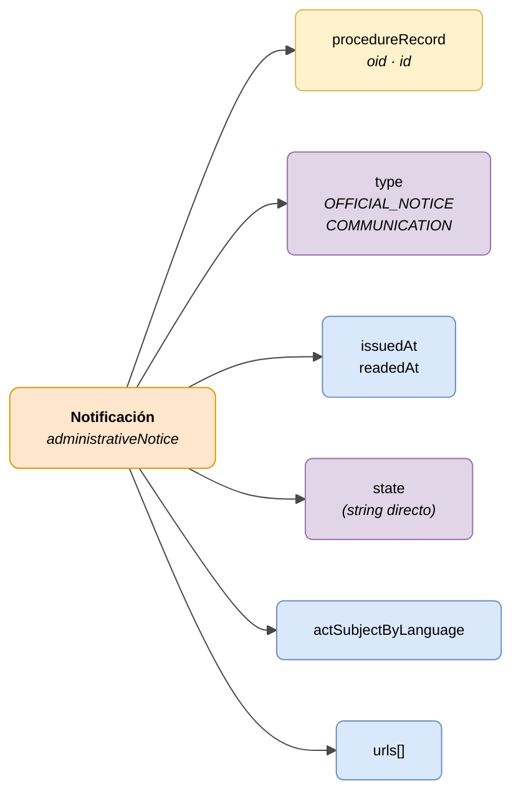

# Notificación (Administrative Notice)

> - **Versión:** `v0.3.25`
> - **Fecha:** 2026-06-10
> - **Test:** [DN99DENATestMockObjFactoryForAdministrativeNotice.java](https://github.com/DENA-Euskadi/dena-interop-common-data-test/blob/develop/denaTestCommonDataClasses/src/main/java/dena/test/common/data/notification/DN99DENATestMockObjFactoryForAdministrativeNotice.java)
> - **Código:** [DN00AdministrativeNotice.java](https://github.com/DENA-Euskadi/dena-common-data-api/blob/develop/denaCommonDataAPIAdministrativeNoticeModelClasses/src/main/java/dena/api/data/model/administrativenotice/DN00AdministrativeNotice.java)

## Descripción

Representa una notificación oficial o comunicación administrativa emitida hacia una persona ciudadana, vinculada a un expediente.

> Ver también: [campos-comunes.md](./campos-comunes.md) para campos heredados (`oid`, `id`, `urls`, `originAdminRef`, `aboutPersonRef`)



| Color | Significado |
|-------|-------------|
| 🟠 Naranja | Objeto principal (Notificación) |
| 🟡 Amarillo | Referencia a otro objeto (Expediente) |
| 🟣 Violeta | Enums / estados / tipos |
| 🔵 Azul claro | Campos de datos |

---

## Atributos JSON

| Campo | Tipo | Obligatorio | Descripción |
|-------|------|:-----------:|-------------|
| `type` | `String` | ✅ | Tipo de notificación: `"OFFICIAL_NOTICE"` o `"COMMUNICATION"`. Además, el discriminador polimórfico del objeto es `"administrativeNotice"` |
| `oid` | `String` | ✅ | Identificador técnico único |
| `id` | `String` | ✅ | Identificador de negocio |
| `procedureRecord` | `Object` | ✅ | Referencia al expediente (`oid`, `id`) |
| `issuedAt` | `String` (ISO 8601) | ✅ | Fecha de emisión |
| `readedAt` | `String` (ISO 8601) | ❌ | Fecha de lectura (null si no leída) |
| `state` | `String` | ✅ | Estado actual (directamente el código, NO un objeto) |
| `actSubjectByLanguage` | `LanguageTexts` | ✅ | Asunto del acto notificado |
| `urls` | `Array` | ❌ (recomendado) | URLs de acceso |

> **Importante:** En notificaciones, el campo `state` es directamente un **string** con el código de estado (ej: `"PENDING_TO_BE_READED_BY_DESTINATION"`), a diferencia de expedientes y registros donde `state` es un objeto con `stateCode` y `description`.

---

## Tipos (`type`)

| Código | Descripción |
|--------|-------------|
| `OFFICIAL_NOTICE` | Notificación administrativa oficial |
| `COMMUNICATION` | Comunicación administrativa |

---

## Estados (`state`)

| Código | Descripción |
|--------|-------------|
| `PENDING_TO_BE_READED_BY_DESTINATION` | Pendiente de lectura |
| `ACKNOWLEDGED_BY_DESTINATION` | Leída y aceptada |
| `REJECTED_BY_DESTINATION` | Rechazada |
| `EXPIRED` | Expirada |
| `CANCELLED_BY_ISSUER` | Cancelada por el emisor |
| `DELETED_BY_ISSUER` | Eliminada por el emisor |

---

## Ejemplo JSON

```json
{
  "type": "OFFICIAL_NOTICE",
  "oid": "NOT-OID-001",
  "id": "NOT-2024-00456",
  "procedureRecord": { "oid": "EXP-OID-001", "id": "EXP-2024-00123" },
  "issuedAt": "2024-05-20T09:00:00Z",
  "readedAt": null,
  "state": "PENDING_TO_BE_READED_BY_DESTINATION",
  "actSubjectByLanguage": {
    "SPANISH": "Resolución de concesión de ayuda",
    "BASQUE": "Laguntza emateko ebazpena"
  },
  "urls": [
    { "url": "https://sede.miadmin.eus/notificacion/NOT-2024-00456", "language": "SPANISH", "tags": ["default"] }
  ]
}
```

### Ejemplo — Notificación leída

```json
{
  "type": "COMMUNICATION",
  "oid": "NOT-OID-002",
  "id": "NOT-2024-00457",
  "procedureRecord": { "oid": "EXP-OID-001", "id": "EXP-2024-00123" },
  "issuedAt": "2024-05-15T08:00:00Z",
  "readedAt": "2024-05-16T10:30:00Z",
  "state": "ACKNOWLEDGED_BY_DESTINATION",
  "actSubjectByLanguage": {
    "SPANISH": "Comunicación de subsanación de documentación",
    "BASQUE": "Dokumentazioa zuzentzeko jakinarazpena"
  },
  "urls": [
    { "url": "https://sede.miadmin.eus/notificacion/NOT-2024-00457", "language": "SPANISH", "tags": ["default"] }
  ]
}
```

---

## Reglas de validación

- Si `state` = `PENDING_TO_BE_READED_BY_DESTINATION`, entonces `readedAt` debe ser `null`.
- Si `state` = `ACKNOWLEDGED_BY_DESTINATION` o `REJECTED_BY_DESTINATION`, entonces `readedAt` debe tener valor.
- `issuedAt` debe ser anterior o igual a `readedAt` (si existe).
- Ver [validaciones.md](../validaciones.md) para reglas completas.


---

## 🔗 Código fuente

| Clase | Repositorio |
|-------|-------------|
| DN00AdministrativeNotice | [Ver código](https://github.com/DENA-Euskadi/dena-common-data-api/blob/develop/denaCommonDataAPIAdministrativeNoticeModelClasses/src/main/java/dena/api/data/model/administrativenotice/DN00AdministrativeNotice.java) |
| DN00AdministrativeNoticeStateCode | [Ver código](https://github.com/DENA-Euskadi/dena-common-data-api/blob/develop/denaCommonDataAPIAdministrativeNoticeModelClasses/src/main/java/dena/api/data/model/administrativenotice/DN00AdministrativeNoticeStateCode.java) |
| DN00AdministrativeNoticeType | [Ver código](https://github.com/DENA-Euskadi/dena-common-data-api/blob/develop/denaCommonDataAPIAdministrativeNoticeModelClasses/src/main/java/dena/api/data/model/administrativenotice/DN00AdministrativeNoticeType.java) |


---

## 🧪 Tests y ejemplos

| Test | Repositorio |
|------|-------------|
| DN00NotificationTest | [Ver test](https://github.com/DENA-Euskadi/dena-interop-common-data-test/blob/develop/denaTestCommonDataClasses/src/main/java/dena/test/common/data/notification/DN99DENATestMockObjFactoryForAdministrativeNotice.java) |
| DN00NotificationStatusTest | [Ver test](https://github.com/DENA-Euskadi/dena-interop-common-data-test/blob/develop/denaTestCommonDataClasses/src/main/java/dena/test/common/data/notification/DN99DENATestMockObjFactoryForAdministrativeNoticeStateCode.java) |
| DN00NotificationTypeTest | [Ver test](https://github.com/DENA-Euskadi/dena-interop-common-data-test/blob/develop/denaTestCommonDataClasses/src/main/java/dena/test/common/data/notification/DN99DENATestMockObjFactoryForAdministrativeNoticeType.java) |
| DN00NotificationIDTest | [Ver test](https://github.com/DENA-Euskadi/dena-interop-common-data-test/blob/develop/denaTestCommonDataClasses/src/main/java/dena/test/common/data/notification/DN99DENATestMockObjFactoryForAdministrativeNotice.java) |


<!-- DENA-DOC-FOOTER -->
---
<sub>DENA Docs v0.3.25 · 2026-06-10</sub>
