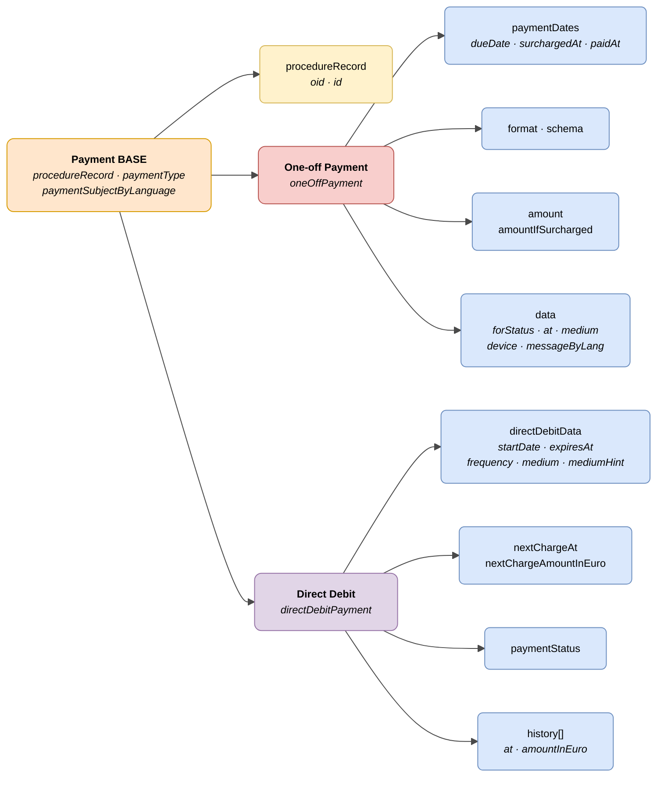

# :material-credit-card: Payment

> - **Version:** `v{{ dena.version }}`
> - **Date:** {{ dena.date }}
> - **Test:** [DN99DENATestMockObjFactoryForOneOffPayment.java]({{ repos.interop_test_blob }}/denaTestCommonDataClasses/src/main/java/dena/test/common/data/payment/DN99DENATestMockObjFactoryForOneOffPayment.java)
> - **Code:**
>   - [DN00OneOffPayment.java]({{ repos.common_data_api_blob }}/denaCommonDataAPIPaymentModelClasses/src/main/java/dena/api/data/model/payments/oneoff/DN00OneOffPayment.java)
>   - [DN00DirectDebitPayment.java]({{ repos.common_data_api_blob }}/denaCommonDataAPIPaymentModelClasses/src/main/java/dena/api/data/model/payments/directdebit/DN00DirectDebitPayment.java)

## Description

Represents a payment obligation associated with a record. Two modalities:

- **One-off payment** (`oneOffPayment`) — One-time settlement (fee, public price, penalty)
- **Direct debit** (`directDebitPayment`) — Recurring periodic charge

> See also: [campos-comunes.md](./campos-comunes.md) for inherited fields (`oid`, `id`, `urls`, `originAdmin`, `aboutPerson`)



| Colour | Meaning |
|-------|-------------|
| 🟠 Orange | Common base object (Payment BASE) |
| 🟡 Yellow | Reference to another object (Record) |
| 🔴 Light red | Subtype: One-off Payment |
| 🟣 Purple | Subtype: Direct Debit |
| 🔵 Light blue | Data fields |

---

## 🔗 Source code

| Class | Repository |
|-------|-------------|
| DN00PaymentDataExchangedBase | [View code]({{ repos.common_data_api_blob }}/denaCommonDataAPIPaymentModelClasses/src/main/java/dena/api/data/model/payments/DN00PaymentDataExchangedBase.java) |
| DN00OneOffPayment | [View code]({{ repos.common_data_api_blob }}/denaCommonDataAPIPaymentModelClasses/src/main/java/dena/api/data/model/payments/oneoff/DN00OneOffPayment.java) |
| DN00OneOffPaymentData | [View code]({{ repos.common_data_api_blob }}/denaCommonDataAPIPaymentModelClasses/src/main/java/dena/api/data/model/payments/oneoff/DN00OneOffPaymentData.java) |
| DN00OneOffPaymentSchemaFormat | [View code]({{ repos.common_data_api_blob }}/denaCommonDataAPIPaymentModelClasses/src/main/java/dena/api/data/model/payments/oneoff/DN00OneOffPaymentSchemaFormat.java) |
| DN00DirectDebitPayment | [View code]({{ repos.common_data_api_blob }}/denaCommonDataAPIPaymentModelClasses/src/main/java/dena/api/data/model/payments/directdebit/DN00DirectDebitPayment.java) |
| DN00DirectDebitData | [View code]({{ repos.common_data_api_blob }}/denaCommonDataAPIPaymentModelClasses/src/main/java/dena/api/data/model/payments/directdebit/DN00DirectDebitData.java) |
| DN00DirectDebitPaymentHistoryItem | [View code]({{ repos.common_data_api_blob }}/denaCommonDataAPIPaymentModelClasses/src/main/java/dena/api/data/model/payments/directdebit/DN00DirectDebitPaymentHistoryItem.java) |
| DN00PaymentDates | [View code]({{ repos.common_data_api_blob }}/denaCommonDataAPIPaymentModelClasses/src/main/java/dena/api/data/model/payments/DN00PaymentDates.java) |
| DN00PaymentStateCode | [View code]({{ repos.common_data_api_blob }}/denaCommonDataAPIPaymentModelClasses/src/main/java/dena/api/data/model/payments/DN00PaymentStateCode.java) |
| DN00PaymentMedium | [View code]({{ repos.common_data_api_blob }}/denaCommonDataAPIPaymentModelClasses/src/main/java/dena/api/data/model/payments/DN00PaymentMedium.java) |
| DN00PaymentDevice | [View code]({{ repos.common_data_api_blob }}/denaCommonDataAPIPaymentModelClasses/src/main/java/dena/api/data/model/payments/DN00PaymentDevice.java) |
| DN00PaymentType | [View code]({{ repos.common_data_api_blob }}/denaCommonDataAPIPaymentModelClasses/src/main/java/dena/api/data/model/payments/DN00PaymentType.java) |

---

## 🧪 Tests and examples

| Test | Repository |
|------|-------------|
| DN00PayOffPaymentTest | [View test]({{ repos.interop_test_blob }}/denaTestCommonDataClasses/src/main/java/dena/test/common/data/payment/DN99DENATestMockObjFactoryForOneOffPayment.java) |
| DN00DirectDebitPaymentsTest | [View test]({{ repos.interop_test_blob }}/denaTestCommonDataClasses/src/main/java/dena/test/common/data/payment/DN99DENATestMockObjFactoryForDirectDebitPayment.java) |
| DN00PaymentDatesTest | [View test]({{ repos.interop_test_blob }}/denaTestCommonDataClasses/src/main/java/dena/test/common/data/payment/DN99DENATestMockObjFactoryForPaymentDates.java) |
| DN00PaymentStatusTest | [View test]({{ repos.interop_test_blob }}/denaTestCommonDataClasses/src/main/java/dena/test/common/data/payment/DN99DENATestMockObjFactoryForPaymentStateCode.java) |
| DN00PaymentStatusDataWhenCompletedTest | [View test]({{ repos.interop_test_blob }}/denaTestCommonDataClasses/src/main/java/dena/test/common/data/payment/DN99DENATestMockObjFactoryForOneOffPaymentData.java) |
| DN00PaymentStatusDataWhenRejectedTest | [View test]({{ repos.interop_test_blob }}/denaTestCommonDataClasses/src/main/java/dena/test/common/data/payment/DN99DENATestMockObjFactoryForOneOffPaymentData.java) |
| DN00PaymentStatusDataWhenCancelledTest | [View test]({{ repos.interop_test_blob }}/denaTestCommonDataClasses/src/main/java/dena/test/common/data/payment/DN99DENATestMockObjFactoryForOneOffPaymentData.java) |
| DN00PaymentStatusDataWhenErrorTest | [View test]({{ repos.interop_test_blob }}/denaTestCommonDataClasses/src/main/java/dena/test/common/data/payment/DN99DENATestMockObjFactoryForOneOffPaymentData.java) |
| DN00OneOffPaymentSchemaTest | [View test]({{ repos.interop_test_blob }}/denaTestCommonDataClasses/src/main/java/dena/test/common/data/payment/DN99DENATestMockObjFactoryForOneOffPaymentSchemaFormat.java) |
| DN00PaymentIDTest | [View test]({{ repos.interop_test_blob }}/denaTestCommonDataClasses/src/main/java/dena/test/common/data/payment/DN99DENATestMockObjFactoryForPaymentDataExchangedBase.java) |

---

## Common attributes


| Field | Type | Mandatory | Example | Description |
|-------|------|:-----------:|---------|-------------|
| `type` | `String` | ✅ | `"oneOffPayment"` | `"oneOffPayment"` or `"directDebitPayment"` |
| `oid` | `String` | ✅ | `"PAY-OID-001"` | Unique technical identifier |
| `id` | `String` | ✅ | `"PAY-2024-00321"` | Business identifier |
| `procedureRecord` | `Object` | ✅ | `{"oid":"EXP-OID-001","id":"EXP-2024-00123"}` *(see [`DN00AdmistrativeServiceProcedureRecord`]({{ repos.common_data_api_blob }}/denaCommonDataAPIAdministrativeServicesModelClasses/src/main/java/dena/api/data/model/administrativeservices/DN00AdmistrativeServiceProcedureRecord.java))* | Reference to the record |
| `paymentType` | `String` | ✅ | `"ONE_OFF_PAYMENT"` | `ONE_OFF_PAYMENT` or `DIRECT_DEBIT` |
| `paymentSubjectByLanguage` | `LanguageTexts` | ✅ | `{"SPANISH":"Tasa licencia"}` | Payment concept |
| `participatingOrgUnits` | `Array` | ❌ | *(see [unidad-organica.md](./unidad-organica.md) · [`DN00OrgUnitReferenceWithRole`]({{ repos.common_data_api_blob }}/denaCommonDataAPIModelClasses/src/main/java/dena/api/data/model/org/DN00OrgUnitReferenceWithRole.java))* | Participating organizational units |
| `urls` | `Array` | ❌ | *(see [campos-comunes.md](./campos-comunes.md) · [`DN00DENADataExchangedObjectBase`]({{ repos.common_data_api_blob }}/denaCommonDataAPIModelClasses/src/main/java/dena/api/data/model/DN00DENADataExchangedObjectBase.java))* | Payment and receipt URLs |

---

## One-off payment — Specific attributes

| Field | Type | Mandatory | Example | Description |
|-------|------|:-----------:|---------|-------------|
| `format` | `String` | ❌ | `"502"` | Payment format (501, 502, 503, 507, 508, 514, 515, 521, 522, 523, 524, 525, 528, 529) |
| `schema` | `Object` | ❌ | *(see [`DN00IsOneOffPaymentSchema`]({{ repos.common_data_api_blob }}/denaCommonDataAPIPaymentModelClasses/src/main/java/dena/api/data/model/payments/oneoff/schemas/DN00IsOneOffPaymentSchema.java))* | Payment format schema (format-specific internal structure) |
| `paymentDates.dueDate` | `String` (date) | ✅ | `"2024-06-30"` | Due date |
| `paymentDates.surchargedAt` | `String` (date) | ❌ | `"2024-07-15"` | Start of surcharge period |
| `paymentDates.paidAt` | `String` (date) | ❌ | `"2024-05-28"` | Effective payment date (mandatory if `forStatus = COMPLETED`) |
| `amount` | `Money` | ✅ | `{"amount":45.50,"currency":"EUR"}` | Payment amount |
| `amountIfSurcharged` | `Money` | ❌ | `{"amount":50.05,"currency":"EUR"}` | Amount with surcharge |
| `data.forStatus` | `String` | ✅ | `"PENDING"` | Payment status |
| `data.at` | `String` (ISO 8601) | ❌ | `"2024-05-28T11:23:45Z"` | Date/time when the payment action was performed |
| `data.medium` | `String` | ❌ | `"PAYMENT_CARD"` | Payment medium used |
| `data.device` | `String` | ❌ | `"WEB_BROWSER"` | Device used |
| `data.paymentProcessorId` | `String` | ❌ | `"BANKIA"` | Processing entity |
| `data.paymentProcessorTransactionId` | `String` | ❌ | `"TXN-2024-ABC123"` | Transaction ID |
| `data.messageByLang` | `LanguageTexts` | ❌ | `{"SPANISH":"Pago rechazado"}` | Informational message (e.g.: rejection reason) |

### `Money` type

The `Money` type is an object with the following structure:

```json
{ "amount": 45.50, "currency": "EUR" }
```

| Field | Type | Description |
|-------|------|-------------|
| `amount` | `Number` | Numeric amount |
| `currency` | `String` | ISO 4217 currency code (default `"EUR"`) |

## Direct debit — Specific attributes

| Field | Type | Mandatory | Example | Description |
|-------|------|:-----------:|---------|-------------|
| `directDebitData.startDate` | `String` (date) | ✅ | `"2024-01-15"` | Direct debit registration date |
| `directDebitData.expiresAt` | `String` (date) | ❌ | `null` | Expiration date (null = valid indefinitely) |
| `directDebitData.frequency` | `String` | ✅ | `"MONTHLY"` | Frequency (see [frequencies](#frequencies-directdebitdatafrequency)) |
| `directDebitData.medium` | `String` | ❌ | `"DIRECT_DEBIT"` | Payment medium |
| `directDebitData.mediumHint` | `String` | ❌ | `"2100 ***** 051332"` | Medium hint (e.g.: last digits of account) |
| `nextChargeAt` | `String` (date) | ❌ | `"2024-07-01"` | Next charge date |
| `nextChargeAmountInEuro` | `Number` | ❌ | `120.00` | Next charge amount |
| `paymentStatus` | `String` | ❌ | `"ACTIVE"` | Direct debit status |
| `history` | `Array` | ❌ | `[{"at":"2024-06-01","amountInEuro":120.00}]` | History of charges made |

### Direct debit statuses (`paymentStatus`)

| Code | Description |
|--------|-------------|
| `ACTIVE` | Active direct debit |
| `CANCELED` | Cancelled direct debit |
| `EXPIRED` | Expired direct debit |

### Frequencies (`directDebitData.frequency`)

| Code | Description |
|--------|-------------|
| `WEEKLY` | Weekly |
| `BIWEEKLY` | Biweekly |
| `MONTHLY` | Monthly |
| `BIMONTHLY` | Bimonthly |
| `QUARTERLY` | Quarterly |
| `BIANNUAL` | Biannual |
| `ANNUAL` | Annual |

### Charge history (`history[]`)

Each element in the `history` array has the following structure:

| Field | Type | Description |
|-------|------|-------------|
| `at` | `String` (date) | Charge date |
| `amountInEuro` | `Number` | Charge amount in euros |

```json
{
  "history": [
    { "at": "2024-06-01", "amountInEuro": 120.00 },
    { "at": "2024-05-01", "amountInEuro": 120.00 },
    { "at": "2024-04-01", "amountInEuro": 115.00 }
  ]
}
```

---

## Payment statuses (`data.forStatus`)

| Code | Description |
|--------|-------------|
| `COMPLETED` | Completed |
| `PENDING` | Pending |
| `REJECTED_BY_PAYMENT_PROCESSOR` | Rejected by the entity |
| `CANCELLED_BY_ISSUER` | Cancelled by the issuer |
| `ERROR_WHEN_PROCESSING_PAYMENT` | Processing error |

## Payment mediums (`data.medium` / `directDebitData.medium`)

| Code | Description |
|--------|-------------|
| `PAYMENT_CARD` | Credit/debit card |
| `ACCOUNT_TRANSFER` | Bank transfer |
| `BIZUM` | Bizum |
| `CASH` | Cash |
| `DIRECT_DEBIT` | Direct debit |

## Devices (`data.device`)

| Code | Description |
|--------|-------------|
| `WEB_BROWSER` | Web browser |
| `MOBILE_APP` | Mobile application |
| `IN_PERSON_FINANCIAL_ENTITY` | In person at financial entity |
| `IN_PERSON_OTHER` | In person at other location |
| `ATM` | ATM |

---

## Example — One-off payment

```json
{
  "type": "oneOffPayment",
  "oid": "PAY-OID-001",
  "id": "PAY-2024-00321",
  "procedureRecord": { "oid": "EXP-OID-001", "id": "EXP-2024-00123" },
  "paymentType": "ONE_OFF_PAYMENT",
  "paymentSubjectByLanguage": { "SPANISH": "Tasa por licencia de actividad", "BASQUE": "Jarduera-lizentziaren tasa" },
  "paymentDates": { "dueDate": "2024-06-30", "surchargedAt": "2024-07-15", "paidAt": null },
  "format": "502",
  "amount": { "amount": 45.50, "currency": "EUR" },
  "amountIfSurcharged": { "amount": 50.05, "currency": "EUR" },
  "data": {
    "forStatus": "PENDING",
    "at": null,
    "medium": null,
    "device": null,
    "messageByLang": null
  },
  "urls": [
    { "url": "https://pago.miadmin.eus/pay/PAY-2024-00321", "language": "SPANISH", "tags": ["payment"] }
  ]
}
```

### Example — Completed payment

```json
{
  "type": "oneOffPayment",
  "oid": "PAY-OID-002",
  "id": "PAY-2024-00322",
  "procedureRecord": { "oid": "EXP-OID-001", "id": "EXP-2024-00123" },
  "paymentType": "ONE_OFF_PAYMENT",
  "paymentSubjectByLanguage": { "SPANISH": "Tasa por licencia de obras", "BASQUE": "Obra-lizentziaren tasa" },
  "paymentDates": { "dueDate": "2024-05-30", "surchargedAt": "2024-06-15", "paidAt": "2024-05-28" },
  "format": "502",
  "amount": { "amount": 120.00, "currency": "EUR" },
  "amountIfSurcharged": { "amount": 132.00, "currency": "EUR" },
  "data": {
    "forStatus": "COMPLETED",
    "at": "2024-05-28T11:23:45Z",
    "medium": "PAYMENT_CARD",
    "device": "WEB_BROWSER",
    "paymentProcessorId": "BANKIA",
    "paymentProcessorTransactionId": "TXN-2024-ABC123"
  },
  "urls": [
    { "url": "https://pago.miadmin.eus/pay/PAY-2024-00322", "language": "SPANISH", "tags": ["payment"] },
    { "url": "https://pago.miadmin.eus/receipt/PAY-2024-00322", "language": "SPANISH", "tags": ["payment-receipt"] }
  ]
}
```

## Example — Direct debit

```json
{
  "type": "directDebitPayment",
  "oid": "DD-OID-001",
  "id": "DD-2024-00100",
  "procedureRecord": { "oid": "EXP-OID-001", "id": "EXP-2024-00123" },
  "paymentType": "DIRECT_DEBIT",
  "paymentSubjectByLanguage": { "SPANISH": "Cuota mensual guardería", "BASQUE": "Haur-eskolako hileko kuota" },
  "directDebitData": {
    "startDate": "2024-01-15",
    "expiresAt": null,
    "frequency": "MONTHLY",
    "medium": "DIRECT_DEBIT",
    "mediumHint": "2100 ***** 051332"
  },
  "nextChargeAt": "2024-07-01",
  "nextChargeAmountInEuro": 120.00,
  "paymentStatus": "ACTIVE",
  "history": [
    { "at": "2024-06-01", "amountInEuro": 120.00 },
    { "at": "2024-05-01", "amountInEuro": 120.00 }
  ]
}
```

---

## Important notes

- The `directDebitData.startDate` field indicates when the direct debit was registered (in JSON it is serialized as `"startDate"`, not as `"setAt"`).
- The `data.at` field in one-off payments indicates the exact moment when the payment was processed (only relevant when `forStatus` ≠ `PENDING`).
- The `data.messageByLang` field allows including a multilingual explanatory message, useful for error or rejection statuses.
- Appointments (`scheduleItem`) are NOT related to payments. Payments always depend on a record (`procedureRecord`).


---

<!-- DENA-DOC-FOOTER -->
---
<sub>DENA Docs v{{ dena.version }} · {{ dena.date }}</sub>
