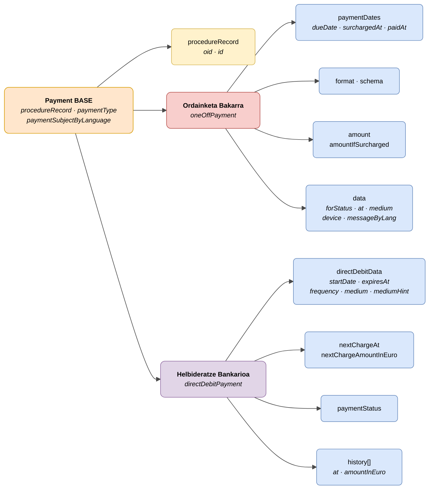

# :material-credit-card: Ordainketa (Payment)

> - **Bertsioa:** `v{{ dena.version }}`
> - **Data:** {{ dena.date }}
> - **Testa:** [DN99DENATestMockObjFactoryForOneOffPayment.java]({{ repos.interop_test_blob }}/denaTestCommonDataClasses/src/main/java/dena/test/common/data/payment/DN99DENATestMockObjFactoryForOneOffPayment.java)
> - **Kodea:**
>   - [DN00OneOffPayment.java]({{ repos.common_data_api_blob }}/denaCommonDataAPIPaymentModelClasses/src/main/java/dena/api/data/model/payments/oneoff/DN00OneOffPayment.java)
>   - [DN00DirectDebitPayment.java]({{ repos.common_data_api_blob }}/denaCommonDataAPIPaymentModelClasses/src/main/java/dena/api/data/model/payments/directdebit/DN00DirectDebitPayment.java)

## Deskribapena

Espediente bati lotutako ordainketa-betebehar bat adierazten du. Bi modalitate:

- **Ordainketa bakarra** (`oneOffPayment`) — Likidazio puntuala (tasa, prezio publikoa, zehapena)
- **Helbideratze bankarioa** (`directDebitPayment`) — Aldizkako kargu errepikakorra

> Ikusi ere: [campos-comunes.md](./campos-comunes.md) heredatutako eremuetarako (`oid`, `id`, `urls`, `originAdminRef`, `aboutPersonRef`)



| Kolorea | Esanahia |
|-------|-------------|
| 🟠 Laranja | Oinarrizko objektu komuna (Payment BASE) |
| 🟡 Horia | Beste objektu baterako erreferentzia (Espedientea) |
| 🔴 Gorri argia | Azpimota: Ordainketa Bakarra |
| 🟣 Morea | Azpimota: Helbideratze Bankarioa |
| 🔵 Urdin argia | Datu-eremuak |

---

## 🔗 Iturburu-kodea

| Klasea | Biltegia |
|-------|-------------|
| DN00PaymentDataExchangedBase | [Ikusi kodea]({{ repos.common_data_api_blob }}/denaCommonDataAPIPaymentModelClasses/src/main/java/dena/api/data/model/payments/DN00PaymentDataExchangedBase.java) |
| DN00OneOffPayment | [Ikusi kodea]({{ repos.common_data_api_blob }}/denaCommonDataAPIPaymentModelClasses/src/main/java/dena/api/data/model/payments/oneoff/DN00OneOffPayment.java) |
| DN00OneOffPaymentData | [Ikusi kodea]({{ repos.common_data_api_blob }}/denaCommonDataAPIPaymentModelClasses/src/main/java/dena/api/data/model/payments/oneoff/DN00OneOffPaymentData.java) |
| DN00OneOffPaymentSchemaFormat | [Ikusi kodea]({{ repos.common_data_api_blob }}/denaCommonDataAPIPaymentModelClasses/src/main/java/dena/api/data/model/payments/oneoff/DN00OneOffPaymentSchemaFormat.java) |
| DN00DirectDebitPayment | [Ikusi kodea]({{ repos.common_data_api_blob }}/denaCommonDataAPIPaymentModelClasses/src/main/java/dena/api/data/model/payments/directdebit/DN00DirectDebitPayment.java) |
| DN00DirectDebitData | [Ikusi kodea]({{ repos.common_data_api_blob }}/denaCommonDataAPIPaymentModelClasses/src/main/java/dena/api/data/model/payments/directdebit/DN00DirectDebitData.java) |
| DN00DirectDebitPaymentHistoryItem | [Ikusi kodea]({{ repos.common_data_api_blob }}/denaCommonDataAPIPaymentModelClasses/src/main/java/dena/api/data/model/payments/directdebit/DN00DirectDebitPaymentHistoryItem.java) |
| DN00PaymentDates | [Ikusi kodea]({{ repos.common_data_api_blob }}/denaCommonDataAPIPaymentModelClasses/src/main/java/dena/api/data/model/payments/DN00PaymentDates.java) |
| DN00PaymentStateCode | [Ikusi kodea]({{ repos.common_data_api_blob }}/denaCommonDataAPIPaymentModelClasses/src/main/java/dena/api/data/model/payments/DN00PaymentStateCode.java) |
| DN00PaymentMedium | [Ikusi kodea]({{ repos.common_data_api_blob }}/denaCommonDataAPIPaymentModelClasses/src/main/java/dena/api/data/model/payments/DN00PaymentMedium.java) |
| DN00PaymentDevice | [Ikusi kodea]({{ repos.common_data_api_blob }}/denaCommonDataAPIPaymentModelClasses/src/main/java/dena/api/data/model/payments/DN00PaymentDevice.java) |
| DN00PaymentType | [Ikusi kodea]({{ repos.common_data_api_blob }}/denaCommonDataAPIPaymentModelClasses/src/main/java/dena/api/data/model/payments/DN00PaymentType.java) |

---

## 🧪 Testak eta adibideak

| Testa | Biltegia |
|------|-------------|
| DN00PayOffPaymentTest | [Ikusi testa]({{ repos.interop_test_blob }}/denaTestCommonDataClasses/src/main/java/dena/test/common/data/payment/DN99DENATestMockObjFactoryForOneOffPayment.java) |
| DN00DirectDebitPaymentsTest | [Ikusi testa]({{ repos.interop_test_blob }}/denaTestCommonDataClasses/src/main/java/dena/test/common/data/payment/DN99DENATestMockObjFactoryForDirectDebitPayment.java) |
| DN00PaymentDatesTest | [Ikusi testa]({{ repos.interop_test_blob }}/denaTestCommonDataClasses/src/main/java/dena/test/common/data/payment/DN99DENATestMockObjFactoryForPaymentDates.java) |
| DN00PaymentStatusTest | [Ikusi testa]({{ repos.interop_test_blob }}/denaTestCommonDataClasses/src/main/java/dena/test/common/data/payment/DN99DENATestMockObjFactoryForPaymentStateCode.java) |
| DN00PaymentStatusDataWhenCompletedTest | [Ikusi testa]({{ repos.interop_test_blob }}/denaTestCommonDataClasses/src/main/java/dena/test/common/data/payment/DN99DENATestMockObjFactoryForOneOffPaymentData.java) |
| DN00PaymentStatusDataWhenRejectedTest | [Ikusi testa]({{ repos.interop_test_blob }}/denaTestCommonDataClasses/src/main/java/dena/test/common/data/payment/DN99DENATestMockObjFactoryForOneOffPaymentData.java) |
| DN00PaymentStatusDataWhenCancelledTest | [Ikusi testa]({{ repos.interop_test_blob }}/denaTestCommonDataClasses/src/main/java/dena/test/common/data/payment/DN99DENATestMockObjFactoryForOneOffPaymentData.java) |
| DN00PaymentStatusDataWhenErrorTest | [Ikusi testa]({{ repos.interop_test_blob }}/denaTestCommonDataClasses/src/main/java/dena/test/common/data/payment/DN99DENATestMockObjFactoryForOneOffPaymentData.java) |
| DN00OneOffPaymentSchemaTest | [Ikusi testa]({{ repos.interop_test_blob }}/denaTestCommonDataClasses/src/main/java/dena/test/common/data/payment/DN99DENATestMockObjFactoryForOneOffPaymentSchemaFormat.java) |
| DN00PaymentIDTest | [Ikusi testa]({{ repos.interop_test_blob }}/denaTestCommonDataClasses/src/main/java/dena/test/common/data/payment/DN99DENATestMockObjFactoryForPaymentDataExchangedBase.java) |

---

## Atributu komunak


| Eremua | Mota | Nahitaezkoa | Adibidea | Deskribapena |
|-------|------|:-----------:|---------|-------------|
| `type` | `String` | ✅ | `"oneOffPayment"` | `"oneOffPayment"` edo `"directDebitPayment"` |
| `oid` | `String` | ✅ | `"PAY-OID-001"` | Identifikatzaile tekniko bakarra |
| `id` | `String` | ✅ | `"PAY-2024-00321"` | Negozio-identifikatzailea |
| `procedureRecord` | `Object` | ✅ | `{"oid":"EXP-OID-001","id":"EXP-2024-00123"}` *(ikusi [`DN00AdmistrativeServiceProcedureRecord`]({{ repos.common_data_api_blob }}/denaCommonDataAPIAdministrativeServicesModelClasses/src/main/java/dena/api/data/model/administrativeservices/DN00AdmistrativeServiceProcedureRecord.java))* | Espedientearen erreferentzia |
| `paymentType` | `String` | ✅ | `"ONE_OFF_PAYMENT"` | `ONE_OFF_PAYMENT` edo `DIRECT_DEBIT` |
| `paymentSubjectByLanguage` | `LanguageTexts` | ✅ | `{"SPANISH":"Tasa licencia"}` | Ordainketaren kontzeptua |
| `participatingOrgUnits` | `Array` | ❌ | *(ikusi [unidad-organica.md](./unidad-organica.md) · [`DN00OrgUnitReferenceWithRole`]({{ repos.common_data_api_blob }}/denaCommonDataAPIModelClasses/src/main/java/dena/api/data/model/org/DN00OrgUnitReferenceWithRole.java))* | Parte hartzen duten unitate organikoak |
| `urls` | `Array` | ❌ | *(ikusi [campos-comunes.md](./campos-comunes.md) · [`DN00DENADataExchangedObjectBase`]({{ repos.common_data_api_blob }}/denaCommonDataAPIModelClasses/src/main/java/dena/api/data/model/DN00DENADataExchangedObjectBase.java))* | Ordainketa eta ordainagiri URLak |

---

## Ordainketa bakarra — Atributu espezifikoak

| Eremua | Mota | Nahitaezkoa | Adibidea | Deskribapena |
|-------|------|:-----------:|---------|-------------|
| `format` | `String` | ❌ | `"502"` | Ordainketa-formatua (501, 502, 503, 507, 508, 514, 515, 521, 522, 523, 524, 525, 528, 529) |
| `schema` | `Object` | ❌ | *(ikusi [`DN00IsOneOffPaymentSchema`]({{ repos.common_data_api_blob }}/denaCommonDataAPIPaymentModelClasses/src/main/java/dena/api/data/model/payments/oneoff/schemas/DN00IsOneOffPaymentSchema.java))* | Ordainketa-formatuaren eskema (formatuaren barne-egitura espezifikoa) |
| `paymentDates.dueDate` | `String` (date) | ✅ | `"2024-06-30"` | Iraungitze-data |
| `paymentDates.surchargedAt` | `String` (date) | ❌ | `"2024-07-15"` | Errekargu-aldiaren hasiera |
| `paymentDates.paidAt` | `String` (date) | ❌ | `"2024-05-28"` | Ordainketa efektiboaren data (nahitaezkoa `forStatus = COMPLETED` bada) |
| `amount` | `Money` | ✅ | `{"amount":45.50,"currency":"EUR"}` | Ordainketaren zenbatekoa |
| `amountIfSurcharged` | `Money` | ❌ | `{"amount":50.05,"currency":"EUR"}` | Errekargudun zenbatekoa |
| `data.forStatus` | `String` | ✅ | `"PENDING"` | Ordainketaren egoera |
| `data.at` | `String` (ISO 8601) | ❌ | `"2024-05-28T11:23:45Z"` | Ordainketa-ekintza egin zen data/ordua |
| `data.medium` | `String` | ❌ | `"PAYMENT_CARD"` | Erabilitako ordainketa-bitartekoa |
| `data.device` | `String` | ❌ | `"WEB_BROWSER"` | Erabilitako gailua |
| `data.paymentProcessorId` | `String` | ❌ | `"BANKIA"` | Prozesatzaile-erakundea |
| `data.paymentProcessorTransactionId` | `String` | ❌ | `"TXN-2024-ABC123"` | Transakzio IDa |
| `data.messageByLang` | `LanguageTexts` | ❌ | `{"SPANISH":"Pago rechazado"}` | Mezu informatiboa (adib.: baztertze-arrazoia) |

### `Money` mota

`Money` mota egitura hau duen objektu bat da:

```json
{ "amount": 45.50, "currency": "EUR" }
```

| Eremua | Mota | Deskribapena |
|-------|------|-------------|
| `amount` | `Number` | Zenbateko numerikoa |
| `currency` | `String` | ISO 4217 moneta-kodea (lehenetsita `"EUR"`) |

## Helbideratze bankarioa — Atributu espezifikoak

| Eremua | Mota | Nahitaezkoa | Adibidea | Deskribapena |
|-------|------|:-----------:|---------|-------------|
| `directDebitData.startDate` | `String` (date) | ✅ | `"2024-01-15"` | Helbideratzearen alta-data |
| `directDebitData.expiresAt` | `String` (date) | ❌ | `null` | Iraungitze-data (null = mugagabeki indarrean) |
| `directDebitData.frequency` | `String` | ✅ | `"MONTHLY"` | Maiztasuna (ikusi [maiztasunak](#maiztasunak-directdebitdatafrequency)) |
| `directDebitData.medium` | `String` | ❌ | `"DIRECT_DEBIT"` | Ordainketa-bitartekoa |
| `directDebitData.mediumHint` | `String` | ❌ | `"2100 ***** 051332"` | Bitartekoaren adierazpena (adib.: kontuaren azken zifrak) |
| `nextChargeAt` | `String` (date) | ❌ | `"2024-07-01"` | Hurrengo karguaren data |
| `nextChargeAmountInEuro` | `Number` | ❌ | `120.00` | Hurrengo karguaren zenbatekoa |
| `paymentStatus` | `String` | ❌ | `"ACTIVE"` | Helbideratzearen egoera |
| `history` | `Array` | ❌ | `[{"at":"2024-06-01","amountInEuro":120.00}]` | Egindako karguen historiala |

### Helbideratzearen egoerak (`paymentStatus`)

| Kodea | Deskribapena |
|--------|-------------|
| `ACTIVE` | Helbideratzea aktiboa |
| `CANCELED` | Helbideratzea bertan behera utzita |
| `EXPIRED` | Helbideratzea iraungita |

### Maiztasunak (`directDebitData.frequency`)

| Kodea | Deskribapena |
|--------|-------------|
| `WEEKLY` | Astero |
| `BIWEEKLY` | Hamabostero |
| `MONTHLY` | Hilero |
| `BIMONTHLY` | Bi hilabetero |
| `QUARTERLY` | Hiruhilero |
| `BIANNUAL` | Seihilero |
| `ANNUAL` | Urtero |

### Karguen historiala (`history[]`)

`history` arrayaren elementu bakoitzak egitura hau du:

| Eremua | Mota | Deskribapena |
|-------|------|-------------|
| `at` | `String` (date) | Karguaren data |
| `amountInEuro` | `Number` | Karguaren zenbatekoa eurotan |

```json
{
  "history": [
    { "at": "2024-06-01", "amountInEuro": 120.00 },
    { "at": "2024-05-01", "amountInEuro": 120.00 },
    { "at": "2024-04-01", "amountInEuro": 115.00 }
  ]
}
```

---

## Ordainketaren egoerak (`data.forStatus`)

| Kodea | Deskribapena |
|--------|-------------|
| `COMPLETED` | Osatua |
| `PENDING` | Zain |
| `REJECTED_BY_PAYMENT_PROCESSOR` | Erakundeak baztertua |
| `CANCELLED_BY_ISSUER` | Jaulkitzaileak bertan behera utzita |
| `ERROR_WHEN_PROCESSING_PAYMENT` | Prozesamendu-errorea |

## Ordainketa-bitartekoak (`data.medium` / `directDebitData.medium`)

| Kodea | Deskribapena |
|--------|-------------|
| `PAYMENT_CARD` | Kreditu/zor txartela |
| `ACCOUNT_TRANSFER` | Banku-transferentzia |
| `BIZUM` | Bizum |
| `CASH` | Eskudirua |
| `DIRECT_DEBIT` | Helbideratze bankarioa |

## Gailuak (`data.device`)

| Kodea | Deskribapena |
|--------|-------------|
| `WEB_BROWSER` | Web nabigatzailea |
| `MOBILE_APP` | Mugikorrerako aplikazioa |
| `IN_PERSON_FINANCIAL_ENTITY` | Aurrez aurre finantza-erakundean |
| `IN_PERSON_OTHER` | Aurrez aurre beste puntu batean |
| `ATM` | Kutxazain automatikoa |

---

## Adibidea — Ordainketa bakarra

```json
{
  "type": "oneOffPayment",
  "oid": "PAY-OID-001",
  "id": "PAY-2024-00321",
  "procedureRecord": { "oid": "EXP-OID-001", "id": "EXP-2024-00123" },
  "paymentType": "ONE_OFF_PAYMENT",
  "paymentSubjectByLanguage": { "SPANISH": "Tasa por licencia de actividad", "BASQUE": "Jarduera-lizentziaren tasa" },
  "paymentDates": { "dueDate": "2024-06-30", "surchargedAt": "2024-07-15", "paidAt": null },
  "format": "502",
  "amount": { "amount": 45.50, "currency": "EUR" },
  "amountIfSurcharged": { "amount": 50.05, "currency": "EUR" },
  "data": {
    "forStatus": "PENDING",
    "at": null,
    "medium": null,
    "device": null,
    "messageByLang": null
  },
  "urls": [
    { "url": "https://pago.miadmin.eus/pay/PAY-2024-00321", "language": "SPANISH", "tags": ["payment"] }
  ]
}
```

### Adibidea — Ordainketa osatua

```json
{
  "type": "oneOffPayment",
  "oid": "PAY-OID-002",
  "id": "PAY-2024-00322",
  "procedureRecord": { "oid": "EXP-OID-001", "id": "EXP-2024-00123" },
  "paymentType": "ONE_OFF_PAYMENT",
  "paymentSubjectByLanguage": { "SPANISH": "Tasa por licencia de obras", "BASQUE": "Obra-lizentziaren tasa" },
  "paymentDates": { "dueDate": "2024-05-30", "surchargedAt": "2024-06-15", "paidAt": "2024-05-28" },
  "format": "502",
  "amount": { "amount": 120.00, "currency": "EUR" },
  "amountIfSurcharged": { "amount": 132.00, "currency": "EUR" },
  "data": {
    "forStatus": "COMPLETED",
    "at": "2024-05-28T11:23:45Z",
    "medium": "PAYMENT_CARD",
    "device": "WEB_BROWSER",
    "paymentProcessorId": "BANKIA",
    "paymentProcessorTransactionId": "TXN-2024-ABC123"
  },
  "urls": [
    { "url": "https://pago.miadmin.eus/pay/PAY-2024-00322", "language": "SPANISH", "tags": ["payment"] },
    { "url": "https://pago.miadmin.eus/receipt/PAY-2024-00322", "language": "SPANISH", "tags": ["payment-receipt"] }
  ]
}
```

## Adibidea — Helbideratze bankarioa

```json
{
  "type": "directDebitPayment",
  "oid": "DD-OID-001",
  "id": "DD-2024-00100",
  "procedureRecord": { "oid": "EXP-OID-001", "id": "EXP-2024-00123" },
  "paymentType": "DIRECT_DEBIT",
  "paymentSubjectByLanguage": { "SPANISH": "Cuota mensual guardería", "BASQUE": "Haur-eskolako hileko kuota" },
  "directDebitData": {
    "startDate": "2024-01-15",
    "expiresAt": null,
    "frequency": "MONTHLY",
    "medium": "DIRECT_DEBIT",
    "mediumHint": "2100 ***** 051332"
  },
  "nextChargeAt": "2024-07-01",
  "nextChargeAmountInEuro": 120.00,
  "paymentStatus": "ACTIVE",
  "history": [
    { "at": "2024-06-01", "amountInEuro": 120.00 },
    { "at": "2024-05-01", "amountInEuro": 120.00 }
  ]
}
```

---

## Ohar garrantzitsuak

- `directDebitData.startDate` eremuak helbideratzea noiz eman zen alta adierazten du (JSON-en `"startDate"` gisa serializatzen da, ez `"setAt"` gisa).
- Ordainketa bakarretan `data.at` eremuak ordainketa prozesatu zen une zehatza adierazten du (soilik garrantzitsua `forStatus` ≠ `PENDING` denean).
- `data.messageByLang` eremuak hizkuntza anitzeko mezu azaltzaile bat sartzeko aukera ematen du, errore edo baztertze egoeretan erabilgarria.
- Hitzorduek (`scheduleItem`) EZ dute ordainketekin loturarik. Ordainketak beti espediente baten menpekoak dira (`procedureRecord`).


---

<!-- DENA-DOC-FOOTER -->
---
<sub>DENA Docs v{{ dena.version }} · {{ dena.date }}</sub>
