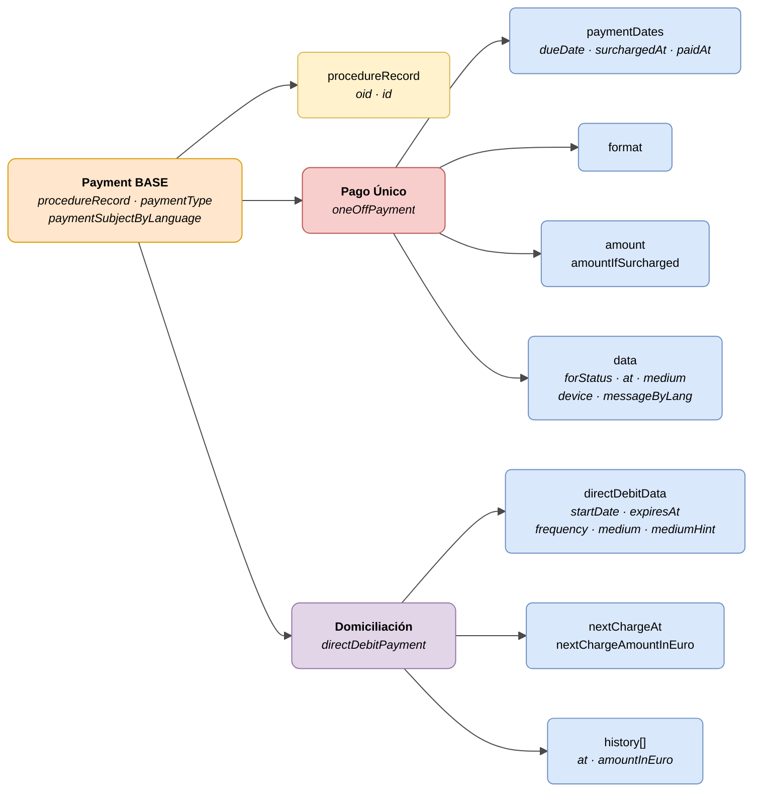

# Pago (Payment)

> - **Versión:** `v0.3.25`
> - **Fecha:** 2026-06-10
> - **Test:** [DN99DENATestMockObjFactoryForOneOffPayment.java](https://github.com/DENA-Euskadi/dena-interop-common-data-test/blob/develop/denaTestCommonDataClasses/src/main/java/dena/test/common/data/payment/DN99DENATestMockObjFactoryForOneOffPayment.java)
> - **Código:**
>   - [DN00OneOffPayment.java](https://github.com/DENA-Euskadi/dena-common-data-api/blob/develop/denaCommonDataAPIPaymentModelClasses/src/main/java/dena/api/data/model/payments/oneoff/DN00OneOffPayment.java)
>   - [DN00DirectDebitPayment.java](https://github.com/DENA-Euskadi/dena-common-data-api/blob/develop/denaCommonDataAPIPaymentModelClasses/src/main/java/dena/api/data/model/payments/directdebit/DN00DirectDebitPayment.java)

## Descripción

Representa una obligación de pago asociada a un expediente. Dos modalidades:

- **Pago único** (`oneOffPayment`) — Liquidación puntual (tasa, precio público, sanción)
- **Domiciliación** (`directDebitPayment`) — Cargo periódico recurrente

> Ver también: [campos-comunes.md](./campos-comunes.md) para campos heredados (`oid`, `id`, `urls`, `originAdminRef`, `aboutPersonRef`)



| Color | Significado |
|-------|-------------|
| 🟠 Naranja | Objeto base común (Payment BASE) |
| 🟡 Amarillo | Referencia a otro objeto (Expediente) |
| 🔴 Rojo claro | Subtipo: Pago Único |
| 🟣 Violeta | Subtipo: Domiciliación |
| 🔵 Azul claro | Campos de datos |

---

## Atributos comunes

| Campo | Tipo | Obligatorio | Descripción |
|-------|------|:-----------:|-------------|
| `type` | `String` | ✅ | `"oneOffPayment"` o `"directDebitPayment"` |
| `oid` | `String` | ✅ | Identificador técnico único |
| `id` | `String` | ✅ | Identificador de negocio |
| `procedureRecord` | `Object` | ✅ | Referencia al expediente (`oid`, `id`) |
| `paymentType` | `String` | ✅ | `ONE_OFF_PAYMENT` o `DIRECT_DEBIT` |
| `paymentSubjectByLanguage` | `LanguageTexts` | ✅ | Concepto del pago |
| `participatingOrgUnits` | `Array` | ❌ | Unidades orgánicas participantes |
| `urls` | `Array` | ❌ | URLs de pago y justificante |

---

## Pago único — Atributos específicos

| Campo | Tipo | Obligatorio | Descripción |
|-------|------|:-----------:|-------------|
| `format` | `String` | ❌ | Formato de pago (501, 502, 503, 507, 508, 514, 515, 521, 522, 524, 525, 528, 529) |
| `paymentDates.dueDate` | `String` (date) | ✅ | Fecha de vencimiento |
| `paymentDates.surchargedAt` | `String` (date) | ❌ | Inicio del periodo de recargo |
| `paymentDates.paidAt` | `String` (date) | ❌ | Fecha de pago efectivo (obligatorio si `forStatus = COMPLETED`) |
| `amount` | `Money` | ✅ | Importe del pago |
| `amountIfSurcharged` | `Money` | ❌ | Importe con recargo |
| `data.forStatus` | `String` | ✅ | Estado del pago |
| `data.at` | `String` (ISO 8601) | ❌ | Fecha/hora en que se realizó la acción de pago |
| `data.medium` | `String` | ❌ | Medio de pago utilizado |
| `data.device` | `String` | ❌ | Dispositivo utilizado |
| `data.paymentProcessorId` | `String` | ❌ | Entidad procesadora |
| `data.paymentProcessorTransactionId` | `String` | ❌ | ID de transacción |
| `data.messageByLang` | `LanguageTexts` | ❌ | Mensaje informativo (ej: motivo de rechazo) |

### Tipo `Money`

El tipo `Money` es un objeto con la siguiente estructura:

```json
{ "amount": 45.50, "currency": "EUR" }
```

| Campo | Tipo | Descripción |
|-------|------|-------------|
| `amount` | `Number` | Importe numérico |
| `currency` | `String` | Código de moneda ISO 4217 (por defecto `"EUR"`) |

## Domiciliación — Atributos específicos

| Campo | Tipo | Obligatorio | Descripción |
|-------|------|:-----------:|-------------|
| `directDebitData.startDate` | `String` (date) | ✅ | Fecha de alta de la domiciliación |
| `directDebitData.expiresAt` | `String` (date) | ❌ | Fecha de expiración (null = vigente indefinidamente) |
| `directDebitData.frequency` | `String` | ✅ | Frecuencia (ver tabla abajo) |
| `directDebitData.medium` | `String` | ❌ | Medio de pago |
| `directDebitData.mediumHint` | `String` | ❌ | Indicación del medio (ej: últimos dígitos de cuenta) |
| `nextChargeAt` | `String` (date) | ❌ | Fecha del próximo cargo |
| `nextChargeAmountInEuro` | `Number` | ❌ | Importe del próximo cargo |
| `history` | `Array` | ❌ | Historial de cargos realizados |

### Frecuencias (`directDebitData.frequency`)

| Código | Descripción |
|--------|-------------|
| `WEEKLY` | Semanal |
| `BIWEEKLY` | Quincenal |
| `MONTHLY` | Mensual |
| `BIMONTHLY` | Bimestral |
| `QUARTERLY` | Trimestral |
| `BIANNUAL` | Semestral |
| `ANNUAL` | Anual |

### Historial de cargos (`history[]`)

Cada elemento del array `history` tiene la siguiente estructura:

| Campo | Tipo | Descripción |
|-------|------|-------------|
| `at` | `String` (date) | Fecha del cargo |
| `amountInEuro` | `Number` | Importe del cargo en euros |

```json
{
  "history": [
    { "at": "2024-06-01", "amountInEuro": 120.00 },
    { "at": "2024-05-01", "amountInEuro": 120.00 },
    { "at": "2024-04-01", "amountInEuro": 115.00 }
  ]
}
```

---

## Estados del pago (`data.forStatus`)

| Código | Descripción |
|--------|-------------|
| `COMPLETED` | Completado |
| `PENDING` | Pendiente |
| `REJECTED_BY_PAYMENT_PROCESSOR` | Rechazado por la entidad |
| `CANCELLED_BY_ISSUER` | Cancelado por el emisor |
| `ERROR_WHEN_PROCESSING_PAYMENT` | Error en el procesamiento |

## Medios de pago (`data.medium` / `directDebitData.medium`)

| Código | Descripción |
|--------|-------------|
| `PAYMENT_CARD` | Tarjeta de crédito/débito |
| `ACCOUNT_TRANSFER` | Transferencia bancaria |
| `BIZUM` | Bizum |
| `CASH` | Metálico |
| `DIRECT_DEBIT` | Domiciliación bancaria |

## Dispositivos (`data.device`)

| Código | Descripción |
|--------|-------------|
| `WEB_BROWSER` | Navegador web |
| `MOBILE_APP` | Aplicación móvil |
| `IN_PERSON_FINANCIAL_ENTITY` | Presencial en entidad financiera |
| `IN_PERSON_OTHER` | Presencial en otro punto |
| `ATM` | Cajero automático |

---

## Ejemplo — Pago único

```json
{
  "type": "oneOffPayment",
  "oid": "PAY-OID-001",
  "id": "PAY-2024-00321",
  "procedureRecord": { "oid": "EXP-OID-001", "id": "EXP-2024-00123" },
  "paymentType": "ONE_OFF_PAYMENT",
  "paymentSubjectByLanguage": { "SPANISH": "Tasa por licencia de actividad", "BASQUE": "Jarduera-lizentziaren tasa" },
  "paymentDates": { "dueDate": "2024-06-30", "surchargedAt": "2024-07-15", "paidAt": null },
  "format": "502",
  "amount": { "amount": 45.50, "currency": "EUR" },
  "amountIfSurcharged": { "amount": 50.05, "currency": "EUR" },
  "data": {
    "forStatus": "PENDING",
    "at": null,
    "medium": null,
    "device": null,
    "messageByLang": null
  },
  "urls": [
    { "url": "https://pago.miadmin.eus/pay/PAY-2024-00321", "language": "SPANISH", "tags": ["payment"] }
  ]
}
```

### Ejemplo — Pago completado

```json
{
  "type": "oneOffPayment",
  "oid": "PAY-OID-002",
  "id": "PAY-2024-00322",
  "procedureRecord": { "oid": "EXP-OID-001", "id": "EXP-2024-00123" },
  "paymentType": "ONE_OFF_PAYMENT",
  "paymentSubjectByLanguage": { "SPANISH": "Tasa por licencia de obras", "BASQUE": "Obra-lizentziaren tasa" },
  "paymentDates": { "dueDate": "2024-05-30", "surchargedAt": "2024-06-15", "paidAt": "2024-05-28" },
  "format": "502",
  "amount": { "amount": 120.00, "currency": "EUR" },
  "amountIfSurcharged": { "amount": 132.00, "currency": "EUR" },
  "data": {
    "forStatus": "COMPLETED",
    "at": "2024-05-28T11:23:45Z",
    "medium": "PAYMENT_CARD",
    "device": "WEB_BROWSER",
    "paymentProcessorId": "BANKIA",
    "paymentProcessorTransactionId": "TXN-2024-ABC123"
  },
  "urls": [
    { "url": "https://pago.miadmin.eus/pay/PAY-2024-00322", "language": "SPANISH", "tags": ["payment"] },
    { "url": "https://pago.miadmin.eus/receipt/PAY-2024-00322", "language": "SPANISH", "tags": ["payment-receipt"] }
  ]
}
```

## Ejemplo — Domiciliación

```json
{
  "type": "directDebitPayment",
  "oid": "DD-OID-001",
  "id": "DD-2024-00100",
  "procedureRecord": { "oid": "EXP-OID-001", "id": "EXP-2024-00123" },
  "paymentType": "DIRECT_DEBIT",
  "paymentSubjectByLanguage": { "SPANISH": "Cuota mensual guardería", "BASQUE": "Haur-eskolako hileko kuota" },
  "directDebitData": {
    "startDate": "2024-01-15",
    "expiresAt": null,
    "frequency": "MONTHLY",
    "medium": "DIRECT_DEBIT",
    "mediumHint": "2100 ***** 051332"
  },
  "nextChargeAt": "2024-07-01",
  "nextChargeAmountInEuro": 120.00,
  "history": [
    { "at": "2024-06-01", "amountInEuro": 120.00 },
    { "at": "2024-05-01", "amountInEuro": 120.00 }
  ]
}
```

---

## Notas importantes

- El campo `directDebitData.startDate` indica cuándo se dio de alta la domiciliación (en el JSON se serializa como `"startDate"`, no como `"setAt"`).
- El campo `data.at` en pagos únicos indica el momento exacto en que se procesó el pago (solo relevante cuando `forStatus` ≠ `PENDING`).
- El campo `data.messageByLang` permite incluir un mensaje explicativo multiidioma, útil para estados de error o rechazo.
- Las citas (`scheduleItem`) NO tienen relación con pagos. Los pagos siempre dependen de un expediente (`procedureRecord`).


---

## 🔗 Código fuente

| Clase | Repositorio |
|-------|-------------|
| DN00PaymentDataExchangedBase | [Ver código](https://github.com/DENA-Euskadi/dena-common-data-api/blob/develop/denaCommonDataAPIPaymentModelClasses/src/main/java/dena/api/data/model/payments/DN00PaymentDataExchangedBase.java) |
| DN00OneOffPayment | [Ver código](https://github.com/DENA-Euskadi/dena-common-data-api/blob/develop/denaCommonDataAPIPaymentModelClasses/src/main/java/dena/api/data/model/payments/oneoff/DN00OneOffPayment.java) |
| DN00OneOffPaymentData | [Ver código](https://github.com/DENA-Euskadi/dena-common-data-api/blob/develop/denaCommonDataAPIPaymentModelClasses/src/main/java/dena/api/data/model/payments/oneoff/DN00OneOffPaymentData.java) |
| DN00OneOffPaymentSchemaFormat | [Ver código](https://github.com/DENA-Euskadi/dena-common-data-api/blob/develop/denaCommonDataAPIPaymentModelClasses/src/main/java/dena/api/data/model/payments/oneoff/DN00OneOffPaymentSchemaFormat.java) |
| DN00DirectDebitPayment | [Ver código](https://github.com/DENA-Euskadi/dena-common-data-api/blob/develop/denaCommonDataAPIPaymentModelClasses/src/main/java/dena/api/data/model/payments/directdebit/DN00DirectDebitPayment.java) |
| DN00DirectDebitData | [Ver código](https://github.com/DENA-Euskadi/dena-common-data-api/blob/develop/denaCommonDataAPIPaymentModelClasses/src/main/java/dena/api/data/model/payments/directdebit/DN00DirectDebitData.java) |
| DN00DirectDebitPaymentHistoryItem | [Ver código](https://github.com/DENA-Euskadi/dena-common-data-api/blob/develop/denaCommonDataAPIPaymentModelClasses/src/main/java/dena/api/data/model/payments/directdebit/DN00DirectDebitPaymentHistoryItem.java) |
| DN00PaymentDates | [Ver código](https://github.com/DENA-Euskadi/dena-common-data-api/blob/develop/denaCommonDataAPIPaymentModelClasses/src/main/java/dena/api/data/model/payments/DN00PaymentDates.java) |
| DN00PaymentStateCode | [Ver código](https://github.com/DENA-Euskadi/dena-common-data-api/blob/develop/denaCommonDataAPIPaymentModelClasses/src/main/java/dena/api/data/model/payments/DN00PaymentStateCode.java) |
| DN00PaymentMedium | [Ver código](https://github.com/DENA-Euskadi/dena-common-data-api/blob/develop/denaCommonDataAPIPaymentModelClasses/src/main/java/dena/api/data/model/payments/DN00PaymentMedium.java) |
| DN00PaymentDevice | [Ver código](https://github.com/DENA-Euskadi/dena-common-data-api/blob/develop/denaCommonDataAPIPaymentModelClasses/src/main/java/dena/api/data/model/payments/DN00PaymentDevice.java) |
| DN00PaymentType | [Ver código](https://github.com/DENA-Euskadi/dena-common-data-api/blob/develop/denaCommonDataAPIPaymentModelClasses/src/main/java/dena/api/data/model/payments/DN00PaymentType.java) |


---

## 🧪 Tests y ejemplos

| Test | Repositorio |
|------|-------------|
| DN00PayOffPaymentTest | [Ver test](https://github.com/DENA-Euskadi/dena-interop-common-data-test/blob/develop/denaTestCommonDataClasses/src/main/java/dena/test/common/data/payment/DN99DENATestMockObjFactoryForOneOffPayment.java) |
| DN00DirectDebitPaymentsTest | [Ver test](https://github.com/DENA-Euskadi/dena-interop-common-data-test/blob/develop/denaTestCommonDataClasses/src/main/java/dena/test/common/data/payment/DN99DENATestMockObjFactoryForDirectDebitPayment.java) |
| DN00PaymentDatesTest | [Ver test](https://github.com/DENA-Euskadi/dena-interop-common-data-test/blob/develop/denaTestCommonDataClasses/src/main/java/dena/test/common/data/payment/DN99DENATestMockObjFactoryForPaymentDates.java) |
| DN00PaymentStatusTest | [Ver test](https://github.com/DENA-Euskadi/dena-interop-common-data-test/blob/develop/denaTestCommonDataClasses/src/main/java/dena/test/common/data/payment/DN99DENATestMockObjFactoryForPaymentStateCode.java) |
| DN00PaymentStatusDataWhenCompletedTest | [Ver test](https://github.com/DENA-Euskadi/dena-interop-common-data-test/blob/develop/denaTestCommonDataClasses/src/main/java/dena/test/common/data/payment/DN99DENATestMockObjFactoryForOneOffPaymentData.java) |
| DN00PaymentStatusDataWhenRejectedTest | [Ver test](https://github.com/DENA-Euskadi/dena-interop-common-data-test/blob/develop/denaTestCommonDataClasses/src/main/java/dena/test/common/data/payment/DN99DENATestMockObjFactoryForOneOffPaymentData.java) |
| DN00PaymentStatusDataWhenCancelledTest | [Ver test](https://github.com/DENA-Euskadi/dena-interop-common-data-test/blob/develop/denaTestCommonDataClasses/src/main/java/dena/test/common/data/payment/DN99DENATestMockObjFactoryForOneOffPaymentData.java) |
| DN00PaymentStatusDataWhenErrorTest | [Ver test](https://github.com/DENA-Euskadi/dena-interop-common-data-test/blob/develop/denaTestCommonDataClasses/src/main/java/dena/test/common/data/payment/DN99DENATestMockObjFactoryForOneOffPaymentData.java) |
| DN00OneOffPaymentSchemaTest | [Ver test](https://github.com/DENA-Euskadi/dena-interop-common-data-test/blob/develop/denaTestCommonDataClasses/src/main/java/dena/test/common/data/payment/DN99DENATestMockObjFactoryForOneOffPaymentSchemaFormat.java) |
| DN00PaymentIDTest | [Ver test](https://github.com/DENA-Euskadi/dena-interop-common-data-test/blob/develop/denaTestCommonDataClasses/src/main/java/dena/test/common/data/payment/DN99DENATestMockObjFactoryForPaymentDataExchangedBase.java) |


<!-- DENA-DOC-FOOTER -->
---
<sub>DENA Docs v0.3.25 · 2026-06-10</sub>
