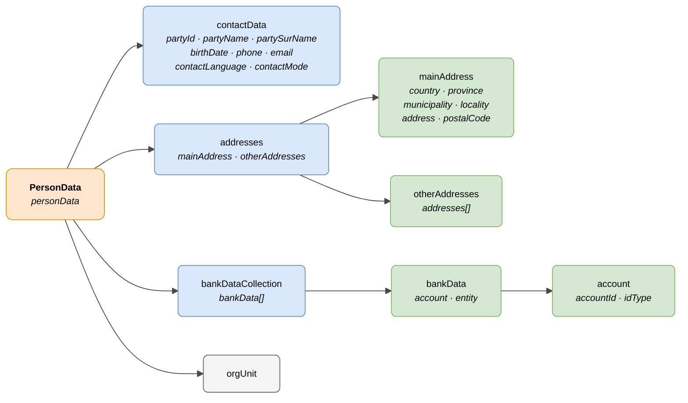

# :material-account-circle: Person (PersonData)

> - **Version:** `v{{ dena.version }}`
> - **Date:** {{ dena.date }}
> - **Test:** [DN99DENATestMockObjFactoryForPersonData.java]({{ repos.interop_test_blob }}/denaTestCommonDataClasses/src/main/java/dena/test/common/data/persondata/DN99DENATestMockObjFactoryForPersonData.java)
> - **Code:** [DN00PersonData.java]({{ repos.common_data_api_blob }}/denaCommonDataAPIPersonDataModelClasses/src/main/java/dena/api/data/model/persondata/DN00PersonData.java)

## Description

The **PersonData** model (`DN00PersonData`) represents the data of a person exchanged between the administration and DENA: contact information, addresses and bank details.

It extends `DN00DENADataExchangedObjectBase` (it is a main exchanged object of the DATA-RETRIEVE model).

> See also: [campos-comunes.md](./campos-comunes.md) for inherited fields (`oid`, `id`, `urls`, `originAdmin`, `aboutPerson`)



| Colour | Meaning |
|--------|---------|
| 🟠 Orange | Main object (PersonData) |
| 🔵 Light blue | First-level blocks |
| 🟢 Light green | Detail sub-objects |
| ⚪ Grey | References to other objects |

---

## 🔗 Source code

| Class | Repository |
|-------|------------|
| DN00PersonData | [View code]({{ repos.common_data_api_blob }}/denaCommonDataAPIPersonDataModelClasses/src/main/java/dena/api/data/model/persondata/DN00PersonData.java) |
| DN00ContactData | [View code]({{ repos.common_data_api_blob }}/denaCommonDataAPIPersonDataModelClasses/src/main/java/dena/api/data/model/persondata/DN00ContactData.java) |
| DN00Address | [View code]({{ repos.common_data_api_blob }}/denaCommonDataAPIPersonDataModelClasses/src/main/java/dena/api/data/model/persondata/DN00Address.java) |
| DN00Addresses | [View code]({{ repos.common_data_api_blob }}/denaCommonDataAPIPersonDataModelClasses/src/main/java/dena/api/data/model/persondata/DN00Addresses.java) |
| DN00BankData | [View code]({{ repos.common_data_api_blob }}/denaCommonDataAPIPersonDataModelClasses/src/main/java/dena/api/data/model/persondata/DN00BankData.java) |
| DN00BankDataCollection | [View code]({{ repos.common_data_api_blob }}/denaCommonDataAPIPersonDataModelClasses/src/main/java/dena/api/data/model/persondata/DN00BankDataCollection.java) |
| DN00Account | [View code]({{ repos.common_data_api_blob }}/denaCommonDataAPIPersonDataModelClasses/src/main/java/dena/api/data/model/persondata/DN00Account.java) |
| DN00ContactType | [View code]({{ repos.common_data_api_blob }}/denaCommonDataAPIPersonDataModelClasses/src/main/java/dena/api/data/model/persondata/DN00ContactType.java) |
| DN00IdType | [View code]({{ repos.common_data_api_blob }}/denaCommonDataAPIPersonDataModelClasses/src/main/java/dena/api/data/model/persondata/DN00IdType.java) |

---

## 🧪 Tests and examples

> Repository: [DENA-Euskadi/dena-interop-common-data-test]({{ repos.interop_test_tree }})

| Mock Factory | Repository |
|--------------|------------|
| DN99DENATestMockObjFactoryForPersonData | [View code]({{ repos.interop_test_blob }}/denaTestCommonDataClasses/src/main/java/dena/test/common/data/persondata/DN99DENATestMockObjFactoryForPersonData.java) |
| DN99DENATestMockObjFactoryForContactData | [View code]({{ repos.interop_test_blob }}/denaTestCommonDataClasses/src/main/java/dena/test/common/data/persondata/DN99DENATestMockObjFactoryForContactData.java) |
| DN99DENATestMockObjFactoryForAddress | [View code]({{ repos.interop_test_blob }}/denaTestCommonDataClasses/src/main/java/dena/test/common/data/persondata/DN99DENATestMockObjFactoryForAddress.java) |
| DN99DENATestMockObjFactoryForAddresses | [View code]({{ repos.interop_test_blob }}/denaTestCommonDataClasses/src/main/java/dena/test/common/data/persondata/DN99DENATestMockObjFactoryForAddresses.java) |
| DN99DENATestMockObjFactoryForBankData | [View code]({{ repos.interop_test_blob }}/denaTestCommonDataClasses/src/main/java/dena/test/common/data/persondata/DN99DENATestMockObjFactoryForBankData.java) |
| DN99DENATestMockObjFactoryForBankDataCollection | [View code]({{ repos.interop_test_blob }}/denaTestCommonDataClasses/src/main/java/dena/test/common/data/persondata/DN99DENATestMockObjFactoryForBankDataCollection.java) |
| DN99DENATestMockObjFactoryForAccount | [View code]({{ repos.interop_test_blob }}/denaTestCommonDataClasses/src/main/java/dena/test/common/data/persondata/DN99DENATestMockObjFactoryForAccount.java) |
| DN99DENATestMockObjFactoryForContactType | [View code]({{ repos.interop_test_blob }}/denaTestCommonDataClasses/src/main/java/dena/test/common/data/persondata/DN99DENATestMockObjFactoryForContactType.java) |
| DN99DENATestMockObjFactoryForIdType | [View code]({{ repos.interop_test_blob }}/denaTestCommonDataClasses/src/main/java/dena/test/common/data/persondata/DN99DENATestMockObjFactoryForIdType.java) |

---

## PersonData — JSON attributes

| Field | Type | Mandatory | Example | Description |
|-------|------|:---------:|---------|-------------|
| `type` | `String` | ✅ | `"personData"` | Polymorphic discriminator |
| `oid` | `String` | ✅ | `"PDATA-OID-001"` | Technical identifier |
| `id` | `String` | ✅ | `"12345678A"` | Business identifier |
| `contactData` | [`DN00ContactData`]({{ repos.common_data_api_blob }}/denaCommonDataAPIPersonDataModelClasses/src/main/java/dena/api/data/model/persondata/DN00ContactData.java) | ✅ | *(see [contactData](#contact-data-contactdata))* | Detailed contact data |
| `addresses` | [`DN00Addresses`]({{ repos.common_data_api_blob }}/denaCommonDataAPIPersonDataModelClasses/src/main/java/dena/api/data/model/persondata/DN00Addresses.java) | ❌ | *(see [Addresses](#addresses-addresses))* | Addresses (main + others) |
| `bankDataCollection` | [`DN00BankDataCollection`]({{ repos.common_data_api_blob }}/denaCommonDataAPIPersonDataModelClasses/src/main/java/dena/api/data/model/persondata/DN00BankDataCollection.java) | ❌ | *(see [Bank data](#bank-data-bankdatacollection))* | Bank data |
| `orgUnit` | [`DN00OrgUnitReference`]({{ repos.common_data_api_blob }}/denaCommonDataAPIModelClasses/src/main/java/dena/api/data/model/org/DN00OrgUnitReference.java) | ❌ | *(see [unidad-organica.md](./unidad-organica.md))* | Associated organisational unit |

---

## Contact data ([`contactData`]({{ repos.common_data_api_blob }}/denaCommonDataAPIPersonDataModelClasses/src/main/java/dena/api/data/model/persondata/DN00ContactData.java))

| Field | Type | Mandatory | Example | Description |
|-------|------|:---------:|---------|-------------|
| `partyId` | `String` | ✅ | `"12345678A"` | NIF/NIE of the interested party |
| `partyName` | `String` | ✅ | `"María"` | First name |
| `partySurName` | `String` | ✅ | `"García López"` | Surname(s) |
| `birthDate` | `String` (ISO 8601) | ❌ | `"1985-03-20T00:00:00Z"` | Date of birth |
| `phone` | `String` | ❌ | `"+34600000001"` | Primary phone number |
| `phone2` | `String` | ❌ | `null` | Secondary phone number |
| `email` | `String` | ❌ | `"maria@example.com"` | Email address |
| `contactLanguage` | `String` | ❌ | `"SPANISH"` | Preferred language (`SPANISH`, `BASQUE`, `ENGLISH`) |
| `contactMode` | `String` | ❌ | `"ELECTRONIC"` | Preferred contact mode |

### Contact modes ([`contactMode`]({{ repos.common_data_api_blob }}/denaCommonDataAPIPersonDataModelClasses/src/main/java/dena/api/data/model/persondata/DN00ContactType.java))

| Code | Description |
|------|-------------|
| `POSTAL` | Postal mail |
| `ELECTRONIC` | Electronic means |

---

## Addresses ([`addresses`]({{ repos.common_data_api_blob }}/denaCommonDataAPIPersonDataModelClasses/src/main/java/dena/api/data/model/persondata/DN00Addresses.java))

| Field | Type | Mandatory | Example | Description |
|-------|------|:---------:|---------|-------------|
| `mainAddress` | `Object` | ❌ | *(see [Address](#address-mainaddress--each-element-of-otheraddressesaddresses))* | Main address |
| `otherAddresses` | `Object` | ❌ | | Other addresses |
| `otherAddresses.addresses` | `Array` | ❌ | | List of additional addresses |

### Address (`mainAddress` / each element of `otherAddresses.addresses`)

| Field | Type | Mandatory | Example | Description |
|-------|------|:---------:|---------|-------------|
| `addressDescription` | `LanguageTexts` | ❌ | `{"SPANISH":"Domicilio habitual"}` | Address description |
| `countryNoraCode` | `String` | ❌ | `"108"` | NORA code of the country |
| `countryDesc` | `LanguageTexts` | ❌ | `{"SPANISH":"España"}` | Country name |
| `provinceNoraCode` | `String` | ❌ | `"48"` | NORA code of the province |
| `provinceDesc` | `LanguageTexts` | ❌ | `{"SPANISH":"Bizkaia"}` | Province name |
| `municipalityNoraCode` | `String` | ❌ | `"48020"` | NORA code of the municipality |
| `municipalityDesc` | `LanguageTexts` | ❌ | `{"SPANISH":"Bilbao"}` | Municipality name |
| `localityNoraCode` | `String` | ❌ | `"48020"` | NORA code of the locality |
| `localityDesc` | `LanguageTexts` | ❌ | `{"SPANISH":"Bilbao"}` | Locality name |
| `address` | `String` | ❌ | `"Gran Vía 50, 3º B"` | Full postal address |
| `postalCode` | `String` | ❌ | `"48001"` | Postal code |

---

## Bank data ([`bankDataCollection`]({{ repos.common_data_api_blob }}/denaCommonDataAPIPersonDataModelClasses/src/main/java/dena/api/data/model/persondata/DN00BankDataCollection.java))

| Field | Type | Mandatory | Example | Description |
|-------|------|:---------:|---------|-------------|
| `bankData` | `Array` | ❌ | | List of bank data entries |

### Each element of [`bankData`]({{ repos.common_data_api_blob }}/denaCommonDataAPIPersonDataModelClasses/src/main/java/dena/api/data/model/persondata/DN00BankData.java)

| Field | Type | Mandatory | Example | Description |
|-------|------|:---------:|---------|-------------|
| `account.accountId` | `String` | ✅ | `"ES9121000418450200051332"` | Account number (IBAN or other) |
| `account.idType` | `String` | ✅ | `"IBAN"` | Identifier type |
| `entity` | `String` | ❌ | `"CAIXESBB"` | Banking entity (BIC/SWIFT code) |

### Account identifier types ([`idType`]({{ repos.common_data_api_blob }}/denaCommonDataAPIPersonDataModelClasses/src/main/java/dena/api/data/model/persondata/DN00IdType.java))

| Code | Description |
|------|-------------|
| `IBAN` | IBAN format |
| `CUSTOM` | Other format |

---

## JSON example

```json
{
  "type": "personData",
  "oid": "PDATA-OID-001",
  "id": "12345678A",
  "contactData": {
    "partyId": "12345678A",
    "partyName": "María",
    "partySurName": "García López",
    "birthDate": "1985-03-20T00:00:00Z",
    "phone": "+34600000001",
    "phone2": null,
    "email": "maria.garcia@example.com",
    "contactLanguage": "SPANISH",
    "contactMode": "ELECTRONIC"
  },
  "addresses": {
    "mainAddress": {
      "countryNoraCode": "108",
      "countryDesc": { "SPANISH": "España", "BASQUE": "Espainia" },
      "provinceNoraCode": "48",
      "provinceDesc": { "SPANISH": "Bizkaia", "BASQUE": "Bizkaia" },
      "municipalityNoraCode": "48020",
      "municipalityDesc": { "SPANISH": "Bilbao", "BASQUE": "Bilbo" },
      "address": "Gran Vía 50, 3º B",
      "postalCode": "48001"
    },
    "otherAddresses": {
      "addresses": []
    }
  },
  "bankDataCollection": {
    "bankData": [
      {
        "account": {
          "accountId": "ES9121000418450200051332",
          "idType": "IBAN"
        },
        "entity": "CAIXESBB"
      }
    ]
  },
  "orgUnit": {
    "id": "ORG-HACIENDA",
    "displayNameByLanguage": { "SPANISH": "Hacienda Foral de Bizkaia", "BASQUE": "Bizkaiko Foru Ogasuna" }
  }
}
```

---

## Validation rules

- `contactData.partyId` is mandatory and must be a valid NIF/NIE.
- `contactData.partyName` and `contactData.partySurName` are mandatory.
- If addresses are included, NORA codes must be valid according to the NORA catalogue.
- If bank data is included with `idType: "IBAN"`, the `accountId` must be a valid IBAN.

---

<!-- DENA-DOC-FOOTER -->
---
<sub>DENA Docs v{{ dena.version }} · {{ dena.date }}</sub>
