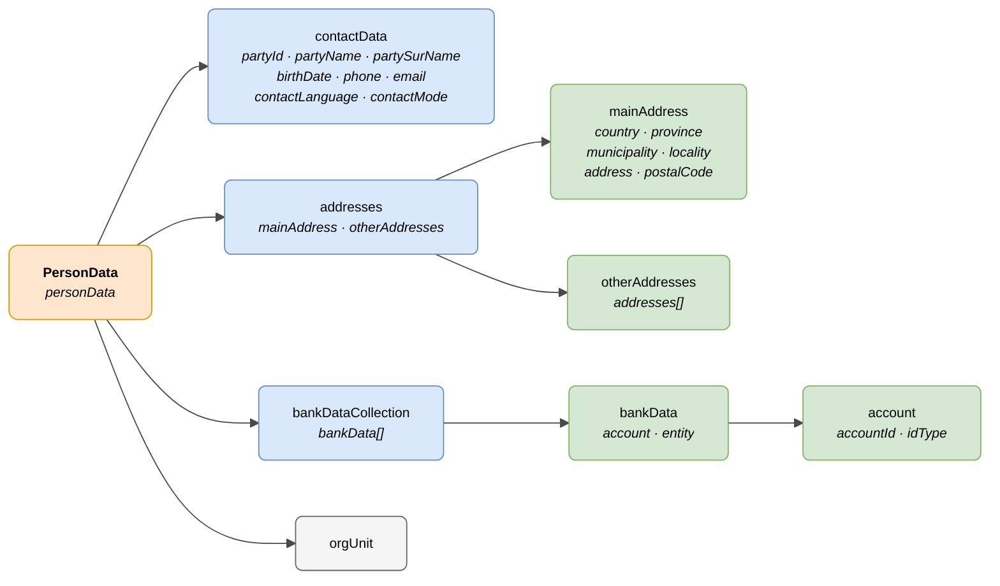

# :material-account-circle: Pertsona (PersonData)

> - **Bertsioa:** `v{{ dena.version }}`
> - **Data:** {{ dena.date }}
> - **Testa:** [DN99DENATestMockObjFactoryForPersonData.java]({{ repos.interop_test_blob }}/denaTestCommonDataClasses/src/main/java/dena/test/common/data/persondata/DN99DENATestMockObjFactoryForPersonData.java)
> - **Kodea:** [DN00PersonData.java]({{ repos.common_data_api_blob }}/denaCommonDataAPIPersonDataModelClasses/src/main/java/dena/api/data/model/persondata/DN00PersonData.java)

## Deskribapena

**PersonData** ereduak (`DN00PersonData`) administrazioaren eta DENA-ren artean trukatutako herritarren datuak adierazten ditu: kontaktu-informazioa, helbideak eta banku-datuak.

`DN00DENADataExchangedObjectBase` hedatzen du (DATA-RETRIEVE ereduaren objektu trukatu nagusia da).

> Ikusi baita ere: [campos-comunes.md](./campos-comunes.md) heredatutako eremuetarako (`oid`, `id`, `urls`, `originAdminRef`, `aboutPersonRef`)



| Kolorea | Esanahia |
|---------|----------|
| 🟠 Laranja | Objektu nagusia (PersonData) |
| 🔵 Urdin argia | Lehen mailako blokeak |
| 🟢 Berde argia | Xehetasun-azpiobjektuak |
| ⚪ Grisa | Beste objektuetarako erreferentziak |

---

## 🔗 Iturburu-kodea

| Klasea | Biltegia |
|--------|----------|
| DN00PersonData | [Ikusi kodea]({{ repos.common_data_api_blob }}/denaCommonDataAPIPersonDataModelClasses/src/main/java/dena/api/data/model/persondata/DN00PersonData.java) |
| DN00ContactData | [Ikusi kodea]({{ repos.common_data_api_blob }}/denaCommonDataAPIPersonDataModelClasses/src/main/java/dena/api/data/model/persondata/DN00ContactData.java) |
| DN00Address | [Ikusi kodea]({{ repos.common_data_api_blob }}/denaCommonDataAPIPersonDataModelClasses/src/main/java/dena/api/data/model/persondata/DN00Address.java) |
| DN00Addresses | [Ikusi kodea]({{ repos.common_data_api_blob }}/denaCommonDataAPIPersonDataModelClasses/src/main/java/dena/api/data/model/persondata/DN00Addresses.java) |
| DN00BankData | [Ikusi kodea]({{ repos.common_data_api_blob }}/denaCommonDataAPIPersonDataModelClasses/src/main/java/dena/api/data/model/persondata/DN00BankData.java) |
| DN00BankDataCollection | [Ikusi kodea]({{ repos.common_data_api_blob }}/denaCommonDataAPIPersonDataModelClasses/src/main/java/dena/api/data/model/persondata/DN00BankDataCollection.java) |
| DN00Account | [Ikusi kodea]({{ repos.common_data_api_blob }}/denaCommonDataAPIPersonDataModelClasses/src/main/java/dena/api/data/model/persondata/DN00Account.java) |
| DN00ContactType | [Ikusi kodea]({{ repos.common_data_api_blob }}/denaCommonDataAPIPersonDataModelClasses/src/main/java/dena/api/data/model/persondata/DN00ContactType.java) |
| DN00IdType | [Ikusi kodea]({{ repos.common_data_api_blob }}/denaCommonDataAPIPersonDataModelClasses/src/main/java/dena/api/data/model/persondata/DN00IdType.java) |

---

## 🧪 Testak eta adibideak

> Biltegia: [DENA-Euskadi/dena-interop-common-data-test]({{ repos.interop_test_tree }})

| Mock Factory | Biltegia |
|--------------|----------|
| DN99DENATestMockObjFactoryForPersonData | [Ikusi kodea]({{ repos.interop_test_blob }}/denaTestCommonDataClasses/src/main/java/dena/test/common/data/persondata/DN99DENATestMockObjFactoryForPersonData.java) |
| DN99DENATestMockObjFactoryForContactData | [Ikusi kodea]({{ repos.interop_test_blob }}/denaTestCommonDataClasses/src/main/java/dena/test/common/data/persondata/DN99DENATestMockObjFactoryForContactData.java) |
| DN99DENATestMockObjFactoryForAddress | [Ikusi kodea]({{ repos.interop_test_blob }}/denaTestCommonDataClasses/src/main/java/dena/test/common/data/persondata/DN99DENATestMockObjFactoryForAddress.java) |
| DN99DENATestMockObjFactoryForAddresses | [Ikusi kodea]({{ repos.interop_test_blob }}/denaTestCommonDataClasses/src/main/java/dena/test/common/data/persondata/DN99DENATestMockObjFactoryForAddresses.java) |
| DN99DENATestMockObjFactoryForBankData | [Ikusi kodea]({{ repos.interop_test_blob }}/denaTestCommonDataClasses/src/main/java/dena/test/common/data/persondata/DN99DENATestMockObjFactoryForBankData.java) |
| DN99DENATestMockObjFactoryForBankDataCollection | [Ikusi kodea]({{ repos.interop_test_blob }}/denaTestCommonDataClasses/src/main/java/dena/test/common/data/persondata/DN99DENATestMockObjFactoryForBankDataCollection.java) |
| DN99DENATestMockObjFactoryForAccount | [Ikusi kodea]({{ repos.interop_test_blob }}/denaTestCommonDataClasses/src/main/java/dena/test/common/data/persondata/DN99DENATestMockObjFactoryForAccount.java) |
| DN99DENATestMockObjFactoryForContactType | [Ikusi kodea]({{ repos.interop_test_blob }}/denaTestCommonDataClasses/src/main/java/dena/test/common/data/persondata/DN99DENATestMockObjFactoryForContactType.java) |
| DN99DENATestMockObjFactoryForIdType | [Ikusi kodea]({{ repos.interop_test_blob }}/denaTestCommonDataClasses/src/main/java/dena/test/common/data/persondata/DN99DENATestMockObjFactoryForIdType.java) |

---

## PersonData — JSON atributuak

| Eremua | Mota | Derrigorrez | Adibidea | Deskribapena |
|--------|------|:-----------:|----------|--------------|
| `type` | `String` | ✅ | `"personData"` | Diskriminatzaile polimorfiko |
| `oid` | `String` | ✅ | `"PDATA-OID-001"` | Identifikatzaile teknikoa |
| `id` | `String` | ✅ | `"12345678A"` | Negozio-identifikatzailea |
| `contactData` | [`DN00ContactData`]({{ repos.common_data_api_blob }}/denaCommonDataAPIPersonDataModelClasses/src/main/java/dena/api/data/model/persondata/DN00ContactData.java) | ✅ | *(ikusi [contactData](#kontaktu-datuak-contactdata))* | Kontaktu-datu xehatuak |
| `addresses` | [`DN00Addresses`]({{ repos.common_data_api_blob }}/denaCommonDataAPIPersonDataModelClasses/src/main/java/dena/api/data/model/persondata/DN00Addresses.java) | ❌ | *(ikusi [Helbideak](#helbideak-addresses))* | Helbideak (nagusia + besteak) |
| `bankDataCollection` | [`DN00BankDataCollection`]({{ repos.common_data_api_blob }}/denaCommonDataAPIPersonDataModelClasses/src/main/java/dena/api/data/model/persondata/DN00BankDataCollection.java) | ❌ | *(ikusi [Banku-datuak](#banku-datuak-bankdatacollection))* | Banku-datuak |
| `orgUnit` | [`DN00OrgUnitReference`]({{ repos.common_data_api_blob }}/denaCommonDataAPIModelClasses/src/main/java/dena/api/data/model/org/DN00OrgUnitReference.java) | ❌ | *(ikusi [unidad-organica.md](./unidad-organica.md))* | Lotutako unitate organikoa |

---

## Kontaktu-datuak ([`contactData`]({{ repos.common_data_api_blob }}/denaCommonDataAPIPersonDataModelClasses/src/main/java/dena/api/data/model/persondata/DN00ContactData.java))

| Eremua | Mota | Derrigorrez | Adibidea | Deskribapena |
|--------|------|:-----------:|----------|--------------|
| `partyId` | `String` | ✅ | `"12345678A"` | Interesdunaren IFZ/AIZ |
| `partyName` | `String` | ✅ | `"María"` | Izena |
| `partySurName` | `String` | ✅ | `"García López"` | Abizenak |
| `birthDate` | `String` (ISO 8601) | ❌ | `"1985-03-20T00:00:00Z"` | Jaiotze-data |
| `phone` | `String` | ❌ | `"+34600000001"` | Telefono nagusia |
| `phone2` | `String` | ❌ | `null` | Bigarren telefonoa |
| `email` | `String` | ❌ | `"maria@example.com"` | Helbide elektronikoa |
| `contactLanguage` | `String` | ❌ | `"SPANISH"` | Hizkuntza hobetsia (`SPANISH`, `BASQUE`, `ENGLISH`) |
| `contactMode` | `String` | ❌ | `"ELECTRONIC"` | Kontaktu-modu hobetsia |

### Kontaktu-moduak ([`contactMode`]({{ repos.common_data_api_blob }}/denaCommonDataAPIPersonDataModelClasses/src/main/java/dena/api/data/model/persondata/DN00ContactType.java))

| Kodea | Deskribapena |
|-------|--------------|
| `POSTAL` | Posta arrunta |
| `ELECTRONIC` | Bide elektronikoak |

---

## Helbideak ([`addresses`]({{ repos.common_data_api_blob }}/denaCommonDataAPIPersonDataModelClasses/src/main/java/dena/api/data/model/persondata/DN00Addresses.java))

| Eremua | Mota | Derrigorrez | Adibidea | Deskribapena |
|--------|------|:-----------:|----------|--------------|
| `mainAddress` | `Object` | ❌ | *(ikusi [Helbidea](#helbidea-mainaddress--otheraddressesaddresses-elementu-bakoitza))* | Helbide nagusia |
| `otherAddresses` | `Object` | ❌ | | Beste helbideak |
| `otherAddresses.addresses` | `Array` | ❌ | | Helbide osagarrien zerrenda |

### Helbidea (`mainAddress` / `otherAddresses.addresses` elementu bakoitza) { #helbidea-mainaddress--otheraddressesaddresses-elementu-bakoitza }

| Eremua | Mota | Derrigorrez | Adibidea | Deskribapena |
|--------|------|:-----------:|----------|--------------|
| `addressDescription` | `LanguageTexts` | ❌ | `{"SPANISH":"Domicilio habitual"}` | Helbidearen deskribapena |
| `countryNoraCode` | `String` | ❌ | `"108"` | Herrialdeko NORA kodea |
| `countryDesc` | `LanguageTexts` | ❌ | `{"SPANISH":"España"}` | Herrialdearen izena |
| `provinceNoraCode` | `String` | ❌ | `"48"` | Probintziako NORA kodea |
| `provinceDesc` | `LanguageTexts` | ❌ | `{"SPANISH":"Bizkaia"}` | Probintziaren izena |
| `municipalityNoraCode` | `String` | ❌ | `"48020"` | Udalerriko NORA kodea |
| `municipalityDesc` | `LanguageTexts` | ❌ | `{"SPANISH":"Bilbao"}` | Udalerriren izena |
| `localityNoraCode` | `String` | ❌ | `"48020"` | Herriguneko NORA kodea |
| `localityDesc` | `LanguageTexts` | ❌ | `{"SPANISH":"Bilbao"}` | Herrigunearen izena |
| `address` | `String` | ❌ | `"Gran Vía 50, 3º B"` | Posta-helbide osoa |
| `postalCode` | `String` | ❌ | `"48001"` | Posta-kodea |

---

## Banku-datuak ([`bankDataCollection`]({{ repos.common_data_api_blob }}/denaCommonDataAPIPersonDataModelClasses/src/main/java/dena/api/data/model/persondata/DN00BankDataCollection.java))

| Eremua | Mota | Derrigorrez | Adibidea | Deskribapena |
|--------|------|:-----------:|----------|--------------|
| `bankData` | `Array` | ❌ | | Banku-datuen zerrenda |

### [`bankData`]({{ repos.common_data_api_blob }}/denaCommonDataAPIPersonDataModelClasses/src/main/java/dena/api/data/model/persondata/DN00BankData.java) elementu bakoitza

| Eremua | Mota | Derrigorrez | Adibidea | Deskribapena |
|--------|------|:-----------:|----------|--------------|
| `account.accountId` | `String` | ✅ | `"ES9121000418450200051332"` | Kontu-zenbakia (IBAN edo beste bat) |
| `account.idType` | `String` | ✅ | `"IBAN"` | Identifikatzaile mota |
| `entity` | `String` | ❌ | `"CaixaBank"` | Banku-erakundea |

### Kontu-identifikatzaile motak ([`idType`]({{ repos.common_data_api_blob }}/denaCommonDataAPIPersonDataModelClasses/src/main/java/dena/api/data/model/persondata/DN00IdType.java))

| Kodea | Deskribapena |
|-------|--------------|
| `IBAN` | IBAN formatua |
| `CUSTOM` | Beste formatua |

---

## JSON adibidea

```json
{
  "type": "personData",
  "oid": "PDATA-OID-001",
  "id": "12345678A",
  "contactData": {
    "partyId": "12345678A",
    "partyName": "María",
    "partySurName": "García López",
    "birthDate": "1985-03-20T00:00:00Z",
    "phone": "+34600000001",
    "phone2": null,
    "email": "maria.garcia@example.com",
    "contactLanguage": "SPANISH",
    "contactMode": "ELECTRONIC"
  },
  "addresses": {
    "mainAddress": {
      "countryNoraCode": "108",
      "countryDesc": { "SPANISH": "España", "BASQUE": "Espainia" },
      "provinceNoraCode": "48",
      "provinceDesc": { "SPANISH": "Bizkaia", "BASQUE": "Bizkaia" },
      "municipalityNoraCode": "48020",
      "municipalityDesc": { "SPANISH": "Bilbao", "BASQUE": "Bilbo" },
      "address": "Gran Vía 50, 3º B",
      "postalCode": "48001"
    },
    "otherAddresses": {
      "addresses": []
    }
  },
  "bankDataCollection": {
    "bankData": [
      {
        "account": {
          "accountId": "ES9121000418450200051332",
          "idType": "IBAN"
        },
        "entity": "CaixaBank"
      }
    ]
  },
  "orgUnit": {
    "id": "ORG-HACIENDA",
    "displayNameByLanguage": { "SPANISH": "Hacienda Foral de Bizkaia", "BASQUE": "Bizkaiko Foru Ogasuna" }
  }
}
```

---

## Balioztatze-arauak

- `contactData.partyId` derrigorrez da eta IFZ/AIZ balioduna izan behar du.
- `contactData.partyName` eta `contactData.partySurName` derrigorrez dira.
- Helbideak sartzen badira, NORA kodeak NORA katalogoan baliodun izan behar dira.
- Banku-datuak `idType: "IBAN"`-rekin sartzen badira, `accountId` IBAN balioduna izan behar da.

---

<!-- DENA-DOC-FOOTER -->
---
<sub>DENA Docs v{{ dena.version }} · {{ dena.date }}</sub>
