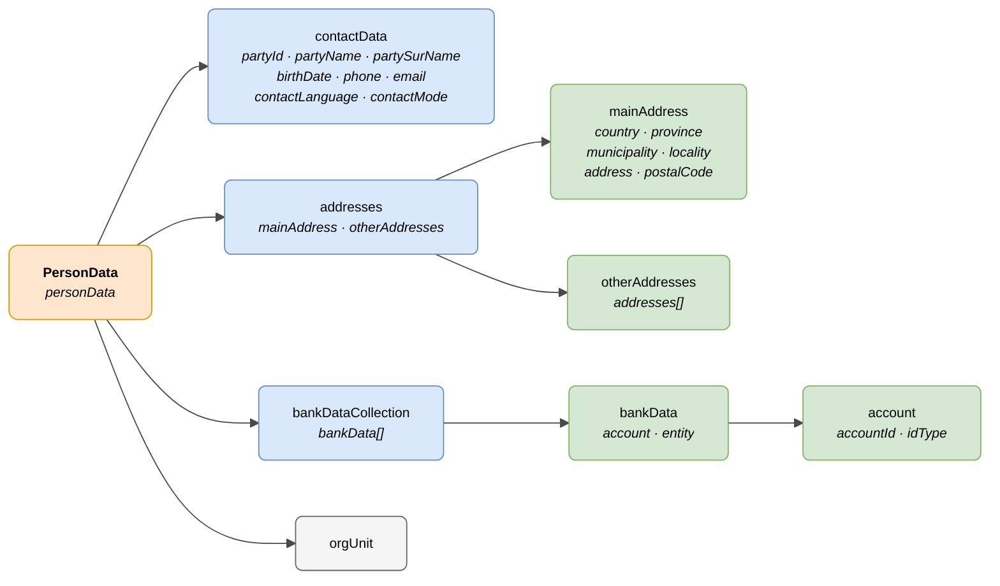

# :material-account-circle: Persona (PersonData)

> - **Versión:** `v0.3.26`
> - **Fecha:** 2026-06-11
> - **Test:** [DN99DENATestMockObjFactoryForPersonData.java]({{ repos.interop_test_blob }}/denaTestCommonDataClasses/src/main/java/dena/test/common/data/persondata/DN99DENATestMockObjFactoryForPersonData.java)
> - **Código:** [DN00PersonData.java]({{ repos.common_data_api_blob }}/denaCommonDataAPIPersonDataModelClasses/src/main/java/dena/api/data/model/persondata/DN00PersonData.java)

## Descripción

El modelo **PersonData** (`DN00PersonData`) representa los datos de una persona ciudadana intercambiados entre la administración y DENA: información de contacto, direcciones y datos bancarios.

Extiende `DN00DENADataExchangedObjectBase` (es un objeto intercambiado principal del modelo DATA-RETRIEVE).

> Ver también: [campos-comunes.md](./campos-comunes.md) para campos heredados (`oid`, `id`, `urls`, `originAdminRef`, `aboutPersonRef`)



| Color | Significado |
|-------|-------------|
| 🟠 Naranja | Objeto principal (PersonData) |
| 🔵 Azul claro | Bloques de primer nivel |
| 🟢 Verde claro | Sub-objetos de detalle |
| ⚪ Gris | Referencias a otros objetos |

---

## 🔗 Código fuente

| Clase | Repositorio |
|-------|-------------|
| DN00PersonData | [Ver código]({{ repos.common_data_api_blob }}/denaCommonDataAPIPersonDataModelClasses/src/main/java/dena/api/data/model/persondata/DN00PersonData.java) |
| DN00ContactData | [Ver código]({{ repos.common_data_api_blob }}/denaCommonDataAPIPersonDataModelClasses/src/main/java/dena/api/data/model/persondata/DN00ContactData.java) |
| DN00Address | [Ver código]({{ repos.common_data_api_blob }}/denaCommonDataAPIPersonDataModelClasses/src/main/java/dena/api/data/model/persondata/DN00Address.java) |
| DN00Addresses | [Ver código]({{ repos.common_data_api_blob }}/denaCommonDataAPIPersonDataModelClasses/src/main/java/dena/api/data/model/persondata/DN00Addresses.java) |
| DN00BankData | [Ver código]({{ repos.common_data_api_blob }}/denaCommonDataAPIPersonDataModelClasses/src/main/java/dena/api/data/model/persondata/DN00BankData.java) |
| DN00BankDataCollection | [Ver código]({{ repos.common_data_api_blob }}/denaCommonDataAPIPersonDataModelClasses/src/main/java/dena/api/data/model/persondata/DN00BankDataCollection.java) |
| DN00Account | [Ver código]({{ repos.common_data_api_blob }}/denaCommonDataAPIPersonDataModelClasses/src/main/java/dena/api/data/model/persondata/DN00Account.java) |
| DN00ContactType | [Ver código]({{ repos.common_data_api_blob }}/denaCommonDataAPIPersonDataModelClasses/src/main/java/dena/api/data/model/persondata/DN00ContactType.java) |
| DN00IdType | [Ver código]({{ repos.common_data_api_blob }}/denaCommonDataAPIPersonDataModelClasses/src/main/java/dena/api/data/model/persondata/DN00IdType.java) |

---

## 🧪 Tests y ejemplos

> Repositorio: [DENA-Euskadi/dena-interop-common-data-test]({{ repos.interop_test_tree }})

| Mock Factory | Repositorio |
|--------------|-------------|
| DN99DENATestMockObjFactoryForPersonData | [Ver código]({{ repos.interop_test_blob }}/denaTestCommonDataClasses/src/main/java/dena/test/common/data/persondata/DN99DENATestMockObjFactoryForPersonData.java) |
| DN99DENATestMockObjFactoryForContactData | [Ver código]({{ repos.interop_test_blob }}/denaTestCommonDataClasses/src/main/java/dena/test/common/data/persondata/DN99DENATestMockObjFactoryForContactData.java) |
| DN99DENATestMockObjFactoryForAddress | [Ver código]({{ repos.interop_test_blob }}/denaTestCommonDataClasses/src/main/java/dena/test/common/data/persondata/DN99DENATestMockObjFactoryForAddress.java) |
| DN99DENATestMockObjFactoryForAddresses | [Ver código]({{ repos.interop_test_blob }}/denaTestCommonDataClasses/src/main/java/dena/test/common/data/persondata/DN99DENATestMockObjFactoryForAddresses.java) |
| DN99DENATestMockObjFactoryForBankData | [Ver código]({{ repos.interop_test_blob }}/denaTestCommonDataClasses/src/main/java/dena/test/common/data/persondata/DN99DENATestMockObjFactoryForBankData.java) |
| DN99DENATestMockObjFactoryForBankDataCollection | [Ver código]({{ repos.interop_test_blob }}/denaTestCommonDataClasses/src/main/java/dena/test/common/data/persondata/DN99DENATestMockObjFactoryForBankDataCollection.java) |
| DN99DENATestMockObjFactoryForAccount | [Ver código]({{ repos.interop_test_blob }}/denaTestCommonDataClasses/src/main/java/dena/test/common/data/persondata/DN99DENATestMockObjFactoryForAccount.java) |
| DN99DENATestMockObjFactoryForContactType | [Ver código]({{ repos.interop_test_blob }}/denaTestCommonDataClasses/src/main/java/dena/test/common/data/persondata/DN99DENATestMockObjFactoryForContactType.java) |
| DN99DENATestMockObjFactoryForIdType | [Ver código]({{ repos.interop_test_blob }}/denaTestCommonDataClasses/src/main/java/dena/test/common/data/persondata/DN99DENATestMockObjFactoryForIdType.java) |

---

## PersonData — Atributos JSON

| Campo | Tipo | Obligatorio | Ejemplo | Descripción |
|-------|------|:-----------:|---------|-------------|
| `type` | `String` | ✅ | `"personData"` | Discriminador polimórfico |
| `oid` | `String` | ✅ | `"PDATA-OID-001"` | Identificador técnico |
| `id` | `String` | ✅ | `"12345678A"` | Identificador de negocio |
| `contactData` | [`DN00ContactData`]({{ repos.common_data_api_blob }}/denaCommonDataAPIPersonDataModelClasses/src/main/java/dena/api/data/model/persondata/DN00ContactData.java) | ✅ | *(ver [contactData](#datos-de-contacto-contactdata))* | Datos de contacto detallados |
| `addresses` | [`DN00Addresses`]({{ repos.common_data_api_blob }}/denaCommonDataAPIPersonDataModelClasses/src/main/java/dena/api/data/model/persondata/DN00Addresses.java) | ❌ | *(ver [Direcciones](#direcciones-addresses))* | Direcciones (principal + otras) |
| `bankDataCollection` | [`DN00BankDataCollection`]({{ repos.common_data_api_blob }}/denaCommonDataAPIPersonDataModelClasses/src/main/java/dena/api/data/model/persondata/DN00BankDataCollection.java) | ❌ | *(ver [Datos bancarios](#datos-bancarios-bankdatacollection))* | Datos bancarios |
| `orgUnit` | [`DN00OrgUnitReference`]({{ repos.common_data_api_blob }}/denaCommonDataAPIModelClasses/src/main/java/dena/api/data/model/org/DN00OrgUnitReference.java) | ❌ | *(ver [unidad-organica.md](./unidad-organica.md))* | Unidad orgánica asociada |

---

## Datos de contacto ([`contactData`]({{ repos.common_data_api_blob }}/denaCommonDataAPIPersonDataModelClasses/src/main/java/dena/api/data/model/persondata/DN00ContactData.java))

| Campo | Tipo | Obligatorio | Ejemplo | Descripción |
|-------|------|:-----------:|---------|-------------|
| `partyId` | `String` | ✅ | `"12345678A"` | NIF/NIE del interesado |
| `partyName` | `String` | ✅ | `"María"` | Nombre |
| `partySurName` | `String` | ✅ | `"García López"` | Apellidos |
| `birthDate` | `String` (ISO 8601) | ❌ | `"1985-03-20T00:00:00Z"` | Fecha de nacimiento |
| `phone` | `String` | ❌ | `"+34600000001"` | Teléfono principal |
| `phone2` | `String` | ❌ | `null` | Teléfono secundario |
| `email` | `String` | ❌ | `"maria@example.com"` | Correo electrónico |
| `contactLanguage` | `String` | ❌ | `"SPANISH"` | Idioma preferido (`SPANISH`, `BASQUE`, `ENGLISH`) |
| `contactMode` | `String` | ❌ | `"ELECTRONIC"` | Modo de contacto preferido |

### Modos de contacto ([`contactMode`]({{ repos.common_data_api_blob }}/denaCommonDataAPIPersonDataModelClasses/src/main/java/dena/api/data/model/persondata/DN00ContactType.java))

| Código | Descripción |
|--------|-------------|
| `POSTAL` | Correo postal |
| `ELECTRONIC` | Medios electrónicos |

---

## Direcciones ([`addresses`]({{ repos.common_data_api_blob }}/denaCommonDataAPIPersonDataModelClasses/src/main/java/dena/api/data/model/persondata/DN00Addresses.java))

| Campo | Tipo | Obligatorio | Ejemplo | Descripción |
|-------|------|:-----------:|---------|-------------|
| `mainAddress` | `Object` | ❌ | *(ver [Dirección](#dirección-mainaddress--cada-elemento-de-otheraddressesaddresses))* | Dirección principal |
| `otherAddresses` | `Object` | ❌ | | Otras direcciones |
| `otherAddresses.addresses` | `Array` | ❌ | | Lista de direcciones adicionales |

### Dirección ([`mainAddress`]({{ repos.common_data_api_blob }}/denaCommonDataAPIPersonDataModelClasses/src/main/java/dena/api/data/model/persondata/DN00Address.java) / cada elemento de `otherAddresses.addresses`)

| Campo | Tipo | Obligatorio | Ejemplo | Descripción |
|-------|------|:-----------:|---------|-------------|
| `addressDescription` | `LanguageTexts` | ❌ | `{"SPANISH":"Domicilio habitual"}` | Descripción de la dirección |
| `countryNoraCode` | `String` | ❌ | `"108"` | Código NORA del país |
| `countryDesc` | `LanguageTexts` | ❌ | `{"SPANISH":"España"}` | Nombre del país |
| `provinceNoraCode` | `String` | ❌ | `"48"` | Código NORA de la provincia |
| `provinceDesc` | `LanguageTexts` | ❌ | `{"SPANISH":"Bizkaia"}` | Nombre de la provincia |
| `municipalityNoraCode` | `String` | ❌ | `"48020"` | Código NORA del municipio |
| `municipalityDesc` | `LanguageTexts` | ❌ | `{"SPANISH":"Bilbao"}` | Nombre del municipio |
| `localityNoraCode` | `String` | ❌ | `"48020"` | Código NORA de la localidad |
| `localityDesc` | `LanguageTexts` | ❌ | `{"SPANISH":"Bilbao"}` | Nombre de la localidad |
| `address` | `String` | ❌ | `"Gran Vía 50, 3º B"` | Dirección postal completa |
| `postalCode` | `String` | ❌ | `"48001"` | Código postal |

---

## Datos bancarios ([`bankDataCollection`]({{ repos.common_data_api_blob }}/denaCommonDataAPIPersonDataModelClasses/src/main/java/dena/api/data/model/persondata/DN00BankDataCollection.java))

| Campo | Tipo | Obligatorio | Ejemplo | Descripción |
|-------|------|:-----------:|---------|-------------|
| `bankData` | `Array` | ❌ | | Lista de datos bancarios |

### Cada elemento de [`bankData`]({{ repos.common_data_api_blob }}/denaCommonDataAPIPersonDataModelClasses/src/main/java/dena/api/data/model/persondata/DN00BankData.java)

| Campo | Tipo | Obligatorio | Ejemplo | Descripción |
|-------|------|:-----------:|---------|-------------|
| `account.accountId` | `String` | ✅ | `"ES9121000418450200051332"` | Número de cuenta (IBAN u otro) |
| `account.idType` | `String` | ✅ | `"IBAN"` | Tipo de identificador |
| `entity` | `String` | ❌ | `"CaixaBank"` | Entidad bancaria |

### Tipos de identificador de cuenta ([`idType`]({{ repos.common_data_api_blob }}/denaCommonDataAPIPersonDataModelClasses/src/main/java/dena/api/data/model/persondata/DN00IdType.java))

| Código | Descripción |
|--------|-------------|
| `IBAN` | Formato IBAN |
| `CUSTOM` | Otro formato |

---

## Ejemplo JSON

```json
{
  "type": "personData",
  "oid": "PDATA-OID-001",
  "id": "12345678A",
  "contactData": {
    "partyId": "12345678A",
    "partyName": "María",
    "partySurName": "García López",
    "birthDate": "1985-03-20T00:00:00Z",
    "phone": "+34600000001",
    "phone2": null,
    "email": "maria.garcia@example.com",
    "contactLanguage": "SPANISH",
    "contactMode": "ELECTRONIC"
  },
  "addresses": {
    "mainAddress": {
      "countryNoraCode": "108",
      "countryDesc": { "SPANISH": "España", "BASQUE": "Espainia" },
      "provinceNoraCode": "48",
      "provinceDesc": { "SPANISH": "Bizkaia", "BASQUE": "Bizkaia" },
      "municipalityNoraCode": "48020",
      "municipalityDesc": { "SPANISH": "Bilbao", "BASQUE": "Bilbo" },
      "address": "Gran Vía 50, 3º B",
      "postalCode": "48001"
    },
    "otherAddresses": {
      "addresses": []
    }
  },
  "bankDataCollection": {
    "bankData": [
      {
        "account": {
          "accountId": "ES9121000418450200051332",
          "idType": "IBAN"
        },
        "entity": "CaixaBank"
      }
    ]
  },
  "orgUnit": {
    "id": "ORG-HACIENDA",
    "displayNameByLanguage": { "SPANISH": "Hacienda Foral de Bizkaia", "BASQUE": "Bizkaiko Foru Ogasuna" }
  }
}
```

---

## Reglas de validación

- `contactData.partyId` es obligatorio y debe ser un NIF/NIE válido.
- `contactData.partyName` y `contactData.partySurName` son obligatorios.
- Si se incluyen direcciones, los códigos NORA deben ser válidos según el catálogo NORA.
- Si se incluyen datos bancarios con `idType: "IBAN"`, el `accountId` debe ser un IBAN válido.

---

<!-- DENA-DOC-FOOTER -->
---
<sub>DENA Docs v0.3.26 · 2026-06-11</sub>
