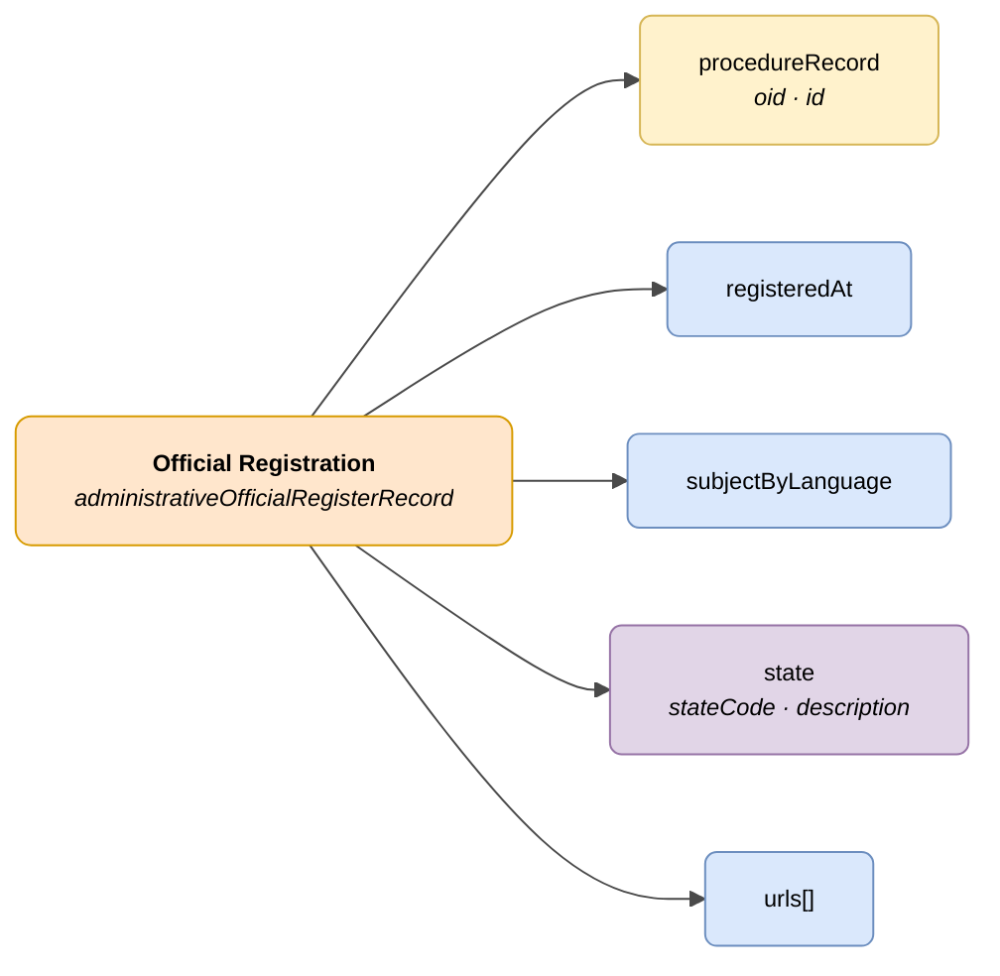

# :material-book-open-page-variant: Official Registration (Official Register Record)

> - **Version:** `v{{ dena.version }}`
> - **Date:** {{ dena.date }}
> - **Test:** [DN99DENATestMockObjFactoryForAdministrativeOfficialRegisterRecord.java]({{ repos.interop_test_blob }}/denaTestCommonDataClasses/src/main/java/dena/test/common/data/register/DN99DENATestMockObjFactoryForAdministrativeOfficialRegisterRecord.java)
> - **Code:** [DN00AdministrativeOfficialRegisterRecord.java]({{ repos.common_data_api_blob }}/denaCommonDataAPIAdministrativeOfficialRegisterModelClasses/src/main/java/dena/api/data/model/register/DN00AdministrativeOfficialRegisterRecord.java)

## Description

Represents an inbound or outbound register entry in an official register, linked to a record.

> See also: [campos-comunes.md](./campos-comunes.md) for inherited fields (`oid`, `id`, `urls`, `originAdmin`, `aboutPerson`)



| Colour | Meaning |
|--------|---------|
| 🟠 Orange | Main object (Official Registration) |
| 🟡 Yellow | Reference to another object (Record) |
| 🟣 Violet | Enums / states |
| 🔵 Light blue | Data fields |

---

## 🔗 Source code

| Class | Repository |
|-------|------------|
| DN00AdministrativeOfficialRegisterRecord | [View code]({{ repos.common_data_api_blob }}/denaCommonDataAPIAdministrativeOfficialRegisterModelClasses/src/main/java/dena/api/data/model/register/DN00AdministrativeOfficialRegisterRecord.java) |
| DN00AdministrativeOfficialRegisterRecordState | [View code]({{ repos.common_data_api_blob }}/denaCommonDataAPIAdministrativeOfficialRegisterModelClasses/src/main/java/dena/api/data/model/register/DN00AdministrativeOfficialRegisterRecordState.java) |
| DN00AdministrativeOfficialRegisterRecordStateCode | [View code]({{ repos.common_data_api_blob }}/denaCommonDataAPIAdministrativeOfficialRegisterModelClasses/src/main/java/dena/api/data/model/register/DN00AdministrativeOfficialRegisterRecordStateCode.java) |

---

## 🧪 Tests and examples

| Test | Repository |
|------|------------|
| DN00AdminFileTest | [View test]({{ repos.interop_test_blob }}/denaTestCommonDataClasses/src/main/java/dena/test/common/data/register/DN99DENATestMockObjFactoryForAdministrativeOfficialRegisterRecord.java) |
| DN00AdminFileStateTest | [View test]({{ repos.interop_test_blob }}/denaTestCommonDataClasses/src/main/java/dena/test/common/data/register/DN99DENATestMockObjFactoryForAdministrativeOfficialRegisterRecordState.java) |

---

## JSON attributes

| Field | Type | Mandatory | Example | Description |
|-------|------|:---------:|---------|-------------|
| `type` | `String` | ✅ | `"administrativeOfficialRegisterRecord"` | Polymorphic discriminator |
| `oid` | `String` | ✅ | `"REG-OID-001"` | Unique technical identifier |
| `id` | `String` | ✅ | `"REG-2024-00789"` | Business identifier |
| `procedureRecord` | `Object` | ✅ | `{"oid":"EXP-OID-001","id":"EXP-2024-00123"}` *(see [`DN00AdmistrativeServiceProcedureRecord`]({{ repos.common_data_api_blob }}/denaCommonDataAPIAdministrativeServicesModelClasses/src/main/java/dena/api/data/model/administrativeservices/DN00AdmistrativeServiceProcedureRecord.java))* | Reference to the record |
| `registeredAt` | `String` (ISO 8601) | ✅ | `"2024-04-10T08:30:00Z"` | Registration date/time |
| `subjectByLanguage` | `LanguageTexts` | ✅ | `{"SPANISH":"Solicitud licencia"}` | Subject of the register entry |
| `state` | `Object` | ✅ | *(see [`DN00AdministrativeOfficialRegisterRecordState`]({{ repos.common_data_api_blob }}/denaCommonDataAPIAdministrativeOfficialRegisterModelClasses/src/main/java/dena/api/data/model/register/DN00AdministrativeOfficialRegisterRecordState.java))* | Current state |
| `state.stateCode` | `String` | ✅ | `"PRESENTED"` | State code |
| `state.description` | `LanguageTexts` | ❌ | `{"SPANISH":"Presentado"}` | Multilingual description |
| `urls` | `Array` | ❌ (recommended) | *(see [campos-comunes.md](./campos-comunes.md) · [`DN00DENADataExchangedObjectBase`]({{ repos.common_data_api_blob }}/denaCommonDataAPIModelClasses/src/main/java/dena/api/data/model/DN00DENADataExchangedObjectBase.java))* | Access URLs |

---

## States (`state.stateCode`)

| Code | Description |
|------|-------------|
| `PRESENTED` | Presented (direct entry) |
| `RECEIVED_FROM_OTHER_ORG_UNIT` | Received from another unit |
| `TRANSFERRED_FROM_OTHER_ORG_UNIT` | Transferred from another unit |

---

## JSON example

```json
{
  "type": "administrativeOfficialRegisterRecord",
  "oid": "REG-OID-001",
  "id": "REG-2024-00789",
  "procedureRecord": { "oid": "EXP-OID-001", "id": "EXP-2024-00123" },
  "registeredAt": "2024-04-10T08:30:00Z",
  "subjectByLanguage": {
    "SPANISH": "Solicitud de licencia de obras",
    "BASQUE": "Obra-lizentzia eskaera"
  },
  "state": {
    "stateCode": "PRESENTED",
    "description": { "SPANISH": "Presentado", "BASQUE": "Aurkeztua" }
  },
  "urls": [
    { "url": "https://sede.miadmin.eus/registro/REG-2024-00789", "language": "SPANISH", "tags": ["default"] }
  ]
}
```

---

## Validation rules

- `registeredAt` is mandatory and must be a valid ISO 8601 date.
- `subjectByLanguage` must include at least texts in `SPANISH` and `BASQUE`.
- `state.stateCode` must be one of the values defined in the states table.
- See [validaciones.md](../validaciones.md) for full rules.


---

<!-- DENA-DOC-FOOTER -->
---
<sub>DENA Docs v{{ dena.version }} · {{ dena.date }}</sub>
