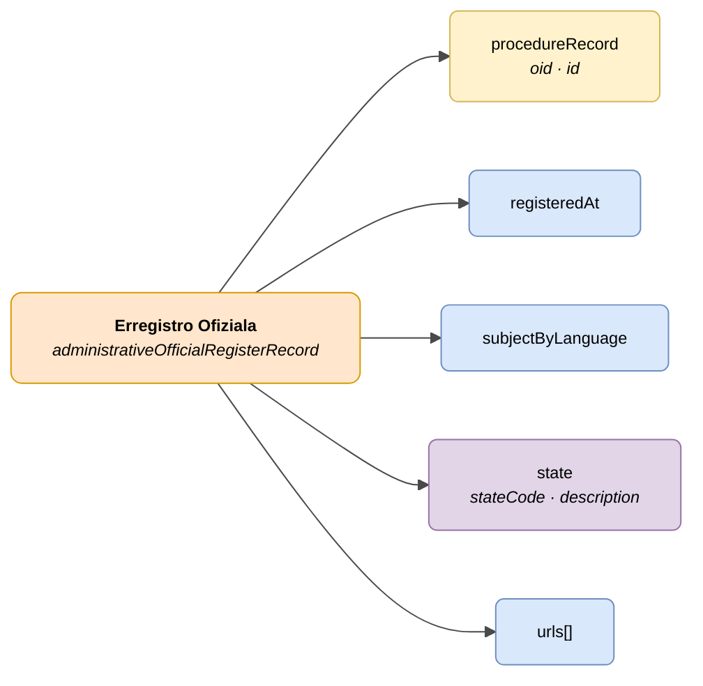

# :material-book-open-page-variant: Erregistro Ofiziala (Official Register Record)

> - **Bertsioa:** `v{{ dena.version }}`
> - **Data:** {{ dena.date }}
> - **Testa:** [DN99DENATestMockObjFactoryForAdministrativeOfficialRegisterRecord.java]({{ repos.interop_test_blob }}/denaTestCommonDataClasses/src/main/java/dena/test/common/data/register/DN99DENATestMockObjFactoryForAdministrativeOfficialRegisterRecord.java)
> - **Kodea:** [DN00AdministrativeOfficialRegisterRecord.java]({{ repos.common_data_api_blob }}/denaCommonDataAPIAdministrativeOfficialRegisterModelClasses/src/main/java/dena/api/data/model/register/DN00AdministrativeOfficialRegisterRecord.java)

## Deskribapena

Espediente bati lotutako erregistro ofizial bateko sarrera edo irteera-erregistroko idazpena adierazten du.

> Ikusi baita ere: [campos-comunes.md](./campos-comunes.md) heredatutako eremuetarako (`oid`, `id`, `urls`, `originAdmin`, `aboutPerson`)



| Kolorea | Esanahia |
|---------|----------|
| 🟠 Laranja | Objektu nagusia (Erregistro Ofiziala) |
| 🟡 Horia | Beste objektu baten erreferentzia (Espedientea) |
| 🟣 Morea | Enumak / egoerak |
| 🔵 Urdin argia | Datu-eremuak |

---

## 🔗 Iturburu-kodea

| Klasea | Biltegia |
|--------|----------|
| DN00AdministrativeOfficialRegisterRecord | [Ikusi kodea]({{ repos.common_data_api_blob }}/denaCommonDataAPIAdministrativeOfficialRegisterModelClasses/src/main/java/dena/api/data/model/register/DN00AdministrativeOfficialRegisterRecord.java) |
| DN00AdministrativeOfficialRegisterRecordState | [Ikusi kodea]({{ repos.common_data_api_blob }}/denaCommonDataAPIAdministrativeOfficialRegisterModelClasses/src/main/java/dena/api/data/model/register/DN00AdministrativeOfficialRegisterRecordState.java) |
| DN00AdministrativeOfficialRegisterRecordStateCode | [Ikusi kodea]({{ repos.common_data_api_blob }}/denaCommonDataAPIAdministrativeOfficialRegisterModelClasses/src/main/java/dena/api/data/model/register/DN00AdministrativeOfficialRegisterRecordStateCode.java) |

---

## 🧪 Testak eta adibideak

| Testa | Biltegia |
|-------|----------|
| DN00AdminFileTest | [Ikusi testa]({{ repos.interop_test_blob }}/denaTestCommonDataClasses/src/main/java/dena/test/common/data/register/DN99DENATestMockObjFactoryForAdministrativeOfficialRegisterRecord.java) |
| DN00AdminFileStateTest | [Ikusi testa]({{ repos.interop_test_blob }}/denaTestCommonDataClasses/src/main/java/dena/test/common/data/register/DN99DENATestMockObjFactoryForAdministrativeOfficialRegisterRecordState.java) |

---

## JSON atributuak

| Eremua | Mota | Derrigorrez | Adibidea | Deskribapena |
|--------|------|:-----------:|----------|--------------|
| `type` | `String` | ✅ | `"administrativeOfficialRegisterRecord"` | Diskriminatzaile polimorfiko |
| `oid` | `String` | ✅ | `"REG-OID-001"` | Identifikatzaile tekniko bakarra |
| `id` | `String` | ✅ | `"REG-2024-00789"` | Negozio-identifikatzailea |
| `procedureRecord` | `Object` | ✅ | `{"oid":"EXP-OID-001","id":"EXP-2024-00123"}` *(ikusi [`DN00AdmistrativeServiceProcedureRecord`]({{ repos.common_data_api_blob }}/denaCommonDataAPIAdministrativeServicesModelClasses/src/main/java/dena/api/data/model/administrativeservices/DN00AdmistrativeServiceProcedureRecord.java))* | Espedientearen erreferentzia |
| `registeredAt` | `String` (ISO 8601) | ✅ | `"2024-04-10T08:30:00Z"` | Erregistro-data/ordua |
| `subjectByLanguage` | `LanguageTexts` | ✅ | `{"SPANISH":"Solicitud licencia"}` | Erregistro-idazpenaren gaia |
| `state` | `Object` | ✅ | *(ikusi [`DN00AdministrativeOfficialRegisterRecordState`]({{ repos.common_data_api_blob }}/denaCommonDataAPIAdministrativeOfficialRegisterModelClasses/src/main/java/dena/api/data/model/register/DN00AdministrativeOfficialRegisterRecordState.java))* | Uneko egoera |
| `state.stateCode` | `String` | ✅ | `"PRESENTED"` | Egoera-kodea |
| `state.description` | `LanguageTexts` | ❌ | `{"SPANISH":"Presentado"}` | Deskribapen eleanitza |
| `urls` | `Array` | ❌ (gomendatua) | *(ikusi [campos-comunes.md](./campos-comunes.md) · [`DN00DENADataExchangedObjectBase`]({{ repos.common_data_api_blob }}/denaCommonDataAPIModelClasses/src/main/java/dena/api/data/model/DN00DENADataExchangedObjectBase.java))* | Sarbide-URLak |

---

## Egoerak (`state.stateCode`)

| Kodea | Deskribapena |
|-------|--------------|
| `PRESENTED` | Aurkeztua (sarrera zuzena) |
| `RECEIVED_FROM_OTHER_ORG_UNIT` | Beste unitate batetik jasoa |
| `TRANSFERRED_FROM_OTHER_ORG_UNIT` | Beste unitate batetik transferitua |

---

## JSON adibidea

```json
{
  "type": "administrativeOfficialRegisterRecord",
  "oid": "REG-OID-001",
  "id": "REG-2024-00789",
  "procedureRecord": { "oid": "EXP-OID-001", "id": "EXP-2024-00123" },
  "registeredAt": "2024-04-10T08:30:00Z",
  "subjectByLanguage": {
    "SPANISH": "Solicitud de licencia de obras",
    "BASQUE": "Obra-lizentzia eskaera"
  },
  "state": {
    "stateCode": "PRESENTED",
    "description": { "SPANISH": "Presentado", "BASQUE": "Aurkeztua" }
  },
  "urls": [
    { "url": "https://sede.miadmin.eus/registro/REG-2024-00789", "language": "SPANISH", "tags": ["default"] }
  ]
}
```

---

## Balioztatze-arauak

- `registeredAt` derrigorrez da eta ISO 8601 data balioduna izan behar du.
- `subjectByLanguage`-k gutxienez `SPANISH` eta `BASQUE` testua sartu behar du.
- `state.stateCode` egoeren taulan definitutako balioen bat izan behar da.
- Ikusi [validaciones.md](../validaciones.md) arau osoentzat.


---

<!-- DENA-DOC-FOOTER -->
---
<sub>DENA Docs v{{ dena.version }} · {{ dena.date }}</sub>
