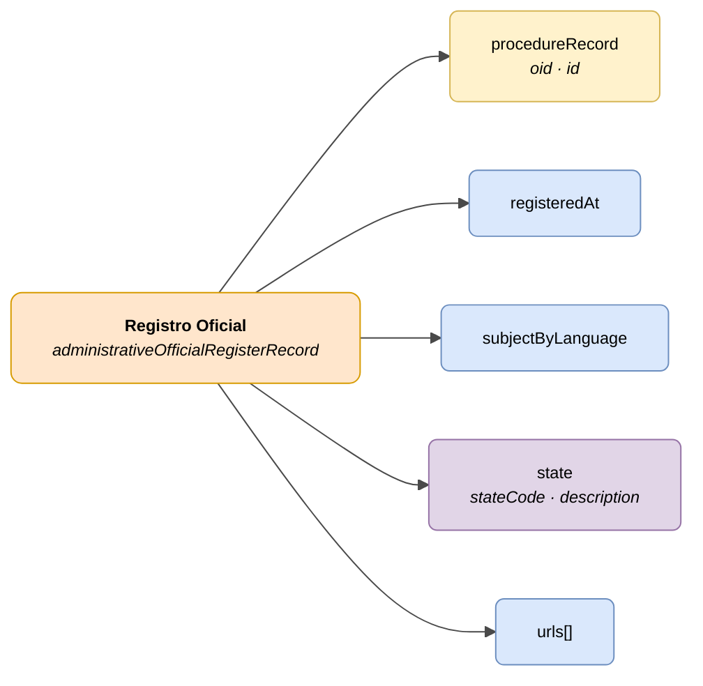

# :material-book-open-page-variant: Registro Oficial (Official Registry Record)

> - **Versión:** `v0.3.26`
> - **Fecha:** 2026-06-11
> - **Test:** [DN99DENATestMockObjFactoryForAdministrativeOfficialRegistryRecord.java]({{ repos.interop_test_blob }}/denaTestCommonDataClasses/src/main/java/dena/test/common/data/registry/DN99DENATestMockObjFactoryForAdministrativeOfficialRegistryRecord.java)
> - **Código:** [DN00AdministrativeOfficialRegistryRecord.java]({{ repos.common_data_api_blob }}/denaCommonDataAPIAdministrativeOfficialRegistryModelClasses/src/main/java/dena/api/data/model/register/DN00AdministrativeOfficialRegistryRecord.java)

## Descripción

Representa un asiento registral de entrada o salida en un registro oficial, vinculado a un expediente.

> Ver también: [campos-comunes.md](./campos-comunes.md) para campos heredados (`oid`, `id`, `urls`, `originAdminRef`, `aboutPersonRef`)



| Color | Significado |
|-------|-------------|
| 🟠 Naranja | Objeto principal (Registro Oficial) |
| 🟡 Amarillo | Referencia a otro objeto (Expediente) |
| 🟣 Violeta | Enums / estados |
| 🔵 Azul claro | Campos de datos |

---

## 🔗 Código fuente

| Clase | Repositorio |
|-------|-------------|
| DN00AdministrativeOfficialRegistryRecord | [Ver código]({{ repos.common_data_api_blob }}/denaCommonDataAPIAdministrativeOfficialRegistryModelClasses/src/main/java/dena/api/data/model/register/DN00AdministrativeOfficialRegistryRecord.java) |
| DN00AdministrativeOfficialRegistryRecordState | [Ver código]({{ repos.common_data_api_blob }}/denaCommonDataAPIAdministrativeOfficialRegistryModelClasses/src/main/java/dena/api/data/model/register/DN00AdministrativeOfficialRegistryRecordState.java) |
| DN00AdministrativeOfficialRegistryRecordStateCode | [Ver código]({{ repos.common_data_api_blob }}/denaCommonDataAPIAdministrativeOfficialRegistryModelClasses/src/main/java/dena/api/data/model/register/DN00AdministrativeOfficialRegistryRecordStateCode.java) |

---

## 🧪 Tests y ejemplos

| Test | Repositorio |
|------|-------------|
| DN00AdminFileTest | [Ver test]({{ repos.interop_test_blob }}/denaTestCommonDataClasses/src/main/java/dena/test/common/data/registry/DN99DENATestMockObjFactoryForAdministrativeOfficialRegistryRecord.java) |
| DN00AdminFileStateTest | [Ver test]({{ repos.interop_test_blob }}/denaTestCommonDataClasses/src/main/java/dena/test/common/data/registry/DN99DENATestMockObjFactoryForAdministrativeOfficialRegistryRecordState.java) |

---

## Atributos JSON

| Campo | Tipo | Obligatorio | Ejemplo | Descripción |
|-------|------|:-----------:|---------|-------------|
| `type` | `String` | ✅ | `"administrativeOfficialRegisterRecord"` | Discriminador polimórfico |
| `oid` | `String` | ✅ | `"REG-OID-001"` | Identificador técnico único |
| `id` | `String` | ✅ | `"REG-2024-00789"` | Identificador de negocio |
| `procedureRecord` | `Object` | ✅ | `{"oid":"EXP-OID-001","id":"EXP-2024-00123"}` *(ver [`DN00AdmistrativeServiceProcedureRecord`]({{ repos.common_data_api_blob }}/denaCommonDataAPIAdministrativeServicesModelClasses/src/main/java/dena/api/data/model/administrativeservices/DN00AdmistrativeServiceProcedureRecord.java))* | Referencia al expediente |
| `registeredAt` | `String` (ISO 8601) | ✅ | `"2024-04-10T08:30:00Z"` | Fecha/hora de registro |
| `subjectByLanguage` | `LanguageTexts` | ✅ | `{"SPANISH":"Solicitud licencia"}` | Asunto del asiento registral |
| `state` | `Object` | ✅ | *(ver [`DN00AdministrativeOfficialRegistryRecordState`]({{ repos.common_data_api_blob }}/denaCommonDataAPIAdministrativeOfficialRegistryModelClasses/src/main/java/dena/api/data/model/register/DN00AdministrativeOfficialRegistryRecordState.java))* | Estado actual |
| `state.stateCode` | `String` | ✅ | `"PRESENTED"` | Código de estado |
| `state.description` | `LanguageTexts` | ❌ | `{"SPANISH":"Presentado"}` | Descripción multiidioma |
| `urls` | `Array` | ❌ (recomendado) | *(ver [campos-comunes.md](./campos-comunes.md) · [`DN00DENADataExchangedObjectBase`]({{ repos.common_data_api_blob }}/denaCommonDataAPIModelClasses/src/main/java/dena/api/data/model/DN00DENADataExchangedObjectBase.java))* | URLs de acceso |

---

## Estados (`state.stateCode`)

| Código | Descripción |
|--------|-------------|
| `PRESENTED` | Presentado (entrada directa) |
| `RECEIVED_FROM_OTHER_ORG_UNIT` | Recibido desde otra unidad |
| `TRANSFERRED_FROM_OTHER_ORG_UNIT` | Transferido desde otra unidad |

---

## Ejemplo JSON

```json
{
  "type": "administrativeOfficialRegisterRecord",
  "oid": "REG-OID-001",
  "id": "REG-2024-00789",
  "procedureRecord": { "oid": "EXP-OID-001", "id": "EXP-2024-00123" },
  "registeredAt": "2024-04-10T08:30:00Z",
  "subjectByLanguage": {
    "SPANISH": "Solicitud de licencia de obras",
    "BASQUE": "Obra-lizentzia eskaera"
  },
  "state": {
    "stateCode": "PRESENTED",
    "description": { "SPANISH": "Presentado", "BASQUE": "Aurkeztua" }
  },
  "urls": [
    { "url": "https://sede.miadmin.eus/registro/REG-2024-00789", "language": "SPANISH", "tags": ["default"] }
  ]
}
```

---

## Reglas de validación

- `registeredAt` es obligatorio y debe ser una fecha ISO 8601 válida.
- `subjectByLanguage` debe incluir al menos textos en `SPANISH` y `BASQUE`.
- `state.stateCode` debe ser uno de los valores definidos en la tabla de estados.
- Ver [validaciones.md](../validaciones.md) para reglas completas.


---

<!-- DENA-DOC-FOOTER -->
---
<sub>DENA Docs v0.3.26 · 2026-06-11</sub>
