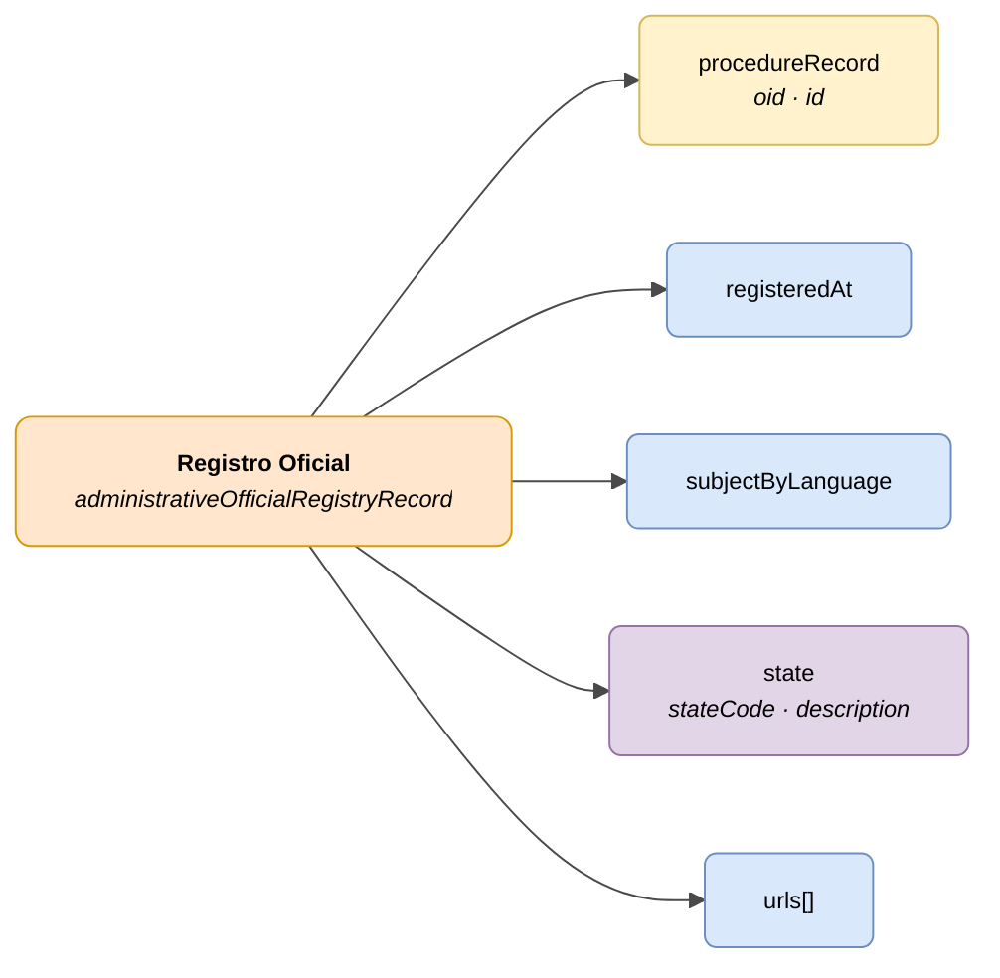

# Registro Oficial (Official Registry Record)

> - **Versión:** `v0.3.25`
> - **Fecha:** 2026-06-10
> - **Test:** [DN99DENATestMockObjFactoryForAdministrativeOfficialRegistryRecord.java](https://github.com/DENA-Euskadi/dena-interop-common-data-test/blob/develop/denaTestCommonDataClasses/src/main/java/dena/test/common/data/registry/DN99DENATestMockObjFactoryForAdministrativeOfficialRegistryRecord.java)
> - **Código:** [DN00AdministrativeOfficialRegistryRecord.java](https://github.com/DENA-Euskadi/dena-common-data-api/blob/develop/denaCommonDataAPIAdministrativeOfficialRegistryModelClasses/src/main/java/dena/api/data/model/register/DN00AdministrativeOfficialRegistryRecord.java)

## Descripción

Representa un asiento registral de entrada o salida en un registro oficial, vinculado a un expediente.

> Ver también: [campos-comunes.md](./campos-comunes.md) para campos heredados (`oid`, `id`, `urls`, `originAdminRef`, `aboutPersonRef`)



| Color | Significado |
|-------|-------------|
| 🟠 Naranja | Objeto principal (Registro Oficial) |
| 🟡 Amarillo | Referencia a otro objeto (Expediente) |
| 🟣 Violeta | Enums / estados |
| 🔵 Azul claro | Campos de datos |

---

## Atributos JSON

| Campo | Tipo | Obligatorio | Descripción |
|-------|------|:-----------:|-------------|
| `type` | `String` | ✅ | `"administrativeOfficialRegistryRecord"` |
| `oid` | `String` | ✅ | Identificador técnico único |
| `id` | `String` | ✅ | Identificador de negocio |
| `procedureRecord` | `Object` | ✅ | Referencia al expediente (`oid`, `id`) |
| `registeredAt` | `String` (ISO 8601) | ✅ | Fecha/hora de registro |
| `subjectByLanguage` | `LanguageTexts` | ✅ | Asunto del asiento registral |
| `state` | `Object` | ✅ | Estado actual |
| `state.stateCode` | `String` | ✅ | Código de estado |
| `state.description` | `LanguageTexts` | ❌ | Descripción multiidioma |
| `urls` | `Array` | ❌ (recomendado) | URLs de acceso |

---

## Estados (`state.stateCode`)

| Código | Descripción |
|--------|-------------|
| `PRESENTED` | Presentado (entrada directa) |
| `RECEIVED_FROM_OTHER_ORG_UNIT` | Recibido desde otra unidad |
| `TRANSFERRED_FROM_OTHER_ORG_UNIT` | Transferido desde otra unidad |

---

## Ejemplo JSON

```json
{
  "type": "administrativeOfficialRegistryRecord",
  "oid": "REG-OID-001",
  "id": "REG-2024-00789",
  "procedureRecord": { "oid": "EXP-OID-001", "id": "EXP-2024-00123" },
  "registeredAt": "2024-04-10T08:30:00Z",
  "subjectByLanguage": {
    "SPANISH": "Solicitud de licencia de obras",
    "BASQUE": "Obra-lizentzia eskaera"
  },
  "state": {
    "stateCode": "PRESENTED",
    "description": { "SPANISH": "Presentado", "BASQUE": "Aurkeztua" }
  },
  "urls": [
    { "url": "https://sede.miadmin.eus/registro/REG-2024-00789", "language": "SPANISH", "tags": ["default"] }
  ]
}
```

---

## Reglas de validación

- `registeredAt` es obligatorio y debe ser una fecha ISO 8601 válida.
- `subjectByLanguage` debe incluir al menos textos en `SPANISH` y `BASQUE`.
- `state.stateCode` debe ser uno de los valores definidos en la tabla de estados.
- Ver [validaciones.md](../validaciones.md) para reglas completas.


---

## 🔗 Código fuente

| Clase | Repositorio |
|-------|-------------|
| DN00AdministrativeOfficialRegistryRecord | [Ver código](https://github.com/DENA-Euskadi/dena-common-data-api/blob/develop/denaCommonDataAPIAdministrativeOfficialRegistryModelClasses/src/main/java/dena/api/data/model/register/DN00AdministrativeOfficialRegistryRecord.java) |
| DN00AdministrativeOfficialRegistryRecordState | [Ver código](https://github.com/DENA-Euskadi/dena-common-data-api/blob/develop/denaCommonDataAPIAdministrativeOfficialRegistryModelClasses/src/main/java/dena/api/data/model/register/DN00AdministrativeOfficialRegistryRecordState.java) |
| DN00AdministrativeOfficialRegistryRecordStateCode | [Ver código](https://github.com/DENA-Euskadi/dena-common-data-api/blob/develop/denaCommonDataAPIAdministrativeOfficialRegistryModelClasses/src/main/java/dena/api/data/model/register/DN00AdministrativeOfficialRegistryRecordStateCode.java) |


---

## 🧪 Tests y ejemplos

| Test | Repositorio |
|------|-------------|
| DN00AdminFileTest | [Ver test](https://github.com/DENA-Euskadi/dena-interop-common-data-test/blob/develop/denaTestCommonDataClasses/src/main/java/dena/test/common/data/registry/DN99DENATestMockObjFactoryForAdministrativeOfficialRegistryRecord.java) |
| DN00AdminFileStateTest | [Ver test](https://github.com/DENA-Euskadi/dena-interop-common-data-test/blob/develop/denaTestCommonDataClasses/src/main/java/dena/test/common/data/registry/DN99DENATestMockObjFactoryForAdministrativeOfficialRegistryRecordState.java) |


<!-- DENA-DOC-FOOTER -->
---
<sub>DENA Docs v0.3.25 · 2026-06-10</sub>
