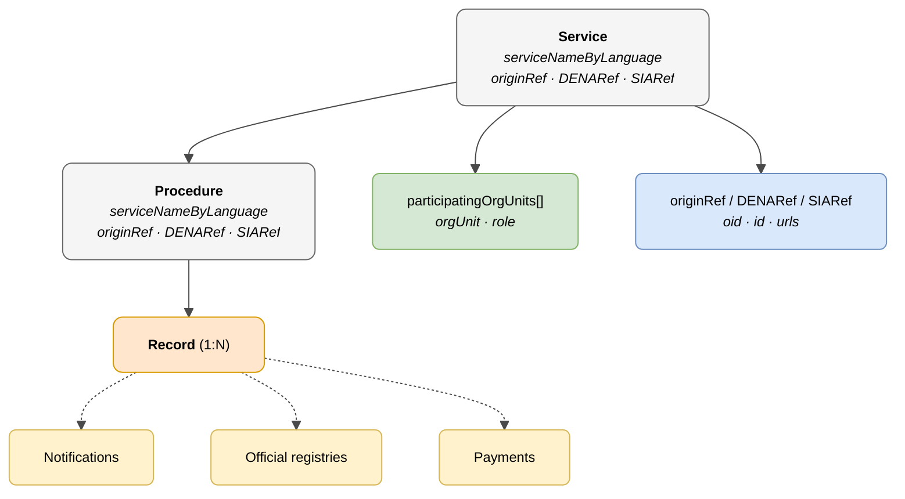

# :material-cog: Administrative Service

> - **Version:** `v{{ dena.version }}`
> - **Date:** {{ dena.date }}
> - **Test:** [DN99DENATestMockObjFactoryForAdmistrativeServiceObjectBase.java]({{ repos.interop_test_blob }}/denaTestCommonDataClasses/src/main/java/dena/test/common/data/services/DN99DENATestMockObjFactoryForAdmistrativeServiceObjectBase.java)
> - **Code:**
>   - [DN00AdmistrativeService.java]({{ repos.common_data_api_blob }}/denaCommonDataAPIAdministrativeServicesModelClasses/src/main/java/dena/api/data/model/administrativeservices/DN00AdmistrativeService.java)
>   - [DN00AdministrativeServiceProcedure.java]({{ repos.common_data_api_blob }}/denaCommonDataAPIAdministrativeServicesModelClasses/src/main/java/dena/api/data/model/administrativeservices/DN00AdministrativeServiceProcedure.java)

## Description

The **Service** and the **Procedure** form the hierarchical context of the record. Every record belongs to a procedure, and every procedure belongs to a service.



| Colour | Meaning |
|-------|-------------|
| ⚪ Grey | Hierarchical context (Service / Procedure) |
| 🟠 Orange | Domain object (Record) |
| 🟡 Yellow | Dependent objects (Notification, Registry, Payment) |
| 🟢 Green | Organizational units |
| 🔵 Light blue | References (originRef / DENARef / SIARef) |

---

## 🔗 Source code

| Class | Repository |
|-------|-------------|
| DN00AdmistrativeService | [View code]({{ repos.common_data_api_blob }}/denaCommonDataAPIAdministrativeServicesModelClasses/src/main/java/dena/api/data/model/administrativeservices/DN00AdmistrativeService.java) |
| DN00AdministrativeServiceProcedure | [View code]({{ repos.common_data_api_blob }}/denaCommonDataAPIAdministrativeServicesModelClasses/src/main/java/dena/api/data/model/administrativeservices/DN00AdministrativeServiceProcedure.java) |
| DN00AdmistrativeServiceObjectBase | [View code]({{ repos.common_data_api_blob }}/denaCommonDataAPIAdministrativeServicesModelClasses/src/main/java/dena/api/data/model/administrativeservices/DN00AdmistrativeServiceObjectBase.java) |
| DN00AdministrativeServiceReference | [View code]({{ repos.common_data_api_blob }}/denaCommonDataAPIAdministrativeServicesModelClasses/src/main/java/dena/api/data/model/administrativeservices/refs/DN00AdministrativeServiceReference.java) |
| DN00AdministrativeServiceProcedureReference | [View code]({{ repos.common_data_api_blob }}/denaCommonDataAPIAdministrativeServicesModelClasses/src/main/java/dena/api/data/model/administrativeservices/refs/DN00AdministrativeServiceProcedureReference.java) |
| DN00AdministrativeServiceObjectReferenceBase | [View code]({{ repos.common_data_api_blob }}/denaCommonDataAPIAdministrativeServicesModelClasses/src/main/java/dena/api/data/model/administrativeservices/refs/DN00AdministrativeServiceObjectReferenceBase.java) |

---

## 🧪 Tests and examples

> Repository: [DENA-Euskadi/dena-interop-common-data-test]({{ repos.interop_test_tree }})

| Mock Factory | Repository |
|--------------|-------------|
| DN99DENATestMockObjFactoryForAdmistrativeServiceObjectBase | [View code]({{ repos.interop_test_blob }}/denaTestCommonDataClasses/src/main/java/dena/test/common/data/services/DN99DENATestMockObjFactoryForAdmistrativeServiceObjectBase.java) |
| DN99DENATestMockObjFactoryForAdmistrativeService | [View code]({{ repos.interop_test_blob }}/denaTestCommonDataClasses/src/main/java/dena/test/common/data/services/DN99DENATestMockObjFactoryForAdmistrativeService.java) |
| DN99DENATestMockObjFactoryForAdministrativeServiceProcedure | [View code]({{ repos.interop_test_blob }}/denaTestCommonDataClasses/src/main/java/dena/test/common/data/services/DN99DENATestMockObjFactoryForAdministrativeServiceProcedure.java) |
| DN99DENATestMockObjFactoryForAdministrativeServiceReference | [View code]({{ repos.interop_test_blob }}/denaTestCommonDataClasses/src/main/java/dena/test/common/data/services/DN99DENATestMockObjFactoryForAdministrativeServiceReference.java) |
| DN99DENATestMockObjFactoryForAdministrativeServiceProcedureReference | [View code]({{ repos.interop_test_blob }}/denaTestCommonDataClasses/src/main/java/dena/test/common/data/services/DN99DENATestMockObjFactoryForAdministrativeServiceProcedureReference.java) |

---

## Service — JSON attributes


| Field | Type | Mandatory | Example | Description |
|-------|------|:-----------:|---------|-------------|
| `serviceNameByLanguage` | `LanguageTexts` | ✅ | `{"SPANISH":"Licencias de actividad"}` | Service name |
| `serviceUrls` | `Array` | ❌ | | Service catalogue URLs |
| `participatingOrgUnits` | `Array` | ❌ | *(see [unidad-organica.md](./unidad-organica.md) · [`DN00OrgUnitReferenceWithRole`]({{ repos.common_data_api_blob }}/denaCommonDataAPIModelClasses/src/main/java/dena/api/data/model/org/DN00OrgUnitReferenceWithRole.java))* | Participating organizational units |
| `originRef` | `Object` | ✅ | *(see [`DN00AdministrativeServiceReference`]({{ repos.common_data_api_blob }}/denaCommonDataAPIAdministrativeServicesModelClasses/src/main/java/dena/api/data/model/administrativeservices/refs/DN00AdministrativeServiceReference.java))* | Reference in the origin administration |
| `originRef.oid` | `String` | ❌ | `"SRV-OID-001"` | OID in the origin catalogue |
| `originRef.id` | `String` | ✅ | `"SRV-LIC-ACT"` | ID in the origin catalogue |
| `originRef.urls` | `Array` | ❌ | | URLs in the origin catalogue |
| `DENARef` | `Object` | ❌ | | Reference in the DENA catalogue (if exists) |
| `DENARef.oid` | `String` | ❌ | `"DENA-SRV-001"` | OID in the DENA catalogue |
| `DENARef.id` | `String` | ❌ | `"DENA-LIC-001"` | ID in the DENA catalogue |
| `SIARef` | `Object` | ❌ | | Reference in the SIA catalogue of the Spanish Central Administration (if exists) |
| `SIARef.oid` | `String` | ❌ | `"SIA-001"` | OID in the SIA catalogue |
| `SIARef.id` | `String` | ❌ | `"SIA-LIC-001"` | ID in the SIA catalogue |

---

## Procedure — JSON attributes


| Field | Type | Mandatory | Example | Description |
|-------|------|:-----------:|---------|-------------|
| `serviceNameByLanguage` | `LanguageTexts` | ✅ | `{"SPANISH":"Solicitud licencia"}` | Procedure name |
| `serviceUrls` | `Array` | ❌ | | Catalogue URLs |
| `participatingOrgUnits` | `Array` | ❌ | *(see [unidad-organica.md](./unidad-organica.md) · [`DN00OrgUnitReferenceWithRole`]({{ repos.common_data_api_blob }}/denaCommonDataAPIModelClasses/src/main/java/dena/api/data/model/org/DN00OrgUnitReferenceWithRole.java))* | Participating organizational units |
| `originRef` | `Object` | ✅ | *(see [`DN00AdministrativeServiceProcedureReference`]({{ repos.common_data_api_blob }}/denaCommonDataAPIAdministrativeServicesModelClasses/src/main/java/dena/api/data/model/administrativeservices/refs/DN00AdministrativeServiceProcedureReference.java))* | Reference in the origin administration |
| `originRef.oid` | `String` | ❌ | `"PROC-OID-001"` | OID in the origin catalogue |
| `originRef.id` | `String` | ✅ | `"PROC-LIC-APER"` | ID in the origin catalogue |
| `originRef.urls` | `Array` | ❌ | | URLs in the origin catalogue |
| `DENARef` | `Object` | ❌ | | Reference in the DENA catalogue (if exists) |
| `SIARef` | `Object` | ❌ | | Reference in the SIA catalogue (if exists) |

---

## Reference structure (`originRef`, `DENARef`, `SIARef`)

All references share the same structure:

```json
{
  "oid": "SRV-OID-001",
  "id": "SRV-LIC-ACT",
  "urls": [
    { "url": "https://catalogo.miadmin.eus/servicio/SRV-LIC-ACT", "language": "SPANISH" }
  ]
}
```

| Field | Type | Description |
|-------|------|-------------|
| `oid` | `String` | Technical identifier in the catalogue |
| `id` | `String` | Business identifier in the catalogue |
| `urls` | `Array` | Catalogue access URLs |

---

## JSON example (within a record)

```json
{
  "service": {
    "serviceNameByLanguage": { "SPANISH": "Licencias de actividad", "BASQUE": "Jarduera-lizentziak" },
    "originRef": { "oid": "SRV-OID-001", "id": "SRV-LIC-ACT" },
    "DENARef": null,
    "SIARef": null,
    "participatingOrgUnits": [
      {
        "orgUnit": { "id": "ORG-URBANISMO", "displayNameByLanguage": { "SPANISH": "Departamento de Urbanismo" } },
        "role": "RESPONSIBLE"
      }
    ]
  },
  "procedure": {
    "serviceNameByLanguage": { "SPANISH": "Solicitud de licencia de apertura", "BASQUE": "Irekiera-lizentzia eskaera" },
    "originRef": { "oid": "PROC-OID-001", "id": "PROC-LIC-APER" },
    "DENARef": null,
    "SIARef": null
  }
}
```

---

## Hierarchy

```
Administrative Service
 └── Procedure
      └── Record (1:N)
           ├── Notifications
           ├── Official registries
           └── Payments
```

> **Note:** Appointments (`scheduleItem`) do NOT belong to this hierarchy. They are independent objects.

---

## Notes for the administration

- `originRef.id` is mandatory: the administration must provide at least the business identifier of the service and procedure in its own catalogue.
- `DENARef` and `SIARef` are optional. If the administration knows the DENA or SIA code, it can include it to facilitate correlation.
- `serviceNameByLanguage` must include at least texts in `SPANISH` and `BASQUE`.


---

<!-- DENA-DOC-FOOTER -->
---
<sub>DENA Docs v{{ dena.version }} · {{ dena.date }}</sub>
