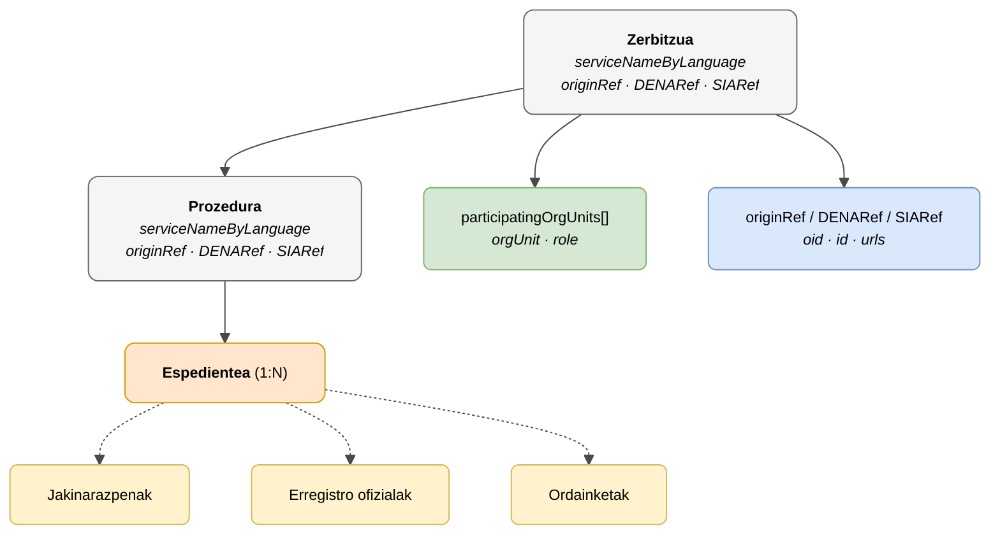

# :material-cog: Administrazio Zerbitzua (Administrative Service)

> - **Bertsioa:** `v{{ dena.version }}`
> - **Data:** {{ dena.date }}
> - **Testa:** [DN99DENATestMockObjFactoryForAdmistrativeServiceObjectBase.java]({{ repos.interop_test_blob }}/denaTestCommonDataClasses/src/main/java/dena/test/common/data/services/DN99DENATestMockObjFactoryForAdmistrativeServiceObjectBase.java)
> - **Kodea:**
>   - [DN00AdmistrativeService.java]({{ repos.common_data_api_blob }}/denaCommonDataAPIAdministrativeServicesModelClasses/src/main/java/dena/api/data/model/administrativeservices/DN00AdmistrativeService.java)
>   - [DN00AdministrativeServiceProcedure.java]({{ repos.common_data_api_blob }}/denaCommonDataAPIAdministrativeServicesModelClasses/src/main/java/dena/api/data/model/administrativeservices/DN00AdministrativeServiceProcedure.java)

## Deskribapena

**Zerbitzuak** eta **Prozedurak** espedientearen testuinguru hierarkikoa osatzen dute. Espediente guztiak prozedura bati dagozkio, eta prozedura guztiak zerbitzu bati.



| Kolorea | Esanahia |
|-------|-------------|
| ⚪ Grisa | Testuinguru hierarkikoa (Zerbitzua / Prozedura) |
| 🟠 Laranja | Domeinu-objektua (Espedientea) |
| 🟡 Horia | Menpeko objektuak (Jakinarazpena, Erregistroa, Ordainketa) |
| 🟢 Berdea | Unitate organikoak |
| 🔵 Urdin argia | Erreferentziak (originRef / DENARef / SIARef) |

---

## 🔗 Iturburu-kodea

| Klasea | Biltegia |
|-------|-------------|
| DN00AdmistrativeService | [Ikusi kodea]({{ repos.common_data_api_blob }}/denaCommonDataAPIAdministrativeServicesModelClasses/src/main/java/dena/api/data/model/administrativeservices/DN00AdmistrativeService.java) |
| DN00AdministrativeServiceProcedure | [Ikusi kodea]({{ repos.common_data_api_blob }}/denaCommonDataAPIAdministrativeServicesModelClasses/src/main/java/dena/api/data/model/administrativeservices/DN00AdministrativeServiceProcedure.java) |
| DN00AdmistrativeServiceObjectBase | [Ikusi kodea]({{ repos.common_data_api_blob }}/denaCommonDataAPIAdministrativeServicesModelClasses/src/main/java/dena/api/data/model/administrativeservices/DN00AdmistrativeServiceObjectBase.java) |
| DN00AdministrativeServiceReference | [Ikusi kodea]({{ repos.common_data_api_blob }}/denaCommonDataAPIAdministrativeServicesModelClasses/src/main/java/dena/api/data/model/administrativeservices/refs/DN00AdministrativeServiceReference.java) |
| DN00AdministrativeServiceProcedureReference | [Ikusi kodea]({{ repos.common_data_api_blob }}/denaCommonDataAPIAdministrativeServicesModelClasses/src/main/java/dena/api/data/model/administrativeservices/refs/DN00AdministrativeServiceProcedureReference.java) |
| DN00AdministrativeServiceObjectReferenceBase | [Ikusi kodea]({{ repos.common_data_api_blob }}/denaCommonDataAPIAdministrativeServicesModelClasses/src/main/java/dena/api/data/model/administrativeservices/refs/DN00AdministrativeServiceObjectReferenceBase.java) |

---

## 🧪 Testak eta adibideak

> Biltegia: [DENA-Euskadi/dena-interop-common-data-test]({{ repos.interop_test_tree }})

| Mock Factory | Biltegia |
|--------------|-------------|
| DN99DENATestMockObjFactoryForAdmistrativeServiceObjectBase | [Ikusi kodea]({{ repos.interop_test_blob }}/denaTestCommonDataClasses/src/main/java/dena/test/common/data/services/DN99DENATestMockObjFactoryForAdmistrativeServiceObjectBase.java) |
| DN99DENATestMockObjFactoryForAdmistrativeService | [Ikusi kodea]({{ repos.interop_test_blob }}/denaTestCommonDataClasses/src/main/java/dena/test/common/data/services/DN99DENATestMockObjFactoryForAdmistrativeService.java) |
| DN99DENATestMockObjFactoryForAdministrativeServiceProcedure | [Ikusi kodea]({{ repos.interop_test_blob }}/denaTestCommonDataClasses/src/main/java/dena/test/common/data/services/DN99DENATestMockObjFactoryForAdministrativeServiceProcedure.java) |
| DN99DENATestMockObjFactoryForAdministrativeServiceReference | [Ikusi kodea]({{ repos.interop_test_blob }}/denaTestCommonDataClasses/src/main/java/dena/test/common/data/services/DN99DENATestMockObjFactoryForAdministrativeServiceReference.java) |
| DN99DENATestMockObjFactoryForAdministrativeServiceProcedureReference | [Ikusi kodea]({{ repos.interop_test_blob }}/denaTestCommonDataClasses/src/main/java/dena/test/common/data/services/DN99DENATestMockObjFactoryForAdministrativeServiceProcedureReference.java) |

---

## Zerbitzua — JSON atributuak


| Eremua | Mota | Nahitaezkoa | Adibidea | Deskribapena |
|-------|------|:-----------:|---------|-------------|
| `serviceNameByLanguage` | `LanguageTexts` | ✅ | `{"SPANISH":"Licencias de actividad"}` | Zerbitzuaren izena |
| `serviceUrls` | `Array` | ❌ | | Zerbitzu-katalogoaren URLak |
| `participatingOrgUnits` | `Array` | ❌ | *(ikusi [unidad-organica.md](./unidad-organica.md) · [`DN00OrgUnitReferenceWithRole`]({{ repos.common_data_api_blob }}/denaCommonDataAPIModelClasses/src/main/java/dena/api/data/model/org/DN00OrgUnitReferenceWithRole.java))* | Parte hartzen duten unitate organikoak |
| `originRef` | `Object` | ✅ | *(ikusi [`DN00AdministrativeServiceReference`]({{ repos.common_data_api_blob }}/denaCommonDataAPIAdministrativeServicesModelClasses/src/main/java/dena/api/data/model/administrativeservices/refs/DN00AdministrativeServiceReference.java))* | Jatorrizko administrazioko erreferentzia |
| `originRef.oid` | `String` | ❌ | `"SRV-OID-001"` | Jatorrizko katalogoko OID-a |
| `originRef.id` | `String` | ✅ | `"SRV-LIC-ACT"` | Jatorrizko katalogoko ID-a |
| `originRef.urls` | `Array` | ❌ | | Jatorrizko katalogoko URLak |
| `DENARef` | `Object` | ❌ | | DENA katalogoko erreferentzia (existitzen bada) |
| `DENARef.oid` | `String` | ❌ | `"DENA-SRV-001"` | DENA katalogoko OID-a |
| `DENARef.id` | `String` | ❌ | `"DENA-LIC-001"` | DENA katalogoko ID-a |
| `SIARef` | `Object` | ❌ | | Estatuko Administrazio Orokorraren SIA katalogoko erreferentzia (existitzen bada) |
| `SIARef.oid` | `String` | ❌ | `"SIA-001"` | SIA katalogoko OID-a |
| `SIARef.id` | `String` | ❌ | `"SIA-LIC-001"` | SIA katalogoko ID-a |

---

## Prozedura — JSON atributuak


| Eremua | Mota | Nahitaezkoa | Adibidea | Deskribapena |
|-------|------|:-----------:|---------|-------------|
| `serviceNameByLanguage` | `LanguageTexts` | ✅ | `{"SPANISH":"Solicitud licencia"}` | Prozeduraren izena |
| `serviceUrls` | `Array` | ❌ | | Katalogoaren URLak |
| `participatingOrgUnits` | `Array` | ❌ | *(ikusi [unidad-organica.md](./unidad-organica.md) · [`DN00OrgUnitReferenceWithRole`]({{ repos.common_data_api_blob }}/denaCommonDataAPIModelClasses/src/main/java/dena/api/data/model/org/DN00OrgUnitReferenceWithRole.java))* | Parte hartzen duten unitate organikoak |
| `originRef` | `Object` | ✅ | *(ikusi [`DN00AdministrativeServiceProcedureReference`]({{ repos.common_data_api_blob }}/denaCommonDataAPIAdministrativeServicesModelClasses/src/main/java/dena/api/data/model/administrativeservices/refs/DN00AdministrativeServiceProcedureReference.java))* | Jatorrizko administrazioko erreferentzia |
| `originRef.oid` | `String` | ❌ | `"PROC-OID-001"` | Jatorrizko katalogoko OID-a |
| `originRef.id` | `String` | ✅ | `"PROC-LIC-APER"` | Jatorrizko katalogoko ID-a |
| `originRef.urls` | `Array` | ❌ | | Jatorrizko katalogoko URLak |
| `DENARef` | `Object` | ❌ | | DENA katalogoko erreferentzia (existitzen bada) |
| `SIARef` | `Object` | ❌ | | SIA katalogoko erreferentzia (existitzen bada) |

---

## Erreferentzien egitura (`originRef`, `DENARef`, `SIARef`)

Erreferentzia guztiek egitura bera partekatzen dute:

```json
{
  "oid": "SRV-OID-001",
  "id": "SRV-LIC-ACT",
  "urls": [
    { "url": "https://catalogo.miadmin.eus/servicio/SRV-LIC-ACT", "language": "SPANISH" }
  ]
}
```

| Eremua | Mota | Deskribapena |
|-------|------|-------------|
| `oid` | `String` | Katalogoko identifikatzaile teknikoa |
| `id` | `String` | Katalogoko negozio-identifikatzailea |
| `urls` | `Array` | Katalogorako sarbide URLak |

---

## JSON adibidea (espediente baten barruan)

```json
{
  "service": {
    "serviceNameByLanguage": { "SPANISH": "Licencias de actividad", "BASQUE": "Jarduera-lizentziak" },
    "originRef": { "oid": "SRV-OID-001", "id": "SRV-LIC-ACT" },
    "DENARef": null,
    "SIARef": null,
    "participatingOrgUnits": [
      {
        "orgUnit": { "id": "ORG-URBANISMO", "displayNameByLanguage": { "SPANISH": "Departamento de Urbanismo" } },
        "role": "RESPONSIBLE"
      }
    ]
  },
  "procedure": {
    "serviceNameByLanguage": { "SPANISH": "Solicitud de licencia de apertura", "BASQUE": "Irekiera-lizentzia eskaera" },
    "originRef": { "oid": "PROC-OID-001", "id": "PROC-LIC-APER" },
    "DENARef": null,
    "SIARef": null
  }
}
```

---

## Hierarkia

```
Administrazio Zerbitzua
 └── Prozedura
      └── Espedientea (1:N)
           ├── Jakinarazpenak
           ├── Erregistro ofizialak
           └── Ordainketak
```

> **Oharra:** Hitzorduek (`scheduleItem`) EZ dute hierarkia honetakoak. Objektu independenteak dira.

---

## Administrazioarentzako oharrak

- `originRef.id` nahitaezkoa da: administrazioak gutxienez zerbitzuaren eta prozeduraren negozio-identifikatzailea eman behar du bere katalogo propioan.
- `DENARef` eta `SIARef` aukerakoak dira. Administrazioak DENA edo SIA kodea ezagutzen badu, korrelazioa errazteko sar dezake.
- `serviceNameByLanguage`-k gutxienez `SPANISH` eta `BASQUE` testuak izan behar ditu.


---

<!-- DENA-DOC-FOOTER -->
---
<sub>DENA Docs v{{ dena.version }} · {{ dena.date }}</sub>
