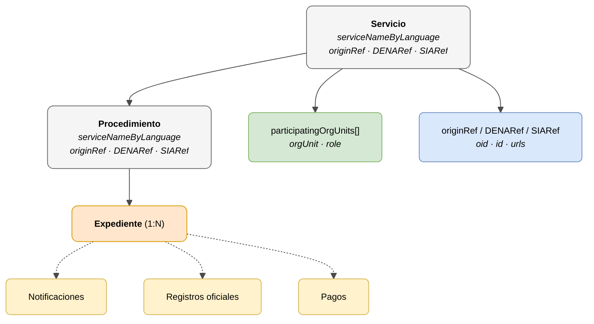

# Servicio Administrativo (Administrative Service)

## Descripción

El **Servicio** y el **Procedimiento** forman el contexto jerárquico del expediente. Todo expediente pertenece a un procedimiento, y todo procedimiento pertenece a un servicio.



| Color | Significado |
|-------|-------------|
| ⚪ Gris | Contexto jerárquico (Servicio / Procedimiento) |
| 🟠 Naranja | Objeto de dominio (Expediente) |
| 🟡 Amarillo | Objetos dependientes (Notificación, Registro, Pago) |
| 🟢 Verde | Unidades orgánicas |
| 🔵 Azul claro | Referencias (originRef / DENARef / SIARef) |

---

## Servicio — Atributos JSON

| Campo | Tipo | Obligatorio | Descripción |
|-------|------|:-----------:|-------------|
| `serviceNameByLanguage` | `LanguageTexts` | ✅ | Nombre del servicio |
| `serviceUrls` | `Array` | ❌ | URLs del catálogo de servicios |
| `participatingOrgUnits` | `Array` | ❌ | Unidades orgánicas participantes (ver [unidad-organica.md](./unidad-organica.md)) |
| `originRef` | `Object` | ✅ | Referencia en la administración de origen |
| `originRef.oid` | `String` | ❌ | OID en el catálogo de origen |
| `originRef.id` | `String` | ✅ | ID en el catálogo de origen |
| `originRef.urls` | `Array` | ❌ | URLs en el catálogo de origen |
| `DENARef` | `Object` | ❌ | Referencia en el catálogo DENA (si existe) |
| `DENARef.oid` | `String` | ❌ | OID en el catálogo DENA |
| `DENARef.id` | `String` | ❌ | ID en el catálogo DENA |
| `SIARef` | `Object` | ❌ | Referencia en el catálogo SIA de la AGE (si existe) |
| `SIARef.oid` | `String` | ❌ | OID en el catálogo SIA |
| `SIARef.id` | `String` | ❌ | ID en el catálogo SIA |

---

## Procedimiento — Atributos JSON

| Campo | Tipo | Obligatorio | Descripción |
|-------|------|:-----------:|-------------|
| `serviceNameByLanguage` | `LanguageTexts` | ✅ | Nombre del procedimiento |
| `serviceUrls` | `Array` | ❌ | URLs del catálogo |
| `participatingOrgUnits` | `Array` | ❌ | Unidades orgánicas participantes |
| `originRef` | `Object` | ✅ | Referencia en la administración de origen |
| `originRef.oid` | `String` | ❌ | OID en el catálogo de origen |
| `originRef.id` | `String` | ✅ | ID en el catálogo de origen |
| `originRef.urls` | `Array` | ❌ | URLs en el catálogo de origen |
| `DENARef` | `Object` | ❌ | Referencia en el catálogo DENA (si existe) |
| `SIARef` | `Object` | ❌ | Referencia en el catálogo SIA (si existe) |

---

## Estructura de las referencias (`originRef`, `DENARef`, `SIARef`)

Todas las referencias comparten la misma estructura:

```json
{
  "oid": "SRV-OID-001",
  "id": "SRV-LIC-ACT",
  "urls": [
    { "url": "https://catalogo.miadmin.eus/servicio/SRV-LIC-ACT", "language": "SPANISH" }
  ]
}
```

| Campo | Tipo | Descripción |
|-------|------|-------------|
| `oid` | `String` | Identificador técnico en el catálogo |
| `id` | `String` | Identificador de negocio en el catálogo |
| `urls` | `Array` | URLs de acceso al catálogo |

---

## Ejemplo JSON (dentro de un expediente)

```json
{
  "service": {
    "serviceNameByLanguage": { "SPANISH": "Licencias de actividad", "BASQUE": "Jarduera-lizentziak" },
    "originRef": { "oid": "SRV-OID-001", "id": "SRV-LIC-ACT" },
    "DENARef": null,
    "SIARef": null,
    "participatingOrgUnits": [
      {
        "orgUnit": { "id": "ORG-URBANISMO", "displayNameByLanguage": { "SPANISH": "Departamento de Urbanismo" } },
        "role": "RESPONSIBLE"
      }
    ]
  },
  "procedure": {
    "serviceNameByLanguage": { "SPANISH": "Solicitud de licencia de apertura", "BASQUE": "Irekiera-lizentzia eskaera" },
    "originRef": { "oid": "PROC-OID-001", "id": "PROC-LIC-APER" },
    "DENARef": null,
    "SIARef": null
  }
}
```

---

## Jerarquía

```
Servicio Administrativo
 └── Procedimiento
      └── Expediente (1:N)
           ├── Notificaciones
           ├── Registros oficiales
           └── Pagos
```

> **Nota:** Las citas (`scheduleItem`) NO pertenecen a esta jerarquía. Son objetos independientes.

---

## Notas para la administración

- `originRef.id` es obligatorio: la administración debe proporcionar al menos el identificador de negocio del servicio y procedimiento en su catálogo propio.
- `DENARef` y `SIARef` son opcionales. Si la administración conoce el código DENA o SIA, puede incluirlo para facilitar la correlación.
- `serviceNameByLanguage` debe incluir al menos textos en `SPANISH` y `BASQUE`.
