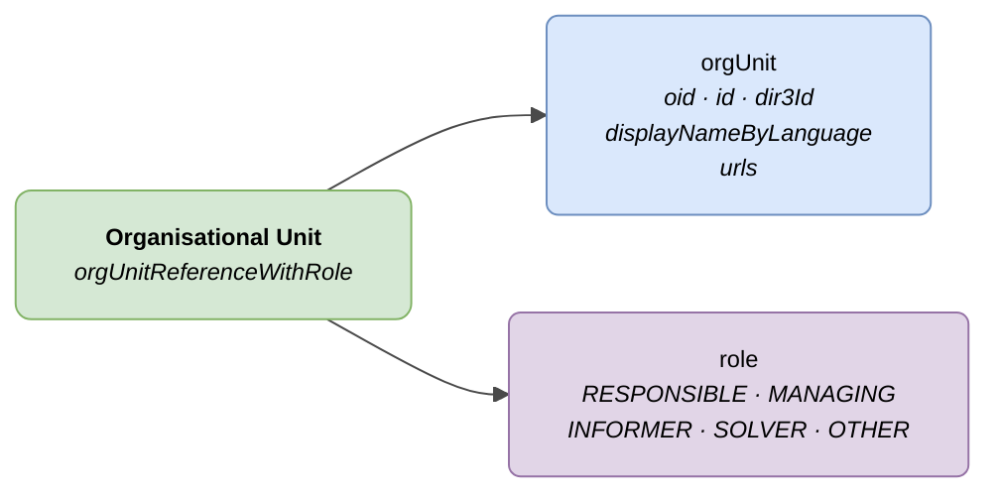

# :material-office-building: Organisational Unit (Org Unit)

> - **Version:** `v{{ dena.version }}`
> - **Date:** {{ dena.date }}
> - **Test:** [DN99DENATestMockObjFactoryForOrgUnitReference.java]({{ repos.interop_test_blob }}/denaTestCommonDataClasses/src/main/java/dena/test/common/data/DN99DENATestMockObjFactoryForOrgUnitReference.java)
> - **Code:** [DN00OrgUnitReference.java]({{ repos.common_data_api_blob }}/denaCommonDataAPIModelClasses/src/main/java/dena/api/data/model/org/DN00OrgUnitReference.java)

## Description

Represents an organisational unit of the administration that participates in a service or procedure with a given role.



| Colour | Meaning |
|--------|---------|
| 🟢 Green | Main object (Organisational Unit) |
| 🔵 Light blue | Data fields (orgUnit) |
| 🟣 Violet | Enums (roles) |

---

## 🔗 Source code

| Class | Repository |
|-------|------------|
| DN00OrgUnitReference | [View code]({{ repos.common_data_api_blob }}/denaCommonDataAPIModelClasses/src/main/java/dena/api/data/model/org/DN00OrgUnitReference.java) |
| DN00OrgUnitReferenceWithRole | [View code]({{ repos.common_data_api_blob }}/denaCommonDataAPIModelClasses/src/main/java/dena/api/data/model/org/DN00OrgUnitReferenceWithRole.java) |
| DN00OrgUnitRole | [View code]({{ repos.common_data_api_blob }}/denaCommonDataAPIModelClasses/src/main/java/dena/api/data/model/org/DN00OrgUnitRole.java) |

---

## 🧪 Tests and examples

> Repository: [DENA-Euskadi/dena-interop-common-data-test]({{ repos.interop_test_tree }})

| Mock Factory | Repository |
|--------------|------------|
| DN99DENATestMockObjFactoryForOrgUnitReference | [View code]({{ repos.interop_test_blob }}/denaTestCommonDataClasses/src/main/java/dena/test/common/data/DN99DENATestMockObjFactoryForOrgUnitReference.java) |
| DN99DENATestMockObjFactoryForOrgUnitReferenceWithRole | [View code]({{ repos.interop_test_blob }}/denaTestCommonDataClasses/src/main/java/dena/test/common/data/DN99DENATestMockObjFactoryForOrgUnitReferenceWithRole.java) |
| DN99DENATestMockObjFactoryForOrgUnitRole | [View code]({{ repos.interop_test_blob }}/denaTestCommonDataClasses/src/main/java/dena/test/common/data/DN99DENATestMockObjFactoryForOrgUnitRole.java) |

---

## JSON attributes


| Field | Type | Mandatory | Example | Description |
|-------|------|:---------:|---------|-------------|
| `orgUnit.oid` | `String` | ❌ | `"ORG-OID-001"` | Technical identifier |
| `orgUnit.id` | `String` | ✅ | `"ORG-URBANISMO"` | Business identifier |
| `orgUnit.dir3Id` | `String` | ❌ | `"EA0000001"` | DIR3 code |
| `orgUnit.displayNameByLanguage` | `LanguageTexts` | ✅ | `{"SPANISH":"Dpto. Urbanismo"}` | Unit name |
| `orgUnit.urls` | `Array` | ❌ | | Unit URLs |
| `role` | `String` | ✅ | `"RESPONSIBLE"` | Role in the context |

---

## Roles (`role`)

| Code | Description |
|------|-------------|
| `RESPONSIBLE` | Responsible unit |
| `MANAGING` | Managing unit (processing) |
| `INFORMER` | Reporting unit |
| `SOLVER` | Resolving unit |
| `OTHER` | Other role |

---

## JSON example (within a service/procedure)

```json
{
  "participatingOrgUnits": [
    {
      "orgUnit": {
        "oid": "ORG-OID-001",
        "id": "ORG-URBANISMO",
        "dir3Id": "EA0000001",
        "displayNameByLanguage": {
          "SPANISH": "Departamento de Urbanismo",
          "BASQUE": "Hirigintza Saila"
        }
      },
      "role": "RESPONSIBLE"
    },
    {
      "orgUnit": {
        "oid": "ORG-OID-002",
        "id": "ORG-MEDIO-AMBIENTE",
        "displayNameByLanguage": {
          "SPANISH": "Departamento de Medio Ambiente",
          "BASQUE": "Ingurumen Saila"
        }
      },
      "role": "INFORMER"
    }
  ]
}
```

---

## Notes for the administration

- `orgUnit.id` and `orgUnit.displayNameByLanguage` are mandatory.
- `orgUnit.dir3Id` is optional but recommended if the unit has an assigned DIR3 code.
- `displayNameByLanguage` must include at least texts in `SPANISH` and `BASQUE`.
- The same unit can appear with different roles in different services/procedures.


---

<!-- DENA-DOC-FOOTER -->
---
<sub>DENA Docs v{{ dena.version }} · {{ dena.date }}</sub>
