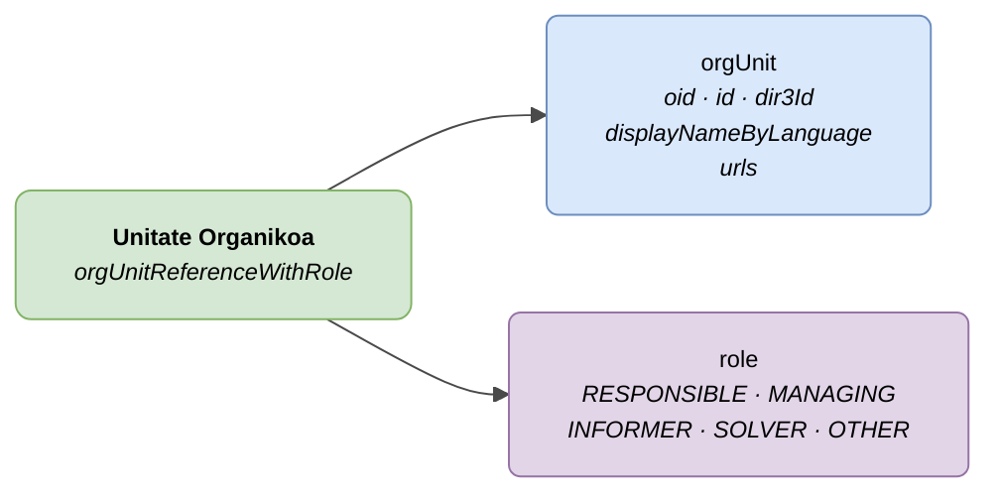

# :material-office-building: Unitate Organikoa (Org Unit)

> - **Bertsioa:** `v{{ dena.version }}`
> - **Data:** {{ dena.date }}
> - **Testa:** [DN99DENATestMockObjFactoryForOrgUnitReference.java]({{ repos.interop_test_blob }}/denaTestCommonDataClasses/src/main/java/dena/test/common/data/DN99DENATestMockObjFactoryForOrgUnitReference.java)
> - **Kodea:** [DN00OrgUnitReference.java]({{ repos.common_data_api_blob }}/denaCommonDataAPIModelClasses/src/main/java/dena/api/data/model/org/DN00OrgUnitReference.java)

## Deskribapena

Zerbitzu edo prozedura batean rol jakin batekin parte hartzen duen administrazioaren antolaketa-unitate bat adierazten du.



| Kolorea | Esanahia |
|---------|----------|
| 🟢 Berde | Objektu nagusia (Unitate Organikoa) |
| 🔵 Urdin argia | Datu-eremuak (orgUnit) |
| 🟣 More | Enumak (rolak) |

---

## 🔗 Iturburu-kodea

| Klasea | Biltegia |
|--------|----------|
| DN00OrgUnitReference | [Ikusi kodea]({{ repos.common_data_api_blob }}/denaCommonDataAPIModelClasses/src/main/java/dena/api/data/model/org/DN00OrgUnitReference.java) |
| DN00OrgUnitReferenceWithRole | [Ikusi kodea]({{ repos.common_data_api_blob }}/denaCommonDataAPIModelClasses/src/main/java/dena/api/data/model/org/DN00OrgUnitReferenceWithRole.java) |
| DN00OrgUnitRole | [Ikusi kodea]({{ repos.common_data_api_blob }}/denaCommonDataAPIModelClasses/src/main/java/dena/api/data/model/org/DN00OrgUnitRole.java) |

---

## 🧪 Testak eta adibideak

> Biltegia: [DENA-Euskadi/dena-interop-common-data-test]({{ repos.interop_test_tree }})

| Mock Factory | Biltegia |
|--------------|----------|
| DN99DENATestMockObjFactoryForOrgUnitReference | [Ikusi kodea]({{ repos.interop_test_blob }}/denaTestCommonDataClasses/src/main/java/dena/test/common/data/DN99DENATestMockObjFactoryForOrgUnitReference.java) |
| DN99DENATestMockObjFactoryForOrgUnitReferenceWithRole | [Ikusi kodea]({{ repos.interop_test_blob }}/denaTestCommonDataClasses/src/main/java/dena/test/common/data/DN99DENATestMockObjFactoryForOrgUnitReferenceWithRole.java) |
| DN99DENATestMockObjFactoryForOrgUnitRole | [Ikusi kodea]({{ repos.interop_test_blob }}/denaTestCommonDataClasses/src/main/java/dena/test/common/data/DN99DENATestMockObjFactoryForOrgUnitRole.java) |

---

## JSON atributuak


| Eremua | Mota | Derrigorrez | Adibidea | Deskribapena |
|--------|------|:-----------:|----------|--------------|
| `orgUnit.oid` | `String` | ❌ | `"ORG-OID-001"` | Identifikatzaile teknikoa |
| `orgUnit.id` | `String` | ✅ | `"ORG-URBANISMO"` | Negozio-identifikatzailea |
| `orgUnit.dir3Id` | `String` | ❌ | `"EA0000001"` | DIR3 kodea |
| `orgUnit.displayNameByLanguage` | `LanguageTexts` | ✅ | `{"SPANISH":"Dpto. Urbanismo"}` | Unitatearen izena |
| `orgUnit.urls` | `Array` | ❌ | | Unitatearen URLak |
| `role` | `String` | ✅ | `"RESPONSIBLE"` | Testuinguruko rola |

---

## Rolak (`role`)

| Kodea | Deskribapena |
|-------|--------------|
| `RESPONSIBLE` | Unitate arduraduna |
| `MANAGING` | Unitate kudeatzailea (izapidetzailea) |
| `INFORMER` | Unitate informatzailea |
| `SOLVER` | Unitate ebazlea |
| `OTHER` | Beste rola |

---

## JSON adibidea (zerbitzu/prozedura baten barruan)

```json
{
  "participatingOrgUnits": [
    {
      "orgUnit": {
        "oid": "ORG-OID-001",
        "id": "ORG-URBANISMO",
        "dir3Id": "EA0000001",
        "displayNameByLanguage": {
          "SPANISH": "Departamento de Urbanismo",
          "BASQUE": "Hirigintza Saila"
        }
      },
      "role": "RESPONSIBLE"
    },
    {
      "orgUnit": {
        "oid": "ORG-OID-002",
        "id": "ORG-MEDIO-AMBIENTE",
        "displayNameByLanguage": {
          "SPANISH": "Departamento de Medio Ambiente",
          "BASQUE": "Ingurumen Saila"
        }
      },
      "role": "INFORMER"
    }
  ]
}
```

---

## Administrazioarentzako oharrak

- `orgUnit.id` eta `orgUnit.displayNameByLanguage` derrigorrez dira.
- `orgUnit.dir3Id` aukerakoa da, baina gomendatzen da unitateak DIR3 kodea esleituta badu.
- `displayNameByLanguage`-k gutxienez `SPANISH` eta `BASQUE` testua sartu behar du.
- Unitate bera rol desberdinekin ager daiteke zerbitzu/prozedura desberdinetan.


---

<!-- DENA-DOC-FOOTER -->
---
<sub>DENA Docs v{{ dena.version }} · {{ dena.date }}</sub>
