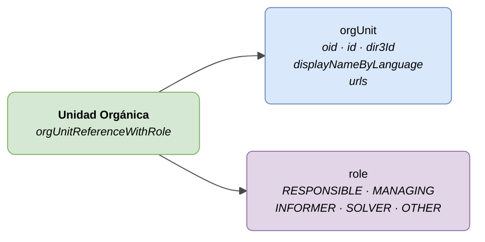

# Unidad Orgánica (Org Unit)

## Descripción

Representa una unidad organizativa de la administración que participa en un servicio o procedimiento con un rol determinado.



| Color | Significado |
|-------|-------------|
| 🟢 Verde | Objeto principal (Unidad Orgánica) |
| 🔵 Azul claro | Campos de datos (orgUnit) |
| 🟣 Violeta | Enums (roles) |

---

## Atributos JSON

| Campo | Tipo | Obligatorio | Descripción |
|-------|------|:-----------:|-------------|
| `orgUnit.oid` | `String` | ❌ | Identificador técnico |
| `orgUnit.id` | `String` | ✅ | Identificador de negocio |
| `orgUnit.dir3Id` | `String` | ❌ | Código DIR3 |
| `orgUnit.displayNameByLanguage` | `LanguageTexts` | ✅ | Nombre de la unidad |
| `orgUnit.urls` | `Array` | ❌ | URLs de la unidad |
| `role` | `String` | ✅ | Rol en el contexto |

---

## Roles (`role`)

| Código | Descripción |
|--------|-------------|
| `RESPONSIBLE` | Unidad responsable |
| `MANAGING` | Unidad gestora (tramitadora) |
| `INFORMER` | Unidad informante |
| `SOLVER` | Unidad resolutora |
| `OTHER` | Otro rol |

---

## Ejemplo JSON (dentro de un servicio/procedimiento)

```json
{
  "participatingOrgUnits": [
    {
      "orgUnit": {
        "oid": "ORG-OID-001",
        "id": "ORG-URBANISMO",
        "dir3Id": "EA0000001",
        "displayNameByLanguage": {
          "SPANISH": "Departamento de Urbanismo",
          "BASQUE": "Hirigintza Saila"
        }
      },
      "role": "RESPONSIBLE"
    },
    {
      "orgUnit": {
        "oid": "ORG-OID-002",
        "id": "ORG-MEDIO-AMBIENTE",
        "displayNameByLanguage": {
          "SPANISH": "Departamento de Medio Ambiente",
          "BASQUE": "Ingurumen Saila"
        }
      },
      "role": "INFORMER"
    }
  ]
}
```

---

## Notas para la administración

- `orgUnit.id` y `orgUnit.displayNameByLanguage` son obligatorios.
- `orgUnit.dir3Id` es opcional pero recomendado si la unidad tiene código DIR3 asignado.
- `displayNameByLanguage` debe incluir al menos textos en `SPANISH` y `BASQUE`.
- Una misma unidad puede aparecer con diferentes roles en distintos servicios/procedimientos.
