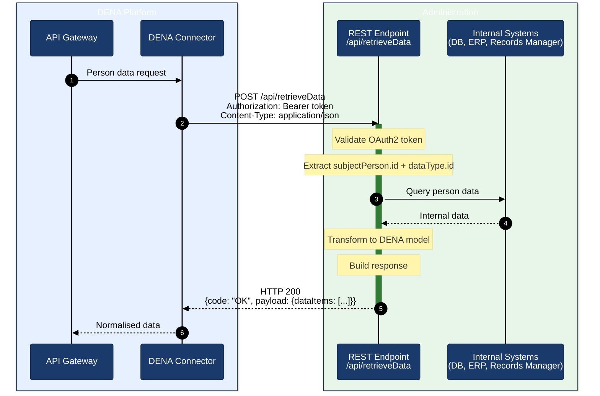

# Implementation Guide — DATA-RETRIEVE for Administrations

## Objective

This guide describes step by step how a public administration must implement the `POST /api/retrieveData` endpoint to integrate with the DENA platform and return person data.

---

## Overview



---

## Step 1 — Understand the contract

DENA will send a `POST` request with this format:

```json
{
  "context": {
    "message": {
      "type": "PERSON_FETCH_DATA",
      "correlationId": "550e8400-e29b-41d4-a716-446655440000",
      "interopRouteData": []
    },
    "dataType": { "id": "administrativeServiceProcedureRecord", "oid": "administrativeServiceProcedureRecord" },
    "subjectPerson": { "id": "12345678A", "oid": "PERSON-OID-0001" }
  },
  "payload": { }
}
```

The key fields you must interpret:

| Field | Purpose | Source code |
|-------|----------|-------------|
| `context.subjectPerson.id` | DNI/NIE of the person whose data is requested | [`DN00InteropContext`]({{ repos.common_api_blob }}/denaCommonAPIModelClasses/src/main/java/dena/api/common/interop/context/DN00InteropContext.java) |
| `context.dataType.id` | Type of data requested (see table below) | [`DN00DataTypeEnum`]({{ repos.common_data_api_blob }}/denaCommonDataAPIModelClasses/src/main/java/dena/api/data/model/DN00DataTypeEnum.java) |
| `context.message.correlationId` | UUID for log traceability | [`DN00InteropContext`]({{ repos.common_api_blob }}/denaCommonAPIModelClasses/src/main/java/dena/api/common/interop/context/DN00InteropContext.java) |

### Data types (`dataType.id`)

| Value | What you must return | Model |
|-------|----------------------|-------|
| `administrativeServiceProcedureRecord` | Records | [expediente.md](./data/expediente.md) |
| `administrativeNotice` | Notifications | [notificacion.md](./data/notificacion.md) |
| `administrativeOfficialRegisterRecord` | Official registrations | [registro-oficial.md](./data/registro-oficial.md) |
| `oneOffPayment` | Payments (one-off + direct debits) | [pago.md](./data/pago.md) |
| `scheduleItem` | Appointments | [cita.md](./data/cita.md) |

> Full endpoint specification: [endpoint-data-retrieve.md](./endpoint-data-retrieve.md)

---

## Step 2 — Create the REST endpoint

Expose a `POST` endpoint that accepts and returns `application/json`.

### Example in Java (Spring Boot)

```java
@RestController
@RequestMapping("/api")
public class RetrieveDataController {

    @PostMapping(value = "/retrieveData",
                 consumes = MediaType.APPLICATION_JSON_VALUE,
                 produces = MediaType.APPLICATION_JSON_VALUE)
    public ResponseEntity<InteropResponse> retrieveData(@RequestBody InteropRequest request) {

        // 1. Extract the person id and the data type
        String personId = request.getContext().getSubjectPerson().getId();
        String dataTypeId = request.getContext().getDataType().getId();

        // 2. Query internal data
        List<Object> items = fetchDataFromInternalSystems(personId, dataTypeId);

        // 3. Build response
        return ResponseEntity.ok(buildResponse(request, items));
    }
}
```

### Example in C# (.NET)

```csharp
[ApiController]
[Route("api")]
public class RetrieveDataController : ControllerBase
{
    [HttpPost("retrieveData")]
    public IActionResult RetrieveData([FromBody] InteropRequest request)
    {
        var personId = request.Context.SubjectPerson.Id;
        var dataTypeId = request.Context.DataType.Id;

        var items = FetchDataFromInternalSystems(personId, dataTypeId);

        return Ok(BuildResponse(request, items));
    }
}
```

### Example in Node.js (Express)

```javascript
app.post('/api/retrieveData', (req, res) => {
  const { id: personId } = req.body.context.subjectPerson;
  const { id: dataTypeId } = req.body.context.dataType;

  const items = fetchDataFromInternalSystems(personId, dataTypeId);

  res.json(buildResponse(req.body, items));
});
```

---

## Step 3 — Map your data to the DENA model

Each data type has a specific JSON structure. Your code must transform the internal data into this format.

### 3.1 — Common fields (mandatory in all objects)

All returned objects must include at minimum:

```json
{
  "oid": "YOUR-UNIQUE-OID-001",
  "id": "NUMBER-VISIBLE-TO-PERSON",
  "urls": [
    { "url": "https://sede.tuadmin.eus/...", "language": "SPANISH", "tags": ["default"] },
    { "url": "https://egoitza.tuadmin.eus/...", "language": "BASQUE", "tags": ["default"] }
  ]
}
```

| Field | What to put |
|-------|-------------|
| `oid` | Unique technical identifier from your system (PK, UUID, etc.) |
| `id` | The number the person sees in their e-government portal |
| `urls` | Links to the portal where the person can view the object |

> Full documentation: [campos-comunes.md](./data/campos-comunes.md)

### 3.2 — Record (`RECORDS`)

```json
{
  "oid": "EXP-001",
  "id": "2024/00123",
  "service": {
    "serviceNameByLanguage": { "SPANISH": "Licencias de actividad", "BASQUE": "Jarduera-lizentziak" },
    "originRef": { "id": "SRV-LIC-ACT" }
  },
  "procedure": {
    "serviceNameByLanguage": { "SPANISH": "Solicitud de licencia", "BASQUE": "Lizentzia eskaera" },
    "originRef": { "id": "PROC-LIC-001" }
  },
  "createdAt": "2024-03-15T10:30:00Z",
  "state": {
    "stateCode": "IN_PROGRESS",
    "description": { "SPANISH": "En tramitación", "BASQUE": "Izapidetzen" }
  }
}
```

Possible states: `REGISTERED_PENDING_TO_BE_OPENED`, `OPENED`, `IN_PROGRESS`, `WAITING_FOR_INTERESTED_PARTY_RESPONSE`, `WAITING_FOR_OTHER_ORG_WORK`, `CLOSED`

> Full documentation: [expediente.md](./data/expediente.md)

### 3.3 — Notification (`NOTICES`)

```json
{
  "oid": "NOT-001",
  "id": "NOT-2024/456",
  "procedureRecord": { "oid": "EXP-001", "id": "2024/00123" },
  "type": "OFFICIAL_NOTICE",
  "issuedAt": "2024-05-20T09:00:00Z",
  "readedAt": null,
  "state": "PENDING_TO_BE_READED_BY_DESTINATION",
  "actSubjectByLanguage": { "SPANISH": "Resolución de ayuda", "BASQUE": "Laguntza ebazpena" }
}
```

Types: `OFFICIAL_NOTICE`, `COMMUNICATION`

States: `PENDING_TO_BE_READED_BY_DESTINATION`, `ACKNOWLEDGED_BY_DESTINATION`, `REJECTED_BY_DESTINATION`, `EXPIRED`, `CANCELLED_BY_ISSUER`, `DELETED_BY_ISSUER`

> Full documentation: [notificacion.md](./data/notificacion.md)

### 3.4 — Official registration (`REGISTER`)

```json
{
  "oid": "REG-001",
  "id": "REG-2024/789",
  "procedureRecord": { "oid": "EXP-001", "id": "2024/00123" },
  "registeredAt": "2024-04-10T08:30:00Z",
  "subjectByLanguage": { "SPANISH": "Solicitud de licencia", "BASQUE": "Lizentzia eskaera" },
  "state": {
    "stateCode": "PRESENTED",
    "description": { "SPANISH": "Presentado", "BASQUE": "Aurkeztua" }
  }
}
```

States: `PRESENTED`, `RECEIVED_FROM_OTHER_ORG_UNIT`, `TRANSFERRED_FROM_OTHER_ORG_UNIT`

> Full documentation: [registro-oficial.md](./data/registro-oficial.md)

### 3.5 — One-off payment (`PAYMENTS`)

```json
{
  "oid": "PAY-001",
  "id": "PAY-2024/321",
  "procedureRecord": { "oid": "EXP-001", "id": "2024/00123" },
  "paymentType": "ONE_OFF_PAYMENT",
  "paymentSubjectByLanguage": { "SPANISH": "Tasa de actividad", "BASQUE": "Jarduera tasa" },
  "paymentDates": { "dueDate": "2024-06-30" },
  "format": "502",
  "amount": { "amount": 45.50, "currency": "EUR" },
  "data": { "forStatus": "PENDING" }
}
```

> Full documentation: [pago.md](./data/pago.md)

### 3.6 — Direct debit (`PAYMENTS`)

```json
{
  "oid": "DD-001",
  "id": "DD-2024/100",
  "procedureRecord": { "oid": "EXP-001", "id": "2024/00123" },
  "paymentType": "DIRECT_DEBIT",
  "paymentSubjectByLanguage": { "SPANISH": "Cuota guardería", "BASQUE": "Haur-eskola kuota" },
  "directDebitData": {
    "startDate": "2024-01-15",
    "frequency": "MONTHLY",
    "medium": "DIRECT_DEBIT",
    "mediumHint": "2100 ***** 051332"
  },
  "nextChargeAt": "2024-07-01",
  "nextChargeAmountInEuro": 120.00,
  "paymentStatus": "ACTIVE"
}
```

> Full documentation: [pago.md](./data/pago.md)

### 3.7 — Appointment (`SCHEDULE`)

```json
{
  "oid": "CITA-001",
  "id": "CITA-2024/050",
  "year": 2024,
  "monthOfYear": 7,
  "dayOfMonth": 15,
  "hourOfDay": 10,
  "minuteOfHour": 30,
  "durationMinutes": 30,
  "subject": { "SPANISH": "Cita renovación DNI", "BASQUE": "NAN berritzeko hitzordua" },
  "location": {
    "administrativeAreaLevel3": { "id": "48020", "name": "Bilbao" },
    "address": "Gran Vía 50"
  }
}
```

> Full documentation: [cita.md](./data/cita.md)

---

## Step 4 — Build the response

The response must have this structure:

```json
{
  "context": {
    "message": {
      "type": "PERSON_FETCH_DATA",
      "correlationId": "REQUEST-UUID",
      "interopRouteData": []
    },
    "dataType": { "id": "administrativeServiceProcedureRecord", "oid": "administrativeServiceProcedureRecord" },
    "subjectPerson": { "id": "12345678A", "oid": "PERSON-OID-0001" }
  },
  "payload": {
    "dataItems": [ ... ]
  },
  "code": "OK"
}
```

### Response rules

| Situation | What to return |
|-----------|----------------|
| Data found | HTTP 200 + `dataItems` with the objects |
| No data for that person | HTTP 200 + `dataItems: []` (empty list) |
| Person not found | HTTP 200 + `code: "CLIENT_ERR"` + `errorId: "PERSON_NOT_FOUND"` |
| Internal error | HTTP 500 + `code: "SERVER_ERR"` |
| Malformed request | HTTP 400 + `code: "CLIENT_ERR"` |

> **Important:** When there is no data, return HTTP 200 with an empty array, do NOT use HTTP 404.

---

## Step 5 — Multilingual texts

All fields of type `LanguageTexts` must include at minimum Spanish and Basque:

```json
{
  "SPANISH": "Texto en castellano",
  "BASQUE": "Euskerazko testua"
}
```

Supported languages are: `SPANISH`, `BASQUE`, `ENGLISH`.

---

## Step 6 — E-government portal URLs

Include links where the person can view each object in your e-government portal:

```json
"urls": [
  { "url": "https://sede.tuadmin.eus/expediente/123", "language": "SPANISH", "tags": ["default"] },
  { "url": "https://egoitza.tuadmin.eus/espedientea/123", "language": "BASQUE", "tags": ["default"] }
]
```

For payments, use additional tags:
- `payment` → URL to make the payment
- `payment-receipt` → URL of the payment receipt

---

## Step 7 — Authentication (optional)

If your administration requires authentication, DENA will send an OAuth2 token in the header:

```
Authorization: Bearer <access_token>
```

The token is obtained automatically via **client credentials** against your authorisation server. The configuration is coordinated with the DENA team.

---

## Step 8 — Validate your implementation

### Validation checklist

- [ ] The endpoint accepts `POST /api/retrieveData` with `Content-Type: application/json`
- [ ] Correctly interprets `context.subjectPerson.id`
- [ ] Correctly interprets `context.dataType.id`
- [ ] Returns HTTP 200 with `dataItems: []` when there is no data
- [ ] All objects include `oid` and `id`
- [ ] Texts include at least `SPANISH` and `BASQUE`
- [ ] Dates are in ISO 8601 format (`2024-03-15T10:30:00Z`)
- [ ] States use the exact codes defined in the model
- [ ] The `code` field is present in the response (`OK`, `CLIENT_ERR`, `SERVER_ERR`)
- [ ] The `context.message.correlationId` from the request is returned in the response
- [ ] Response time is < 30 seconds

### Test tools

You can use the mock factories from the test project to generate sample objects:

- [Record tests]({{ repos.interop_test_blob }}/denaTestCommonDataClasses/src/main/java/dena/test/common/data/services/DN99DENATestMockObjFactoryForAdmistrativeServiceProcedureRecord.java)
- [Notification tests]({{ repos.interop_test_blob }}/denaTestCommonDataClasses/src/main/java/dena/test/common/data/notification/DN99DENATestMockObjFactoryForAdministrativeNotice.java)
- [Payment tests]({{ repos.interop_test_blob }}/denaTestCommonDataClasses/src/main/java/dena/test/common/data/payment/DN99DENATestMockObjFactoryForOneOffPayment.java)

---

## Step 9 — Common errors

| Error | Cause | Solution |
|-------|-------|----------|
| `dataItems` returns `null` | Array not initialised | Always return `[]` as a minimum |
| Dates rejected | Incorrect format | Use ISO 8601: `2024-03-15T10:30:00Z` |
| Empty multilingual texts | Only one language included | Always include `SPANISH` + `BASQUE` |
| Unrecognised states | Custom states used | Use exactly the codes from the DENA model |
| HTTP 404 for "no data" | Confused with person not found | Use HTTP 200 + `dataItems: []` |
| Duplicate `oid` | Same identifier reused | Each `oid` must be unique per object type |

> Full error guide: [errores-troubleshooting.md](./errores-troubleshooting.md)

---

## Flow summary

```
1. DENA sends POST /api/retrieveData
2. Your system:
   a. Reads subjectPerson.id → identifies the person
   b. Reads dataType.id → knows what data to fetch
   c. Queries its internal systems
   d. Transforms the data to the DENA model
   e. Builds the response with dataItems[]
3. DENA receives the data and presents it to the person
```

---

## Reference documentation

| Document | Content |
|----------|---------|
| [endpoint-data-retrieve.md](./endpoint-data-retrieve.md) | Full technical contract of the endpoint |
| [campos-comunes.md](./data/campos-comunes.md) | Base fields inherited by all objects |
| [expediente.md](./data/expediente.md) | Record model |
| [notificacion.md](./data/notificacion.md) | Notification model |
| [registro-oficial.md](./data/registro-oficial.md) | Official registration model |
| [pago.md](./data/pago.md) | Payment model |
| [cita.md](./data/cita.md) | Appointment model |
| [servicio-administrativo.md](./data/servicio-administrativo.md) | Service and procedure |
| [unidad-organica.md](./data/unidad-organica.md) | Organisational units |
| [validaciones.md](./validaciones.md) | Validation rules |
| [errores-troubleshooting.md](./errores-troubleshooting.md) | Error guide |
| [snippets-codigo.md](./snippets-codigo.md) | Snippets in Java, C#, Node.js, Python, PHP |


<!-- DENA-DOC-FOOTER -->
---
<sub>DENA Docs v{{ dena.version }} · {{ dena.date }}</sub>
