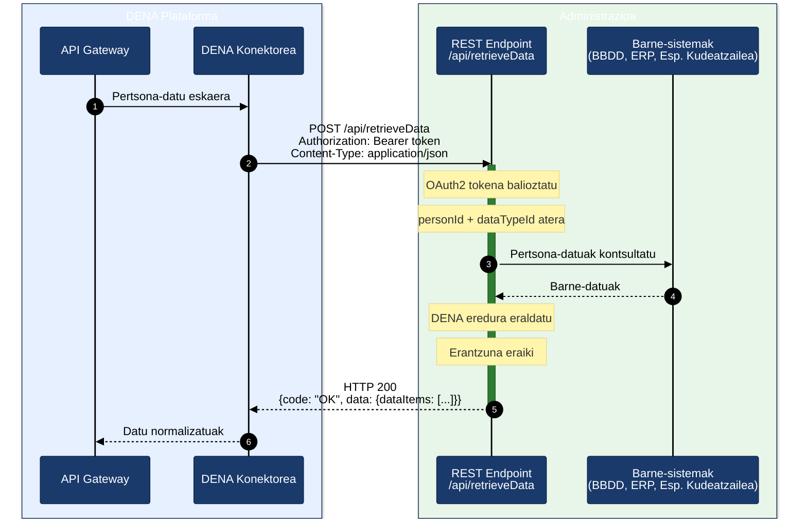

# Inplementazio-gida — DATA-RETRIEVE Administrazioentzat

## Helburua

Gida honek pausoz pauso azaltzen du administrazio publiko batek nola inplementatu behar duen `POST /api/retrieveData` endpoint-a DENA plataformarekin integratzeko eta herritarren datu pertsonalak itzultzeko.

---

## Ikuspegi orokorra



---

## 1. urratsa — Kontratua ulertu

DENA-k `POST` eskaera bat bidaliko du formatu honekin:

```json
{
  "context": {
    "messageType": "PERSON_FETCH_DATA",
    "dataType": { "dataTypeId": "RECORDS" },
    "messageCorrelationId": "550e8400-e29b-41d4-a716-446655440000",
    "flowDirection": "REQUEST",
    "subjectPerson": { "personId": "12345678A" }
  },
  "data": { }
}
```

Interpretatu behar dituzun eremu nagusiak:

| Eremua | Zertarako balio duen | Iturburu-kodea |
|--------|----------------------|----------------|
| `context.subjectPerson.personId` | Datuak eskatzen diren pertsonaren NAN/AIZ | [`DN00InteropContext`]({{ repos.common_interop_api_blob }}/denaCommonInteropAPIModelClasses/src/main/java/dena/api/common/model/interop/context/DN00InteropContext.java) |
| `context.dataType.dataTypeId` | Eskatutako datu mota (ikusi beheko taula) | [`DN00DataTypeEnum`]({{ repos.common_data_api_blob }}/denaCommonDataAPIModelClasses/src/main/java/dena/api/data/model/DN00DataTypeEnum.java) |
| `context.messageCorrelationId` | UUID log trazabilitaterako | [`DN00InteropContext`]({{ repos.common_interop_api_blob }}/denaCommonInteropAPIModelClasses/src/main/java/dena/api/common/model/interop/context/DN00InteropContext.java) |

### Datu motak (`dataTypeId`)

| Balioa | Zer itzuli behar duzun | Eredua |
|--------|------------------------|--------|
| `RECORDS` | Espedienteak | [expediente.md](./data/expediente.md) |
| `NOTICES` | Jakinarazpenak | [notificacion.md](./data/notificacion.md) |
| `REGISTER` | Erregistro ofizialak | [registro-oficial.md](./data/registro-oficial.md) |
| `PAYMENTS` | Ordainketak (bakarrak + domiziliazioak) | [pago.md](./data/pago.md) |
| `SCHEDULE` | Hitzorduak | [cita.md](./data/cita.md) |

> Endpoint-aren zehaztapen osoa: [endpoint-data-retrieve.md](./endpoint-data-retrieve.md)

---

## 2. urratsa — REST endpoint-a sortu

Esposatu `POST` endpoint bat `application/json` onartzen eta itzultzen duena.

### Java adibidea (Spring Boot)

```java
@RestController
@RequestMapping("/api")
public class RetrieveDataController {

    @PostMapping(value = "/retrieveData",
                 consumes = MediaType.APPLICATION_JSON_VALUE,
                 produces = MediaType.APPLICATION_JSON_VALUE)
    public ResponseEntity<InteropResponse> retrieveData(@RequestBody InteropRequest request) {

        // 1. personId eta dataTypeId atera
        String personId = request.getContext().getSubjectPerson().getPersonId();
        String dataTypeId = request.getContext().getDataType().getDataTypeId();

        // 2. Barne-datuak kontsultatu
        List<Object> items = fetchDataFromInternalSystems(personId, dataTypeId);

        // 3. Erantzuna eraiki
        return ResponseEntity.ok(buildResponse(request, items));
    }
}
```

### C# adibidea (.NET)

```csharp
[ApiController]
[Route("api")]
public class RetrieveDataController : ControllerBase
{
    [HttpPost("retrieveData")]
    public IActionResult RetrieveData([FromBody] InteropRequest request)
    {
        var personId = request.Context.SubjectPerson.PersonId;
        var dataTypeId = request.Context.DataType.DataTypeId;

        var items = FetchDataFromInternalSystems(personId, dataTypeId);

        return Ok(BuildResponse(request, items));
    }
}
```

### Node.js adibidea (Express)

```javascript
app.post('/api/retrieveData', (req, res) => {
  const { personId } = req.body.context.subjectPerson;
  const { dataTypeId } = req.body.context.dataType;

  const items = fetchDataFromInternalSystems(personId, dataTypeId);

  res.json(buildResponse(req.body, items));
});
```

---

## 3. urratsa — Zure datuak DENA eredura mapatu

Datu mota bakoitzak JSON egitura espezifiko bat du. Zure kodeak barne-datuak formatu honetara eraldatu behar ditu.

### 3.1 — Eremu komunak (objektu guztietan derrigorrez)

Itzulitako objektu guztiek gutxienez hau sartu behar dute:

```json
{
  "oid": "ZURE-OID-BAKARRA-001",
  "id": "HERRITARRAK-IKUSTEN-DUEN-ZENBAKIA",
  "urls": [
    { "url": "https://sede.tuadmin.eus/...", "language": "SPANISH", "tags": ["default"] },
    { "url": "https://egoitza.tuadmin.eus/...", "language": "BASQUE", "tags": ["default"] }
  ]
}
```

| Eremua | Zer jarri |
|--------|-----------|
| `oid` | Zure sistemako identifikatzaile tekniko bakarra (PK, UUID, etab.) |
| `id` | Pertsonak bere egoitza elektronikoan ikusten duen zenbakia |
| `urls` | Pertsonak objektua ikusi dezakeen egoitzarako estekak |

> Dokumentazio osoa: [campos-comunes.md](./data/campos-comunes.md)

### 3.2 — Espedientea (`RECORDS`)

```json
{
  "oid": "EXP-001",
  "id": "2024/00123",
  "service": {
    "serviceNameByLanguage": { "SPANISH": "Licencias de actividad", "BASQUE": "Jarduera-lizentziak" },
    "originRef": { "id": "SRV-LIC-ACT" }
  },
  "procedure": {
    "serviceNameByLanguage": { "SPANISH": "Solicitud de licencia", "BASQUE": "Lizentzia eskaera" },
    "originRef": { "id": "PROC-LIC-001" }
  },
  "createdAt": "2024-03-15T10:30:00Z",
  "state": {
    "stateCode": "IN_PROGRESS",
    "description": { "SPANISH": "En tramitación", "BASQUE": "Izapidetzen" }
  }
}
```

Egoera posibleak: `REGISTERED_PENDING_TO_BE_OPENED`, `OPENED`, `IN_PROGRESS`, `WAITING_FOR_INTERESTED_PARTY_RESPONSE`, `WAITING_FOR_OTHER_ORG_WORK`, `CLOSED`

> Dokumentazio osoa: [expediente.md](./data/expediente.md)

### 3.3 — Jakinarazpena (`NOTICES`)

```json
{
  "oid": "NOT-001",
  "id": "NOT-2024/456",
  "procedureRecord": { "oid": "EXP-001", "id": "2024/00123" },
  "type": "OFFICIAL_NOTICE",
  "issuedAt": "2024-05-20T09:00:00Z",
  "readedAt": null,
  "state": "PENDING_TO_BE_READED_BY_DESTINATION",
  "actSubjectByLanguage": { "SPANISH": "Resolución de ayuda", "BASQUE": "Laguntza ebazpena" }
}
```

Motak: `OFFICIAL_NOTICE`, `COMMUNICATION`

Egoerak: `PENDING_TO_BE_READED_BY_DESTINATION`, `ACKNOWLEDGED_BY_DESTINATION`, `REJECTED_BY_DESTINATION`, `EXPIRED`, `CANCELLED_BY_ISSUER`, `DELETED_BY_ISSUER`

> Dokumentazio osoa: [notificacion.md](./data/notificacion.md)

### 3.4 — Erregistro ofiziala (`REGISTER`)

```json
{
  "oid": "REG-001",
  "id": "REG-2024/789",
  "procedureRecord": { "oid": "EXP-001", "id": "2024/00123" },
  "registeredAt": "2024-04-10T08:30:00Z",
  "subjectByLanguage": { "SPANISH": "Solicitud de licencia", "BASQUE": "Lizentzia eskaera" },
  "state": {
    "stateCode": "PRESENTED",
    "description": { "SPANISH": "Presentado", "BASQUE": "Aurkeztua" }
  }
}
```

Egoerak: `PRESENTED`, `RECEIVED_FROM_OTHER_ORG_UNIT`, `TRANSFERRED_FROM_OTHER_ORG_UNIT`

> Dokumentazio osoa: [registro-oficial.md](./data/registro-oficial.md)

### 3.5 — Ordainketa bakarra (`PAYMENTS`)

```json
{
  "oid": "PAY-001",
  "id": "PAY-2024/321",
  "procedureRecord": { "oid": "EXP-001", "id": "2024/00123" },
  "paymentType": "ONE_OFF_PAYMENT",
  "paymentSubjectByLanguage": { "SPANISH": "Tasa de actividad", "BASQUE": "Jarduera tasa" },
  "paymentDates": { "dueDate": "2024-06-30" },
  "format": "502",
  "amount": { "amount": 45.50, "currency": "EUR" },
  "data": { "forStatus": "PENDING" }
}
```

> Dokumentazio osoa: [pago.md](./data/pago.md)

### 3.6 — Domiziliazioa (`PAYMENTS`)

```json
{
  "oid": "DD-001",
  "id": "DD-2024/100",
  "procedureRecord": { "oid": "EXP-001", "id": "2024/00123" },
  "paymentType": "DIRECT_DEBIT",
  "paymentSubjectByLanguage": { "SPANISH": "Cuota guardería", "BASQUE": "Haur-eskola kuota" },
  "directDebitData": {
    "startDate": "2024-01-15",
    "frequency": "MONTHLY",
    "medium": "DIRECT_DEBIT",
    "mediumHint": "2100 ***** 051332"
  },
  "nextChargeAt": "2024-07-01",
  "nextChargeAmountInEuro": 120.00,
  "paymentStatus": "ACTIVE"
}
```

> Dokumentazio osoa: [pago.md](./data/pago.md)

### 3.7 — Hitzordua (`SCHEDULE`)

```json
{
  "oid": "CITA-001",
  "id": "CITA-2024/050",
  "year": 2024,
  "monthOfYear": 7,
  "dayOfMonth": 15,
  "hourOfDay": 10,
  "minuteOfHour": 30,
  "durationMinutes": 30,
  "subject": { "SPANISH": "Cita renovación DNI", "BASQUE": "NAN berritzeko hitzordua" },
  "location": {
    "administrativeAreaLevel3": { "id": "48020", "name": "Bilbao" },
    "address": "Gran Vía 50"
  }
}
```

> Dokumentazio osoa: [cita.md](./data/cita.md)

---

## 4. urratsa — Erantzuna eraiki

Erantzunak egitura hau izan behar du:

```json
{
  "context": {
    "messageType": "PERSON_FETCH_DATA",
    "dataType": { "dataTypeId": "RECORDS" },
    "messageCorrelationId": "ESKAERAREN-UUID",
    "flowDirection": "RESPONSE",
    "subjectPerson": { "personId": "12345678A" }
  },
  "data": {
    "dataItems": [ ... ]
  },
  "code": "OK"
}
```

### Erantzunaren arauak

| Egoera | Zer itzuli |
|--------|------------|
| Datuak aurkitu dira | HTTP 200 + `dataItems` objektuekin |
| Pertsona horren daturik ez | HTTP 200 + `dataItems: []` (zerrenda hutsa) |
| Pertsona ez da aurkitu | HTTP 200 + `code: "CLIENT_ERR"` + `errorId: "PERSON_NOT_FOUND"` |
| Barne-errorea | HTTP 500 + `code: "SERVER_ERR"` |
| Eskaera gaizki osatua | HTTP 400 + `code: "CLIENT_ERR"` |

> **Garrantzitsua:** Daturik ez dagoenean, itzuli HTTP 200 array hutsarekin, EZ erabili HTTP 404.

---

## 5. urratsa — Hizkuntz anitzeko testuak

`LanguageTexts` motako eremu guztiek gutxienez gaztelania eta euskera sartu behar dituzte:

```json
{
  "SPANISH": "Texto en castellano",
  "BASQUE": "Euskerazko testua"
}
```

Onartutako hizkuntzak: `SPANISH`, `BASQUE`, `ENGLISH`.

---

## 6. urratsa — Egoitza elektronikoaren URLak

Sartu pertsonak zure egoitza elektronikoan objektu bakoitza ikusi dezakeen estekak:

```json
"urls": [
  { "url": "https://sede.tuadmin.eus/expediente/123", "language": "SPANISH", "tags": ["default"] },
  { "url": "https://egoitza.tuadmin.eus/espedientea/123", "language": "BASQUE", "tags": ["default"] }
]
```

Ordainketetan, erabili tag gehigarriak:
- `payment` → Ordainketa egiteko URLa
- `payment-receipt` → Ordainagiriaren URLa

---

## 7. urratsa — Autentifikazioa (aukerakoa)

Zure administrazioak autentifikazioa eskatzen badu, DENA-k OAuth2 token bat bidaliko du goiburuan:

```
Authorization: Bearer <access_token>
```

Tokena automatikoki lortzen da **client credentials** bidez zure baimena-zerbitzariaren aurka. Konfigurazioa DENA taldearekin koordinatzen da.

---

## 8. urratsa — Zure inplementazioa balioztatu

### Balioztatze-zerrenda

- [ ] Endpoint-ak `POST /api/retrieveData` onartzen du `Content-Type: application/json`-rekin
- [ ] `context.subjectPerson.personId` zuzen interpretatzen du
- [ ] `context.dataType.dataTypeId` zuzen interpretatzen du
- [ ] HTTP 200 itzultzen du `dataItems: []`-rekin daturik ez dagoenean
- [ ] Objektu guztiek `oid` eta `id` dituzte
- [ ] Testuek gutxienez `SPANISH` eta `BASQUE` dituzte
- [ ] Datak ISO 8601 formatuan daude (`2024-03-15T10:30:00Z`)
- [ ] Egoerek ereduan definitutako kode zehatzak erabiltzen dituzte
- [ ] `code` eremua erantzunean dago (`OK`, `CLIENT_ERR`, `SERVER_ERR`)
- [ ] Eskaerako `messageCorrelationId` erantzunean itzultzen da
- [ ] Erantzun-denbora < 30 segundokoa da

### Test-tresnak

Test proiektuko mock factory-ak erabil ditzakezu adibide-objektuak sortzeko:

- [Espediente-testak]({{ repos.interop_test_blob }}/denaTestCommonDataClasses/src/main/java/dena/test/common/data/services/DN99DENATestMockObjFactoryForAdmistrativeServiceProcedureRecord.java)
- [Jakinarazpen-testak]({{ repos.interop_test_blob }}/denaTestCommonDataClasses/src/main/java/dena/test/common/data/notification/DN99DENATestMockObjFactoryForAdministrativeNotice.java)
- [Ordainketa-testak]({{ repos.interop_test_blob }}/denaTestCommonDataClasses/src/main/java/dena/test/common/data/payment/DN99DENATestMockObjFactoryForOneOffPayment.java)

---

## 9. urratsa — Ohiko erroreak

| Errorea | Kausa | Konponbidea |
|---------|-------|-------------|
| `dataItems`-ek `null` itzultzen du | Array-a ez da hasieratzen | Beti itzuli `[]` gutxienez |
| Datak baztertuak | Formatu okerra | Erabili ISO 8601: `2024-03-15T10:30:00Z` |
| Hizkuntz anitzeko testu hutsak | Hizkuntza bat bakarrik sartzen da | Beti sartu `SPANISH` + `BASQUE` |
| Ezagutzen ez diren egoerak | Propioak diren egoerak erabiltzen dira | Erabili DENA ereduko kode zehatzak |
| HTTP 404 "daturik ez" adierazteko | Pertsona ez aurkitzearekin nahasten da | Erabili HTTP 200 + `dataItems: []` |
| `oid` bikoiztua | Identifikatzaile bera berrerabiltzen da | `oid` bakoitza bakarra izan behar da objektu mota bakoitzeko |

> Errore-gida osoa: [errores-troubleshooting.md](./errores-troubleshooting.md)

---

## Fluxuaren laburpena

```
1. DENA-k POST /api/retrieveData bidaltzen du
2. Zure sistemak:
   a. personId irakurtzen du → pertsona identifikatzen du
   b. dataTypeId irakurtzen du → zer datu eskatu jakiten du
   c. Barne-sistemak kontsultatzen ditu
   d. Datuak DENA eredura eraldatzen ditu
   e. dataItems[]-rekin erantzuna eraikitzen du
3. DENA-k datuak jasotzen ditu eta pertsonari aurkezten dizkio
```

---

## Erreferentzia-dokumentazioa

| Dokumentua | Edukia |
|------------|--------|
| [endpoint-data-retrieve.md](./endpoint-data-retrieve.md) | Endpoint-aren kontratu tekniko osoa |
| [campos-comunes.md](./data/campos-comunes.md) | Objektu guztiek heredatzen dituzten oinarrizko eremuak |
| [expediente.md](./data/expediente.md) | Espediente-eredua |
| [notificacion.md](./data/notificacion.md) | Jakinarazpen-eredua |
| [registro-oficial.md](./data/registro-oficial.md) | Erregistro ofizialaren eredua |
| [pago.md](./data/pago.md) | Ordainketa-eredua |
| [cita.md](./data/cita.md) | Hitzordu-eredua |
| [servicio-administrativo.md](./data/servicio-administrativo.md) | Zerbitzua eta prozedura |
| [unidad-organica.md](./data/unidad-organica.md) | Unitate organikoak |
| [validaciones.md](./validaciones.md) | Balioztatze-arauak |
| [errores-troubleshooting.md](./errores-troubleshooting.md) | Errore-gida |
| [snippets-codigo.md](./snippets-codigo.md) | Zatiak Java, C#, Node.js, Python, PHP-n |


<!-- DENA-DOC-FOOTER -->
---
<sub>DENA Docs v{{ dena.version }} · {{ dena.date }}</sub>
