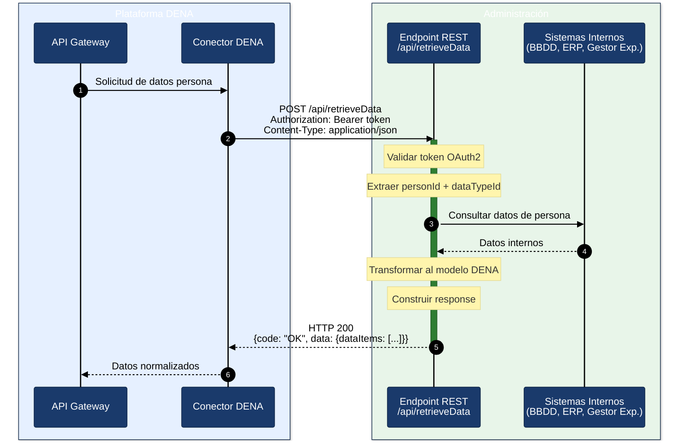

# Guía de Implementación — DATA-RETRIEVE para Administraciones

## Objetivo

Esta guía describe paso a paso cómo una administración pública debe implementar el endpoint `POST /api/retrieveData` para integrarse con la plataforma DENA y devolver datos de personas ciudadanas.

---

## Visión general



---

## Paso 1 — Entender el contrato

DENA enviará una petición `POST` con este formato:

```json
{
  "context": {
    "messageType": "PERSON_FETCH_DATA",
    "dataType": { "dataTypeId": "RECORDS" },
    "messageCorrelationId": "550e8400-e29b-41d4-a716-446655440000",
    "flowDirection": "REQUEST",
    "subjectPerson": { "personId": "12345678A" }
  },
  "data": { }
}
```

Los campos clave que debes interpretar:

| Campo | Para qué sirve | Código fuente |
|-------|----------------|---------------|
| `context.subjectPerson.personId` | DNI/NIE de la persona cuyos datos se solicitan | [`DN00InteropContext`]({{ repos.common_interop_api_blob }}/denaCommonInteropAPIModelClasses/src/main/java/dena/api/common/model/interop/context/DN00InteropContext.java) |
| `context.dataType.dataTypeId` | Tipo de dato solicitado (ver tabla abajo) | [`DN00DataTypeEnum`]({{ repos.common_data_api_blob }}/denaCommonDataAPIModelClasses/src/main/java/dena/api/data/model/DN00DataTypeEnum.java) |
| `context.messageCorrelationId` | UUID para trazabilidad en logs | [`DN00InteropContext`]({{ repos.common_interop_api_blob }}/denaCommonInteropAPIModelClasses/src/main/java/dena/api/common/model/interop/context/DN00InteropContext.java) |

### Tipos de dato (`dataTypeId`)

| Valor | Qué debes devolver | Modelo |
|-------|---------------------|--------|
| `RECORDS` | Expedientes | [expediente.md](./data/expediente.md) |
| `NOTICES` | Notificaciones | [notificacion.md](./data/notificacion.md) |
| `REGISTER` | Registros oficiales | [registro-oficial.md](./data/registro-oficial.md) |
| `PAYMENTS` | Pagos (únicos + domiciliaciones) | [pago.md](./data/pago.md) |
| `SCHEDULE` | Citas | [cita.md](./data/cita.md) |

> Especificación completa del endpoint: [endpoint-data-retrieve.md](./endpoint-data-retrieve.md)

---

## Paso 2 — Crear el endpoint REST

Expón un endpoint `POST` que acepte y devuelva `application/json`.

### Ejemplo en Java (Spring Boot)

```java
@RestController
@RequestMapping("/api")
public class RetrieveDataController {

    @PostMapping(value = "/retrieveData",
                 consumes = MediaType.APPLICATION_JSON_VALUE,
                 produces = MediaType.APPLICATION_JSON_VALUE)
    public ResponseEntity<InteropResponse> retrieveData(@RequestBody InteropRequest request) {

        // 1. Extraer personId y dataTypeId
        String personId = request.getContext().getSubjectPerson().getPersonId();
        String dataTypeId = request.getContext().getDataType().getDataTypeId();

        // 2. Consultar datos internos
        List<Object> items = fetchDataFromInternalSystems(personId, dataTypeId);

        // 3. Construir response
        return ResponseEntity.ok(buildResponse(request, items));
    }
}
```

### Ejemplo en C# (.NET)

```csharp
[ApiController]
[Route("api")]
public class RetrieveDataController : ControllerBase
{
    [HttpPost("retrieveData")]
    public IActionResult RetrieveData([FromBody] InteropRequest request)
    {
        var personId = request.Context.SubjectPerson.PersonId;
        var dataTypeId = request.Context.DataType.DataTypeId;

        var items = FetchDataFromInternalSystems(personId, dataTypeId);

        return Ok(BuildResponse(request, items));
    }
}
```

### Ejemplo en Node.js (Express)

```javascript
app.post('/api/retrieveData', (req, res) => {
  const { personId } = req.body.context.subjectPerson;
  const { dataTypeId } = req.body.context.dataType;

  const items = fetchDataFromInternalSystems(personId, dataTypeId);

  res.json(buildResponse(req.body, items));
});
```

---

## Paso 3 — Mapear tus datos al modelo DENA

Cada tipo de dato tiene una estructura JSON específica. Tu código debe transformar los datos internos a este formato.

### 3.1 — Campos comunes (obligatorios en todos los objetos)

Todos los objetos devueltos deben incluir como mínimo:

```json
{
  "oid": "TU-OID-UNICO-001",
  "id": "NUMERO-VISIBLE-PARA-PERSONA",
  "urls": [
    { "url": "https://sede.tuadmin.eus/...", "language": "SPANISH", "tags": ["default"] },
    { "url": "https://egoitza.tuadmin.eus/...", "language": "BASQUE", "tags": ["default"] }
  ]
}
```

| Campo | Qué poner |
|-------|-----------|
| `oid` | Identificador técnico único de tu sistema (PK, UUID, etc.) |
| `id` | El número que la persona ve en su sede electrónica |
| `urls` | Enlaces a la sede donde la persona puede ver el objeto |

> Documentación completa: [campos-comunes.md](./data/campos-comunes.md)

### 3.2 — Expediente (`RECORDS`)

```json
{
  "oid": "EXP-001",
  "id": "2024/00123",
  "service": {
    "serviceNameByLanguage": { "SPANISH": "Licencias de actividad", "BASQUE": "Jarduera-lizentziak" },
    "originRef": { "id": "SRV-LIC-ACT" }
  },
  "procedure": {
    "serviceNameByLanguage": { "SPANISH": "Solicitud de licencia", "BASQUE": "Lizentzia eskaera" },
    "originRef": { "id": "PROC-LIC-001" }
  },
  "createdAt": "2024-03-15T10:30:00Z",
  "state": {
    "stateCode": "IN_PROGRESS",
    "description": { "SPANISH": "En tramitación", "BASQUE": "Izapidetzen" }
  }
}
```

Estados posibles: `REGISTERED_PENDING_TO_BE_OPENED`, `OPENED`, `IN_PROGRESS`, `WAITING_FOR_INTERESTED_PARTY_RESPONSE`, `WAITING_FOR_OTHER_ORG_WORK`, `CLOSED`

> Documentación completa: [expediente.md](./data/expediente.md)

### 3.3 — Notificación (`NOTICES`)

```json
{
  "oid": "NOT-001",
  "id": "NOT-2024/456",
  "procedureRecord": { "oid": "EXP-001", "id": "2024/00123" },
  "type": "OFFICIAL_NOTICE",
  "issuedAt": "2024-05-20T09:00:00Z",
  "readedAt": null,
  "state": "PENDING_TO_BE_READED_BY_DESTINATION",
  "actSubjectByLanguage": { "SPANISH": "Resolución de ayuda", "BASQUE": "Laguntza ebazpena" }
}
```

Tipos: `OFFICIAL_NOTICE`, `COMMUNICATION`

Estados: `PENDING_TO_BE_READED_BY_DESTINATION`, `ACKNOWLEDGED_BY_DESTINATION`, `REJECTED_BY_DESTINATION`, `EXPIRED`, `CANCELLED_BY_ISSUER`, `DELETED_BY_ISSUER`

> Documentación completa: [notificacion.md](./data/notificacion.md)

### 3.4 — Registro oficial (`REGISTER`)

```json
{
  "oid": "REG-001",
  "id": "REG-2024/789",
  "procedureRecord": { "oid": "EXP-001", "id": "2024/00123" },
  "registeredAt": "2024-04-10T08:30:00Z",
  "subjectByLanguage": { "SPANISH": "Solicitud de licencia", "BASQUE": "Lizentzia eskaera" },
  "state": {
    "stateCode": "PRESENTED",
    "description": { "SPANISH": "Presentado", "BASQUE": "Aurkeztua" }
  }
}
```

Estados: `PRESENTED`, `RECEIVED_FROM_OTHER_ORG_UNIT`, `TRANSFERRED_FROM_OTHER_ORG_UNIT`

> Documentación completa: [registro-oficial.md](./data/registro-oficial.md)

### 3.5 — Pago único (`PAYMENTS`)

```json
{
  "oid": "PAY-001",
  "id": "PAY-2024/321",
  "procedureRecord": { "oid": "EXP-001", "id": "2024/00123" },
  "paymentType": "ONE_OFF_PAYMENT",
  "paymentSubjectByLanguage": { "SPANISH": "Tasa de actividad", "BASQUE": "Jarduera tasa" },
  "paymentDates": { "dueDate": "2024-06-30" },
  "format": "502",
  "amount": { "amount": 45.50, "currency": "EUR" },
  "data": { "forStatus": "PENDING" }
}
```

> Documentación completa: [pago.md](./data/pago.md)

### 3.6 — Domiciliación (`PAYMENTS`)

```json
{
  "oid": "DD-001",
  "id": "DD-2024/100",
  "procedureRecord": { "oid": "EXP-001", "id": "2024/00123" },
  "paymentType": "DIRECT_DEBIT",
  "paymentSubjectByLanguage": { "SPANISH": "Cuota guardería", "BASQUE": "Haur-eskola kuota" },
  "directDebitData": {
    "startDate": "2024-01-15",
    "frequency": "MONTHLY",
    "medium": "DIRECT_DEBIT",
    "mediumHint": "2100 ***** 051332"
  },
  "nextChargeAt": "2024-07-01",
  "nextChargeAmountInEuro": 120.00,
  "paymentStatus": "ACTIVE"
}
```

> Documentación completa: [pago.md](./data/pago.md)

### 3.7 — Cita (`SCHEDULE`)

```json
{
  "oid": "CITA-001",
  "id": "CITA-2024/050",
  "year": 2024,
  "monthOfYear": 7,
  "dayOfMonth": 15,
  "hourOfDay": 10,
  "minuteOfHour": 30,
  "durationMinutes": 30,
  "subject": { "SPANISH": "Cita renovación DNI", "BASQUE": "NAN berritzeko hitzordua" },
  "location": {
    "administrativeAreaLevel3": { "id": "48020", "name": "Bilbao" },
    "address": "Gran Vía 50"
  }
}
```

> Documentación completa: [cita.md](./data/cita.md)

---

## Paso 4 — Construir la response

La response debe tener esta estructura:

```json
{
  "context": {
    "messageType": "PERSON_FETCH_DATA",
    "dataType": { "dataTypeId": "RECORDS" },
    "messageCorrelationId": "UUID-DE-LA-REQUEST",
    "flowDirection": "RESPONSE",
    "subjectPerson": { "personId": "12345678A" }
  },
  "data": {
    "dataItems": [ ... ]
  },
  "code": "OK"
}
```

### Reglas de la response

| Situación | Qué devolver |
|-----------|--------------|
| Datos encontrados | HTTP 200 + `dataItems` con los objetos |
| Sin datos para esa persona | HTTP 200 + `dataItems: []` (lista vacía) |
| Persona no encontrada | HTTP 200 + `code: "CLIENT_ERR"` + `errorId: "PERSON_NOT_FOUND"` |
| Error interno | HTTP 500 + `code: "SERVER_ERR"` |
| Petición malformada | HTTP 400 + `code: "CLIENT_ERR"` |

> **Importante:** Cuando no hay datos, devuelve HTTP 200 con array vacío, NO uses HTTP 404.

---

## Paso 5 — Textos multiidioma

Todos los campos de tipo `LanguageTexts` deben incluir como mínimo castellano y euskera:

```json
{
  "SPANISH": "Texto en castellano",
  "BASQUE": "Euskerazko testua"
}
```

Los idiomas soportados son: `SPANISH`, `BASQUE`, `ENGLISH`.

---

## Paso 6 — URLs de sede electrónica

Incluye enlaces donde la persona pueda ver cada objeto en tu sede electrónica:

```json
"urls": [
  { "url": "https://sede.tuadmin.eus/expediente/123", "language": "SPANISH", "tags": ["default"] },
  { "url": "https://egoitza.tuadmin.eus/espedientea/123", "language": "BASQUE", "tags": ["default"] }
]
```

Para pagos, usa tags adicionales:
- `payment` → URL para realizar el pago
- `payment-receipt` → URL del justificante

---

## Paso 7 — Autenticación (opcional)

Si tu administración requiere autenticación, DENA enviará un token OAuth2 en la cabecera:

```
Authorization: Bearer <access_token>
```

El token se obtiene automáticamente mediante **client credentials** contra tu servidor de autorización. La configuración se coordina con el equipo DENA.

---

## Paso 8 — Validar tu implementación

### Checklist de validación

- [ ] El endpoint acepta `POST /api/retrieveData` con `Content-Type: application/json`
- [ ] Interpreta correctamente `context.subjectPerson.personId`
- [ ] Interpreta correctamente `context.dataType.dataTypeId`
- [ ] Devuelve HTTP 200 con `dataItems: []` cuando no hay datos
- [ ] Todos los objetos incluyen `oid` e `id`
- [ ] Los textos incluyen al menos `SPANISH` y `BASQUE`
- [ ] Las fechas están en formato ISO 8601 (`2024-03-15T10:30:00Z`)
- [ ] Los estados usan los códigos exactos definidos en el modelo
- [ ] El campo `code` está presente en la response (`OK`, `CLIENT_ERR`, `SERVER_ERR`)
- [ ] El `messageCorrelationId` de la request se devuelve en la response
- [ ] El tiempo de respuesta es < 30 segundos

### Herramientas de test

Puedes usar los mock factories del proyecto de tests para generar objetos de ejemplo:

- [Tests de expediente]({{ repos.interop_test_blob }}/denaTestCommonDataClasses/src/main/java/dena/test/common/data/services/DN99DENATestMockObjFactoryForAdmistrativeServiceProcedureRecord.java)
- [Tests de notificación]({{ repos.interop_test_blob }}/denaTestCommonDataClasses/src/main/java/dena/test/common/data/notification/DN99DENATestMockObjFactoryForAdministrativeNotice.java)
- [Tests de pago]({{ repos.interop_test_blob }}/denaTestCommonDataClasses/src/main/java/dena/test/common/data/payment/DN99DENATestMockObjFactoryForOneOffPayment.java)

---

## Paso 9 — Errores comunes

| Error | Causa | Solución |
|-------|-------|----------|
| `dataItems` devuelve `null` | No se inicializa el array | Devolver siempre `[]` como mínimo |
| Fechas rechazadas | Formato incorrecto | Usar ISO 8601: `2024-03-15T10:30:00Z` |
| Textos multiidioma vacíos | Solo se incluye un idioma | Incluir siempre `SPANISH` + `BASQUE` |
| Estados no reconocidos | Se usan estados propios | Usar exactamente los códigos del modelo DENA |
| HTTP 404 para "sin datos" | Se confunde con persona no encontrada | Usar HTTP 200 + `dataItems: []` |
| `oid` duplicado | Se reutiliza el mismo identificador | Cada `oid` debe ser único por tipo de objeto |

> Guía completa de errores: [errores-troubleshooting.md](./errores-troubleshooting.md)

---

## Resumen del flujo

```
1. DENA envía POST /api/retrieveData
2. Tu sistema:
   a. Lee personId → identifica a la persona
   b. Lee dataTypeId → sabe qué datos pedir
   c. Consulta sus sistemas internos
   d. Transforma los datos al modelo DENA
   e. Construye la response con dataItems[]
3. DENA recibe los datos y los presenta a la persona
```

---

## Documentación de referencia

| Documento | Contenido |
|-----------|-----------|
| [endpoint-data-retrieve.md](./endpoint-data-retrieve.md) | Contrato técnico completo del endpoint |
| [campos-comunes.md](./data/campos-comunes.md) | Campos base heredados por todos los objetos |
| [expediente.md](./data/expediente.md) | Modelo de expediente |
| [notificacion.md](./data/notificacion.md) | Modelo de notificación |
| [registro-oficial.md](./data/registro-oficial.md) | Modelo de registro oficial |
| [pago.md](./data/pago.md) | Modelo de pagos |
| [cita.md](./data/cita.md) | Modelo de citas |
| [servicio-administrativo.md](./data/servicio-administrativo.md) | Servicio y procedimiento |
| [unidad-organica.md](./data/unidad-organica.md) | Unidades orgánicas |
| [validaciones.md](./validaciones.md) | Reglas de validación |
| [errores-troubleshooting.md](./errores-troubleshooting.md) | Guía de errores |
| [snippets-codigo.md](./snippets-codigo.md) | Snippets en Java, C#, Node.js, Python, PHP |


<!-- DENA-DOC-FOOTER -->
---
<sub>DENA Docs v{{ dena.version }} · {{ dena.date }}</sub>
